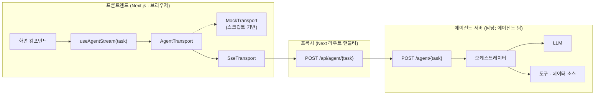

# Voyagent — 프론트엔드 ↔ 에이전트 계약서

> **계약 버전** `v1.0-draft` · **최종 수정** 2026-08-13 · **상태** 합의 대기 (§11 결정 목록 확인)
> **관련 문서** [`../spec.md`](../spec.md) 5·6·9장 · [`behavior.md`](./behavior.md) · [`integration.md`](./integration.md)
> **기계 판독본** [`schemas/agent-event.schema.json`](./schemas/agent-event.schema.json) · [`schemas/task-io.schema.json`](./schemas/task-io.schema.json)

---

## 0. 이 문서의 지위

이 문서는 **프론트엔드와 에이전트 사이의 유일한 계약**이다.

> 프론트엔드는 에이전트가 LangGraph인지 단일 프롬프트인지, GPT인지 Claude인지, 도구를 몇 개 쓰는지 **알지 못하고 알 필요도 없다.** 프론트엔드가 아는 것은 이 문서에 적힌 **이벤트 스트림의 모양** 하나뿐이다.

따라서

| 대상 | 규칙 |
|---|---|
| 이 문서에 적힌 것 | 양측이 지켜야 한다. 어기면 상대 화면이 깨진다 |
| 이 문서에 없는 것 | 각자 자유롭게 결정한다. 상대에게 묻지 않아도 된다 |
| 이 문서를 바꾸는 것 | [`collaboration.md` §2](./collaboration.md#2-인터페이스-소유권과-변경-절차)의 절차를 따른다. 한쪽이 임의로 바꿀 수 없다 |

**표기**

- ✅ **확정** — `spec.md`에 근거가 있다. 구현해도 안전하다
- 🔶 **제안** — 이 문서에서 새로 제안한다. [§11.2 합의 필요 목록](#112-합의-필요-목록)에 올라가 있고, 합의 전까지는 잠정이다
- ⛔ **금지** — 계약 위반. 어기면 프론트엔드가 깨진다

---

## 목차

| 절 | 내용 |
|---|---|
| 1 | [경계와 4가지 원칙](#1-경계와-4가지-원칙) |
| 2 | [전송 계층](#2-전송-계층) |
| 3 | [이벤트 봉투와 순서 규칙](#3-이벤트-봉투와-순서-규칙) |
| 4 | [이벤트 타입 9종](#4-이벤트-타입-9종) |
| 5 | [작업별 계약 6개](#5-작업별-계약-6개) |
| 6 | [도메인 타입 — 프론트가 깨지는 지점](#6-도메인-타입--프론트가-깨지는-지점) |
| 7 | [형식 규약](#7-형식-규약) |
| 8 | [에러 계약](#8-에러-계약) |
| 9 | [계약 위반 목록](#9-계약-위반-목록) |
| 10 | [계약 테스트](#10-계약-테스트) |
| 11 | [버전 관리와 미결 사항](#11-버전-관리와-미결-사항) |
| 부록 A | [`spec.md` 정합성 메모](#부록-a-specmd-정합성-메모) |
| 부록 B | [`ItineraryChange.payload` 스키마 제안](#부록-b-itinerarychangepayload-스키마-제안) |

---

## 1. 경계와 4가지 원칙

### 1.1 시스템 경계



**계약면은 화살표 `S --> P --> E` 하나다.** 이 선을 넘는 것은 오직 HTTP 요청 1개와 SSE 이벤트 스트림 1개뿐이다.

### 1.2 4가지 원칙

| # | 원칙 | 의미 | 어기면 |
|---|---|---|---|
| 1 | **이벤트만이 계약이다** | 프론트엔드는 `AgentEvent` 외의 어떤 것도 읽지 않는다. HTTP 헤더·상태 코드에 의미를 담지 않는다(에러도 이벤트로 보낸다) | 프론트가 상태를 놓친다 |
| 2 | **`thought`는 누적 전체 텍스트다** | 델타(증분)가 아니다. 같은 `id`로 갱신할 때마다 **처음부터 지금까지의 전체 문장**을 보낸다 | 문장이 조각나거나 중복된다 |
| 3 | **부분 결과는 되돌리지 않는다** | 한 번 `partial`로 보낸 항목은 취소·수정·삭제하지 않는다. 실패해도 이미 보낸 것은 화면에 남는다 | 사용자 눈앞에서 카드가 사라진다 |
| 4 | **종료 이벤트는 정확히 하나다** | 모든 스트림은 `done` 또는 `error` **정확히 하나**로 끝난다. 둘 다 보내거나 아무것도 안 보내면 안 된다 | 프론트가 영원히 로딩 상태로 남는다 |

---

## 2. 전송 계층

### 2.1 엔드포인트 ✅

에이전트 서버가 노출하는 것:

```
POST /agent/{task}
```

`{task}` ∈ `cityInfo` · `flightSearch` · `staySearch` · `placeDiscovery` · `itineraryGenerate` · `itineraryVerify`

프론트엔드는 **동일 출처 프록시를 경유**한다(기본값).

```
브라우저 → POST /api/agent/{task}   (Next.js 라우트 핸들러)
         → POST {AGENT_BASE_URL}/agent/{task}
```

| 왜 프록시를 경유하는가 | 내용 |
|---|---|
| CORS 회피 | 브라우저에서 다른 출처로 SSE를 열지 않는다 |
| 비밀 관리 | 에이전트 서버 인증 토큰이 브라우저로 나가지 않는다 |
| 버퍼링 제어 | SSE 버퍼링 방지 헤더를 한 곳에서 통제한다 (§2.4) |

> 에이전트 팀은 프록시 존재를 신경 쓰지 않아도 된다. **`POST /agent/{task}`만 규격대로 만들면 된다.**

### 2.2 요청 ✅

```http
POST /agent/placeDiscovery HTTP/1.1
Content-Type: application/json
Accept: text/event-stream
X-Voyagent-Trace-Id: 8f3a1c9e-...        🔶 §11.2-6
X-Voyagent-Contract: v1.0-draft          🔶 §11.2-6

{ ...AgentTaskIO[task]['input'] }
```

| 항목 | 규칙 |
|---|---|
| 본문 | [§5](#5-작업별-계약-6개)의 작업별 입력 타입 **그대로**. 래핑(`{ "input": ... }`)하지 않는다 |
| 입력 검증 | 서버는 본문을 스키마로 검증한다. 실패 시 **HTTP 200 + `error` 이벤트(`invalid_input`)** 로 응답한다 (§8.2) |
| 멱등성 | 같은 입력으로 여러 번 호출될 수 있다. 부작용을 남기지 않는다 |
| 동시성 | 한 사용자가 동시에 두 작업을 실행하지는 않지만, 서로 다른 사용자의 동시 요청은 처리해야 한다 |

### 2.3 응답 ✅

```http
HTTP/1.1 200 OK
Content-Type: text/event-stream; charset=utf-8
Cache-Control: no-cache, no-transform
Connection: keep-alive
X-Accel-Buffering: no
```

프레이밍은 **SSE 표준**을 따른다.

```
data: {"seq":0,"at":12,"type":"status","text":"검색 조건을 정리하고 있어요"}\n
\n
data: {"seq":1,"at":540,"type":"thought","id":"t1","text":"인천(ICN) → 도쿄","done":false}\n
\n
```

| 규칙 | 내용 |
|---|---|
| 한 이벤트 = `data:` 한 줄 + 빈 줄 | JSON 안에 개행을 넣지 않는다(`JSON.stringify` 기본 동작이면 안전) |
| `event:` 필드 | 쓰지 않는다. 타입은 JSON 본문의 `type`으로만 구분한다 |
| `id:` / `retry:` 필드 | 쓰지 않는다. 재연결·재개는 지원하지 않는다 (§2.6) |
| 인코딩 | UTF-8. 한국어가 그대로 나간다 |
| 압축 | ⛔ 금지. `no-transform`으로 프록시 압축도 막는다(SSE가 지연된다) |

> **`X-Accel-Buffering: no`를 빠뜨리면** nginx·Vercel 등 중간 프록시가 응답을 모아서 한 번에 보낸다. 그러면 스트리밍 UX가 전부 사라지고 **"10초 멈춤 → 결과 한 번에"** 가 된다. 스트리밍이 안 보이면 이것부터 확인한다.

### 2.4 keepalive ✅

이벤트 사이 간격이 벌어지면 **15초마다** SSE 주석을 보낸다.

```
: keepalive\n\n
```

주석은 이벤트가 아니므로 `seq`를 소비하지 않고, 프론트엔드는 무시한다.

### 2.5 무음 구간 상한 🔶

| 항목 | 값 |
|---|---|
| 첫 이벤트까지 | **1,000ms 이내** (권고 500ms). 이 시간 동안 프론트는 빈 패널을 보여준다 |
| 이벤트 사이 최대 무음 | **8초**. 오래 걸리는 도구가 있으면 그 사이에 `status` 또는 `progress`를 끼워 넣는다 |

무음 구간이 길면 사용자는 멈춘 줄 안다. `spec.md` 1.3의 **"기다리는 시간을 신뢰가 쌓이는 시간으로 바꾼다"** 는 목표가 여기서 깨진다.

### 2.6 취소 ✅

| 상황 | 서버 동작 |
|---|---|
| 클라이언트가 연결을 끊음 (`AbortSignal`) | 진행 중인 LLM 호출·도구 호출을 **즉시 중단**한다. 요금이 계속 발생하게 두지 않는다 |
| 취소 후 이벤트 | ⛔ 보내지 않는다. 연결이 이미 없다 |
| `aborted` 에러 이벤트 | 서버가 보내지 않는다. **프론트엔드가 스스로 만든다** |

재연결·이어받기(`Last-Event-ID`)는 **지원하지 않는다.** 취소되면 처음부터 다시 실행한다.

### 2.7 타임아웃 예산 ✅🔶

| 계층 | 값 | 근거 |
|---|---|---|
| 클라이언트 하드 타임아웃 | **45초** | `spec.md` 6.9.3 ✅ |
| 서버 하드 상한 | **40초** | 클라이언트보다 먼저 끝내 `timeout` 이벤트를 보낼 수 있게 🔶 |
| 작업별 목표 소요 | [§5](#5-작업별-계약-6개) 표 | `spec.md` 6.5.2 ✅ |
| 작업별 소프트 상한 | 목표 상한 × 2 | 넘으면 경고 로그 + 부분 결과로 `done` 🔶 |

서버가 하드 상한에 도달하면 **연결을 끊지 말고** `error`(`timeout`, `retryable: true`)를 보낸 뒤 정상 종료한다. 그래야 프론트가 이유를 표시할 수 있다.

### 2.8 인증 🔶

캠프 범위에서는 **인증 없음**을 기본으로 한다. 에이전트 서버는 프록시에서만 접근 가능한 위치에 둔다.

토큰이 필요해지면 `Authorization: Bearer {token}`을 프록시가 주입한다. 브라우저는 토큰을 모른다. → [§11.2-5](#112-합의-필요-목록)

---

## 3. 이벤트 봉투와 순서 규칙

### 3.1 공통 필드 ✅

모든 이벤트는 아래 3개 필드를 **반드시** 갖는다.

| 필드 | 타입 | 규칙 |
|---|---|---|
| `seq` | `number` | 스트림 내 순번. **0부터 1씩 증가.** 건너뛰거나 되돌아가지 않는다 |
| `at` | `number` | 스트림 시작 기준 경과 밀리초. 단조 증가(같은 값은 허용) |
| `type` | `string` | 아래 9종 중 하나 |

```ts
type AgentEventBase = { seq: number; at: number };
```

> `seq`가 건너뛰면 프론트엔드는 **경고만 로깅하고 계속 진행**한다(`spec.md` 6.9.2). 스트림을 버리지는 않지만, 순번이 어긋나면 디버깅이 불가능해지므로 반드시 맞춘다.

### 3.2 필수 시퀀스 ✅

```
[status]  ← 첫 이벤트는 반드시 status
   ⋮
(자유 순서: thought · tool_call · tool_result · partial · check_update · progress)
   ⋮
[done | error]  ← 마지막 이벤트는 정확히 하나
```

| 규칙 | 내용 |
|---|---|
| 첫 이벤트 | **반드시 `status`.** 프론트는 이 문장으로 패널 헤더를 채운다 |
| 마지막 이벤트 | `done` 또는 `error` **정확히 하나** |
| 종료 후 | ⛔ 어떤 이벤트도 보내지 않는다 |
| `tool_result` | 같은 `id`의 `tool_call`이 **먼저** 나와야 한다 |
| `partial` | `done` 이전에만. `done`의 결과에 포함된 항목이어야 한다 |

### 3.3 이벤트 수 권고 🔶

너무 적으면 UX가 비고, 너무 많으면 콘솔이 소음이 된다.

| 작업 | `thought` | `tool_call` | `partial` | 총 이벤트 |
|---|---|---|---|---|
| `flightSearch` | 3–4문장 | 3–4개 | 결과 수만큼 | 40–120 |
| `staySearch` | 3–4문장 | 3–4개 | 결과 수만큼 | 40–110 |
| `placeDiscovery` | 3–4문장 | 4–5개 | 결과 수만큼 | 60–160 |
| `cityInfo` | 2–4문장 | 2–4개 | 사용 안 함 | 40–120 |
| `itineraryGenerate` | 4–5문장 | 4–5개 | 일자 수만큼 | 50–140 |
| `itineraryVerify` | 5–7문장 | 0–10개 | 사용 안 함 | 60–150 |

`thought`의 타이핑 갱신이 이벤트 수의 대부분을 차지한다. 갱신 간격 권고는 [§4.2](#42-thought-)에 있다.

---

## 4. 이벤트 타입 9종

### 4.1 `status` ✅

패널 헤더의 한 줄. **덮어쓰기**다(누적 아님).

```json
{ "seq": 0, "at": 12, "type": "status", "text": "검색 조건을 정리하고 있어요" }
```

| 필드 | 타입 | 필수 | 규칙 |
|---|---|---|---|
| `text` | `string` | ✅ | **20자 이내.** 진행 중임을 나타내는 현재형. 마크다운·이모지 ⛔ |

- 프론트 사용처: `AgentStreamPanel` 헤더. 교체 시 140ms 슬라이드 애니메이션
- 한 스트림에 2–4회 보낸다. 매초 바꾸면 읽을 수 없다
- 카피 규칙은 [`behavior.md` §1.2](./behavior.md#12-한국어-카피-규칙)

### 4.2 `thought` ✅

에이전트의 추론 문장. **타이핑 연출의 원본이다.**

```json
{ "seq": 1, "at": 540,  "type": "thought", "id": "t1", "text": "인천(ICN) → 도쿄", "done": false }
{ "seq": 2, "at": 610,  "type": "thought", "id": "t1", "text": "인천(ICN) → 도쿄(NRT/HND), 6월 12일 출발", "done": false }
{ "seq": 3, "at": 1180, "type": "thought", "id": "t1", "text": "인천(ICN) → 도쿄(NRT/HND), 6월 12일 출발 · 6월 16일 귀국. 성인 2명, 이코노미 기준으로 찾습니다.", "done": true }
```

| 필드 | 타입 | 필수 | 규칙 |
|---|---|---|---|
| `id` | `string` | ✅ | 문장 식별자. 같은 문장의 갱신은 같은 `id`. 스트림 내 유일 |
| `text` | `string` | ✅ | **처음부터 지금까지의 누적 전체 텍스트.** ⛔ 델타 금지 |
| `done` | `boolean` | ✅ | 이 문장이 완결됐는지. 마지막 갱신에서 `true` |

**왜 델타가 아니라 누적인가** (`spec.md` 6.9.2)

> 클라이언트 구현이 단순해지고 이벤트 유실에 강하다. 중간 이벤트를 하나 놓쳐도 다음 이벤트가 전체를 다시 주므로 문장이 깨지지 않는다.

| 항목 | 권고 |
|---|---|
| 갱신 간격 | 60–150ms |
| 갱신 단위 | 8–40자 |
| 문장 길이 | **120자 이내.** 넘으면 문장을 쪼개 새 `id`로 |
| 완결 처리 | 문장이 끝나면 반드시 `done: true`를 한 번 보낸다 |
| 대안 | 토큰 스트리밍이 어렵다면 **완결 문장을 한 번에**(`done: true` 1개 이벤트) 보내도 된다. 프론트가 자체 타이핑으로 연출한다 |

- 프론트 사용처: `ThoughtStream`. `done: false`는 `--text-secondary` + 깜빡이는 커서, `done: true`는 `--text`
- `prefers-reduced-motion`에서는 타이핑 없이 문장 단위로 즉시 표시된다

### 4.3 `tool_call` ✅

도구 실행 시작.

```json
{ "seq": 4, "at": 1180, "type": "tool_call", "id": "c1",
  "name": "search_flights", "label": "항공편 데이터베이스 조회 중",
  "args": { "origin": ["ICN"], "destination": ["NRT", "HND"] } }
```

| 필드 | 타입 | 필수 | 규칙 |
|---|---|---|---|
| `id` | `string` | ✅ | 호출 식별자. 대응 `tool_result`와 짝을 이룬다 |
| `name` | `string` | ✅ | 도구 이름. `snake_case` 영문. 모노스페이스로 표시된다 |
| `label` | `string` | ✅ | **한국어 진행 문구, 20자 이내.** 예: `항공편 데이터베이스 조회 중` |
| `args` | `object` | 🔶 선택 | 디버깅용. **프론트는 화면에 표시하지 않는다.** 비밀·대용량을 넣지 않는다 |

- 도구 이름 목록은 [`behavior.md`](./behavior.md)의 작업별 절에 제안되어 있다. 다른 이름을 써도 계약 위반은 아니다
- 내부 도구를 전부 노출하지 않는다. **사용자가 이해할 수 있는 단위 3–5개**로 묶어 보낸다

### 4.4 `tool_result` ✅

도구 실행 결과.

```json
{ "seq": 5, "at": 2760, "type": "tool_result", "id": "c1",
  "label": "128개 항공편 확인", "count": 128, "ok": true }
```

| 필드 | 타입 | 필수 | 규칙 |
|---|---|---|---|
| `id` | `string` | ✅ | 대응 `tool_call`의 `id`. ⛔ 짝 없는 결과 금지 |
| `label` | `string` | ✅ | **한국어 결과 문구, 20자 이내.** 예: `128개 항공편 확인` |
| `ok` | `boolean` | ✅ | 성공 여부 |
| `count` | `number` | 🔶 선택 | 결과 개수 |
| `detail` | `string` | 🔶 선택 | 실패 이유 등 추가 설명 |

- `ok: false`여도 스트림은 계속될 수 있다. 도구 하나가 실패해도 다른 경로로 결과를 낼 수 있으면 계속한다
- 프론트 사용처: `ToolCallCard` 3행 + 우측 상태 아이콘(`Check` / `X`)

### 4.5 `partial` ✅

부분 결과. **카드가 하나씩 쌓이는 연출의 원본이다.**

```json
{ "seq": 6, "at": 6200, "type": "partial", "payload": { "id": "f-001", "outbound": { }, "inbound": { } } }
```

| 필드 | 타입 | 필수 | 규칙 |
|---|---|---|---|
| `payload` | 작업별 | ✅ | 아래 표. **완전한 1건**이어야 한다. 부분 객체 ⛔ |

| 작업 | `payload` 타입 | 방출 단위 |
|---|---|---|
| `flightSearch` | `FlightOffer` | 항공권 1건 |
| `staySearch` | `StayOffer` | 숙소 1건 |
| `placeDiscovery` | `Place` | 장소 1건 |
| `cityInfo` | — | ⛔ 사용하지 않는다. 최종 객체를 `done`으로 한 번만 보낸다 |
| `itineraryGenerate` | `ItineraryDay` | **일자 1개** (항목 전체 포함) |
| `itineraryVerify` | — | ⛔ 사용하지 않는다. `check_update`로 대체 |

| 규칙 | 내용 |
|---|---|
| 순서 | **최종 결과의 정렬 순서와 같아야 한다.** 프론트는 도착 순서대로 쌓고 재정렬하지 않는다 |
| 완전성 | `payload`는 [§6](#6-도메인-타입--프론트가-깨지는-지점)의 필수 필드를 모두 갖춘 완전한 객체 |
| 일관성 | `done.payload`에 **같은 `id`로 반드시 포함**되어야 한다 |
| 간격 | 90–300ms. 너무 빠르면 연출이 안 보이고, 너무 느리면 답답하다 |
| 되돌리기 | ⛔ 이미 보낸 항목을 취소·수정할 수 없다 (원칙 3) |

> **이 이벤트가 이 제품의 가장 인상적인 장면을 만든다.** `spec.md` 6.6.4:
> *"일정 카드가 하나씩 쌓이는 연출 — 이 순간이 이 앱에서 가장 인상적인 장면이므로 절대 스피너로 대체하지 않는다."*
> 결과를 다 모아서 `done` 한 번에 보내면 계약은 지켜지지만 **제품이 망가진다.**

### 4.6 `check_update` ✅

`itineraryVerify` 전용. 검증 항목 1건의 상태 변경.

```json
{ "seq": 12, "at": 3100, "type": "check_update", "check": {
  "id": "V1", "ruleId": "V1",
  "label": "영업시간 · 휴관일",
  "description": "각 장소의 요일별 영업시간을 방문 시각과 대조합니다",
  "status": "running", "severity": "pass",
  "targetRefs": [], "message": "",
  "evidence": ["> 17개 장소의 요일별 영업시간 조회"]
} }
```

| 필드 | 타입 | 필수 | 규칙 |
|---|---|---|---|
| `check.id` | `string` | ✅ | **스트림 내에서 규칙당 고정.** 프론트가 이 값으로 행을 매칭한다. `ruleId`와 같게 두는 것을 권고 |
| `check.ruleId` | `"V1"`–`"V10"` | ✅ | 규칙 ID |
| `check.label` | `string` | ✅ | [§6.5 규칙 라벨 표](#65-verificationreport)의 문구를 **그대로** |
| `check.description` | `string` | ✅ | 검사 중 표시되는 설명 |
| `check.status` | `pending`/`running`/`done` | ✅ | 상태 |
| `check.severity` | `pass`/`warning`/`conflict`/`skipped` | ✅ | `status !== 'done'`이면 `pass`로 채운다 |
| `check.targetRefs` | `{dayIndex, itemId?}[]` | ✅ | 검사 대상. 없으면 `[]` |
| `check.message` | `string` | ✅ | 결과 한 줄. `running`이면 `""` |
| `check.evidence` | `string[]` | ✅ | 근거 로그. 접두 규약은 아래 🔶 |
| `check.startedAt` / `finishedAt` | `number` | 🔶 선택 | **스트림 시작 기준 경과 ms**(= `at`과 같은 기준). ⛔ 유닉스 타임스탬프 금지 |

**필수 시퀀스** ✅

```
규칙당 최소 2개 이벤트
  check_update { status: 'running', severity: 'pass',  message: '' }
  check_update { status: 'done',    severity: <실제>,  message: <결과> }
```

| 규칙 | 내용 |
|---|---|
| 10개 전부 | ⛔ 규칙을 건너뛰어도 **이벤트를 생략하지 않는다.** `severity: 'skipped'` + `message`에 이유를 담아 `done`을 보낸다 |
| 진행 중 갱신 | `running` 상태로 여러 번 보내도 된다. `evidence`를 점진적으로 늘려 추론 콘솔을 채운다 🔶 |
| 순서 | V1 → V10 순차. 내부적으로 병렬 실행해도 **이벤트는 순서대로** 보낸다 (`spec.md` 9.3) |

**`evidence` 접두 규약** 🔶 → [§11.2-1](#112-합의-필요-목록)

추론 콘솔(`ReasoningConsole`)은 줄 앞의 기호로 색을 결정한다. 서버가 기호를 포함해서 보낸다.

| 접두 | 색 | 용도 | 예 |
|---|---|---|---|
| `> ` | `--text-muted` | 조회·중간 진행 | `> Day 2 (6/13 금) 확인 완료` |
| `⚠ ` | `--warning` | 주의 발견 | `⚠ 도쿄 국립박물관: 월요일 휴관` |
| `✗ ` | `--danger` | 충돌 발견 | `✗ 이동 시간 12분 부족` |
| `→ ` | `--text-secondary` 500 | 결론 | `→ 충돌 1건` |
| (없음) | `--text-muted` | 일반 | `영업시간: 화–일 09:30–17:00` |

> 접두 없는 줄은 `VerifyIssueCard`의 **근거 불릿**으로도 그대로 쓰인다. 사용자가 읽는 문장이므로 [`behavior.md` §1.2](./behavior.md#12-한국어-카피-규칙)의 카피 규칙을 지킨다.

### 4.7 `progress` ✅

```json
{ "seq": 20, "at": 8400, "type": "progress", "value": 0.6 }
```

| 필드 | 타입 | 필수 | 규칙 |
|---|---|---|---|
| `value` | `number` | ✅ | `0` 이상 `1` 이하. **단조 증가** |

- 선택 이벤트다. 보내지 않으면 프론트는 **불확정 진행바**(좌우 왕복)를 표시한다
- 보낼 거면 최소 3회 이상 보낸다. 한 번만 보내면 바가 멈춘 것처럼 보인다
- `itineraryVerify`는 `check_update` 개수로 진행률을 계산하므로 `progress`가 **불필요**하다
- → [§11.2-8](#112-합의-필요-목록)

### 4.8 `done` ✅

```json
{ "seq": 84, "at": 9100, "type": "done",
  "payload": [ { "id": "f-001" } ],
  "summary": "12개 항공권을 찾았어요. 추천은 대한항공 684,000원입니다." }
```

| 필드 | 타입 | 필수 | 규칙 |
|---|---|---|---|
| `payload` | 작업별 출력 | ✅ | [§5](#5-작업별-계약-6개)의 출력 타입. **전체 결과**(부분 아님) |
| `summary` | `string` | 🔶 강력 권고 | **60자 이내** 한국어 한 문장. 결과 요약 바에 그대로 표시된다 |

| 규칙 | 내용 |
|---|---|
| 전체성 | `partial`로 보낸 모든 항목이 `payload`에 포함되어야 한다 |
| 순서 | `payload` 배열 순서 = `partial` 방출 순서 = 화면 표시 순서 |
| 빈 결과 | 결과가 0건이면 `done`이 아니라 **`error`(`no_results`)** 를 보낸다 (§8.3) |

### 4.9 `error` ✅

```json
{ "seq": 31, "at": 12400, "type": "error",
  "code": "timeout", "message": "검색이 예상보다 오래 걸리고 있어요", "retryable": true }
```

| 필드 | 타입 | 필수 | 규칙 |
|---|---|---|---|
| `code` | [§8.1](#81-에러-코드) 중 하나 | ✅ | 프론트가 이 값으로 UI를 고른다 |
| `message` | `string` | ✅ | **사용자에게 보여도 되는 한국어.** ⛔ 스택 트레이스·영문 예외 메시지 금지 |
| `retryable` | `boolean` | ✅ | 재시도 버튼 노출 여부 |

- ⛔ `code: 'aborted'`를 서버가 보내지 않는다 (§2.6)
- 이미 보낸 `partial`은 화면에 남는다. 프론트는 경고 배너만 얹는다

---

## 5. 작업별 계약 6개

도메인 타입은 [`spec.md` 5장](../spec.md#5-데이터-모델), 작업 경계 타입은 [`spec.md` 6.3](../spec.md#63-agentevent-계약)이 원본이다. 여기서는 **경계에서 지켜야 할 것**만 적는다.

### 5.0 요약표 ✅

| 작업 | 출력 | 목표 소요 | `partial` 단위 | 비고 |
|---|---|---|---|---|
| `cityInfo` | `CityInfo` | 5–8초 | 사용 안 함 | 웹 출처 1건 이상 |
| `flightSearch` | `FlightOffer[]` | 8–10초 | 항공권 1건 | 최대 20건 |
| `staySearch` | `StayOffer[]` | 7–9초 | 숙소 1건 | 최대 20건 |
| `placeDiscovery` | `Place[]` | 9–12초 | 장소 1건 | 최대 20건 |
| `itineraryGenerate` | `Itinerary` | 10–14초 | `ItineraryDay` 1개 | 불변식 5개 (§5.4) |
| `itineraryVerify` | `VerificationReport` | 11–15초 | 사용 안 함 | 검사 10개 전부 |

### 5.1 `flightSearch`

**입력** ✅

```ts
type FlightSearchInput = {
  origin: string[];            // IATA. 예: ['ICN']
  destination: string[];       // IATA. 예: ['NRT','HND']
  departDate: ISODate;         // 'YYYY-MM-DD'
  returnDate: ISODate;
  travelers: Travelers;
  survey: FlightSurvey;
};
```

**출력** `FlightOffer[]`

| 불변식 | 내용 |
|---|---|
| I-F1 | 모든 오퍼는 `outbound`와 `inbound`를 **둘 다** 갖는다. 편도 오퍼 ⛔ (프론트는 왕복 묶음 단위로만 선택한다) |
| I-F2 | `outbound.departAt`의 날짜 = `departDate`, `inbound.departAt`의 날짜 = `returnDate` |
| I-F3 | `outbound.segments[0].from.code` ∈ `origin`, 마지막 `to.code` ∈ `destination` (`inbound`는 반대) |
| I-F4 | `stops` = `segments.length - 1`, `layovers.length` = `stops` |
| I-F5 | `dayOffset` = 도착 날짜 − 출발 날짜 (0 또는 1). 프론트가 `+1일` 배지를 띄운다 |
| I-F6 | `totalPrice.amount` = `price.amount` × 유상 인원(성인 + 어르신 + 2세 이상 아동) |
| I-F7 | `id`는 배열 내 유일. `f-001` 형태 권고 |
| I-F8 | `tags`에 `recommended` 1건, `cheapest` 1건, `fastest` 1건을 각각 **정확히 하나만** 부여. 없어도 되지만 중복 ⛔ |
| I-F9 | 배열 순서 = 추천순. 프론트의 기본 정렬 탭이 `추천순`이다 |

| ⛔ 저작권 주의 | `airlineLogo`에 실제 항공사 로고 URL을 넣지 않는다. `spec.md` 3.14.3에 따라 프론트는 **단색 이니셜 마크**로 렌더한다. 경로만 규격대로 채우고(`/images/airlines/{code}.svg`) 외부 이미지를 참조하지 않는다 |
|---|---|

### 5.2 `staySearch`

**입력** ✅

```ts
type StaySearchInput = {
  cityId: string;              // 'tokyo'
  checkIn: ISODate;
  checkOut: ISODate;
  travelers: Travelers;
  survey: StaySurvey;
  placesCentroid?: LatLng;     // 선택 장소들의 중심. 위치 점수 가중에 사용
  arrivalTime?: TimeHHMM;      // 항공 도착 시각
};
```

**출력** `StayOffer[]`

실시간 객실 가격·재고는 제공하지 않는다. Places API의 정적 숙소 정보에 팀 공용 데모 가격 fixture를 결합하며, `nightlyPrice`와 `totalPrice`는 예상값이다. `survey.rooms`는 재고 조건이 아니라 총액 계산 배수다.

| 불변식 | 내용 |
|---|---|
| I-S1 | `images.length >= 4` (`spec.md` 5.6). 갤러리가 4장 미만이면 캐러셀이 무의미해진다 |
| I-S2 | `reviewScore` ∈ `[0, 10]` (5점 척도 ⛔). `starRating` ∈ `[1,5]` 또는 `null` |
| I-S3 | `totalPrice.amount` = `nightlyPrice.amount` × 숙박일 수 × `survey.rooms` |
| I-S4 | `nightlyPrice.currency` = `totalPrice.currency` |
| I-S5 | `location`이 `cityId`의 도시 경계 안에 있다. 중심에서 50km 이내 |
| I-S6 | `placesCentroid`가 주어졌으면 `distanceToPlacesKm`를 채운다(정렬 옵션 `가고 싶은 곳에서 가까운순`이 이 값을 쓴다) |
| I-S7 | `reviewHighlights`는 `청결도` / `위치` / `시설` / `가격` 4개 항목을 담는다. 프론트가 4행 게이지로 렌더한다 |
| I-S8 | `cancellation`이 `free`가 아니면 `cancellationNote`를 채운다 |
| I-S9 | 배열 순서 = 추천순 |

### 5.3 `placeDiscovery`

**입력** ✅

```ts
type PlaceDiscoveryInput = {
  cityId: string;
  persona: Persona;            // 관심사·페이스·동행·접근성·예산 전체
  dayCount: number;            // 여행 일수
};
```

**출력** `Place[]`

| 불변식 | 내용 |
|---|---|
| I-P1 | **좌표가 실제 위치와 맞아야 한다.** `spec.md` 6.2.2: *"좌표가 틀리면 경로 최적화와 검증 결과가 모두 이상해 보인다."* 이 계약에서 가장 중요한 항목이다 |
| I-P2 | `openingHours.length === 7`, `weekday`가 0(일)–6(토) **전부 하나씩** |
| I-P3 | `closedWeekdays` = `openingHours`에서 `open === null`인 요일. **파생값이 일치해야 한다**(검증 V1이 이 캐시를 쓴다) |
| I-P4 | `images.length >= 3`, `reviews.length >= 3` (`spec.md` 5.7) |
| I-P5 | `id` = `{cityId}-{slug}` (예: `tokyo-sensoji`). 배열 내 유일. **재실행해도 같은 장소에 같은 id** ([§11.2-4](#112-합의-필요-목록)) |
| I-P6 | `source: 'agent'` 고정. `user-google-maps` / `user-manual`은 프론트가 만든다 |
| I-P7 | `admission.free === false`면 `admission.price`를 채운다 |
| I-P8 | `accessibility` 3개 필드는 **모르면 `null`.** ⛔ 추측해서 `true`/`false`를 넣지 않는다 (`spec.md` 3.14.3 "정직하게") |
| I-P9 | `interestTags`는 `persona.interests`와 매칭 가능한 값만 (§7.5 목록) |
| I-P10 | 배열 순서 = 추천순. 관심사 일치 항목이 위로 |

**개수와 구성** 🔶 (`spec.md` 6.2.2 기준)

| 항목 | 권고 |
|---|---|
| 총 개수 | **최대 20건.** 조건을 만족하는 후보가 20건보다 적으면 실제 건수만 반환하고, 0건이면 `error(no_results)` |
| 카테고리 균형 | 한 카테고리가 전체의 25%를 넘지 않게. 배분 예시는 `spec.md` 6.2.2 표 |
| 관심사 커버리지 | `persona.interests`를 각 1건 이상 우선 커버하고, 상위 관심사는 3건까지 배정한다. 20건 한도 때문에 전부 충족할 수 없으면 사용자 입력 순서를 우선한다 |
| 휴관일 다양성 | 박물관 계열 일부에 실제 휴관일을 반영한다. V1 검증이 동작할 근거가 된다 |

### 5.4 `itineraryGenerate`

**입력** ✅

```ts
type ItineraryGenInput = {
  cityId: string;
  dateRange: { start: ISODate; end: ISODate };
  persona: Persona;
  places: Place[];             // 사용자가 선택한 장소들
  flight: FlightOffer | null;  // 선택했으면 첫날/마지막날 배치에 반영
  stay: StayOffer | null;      // 선택했으면 체크인/체크아웃 항목 생성
};
```

**출력** `Itinerary`

| 불변식 | 내용 |
|---|---|
| I-I1 | ⛔ **입력에 없는 `placeId`를 만들어내지 않는다.** `kind: 'place'` 항목의 `placeId`는 반드시 `input.places[].id` 중 하나 |
| I-I2 | **모든 입력 장소가 어딘가에 있어야 한다.** 어떤 일자의 `items`에 배치되거나, `unassignedPlaceIds`에 들어간다. 조용히 사라지면 프론트가 장소를 잃는다 |
| I-I3 | `days.length` = `dateRange` 일수(양끝 포함). `dayIndex`는 0부터 연속 |
| I-I4 | `days[i].date` = `start + i일`, `weekday` = 그 날짜의 실제 요일(0=일) |
| I-I5 | `colorKey` = `day1`–`day6` 순환 (`dayIndex % 6 + 1`). 프론트의 일자 색과 지도 마커 색이 여기서 나온다 |
| I-I6 | 각 일자의 **마지막 항목**은 `travelToNext: null`. 나머지는 `TravelLeg` 객체 |
| I-I7 | 한 일자 안에서 `startTime`이 오름차순. 시간대가 겹치지 않는다 |
| I-I8 | `version: 1` (최초 생성). 이후 증가는 프론트가 담당 |
| I-I9 | `flight !== null`이면 첫날에 `kind: 'flight'` 도착 항목, 마지막날에 출발 항목을 넣고 `offerRef`로 참조 |
| I-I10 | `stay !== null`이면 `stay-checkin` / `stay-checkout` 항목을 넣는다. 체크인은 `stay.checkIn` 시각 이후 |
| I-I11 | `item.id`는 일정 전체에서 유일 |
| I-I12 | `passedRuleIds: []`, `issueIds: []`로 초기화. 채우는 것은 `itineraryVerify`의 몫 |
| I-I13 | `locked: false`로 초기화 |

**`partial` 방출** ✅

`ItineraryDay`를 **`dayIndex` 순서대로** 하나씩 보낸다. `done.payload.days`에 같은 `id`로 포함되어야 한다.

**품질 기준** 🔶

| 항목 | 기준 |
|---|---|
| 하루 장소 수 | `PACE_CONFIG[persona.pace].placesPerDay` 범위 안 (`relaxed` 2–3 / `balanced` 3–4 / `packed` 5–7) |
| 하루 시작·종료 | 같은 설정의 `startTime`–`endTime` 안 |
| 지역 클러스터링 | 같은 권역 장소를 같은 날에 모아 이동을 줄인다 |
| 영업시간 준수 | 배치 시각이 그 요일의 영업시간 안. **여기서 잘 하면 V1 충돌이 안 생긴다** |
| 식사 배치 | 점심 12–14시, 저녁 18–20시에 `kind: 'meal'` 또는 식당 장소 |
| `agentReason` | 각 장소 항목에 배치 이유 한 줄(40자 이내). 프론트가 카드 4행에 표시한다 |

### 5.5 `itineraryVerify`

**입력** ✅

```ts
type VerifyInput = {
  itinerary: Itinerary;
  persona: Persona;
  places: Record<string, Place>;   // placeId → Place
  flight: FlightOffer | null;
  stay: StayOffer | null;
};
```

**출력** `VerificationReport`

| 불변식 | 내용 |
|---|---|
| I-V1 | `checks.length === 10`. V1–V10 **전부.** 건너뛴 규칙도 `severity: 'skipped'`로 포함 |
| I-V2 | `itineraryVersion` = `input.itinerary.version`을 **그대로 되돌려준다.** 프론트가 이 값으로 재검증 필요 여부를 판단한다 |
| I-V3 | `summary`의 4개 카운트 합 = 10. `pass + warning + conflict + skipped === checks.length` |
| I-V4 | `overall` 계산: `conflict > 0` → `has-conflicts`, `warning > 0` → `has-warnings`, 그 외 → `verified` |
| I-V5 | `issues[].target.dayIndex`·`itemId`가 입력 일정에 **실재**해야 한다. 없는 항목을 가리키면 프론트의 `[일정에서 보기]`가 깨진다 |
| I-V6 | `issues[].status: 'open'` 고정. `fixed`/`ignored`는 프론트가 관리 |
| I-V7 | `issues[].severity` ∈ `warning` / `conflict` (`pass`/`skipped` ⛔) |
| I-V8 | `autoFix.changes[].dayIndex`·`itemId`도 실재해야 한다 |
| I-V9 | `logLines`에 추론 콘솔 전체 로그를 담는다. 프론트가 `[추론 다시 보기]`로 재열람한다 |
| I-V10 | `startedAt`/`finishedAt`은 **ISO UTC 타임스탬프**(`VerificationCheck`의 것과 기준이 다르다. §4.6 주의) |

**심각도 판정 원칙** ✅ (`spec.md` 9.1)

| 심각도 | 의미 |
|---|---|
| `conflict` | **실행이 물리적으로 불가능**하다. 휴관일 방문, 이동 시간 부족 |
| `warning` | 가능하지만 경험이 나빠질 수 있다. 일정 과다, 예산 초과 |
| `pass` | 문제 없음 |
| `skipped` | 판정할 데이터가 없음. 예산 미입력, 항공권 미선택 |

> ⛔ **애매하면 `warning`으로.** `conflict`를 남발하면 사용자가 검증을 신뢰하지 않는다.

규칙 10개의 판정 로직·자동 수정 종류는 [`spec.md` 9.2](../spec.md#92-규칙-상세)가 원본이고, 구현 지침은 [`behavior.md` §6](./behavior.md#6-itineraryverify)에 있다.

### 5.6 `cityInfo`

**입력** ✅

```ts
type CityInfoInput = {
  cityId: string;
  dateRange?: { start: ISODate; end: ISODate };
};
```

`dateRange`가 있으면 해당 여행 시기의 날씨·준비 팁을 우선 조사한다. 없으면 도시의 일반적인 계절 정보를 제공한다.

**출력** `CityInfo`

```ts
type CityInfo = {
  cityId: string;
  cityName: string;
  countryName: string;
  timezone: string;
  currency: string;             // ISO 4217, 예: JPY
  languages: string[];
  overview: string;
  weather: { summary: string; packingTips: string[] };
  transport: { summary: string; tips: string[] };
  safety: { summary: string; emergencyNumbers: string[]; tips: string[] };
  etiquetteTips: string[];
  practicalTips: string[];
  sources: WebSource[];
  fetchedAt: Timestamp;
};

type WebSource = {
  title: string;
  url: string;                  // HTTPS 원문 URL
  publisher: string;
  retrievedAt: Timestamp;
};
```

| 불변식 | 내용 |
|---|---|
| I-C1 | 출력 `cityId`는 입력 `cityId`와 정확히 같다 |
| I-C2 | 도시명·국가명·timezone·통화·언어는 출처에서 확인한 값이며 추측하지 않는다 |
| I-C3 | 날씨·교통·안전은 각각 요약과 실행 가능한 팁을 포함한다 |
| I-C4 | 응급 전화번호처럼 바뀔 수 있는 정보는 공식 기관 출처를 우선한다 |
| I-C5 | `sources`는 최소 1건이며 모든 항목에 HTTPS URL과 조회 시각이 있다 |
| I-C6 | 서로 다른 출처가 충돌하면 더 최신인 공식 출처를 우선하고, 불확실성을 문장에 표시한다 |
| I-C7 | `partial`을 사용하지 않고 완성된 단일 객체를 `done.payload`로 보낸다 |

웹 검색 결과의 문장을 길게 복제하지 않고 사실을 요약한다. 검색 결과가 없거나 신뢰할 출처를 확보하지 못하면 내용을 지어내지 말고 `error(no_results)`로 종료한다. 구현 지침은 [`behavior.md`](./behavior.md#cityinfo)에 있다.

---

## 6. 도메인 타입 — 프론트가 깨지는 지점

전체 필드는 [`spec.md` 5장](../spec.md#5-데이터-모델)에 있다. 이 절은 **비었을 때 화면이 실제로 깨지는 필드**만 골라낸 것이다. 구현 우선순위 판단에 쓴다.

### 6.1 `Place`

| 필드 | 없으면 | 등급 |
|---|---|---|
| `id` · `name` · `location` | 렌더 불가. 지도 마커 소실 | 🔴 치명 |
| `category` | 카테고리 탭 필터·기본 체류시간 계산 실패 | 🔴 치명 |
| `openingHours` (7건) | 검증 V1 불가. 상세 드로어 아코디언 붕괴 | 🔴 치명 |
| `closedWeekdays` | V1이 오판정 | 🔴 치명 |
| `suggestedDurationMinutes` | 일정 생성·V2·V5 계산 불가 | 🔴 치명 |
| `images` (3장+) | 갤러리·썸네일 자리 붕괴 | 🟠 중대 |
| `summary` | 리스트 4행이 빈다 | 🟠 중대 |
| `description` | 상세 드로어 소개 섹션이 빈다 | 🟠 중대 |
| `reviews` (3건+) | 리뷰 섹션이 빈다 | 🟠 중대 |
| `admission` | 메타 칩·지출 탭 계산 실패 | 🟠 중대 |
| `rating` · `reviewCount` | 별점 행이 빈다 (`rating: null` 허용) | 🟡 경미 |
| `interestTags` | V8 관심사 검증이 무의미해진다 | 🟠 중대 |
| `indoor` | V10 우천 대안 판정 불가 | 🟡 경미 |
| `needsReservation` | V9가 아무것도 못 잡는다 | 🟠 중대 |
| `accessibility` | V7 판정 축소 (`null`이면 판정 제외가 정상) | 🟡 경미 |
| `agentNote` | 추천 이유 카드가 사라진다 (선택 필드) | 🟡 경미 |
| `sourceUrls` | 출처 줄이 사라진다 (선택 필드) | 🟡 경미 |

전체 필드가 채워진 완전한 예시는 [`spec.md` 6.10](../spec.md#610-목-데이터-샘플)에 있다. **그 JSON을 그대로 골든 샘플로 쓴다.**

### 6.2 `FlightOffer`

| 필드 | 없으면 | 등급 |
|---|---|---|
| `id` · `outbound` · `inbound` | 렌더 불가 | 🔴 치명 |
| `outbound.segments` (1건+) | 타임라인 렌더 불가 | 🔴 치명 |
| `segments[].departAt` / `arriveAt` | 시각 표시 불가. V3 검증 불가 | 🔴 치명 |
| `price` · `totalPrice` | 가격·지출 탭 붕괴 | 🔴 치명 |
| `durationMinutes` · `stops` · `layovers` | 소요시간·경유 표시 붕괴 | 🟠 중대 |
| `dayOffset` | `+1일` 배지 오류 | 🟡 경미 |
| `baggage` · `refundable` | 메타 행이 빈다 | 🟡 경미 |
| `airlineName` · `flightNumber` | 선택 요약 바 문구가 빈다 | 🟠 중대 |
| `tags` | 배지·기본 정렬 품질 저하 | 🟡 경미 |

### 6.3 `StayOffer`

| 필드 | 없으면 | 등급 |
|---|---|---|
| `id` · `name` · `location` | 렌더 불가. 지도 마커 소실 | 🔴 치명 |
| `nightlyPrice` · `totalPrice` | 가격 pill 마커·지출 탭 붕괴 | 🔴 치명 |
| `checkIn` · `checkOut` | V4 검증 불가 | 🔴 치명 |
| `reviewScore` · `reviewCount` | 평점 행이 빈다 | 🟠 중대 |
| `images` (4장+) | 갤러리 붕괴 | 🟠 중대 |
| `distanceSummary` | **지도를 못 쓰는 사용자의 유일한 위치 정보다** (접근성 요건) | 🟠 중대 |
| `reviewHighlights` (4항목) | 드로어 게이지 4행이 빈다 | 🟡 경미 |
| `amenities` | 어메니티 아이콘 행이 빈다 | 🟡 경미 |
| `cancellation` | 취소 정책 줄이 빈다 | 🟡 경미 |

### 6.4 `Itinerary`

| 필드 | 없으면 | 등급 |
|---|---|---|
| `days[].items[].id` | DnD·편집 전부 불가 | 🔴 치명 |
| `days[].items[].startTime` · `durationMinutes` | 시각 표시·모든 검증 불가 | 🔴 치명 |
| `days[].items[].kind` | 아이콘·번호 배지 분기 실패 | 🔴 치명 |
| `days[].items[].title` | 카드 제목이 빈다 | 🔴 치명 |
| `days[].date` · `dayIndex` · `colorKey` | 일자 헤더·지도 색 붕괴 | 🔴 치명 |
| `travelToNext` | 이동 커넥터가 사라진다. V2 검증 불가 | 🟠 중대 |
| `travelToNext.polyline` | 지도 경로가 직선으로 그려진다 (선택 필드) | 🟡 경미 |
| `unassignedPlaceIds` | 미배치 패널이 안 뜬다. **장소가 사라진 것처럼 보인다** | 🟠 중대 |
| `agentSummary` · `agentHighlights` | 결과 요약 바가 빈다 | 🟠 중대 |
| `agentReason` (항목별) | 카드 4행이 사라진다 (선택 필드) | 🟡 경미 |
| `totalCost` | 지출 탭 합계가 빈다 (`null` 허용) | 🟡 경미 |

### 6.5 `VerificationReport`

| 필드 | 없으면 | 등급 |
|---|---|---|
| `checks` (10건) | 체크리스트 행이 비거나 영원히 `대기` | 🔴 치명 |
| `itineraryVersion` | **재검증 판정 불가.** 항상 `stale`로 보이거나 절대 `stale`이 안 된다 | 🔴 치명 |
| `summary` | 스코어카드 3개 숫자가 빈다 | 🔴 치명 |
| `overall` | 스코어카드 배경색·결론 문장 분기 실패 | 🔴 치명 |
| `issues[].title` · `detail` · `target` | 이슈 카드 붕괴. `[일정에서 보기]` 실패 | 🔴 치명 |
| `issues[].evidence` | 근거 섹션이 빈다. **검증의 설득력이 사라진다** | 🟠 중대 |
| `issues[].autoFix` | 제안 카드 대신 "자동으로 고칠 수 없어요" 표시 (`null` 허용) | 🟠 중대 |
| `logLines` | `[추론 다시 보기]`가 빈 화면 | 🟡 경미 |

**규칙 라벨과 설명** ✅ — `check.label`과 `check.description`에 **이 문구를 그대로** 넣는다.

| ID | `label` | `description` |
|---|---|---|
| V1 | 영업시간 · 휴관일 | 각 장소의 요일별 영업시간을 방문 시각과 대조합니다 |
| V2 | 이동 시간 실현성 | 다음 장소까지 이동할 시간이 충분한지 확인합니다 |
| V3 | 항공 도착 · 출발 여유 | 비행기 시각과 첫날·마지막날 일정이 겹치지 않는지 확인합니다 |
| V4 | 숙소 체크인 · 체크아웃 | 체크인·체크아웃 시각과 일정이 맞는지 확인합니다 |
| V5 | 하루 일정량 | 페이스에 비해 하루가 너무 빡빡하거나 비어 있지 않은지 확인합니다 |
| V6 | 예산 | 예상 비용이 입력한 예산 안에 들어오는지 확인합니다 |
| V7 | 접근성 | 입력한 이동·접근 조건에 맞지 않는 장소가 있는지 확인합니다 |
| V8 | 관심사 반영 | 선택한 관심사가 일정에 골고루 반영됐는지 확인합니다 |
| V9 | 사전 예약 필요 | 미리 예약해야 하는 장소가 있는지 확인합니다 |
| V10 | 시즌 · 날씨 | 여행 시기의 날씨나 시즌 이슈를 확인합니다 |

**건너뛴 규칙의 `message`** ✅ (`spec.md` 9.2)

| ID | 조건 | `message` |
|---|---|---|
| V3 | `flight === null` | 항공권을 선택하지 않아 건너뛰었어요 |
| V4 | `stay === null` | 숙소를 선택하지 않아 건너뛰었어요 |
| V6 | `budget.amount === null` | 예산을 입력하지 않아 건너뛰었어요 |
| V7 | 접근성 조건 전부 기본값 | 특별한 접근성 조건이 없어 건너뛰었어요 |

---

## 7. 형식 규약

경계를 넘는 값의 형식이다. **여기서 어긋나면 조용히 잘못된 화면이 나온다.** 타입 에러가 아니라 의미 에러이므로 스키마 검증으로 잡기 어렵다.

### 7.1 날짜와 시각 ✅

| 타입 | 형식 | 예 | 주의 |
|---|---|---|---|
| `ISODate` | `YYYY-MM-DD` | `2026-06-12` | — |
| `ISODateTime` | `YYYY-MM-DDTHH:mm` | `2026-06-12T09:05` | ⛔ **타임존 없음.** `Z`·`+09:00` 금지. 초 단위 금지 |
| `TimeHHMM` | `HH:mm` (24시간) | `15:00` | ⛔ `3:00 PM`, `1500` 금지 |
| `Timestamp` | ISO 8601 UTC | `2026-08-13T04:12:33.120Z` | 생성·수정 시각 **전용** |
| `Weekday` | `0`–`6` | `1` | **0 = 일요일** (`Date.getDay()`와 동일) |

> **`ISODateTime`은 항상 현지 시각이다.** `spec.md` 5.2: *"타임존 없음 — 항상 현지 시각으로 해석."*
> 항공편의 `departAt`은 출발지 현지 시각, `arriveAt`은 도착지 현지 시각이다. 둘의 차가 곧 소요시간이 **아니다.** `durationMinutes`를 별도로 정확히 계산해서 보낸다.
> ⛔ 타임존을 붙이면 프론트의 `new Date('2026-06-12T09:05')` 파싱이 브라우저 로컬 타임존으로 해석되어 시각이 밀린다.

### 7.2 돈 ✅

```ts
type Money = { amount: number; currency: 'KRW' | 'USD' | 'JPY' | 'EUR' | 'THB' };
```

| 규칙 | 내용 |
|---|---|
| `amount` | 소수점 없는 정수 권고(KRW·JPY는 필수) |
| 환율 변환 | ⛔ 하지 않는다. 현지 통화 그대로 보낸다. 예산 비교 환산은 프론트가 고정 환율로 처리한다 |
| 한 오퍼 안 | `price`와 `totalPrice`의 `currency`가 같아야 한다 |

### 7.3 좌표와 거리 ✅

| 타입 | 규칙 |
|---|---|
| `LatLng` | `{ lat: number; lng: number }`. `lat` ∈ `[-90, 90]`, `lng` ∈ `[-180, 180]` |
| `Meters` | 미터 단위 정수 |
| `Minutes` | 분 단위 정수. **5분 단위로 반올림 권고** (`spec.md` 15.2: *"어설픈 정밀도가 오히려 신뢰를 떨어뜨린다"*) |

### 7.4 ID 규약 🔶

| 대상 | 형식 | 안정성 요구 |
|---|---|---|
| `Place.id` | `{cityId}-{slug}` · `tokyo-sensoji` | **재실행 간 안정.** 공유 링크가 이 id로 장소를 복원한다 |
| `FlightOffer.id` | `f-{3자리}` · `f-001` | 스트림 내 유일 |
| `StayOffer.id` | `s-{3자리}` · `s-001` | 스트림 내 유일 |
| `ItineraryItem.id` | 임의 · `it-d0-3` | 일정 전체에서 유일 |
| `ItineraryDay.id` | 임의 · `day-0` | 일정 내 유일 |
| `VerificationCheck.id` | `ruleId`와 동일 · `V1` | 스트림 내 규칙당 고정 |
| `thought.id` | `t1`, `t2`… | 스트림 내 유일 |
| `tool_call.id` | `c1`, `c2`… | 스트림 내 유일 |

⛔ ID에 공백·`/`·`?`·`#`를 넣지 않는다. URL 쿼리(`?place={id}`)에 그대로 들어간다.

### 7.5 열거형 ✅

프론트가 이 값으로 아이콘·라벨·색을 고른다. ⛔ **목록에 없는 값을 보내면 렌더가 빈다.**

| 이름 | 허용값 |
|---|---|
| `PlaceCategory` | `attraction` `museum` `nature` `temple` `history` `food` `cafe` `shopping` `nightlife` `activity` `viewpoint` `relax` `other` |
| `InterestId` | `food` `cafe` `nature` `museum` `history` `shopping` `nightlife` `activity` `photo` `relax` |
| `TransportId` | `walk` `transit` `car` `taxi` |
| `TravelMode` | `walk` `transit` `car` `taxi` `bike` |
| `CompanionType` | `solo` `couple` `family` `friends` `colleagues` |
| `Pace` | `relaxed` `balanced` `packed` |
| `CabinClass` | `economy` `premium` `business` `first` |
| `StayType` | `hotel` `apartment` `hostel` `ryokan` `guesthouse` |
| `AmenityId` | `wifi` `breakfast` `kitchen` `laundry` `parking` `pool` `gym` `ac` `luggage` `petFriendly` `nonSmoking` `accessible` |
| `ItineraryItemKind` | `place` `flight` `stay-checkin` `stay-checkout` `meal` `free` `buffer` |
| `FlightTag` | `cheapest` `fastest` `recommended` `nonstop` `best-value` |
| `TimeWindow` | `dawn` `morning` `afternoon` `evening` |
| `AutoFixKind` | `move-to-other-day` `shift-time` `swap-order` `replace-place` `remove-item` `add-buffer` `add-todo` `add-indoor-alternative` `split-day` |
| `CheckSeverity` | `pass` `warning` `conflict` `skipped` |
| `VerificationOverall` | `idle` `running` `verified` `has-warnings` `has-conflicts` `stale` |

### 7.6 텍스트 ⛔

| 규칙 | 이유 |
|---|---|
| ⛔ 마크다운 금지 | 프론트는 plain text로 렌더한다. `**굵게**`가 그대로 별표로 보인다 |
| ⛔ HTML 금지 | XSS 방어로 이스케이프된다 |
| ⛔ 이모지 금지 | `spec.md` 3.14.1. 아이콘은 프론트가 lucide로 붙인다. **국기 이모지도 서버가 보내지 않는다**(프론트가 `countryCode`로 생성) |
| ⛔ 개행 금지 | 한 필드 = 한 문단. 여러 문단이 필요하면 배열 필드(`evidence`, `agentHighlights`)를 쓴다 |
| 길이 상한 | [`behavior.md` §1.2](./behavior.md#12-한국어-카피-규칙) 표 |

---

## 8. 에러 계약

### 8.1 에러 코드 ✅

| `code` | 언제 | `retryable` | 프론트 UI |
|---|---|---|---|
| `network` | 외부 데이터 소스 연결 실패 | `true` | `[다시 시도]` + `[이 단계 건너뛰기]` |
| `timeout` | 하드 상한(40초) 초과 | `true` | `[다시 시도]` + `[조건 완화하기]` |
| `no_results` | 조건에 맞는 결과 0건 | `false` | `[조건 수정하기]` + `[조건 없이 다시 찾기]` |
| `invalid_input` | 입력 스키마 검증 실패 | `false` | 개발 오류. 프론트 콘솔 경고 |
| `rate_limit` | LLM·API 쿼터 초과 | `true` | `[다시 시도]` |
| `agent_failed` | LLM 응답 파싱 실패, 내부 예외 | `true` | `[다시 시도]` |
| `aborted` | — | — | ⛔ **서버가 보내지 않는다.** 프론트가 생성 |

### 8.2 HTTP 상태 코드 ✅

| 상황 | HTTP | 본문 |
|---|---|---|
| 정상 (성공이든 실패든) | **200** | SSE 스트림. 에러도 `error` 이벤트로 |
| 라우팅 실패 (없는 `{task}`) | 404 | JSON `{ "error": "unknown_task" }` |
| 본문 파싱 불가 (JSON 깨짐) | 400 | JSON |
| 서버 자체 장애 (프로세스 다운) | 5xx | 임의 |

> **입력 검증 실패는 400이 아니라 200 + `error` 이벤트다.** 프론트의 `useAgentStream`은 SSE 스트림 안의 이벤트만 UI에 반영한다. 4xx로 응답하면 사용자에게는 아무 설명 없는 빈 화면이 남는다.

### 8.3 부분 실패 🔶

| 상황 | 동작 |
|---|---|
| 결과 0건 | `error`(`no_results`). ⛔ 빈 배열로 `done` 금지 (프론트가 성공으로 처리해 빈 리스트를 보여준다) |
| 목표보다 적지만 1건 이상 | `done` + `summary`에 개수 명시. 에러가 아니다 |
| 일부 장소의 상세 정보 실패 | 그 장소를 **결과에서 제외**한다. ⛔ 필수 필드가 빈 객체를 보내지 않는다 |
| 도구 1개 실패, 대체 경로 성공 | `tool_result`에 `ok: false`를 기록하고 계속 진행 → `done` |
| 소프트 상한 초과 | 지금까지의 결과로 `done`. `summary`에 "일부만 찾았어요" 취지 명시 |

→ [§11.2-9](#112-합의-필요-목록)

### 8.4 재시도 ✅

프론트엔드 동작(서버가 알아둘 것):

- `retryable: true`면 사용자에게 `[다시 시도]` 버튼 노출. **최대 3회**
- 재시도는 **같은 입력으로 새 요청**이다. 이어받기가 아니다
- 3회 실패 후 프론트는 **목 데이터 폴백**을 쓸 수 있다 (`spec.md` 6.8: *"데모 중단 방지"*)

---

## 9. 계약 위반 목록

발견 즉시 버그로 처리한다. 심각도 순.

| # | 위반 | 프론트에서 벌어지는 일 |
|---|---|---|
| 1 | `done`/`error` 없이 스트림 종료 | **영원히 로딩.** 45초 후 타임아웃. 최악의 위반 |
| 2 | `done`과 `error`를 둘 다 보냄 | 상태가 뒤집힌다 |
| 3 | `thought`를 델타로 보냄 | 문장이 `인천인천(ICN)인천(ICN) → 도쿄`처럼 뭉친다 |
| 4 | 첫 이벤트가 `status`가 아님 | 패널 헤더가 빈 채로 시작 |
| 5 | `partial` 항목이 `done.payload`에 없음 | 카드가 쌓였다가 사라진다 |
| 6 | `partial` 순서 ≠ 최종 순서 | 추천 1위가 3번째에 표시된다 |
| 7 | 짝 없는 `tool_result` | 도구 카드가 안 나타난다 |
| 8 | `seq` 건너뛰기·중복 | 디버깅 불가. 프론트는 경고 로깅 후 진행 |
| 9 | `check_update`가 10개 미만 | 체크리스트 행이 영원히 `대기` |
| 10 | `itineraryVersion` 미반영 | 검증 결과가 즉시 `stale`로 표시 |
| 11 | 입력에 없는 `placeId` 생성 | 일정 카드가 제목·사진 없이 렌더 |
| 12 | 입력 장소가 배치도 미배치도 아님 | 사용자가 고른 장소가 사라진다 |
| 13 | `ISODateTime`에 타임존 포함 | 모든 시각이 9시간 밀린다 |
| 14 | 열거형에 없는 값 | 아이콘·라벨 자리가 빈다 |
| 15 | 마크다운·이모지·개행 포함 | 화면에 `**`, 이모지가 그대로 노출 |
| 16 | `X-Accel-Buffering` 누락 | 스트리밍 연출 전부 소실 |
| 17 | 빈 배열로 `done` | 빈 리스트를 성공으로 표시 |
| 18 | 취소 후 LLM 호출 계속 | 요금 낭비. 화면 영향은 없음 |

---

## 10. 계약 테스트

### 10.1 무엇을 검사하는가

| 계층 | 검사 | 도구 |
|---|---|---|
| L1 프레이밍 | SSE 형식, `seq` 단조성, 첫/마지막 이벤트 | [`tools/conformance.mjs`](./tools/conformance.mjs) |
| L2 스키마 | 모든 이벤트가 이벤트 스키마 통과 | [`schemas/agent-event.schema.json`](./schemas/agent-event.schema.json) |
| L3 불변식 | §5의 I-* 항목 | `conformance.mjs` |
| L4 타이밍 | 첫 이벤트 ≤ 1초, 무음 ≤ 8초, 총 ≤ 소프트 상한 | `conformance.mjs` |
| L5 취소 | abort 후 이벤트 중단 | 수동 / 후속 |
| L6 품질 | 결과가 "좋은가" | [`behavior.md` §7 루브릭](./behavior.md#7-품질-평가) · 사람 판정 |

### 10.2 실행

```bash
# 에이전트 서버를 띄운 상태에서
node agent/tools/conformance.mjs http://localhost:8000

# 특정 작업만
node agent/tools/conformance.mjs http://localhost:8000 placeDiscovery
```

입력은 [`fixtures/inputs.json`](./fixtures/inputs.json)을 쓴다. 자세한 사용법은 [`integration.md` §5](./integration.md#5-계약-테스트).

### 10.3 골든 스트림

[`fixtures/golden.flightSearch.jsonl`](./fixtures/golden.flightSearch.jsonl)은 **계약을 만족하는 이벤트 스트림의 정답 예시**다. 한 줄 = 한 이벤트.

- 에이전트 팀: 내 서버 출력이 이 모양인지 눈으로 비교한다
- 프론트 팀: `MockTransport` 대신 이 파일을 재생해 렌더를 검증한다

⛔ 골든 파일은 **형식의 기준**이지 내용의 기준이 아니다. 항공사·가격이 다른 것은 문제가 아니다.

---

## 11. 버전 관리와 미결 사항

### 11.1 버전 규칙

`v{major}.{minor}` 형식. 요청 헤더 `X-Voyagent-Contract`로 전달한다. 🔶

| 변경 | 버전 | 예 |
|---|---|---|
| **호환 파괴** — 필드 제거·이름 변경·필수화, 이벤트 타입 제거 | major +1 | `v1.0` → `v2.0` |
| **호환 유지** — 선택 필드 추가, 열거값 추가, 문구 수정 | minor +1 | `v1.0` → `v1.1` |
| 문서 오타·설명 보강 | 변경 없음 | — |

major 변경은 [`collaboration.md` §2](./collaboration.md#2-인터페이스-소유권과-변경-절차)의 양측 승인이 필요하다.

### 11.2 합의 필요 목록

이 항목들이 정리되면 계약은 `v1.0-draft` → `v1.0`이 된다. 논의 상태는 [`collaboration.md` §7](./collaboration.md#7-결정-대기-목록)에서 추적한다.

| # | 항목 | 제안 | 결정 필요 시점 |
|---|---|---|---|
| 1 | 추론 콘솔 로그 전달 방식 | `check.evidence` 접두 규약 (§4.6) | `itineraryVerify` 착수 전 |
| 2 | `ItineraryChange.payload` 스키마 | [부록 B](#부록-b-itinerarychangepayload-스키마-제안) | 자동 수정 착수 전 |
| 3 | `VerificationCheck.startedAt/finishedAt` 기준 | 스트림 시작 기준 ms (§4.6) | `itineraryVerify` 착수 전 |
| 5 | 인증 방식 | 캠프 범위는 없음. 프록시로 격리 (§2.8) | 배포 전 |
| 6 | 요청 헤더 이름 | `X-Voyagent-Trace-Id` / `X-Voyagent-Contract` | M0 |
| 7 | `staySearch` 스크립트 파일명 오타 | [부록 A](#부록-a-specmd-정합성-메모) | 프론트 구현 시 |
| 8 | `progress` 필수화 여부 | 선택 유지 (§4.7) | M1 |
| 9 | 부분 실패 시 `done` vs `error` | §8.3 표 | M1 |
| 10 | live 모드에서 `Place.reviews` 3건 보장 가능 여부 | 불가하면 프론트가 리뷰 섹션 조건부 렌더 | live 전환 전 |

---

## 부록 A. `spec.md` 정합성 메모

이 계약을 쓰면서 `spec.md`에서 발견한 불일치·미정의 항목이다. **계약 구현을 막지는 않지만** 프론트 구현 시 확인이 필요하다.

| # | 위치 | 내용 | 이 계약의 처리 |
|---|---|---|---|
| A1 | `spec.md` 2.3 폴더 트리 | 스크립트 파일명이 `stitchStaySearch.ts`. 다른 곳은 모두 `staySearch` | 작업 ID는 **`staySearch`**. 파일명은 프론트 재량 |
| A2 | `spec.md` 5.9 `VerificationCheck` | `startedAt`/`finishedAt`이 `performance.now()` 주석. 서버에는 이 시계가 없다 | 스트림 시작 기준 ms로 정의 (§4.6) 🔶 |
| A3 | `spec.md` 5.9 `ItineraryChange` | `payload?: Record<string, unknown>`. 자동 수정을 실제로 적용할 수 없다 | [부록 B](#부록-b-itinerarychangepayload-스키마-제안) 제안 🔶 |
| A4 | `spec.md` 7 S7 추론 콘솔 | 콘솔 로그 라인의 전달 채널이 정의되지 않음 | `check.evidence` 접두 규약 (§4.6) 🔶 |
| A5 | `spec.md` 6.3 `AgentEvent` | `partial.payload`와 `done.payload`가 `unknown` | 작업별 타입 확정 (§4.5, §5) |
| A6 | `spec.md` 9.2 V1–V10 | 규칙 구현 위치가 `src/lib/verify/rules.ts`(프론트) | live 모드에서는 **서버가 판정**한다. [`behavior.md` §6.1](./behavior.md#61-규칙-소유권) |
| A7 | `spec.md` 6.9.1 | 엔드포인트가 `/api/agent/{task}` | 에이전트 서버는 `/agent/{task}`, 프론트 프록시가 `/api/agent/{task}` (§2.1) |
| A8 | `spec.md` 5.8 `Itinerary.version` | 최초값이 명시되지 않음 | **`1`** (I-I8) |
| A9 | `spec.md` 5.6 `StayOffer.reviewHighlights` | 항목 이름이 예시로만 제시 | `청결도`/`위치`/`시설`/`가격` 4개 고정 (I-S7) 🔶 |
| A10 | `spec.md` 전반의 날짜 표기 | **2026-06-12는 금요일이다.** 본문의 `6.12(목)` · `6.16(월)` 표기는 오기다. 반면 7장 S7의 `6/15(월)`은 정확하다 | 픽스처는 **실제 요일**을 쓴다. 아래 표 참조 |

**A10 상세** — `weekday` 값이 틀리면 V1(휴관일)이 조용히 오판정한다. 예시 데이터를 만들 때 반드시 실제 요일로 계산한다.

| 날짜 | 실제 요일 | `weekday` |
|---|---|---|
| 2026-06-12 | 금 | 5 |
| 2026-06-13 | 토 | 6 |
| 2026-06-14 | 일 | 0 |
| 2026-06-15 | **월** | **1** |
| 2026-06-16 | 화 | 2 |

> 다행히 `spec.md`의 검증 시연 시나리오(**"Day 4 · 6/15(월) 도쿄 국립박물관 휴관"**)는 실제 요일과 맞는다. 4박 5일 여행의 4번째 날이 6/15 월요일이므로 시나리오는 그대로 유효하다. 여행 시작·종료일의 요일 표기만 고치면 된다.
> ⛔ 요일을 하드코딩하지 말고 **날짜에서 계산**한다. `new Date('2026-06-15T00:00:00Z').getUTCDay()` → `1`. 로컬 타임존으로 파싱하면(`new Date('2026-06-15')` 뒤 `getDay()`) 시간대에 따라 하루가 밀린다.

## 부록 B. `ItineraryChange.payload` 스키마 제안

🔶 **제안 · 합의 필요** → [§11.2-2](#112-합의-필요-목록)

`spec.md` 5.9의 `payload?: Record<string, unknown>`으로는 프론트가 `applyAutoFix`를 구현할 수 없다. `op`별로 아래를 제안한다.

```ts
type ItineraryChangePayload =
  /** op: 'move' — 항목을 다른 일자·위치로 옮긴다 */
  | { toDayIndex: number; toIndex: number }

  /** op: 'update-time' — 시작 시각·체류 시간을 바꾼다 */
  | { startTime?: TimeHHMM; durationMinutes?: Minutes; cascade: boolean }

  /** op: 'reorder' — 한 일자의 순서를 통째로 바꾼다 */
  | { orderedItemIds: string[] }

  /** op: 'insert' — 새 항목을 삽입한다 */
  | { atIndex: number; item: {
      kind: ItineraryItemKind;
      placeId?: string;          // kind==='place'면 필수. 기존 index에 있는 id
      title: string;
      startTime: TimeHHMM;
      durationMinutes: Minutes;
      note?: string;
    } }

  /** op: 'remove' — 항목을 제거한다. itemId로 충분하므로 payload 없음 */
  | undefined

  /** op: 'replace' — 장소를 다른 장소로 교체한다 */
  | { newPlaceId: string; keepStartTime: boolean };
```

| `op` | `dayIndex` | `itemId` | `payload` |
|---|---|---|---|
| `move` | 원본 일자 | ✅ | `{ toDayIndex, toIndex }` |
| `update-time` | 해당 일자 | ✅ | `{ startTime?, durationMinutes?, cascade }` |
| `reorder` | 해당 일자 | — | `{ orderedItemIds }` |
| `insert` | 대상 일자 | — | `{ atIndex, item }` |
| `remove` | 해당 일자 | ✅ | 없음 |
| `replace` | 해당 일자 | ✅ | `{ newPlaceId, keepStartTime }` |

**추가 규칙**

| 규칙 | 내용 |
|---|---|
| `cascade` | `true`면 이후 항목을 같은 양만큼 밀어낸다. 프론트 `TimeStepper`의 **"이후 일정도 같이 밀기"** 와 동일 동작 |
| `insert.item.placeId` | 반드시 `VerifyInput.places`에 존재하는 id. ⛔ 새 장소를 만들어내지 않는다 |
| `replace.newPlaceId` | 동일. 후보 장소 중에서만 고른다 |
| `beforeLabel` / `afterLabel` | 사람이 읽는 diff 문구. `payload`와 **내용이 일치**해야 한다. 다이얼로그에 그대로 표시된다 |
| 적용 순서 | `changes` 배열 순서대로 적용한다. 순서가 바뀌면 결과가 달라지는 변경을 넣지 않는다 |
| `add-todo` / `add-indoor-alternative` | 일정을 바꾸지 않는다. `changes: []`로 두고 `summary`만 채운다 (`spec.md` 9.2 V9·V10) |

---

**문서 끝** · 다음은 [`behavior.md`](./behavior.md) — 이 계약을 만족하는 이벤트를 **무엇을 근거로 만들어야 하는가**.
