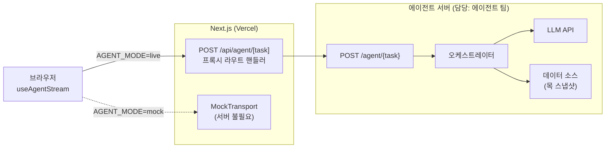

# Voyagent — 에이전트 연동 가이드

> **문서 버전** v1.0 · **최종 수정** 2026-08-13
> **관련 문서** [`contract.md`](./contract.md) — 계약 · [`behavior.md`](./behavior.md) — 행동 명세 · [`collaboration.md`](./collaboration.md) — 일정과 역할
> **이 문서의 역할** 계약을 **실제로 붙이는 방법**. 환경 구성, 단계별 전환, 테스트, 관측성, 장애 대응

---

## 목차

| 절 | 내용 |
|---|---|
| 1 | [시스템 구성](#1-시스템-구성) |
| 2 | [로컬 개발 환경](#2-로컬-개발-환경) |
| 3 | [환경 변수](#3-환경-변수) |
| 4 | [작업 단위 점진 전환](#4-작업-단위-점진-전환) |
| 5 | [계약 테스트](#5-계약-테스트) |
| 6 | [관측성](#6-관측성) |
| 7 | [성능 예산](#7-성능-예산) |
| 8 | [배포](#8-배포) |
| 9 | [트러블슈팅](#9-트러블슈팅) |

---

## 1. 시스템 구성



| 구성 요소 | 담당 | 비고 |
|---|---|---|
| 브라우저 · `useAgentStream` | 프론트 | 계약대로 이벤트를 소비한다 |
| `MockTransport` | 프론트 | 서버 없이 동작. **끝까지 유지한다** (§4.4) |
| `/api/agent/[task]` 프록시 | 프론트 | CORS·비밀·SSE 버퍼링 제어 |
| `POST /agent/{task}` | **에이전트** | 계약의 유일한 구현 대상 |
| LLM · 데이터 소스 | **에이전트** | 프론트는 관여하지 않는다 |

### 1.1 프록시 라우트 핸들러 (프론트 측 참고 구현)

에이전트 팀이 직접 만들 필요는 없지만, **어떻게 호출되는지** 알아두면 디버깅이 쉽다.

```ts
// src/app/api/agent/[task]/route.ts
const TASKS = new Set([
  'flightSearch', 'staySearch', 'placeDiscovery', 'itineraryGenerate', 'itineraryVerify',
]);

export async function POST(req: Request, { params }: { params: Promise<{ task: string }> }) {
  const { task } = await params;
  if (!TASKS.has(task)) {
    return Response.json({ error: 'unknown_task' }, { status: 404 });
  }

  const base = process.env.AGENT_BASE_URL;
  if (!base) return Response.json({ error: 'agent_not_configured' }, { status: 503 });

  const upstream = await fetch(`${base}/agent/${task}`, {
    method: 'POST',
    headers: {
      'Content-Type': 'application/json',
      Accept: 'text/event-stream',
      'X-Voyagent-Contract': 'v1.0',
      'X-Voyagent-Trace-Id': crypto.randomUUID(),
      ...(process.env.AGENT_TOKEN ? { Authorization: `Bearer ${process.env.AGENT_TOKEN}` } : {}),
    },
    body: await req.text(),
    // 클라이언트가 끊으면 업스트림도 끊는다 (contract.md §2.6)
    signal: req.signal,
    // @ts-expect-error Node fetch 전용
    duplex: 'half',
  });

  return new Response(upstream.body, {
    status: upstream.status,
    headers: {
      'Content-Type': 'text/event-stream; charset=utf-8',
      'Cache-Control': 'no-cache, no-transform',
      Connection: 'keep-alive',
      'X-Accel-Buffering': 'no',
    },
  });
}
```

| 주의 | 내용 |
|---|---|
| `signal: req.signal` | 이게 없으면 사용자가 화면을 떠나도 에이전트가 계속 돌아 **LLM 요금이 새어나간다** |
| `upstream.body` 그대로 전달 | ⛔ `await upstream.text()`로 받으면 스트리밍이 죽는다 |
| `export const runtime` | Edge 런타임은 SSE 스트리밍에 제약이 있다. **Node 런타임**(기본값)을 쓴다 |

### 1.2 서버 구현 스켈레톤 (참고)

언어·프레임워크는 자유다. 아래는 SSE 응답의 최소 형태다.

```python
# FastAPI 예시
from fastapi import FastAPI, Request
from fastapi.responses import StreamingResponse
import json, time, asyncio

app = FastAPI()
SSE_HEADERS = {
    "Cache-Control": "no-cache, no-transform",
    "Connection": "keep-alive",
    "X-Accel-Buffering": "no",   # 이걸 빼면 스트리밍이 사라진다
}

@app.post("/agent/{task}")
async def run_agent(task: str, request: Request):
    if task not in TASKS:
        return JSONResponse({"error": "unknown_task"}, status_code=404)
    payload = await request.json()

    async def gen():
        t0 = time.monotonic()
        seq = 0
        def ev(**kw):
            nonlocal seq
            e = {"seq": seq, "at": int((time.monotonic() - t0) * 1000), **kw}
            seq += 1
            return f"data: {json.dumps(e, ensure_ascii=False)}\n\n"

        yield ev(type="status", text="검색 조건을 정리하고 있어요")
        try:
            async for e in orchestrate(task, payload, request):
                if await request.is_disconnected():
                    return                      # 취소: 이벤트를 더 보내지 않는다
                yield ev(**e)
        except TimeoutError:
            yield ev(type="error", code="timeout",
                     message="검색이 예상보다 오래 걸리고 있어요", retryable=True)
        except Exception:
            log.exception("agent failed")       # 스택은 로그로만
            yield ev(type="error", code="agent_failed",
                     message="AI가 응답하지 못했어요", retryable=True)

    return StreamingResponse(gen(), media_type="text/event-stream", headers=SSE_HEADERS)
```

| 체크 | 이유 |
|---|---|
| `ensure_ascii=False` | 한국어가 `\uXXXX`로 이스케이프되면 페이로드가 3배로 커진다 |
| `try/except`로 감싸기 | 예외가 그냥 터지면 스트림이 종료 이벤트 없이 끊긴다 → **프론트가 영원히 로딩** |
| `is_disconnected()` | 취소 감지 |
| 종료 이벤트 보장 | 모든 경로가 `done` 또는 `error`로 끝나야 한다 |

---

## 2. 로컬 개발 환경

### 2.1 포트 약속

| 서비스 | 포트 |
|---|---|
| Next.js 프론트 | `3000` |
| 에이전트 서버 | **`8000`** |

### 2.2 에이전트만 개발할 때 (프론트 없이)

프론트를 띄우지 않고도 계약 준수를 확인할 수 있다. 이게 병렬 개발의 핵심이다.

```bash
# 1) 에이전트 서버 실행 (각자의 방식)
#    → http://localhost:8000

# 2) 계약 테스트
node agent/tools/conformance.mjs http://localhost:8000

# 3) 특정 작업만
node agent/tools/conformance.mjs http://localhost:8000 placeDiscovery

# 4) 눈으로 스트림 확인 (SSE 원문)
curl -N -X POST http://localhost:8000/agent/placeDiscovery \
  -H 'Content-Type: application/json' \
  -H 'Accept: text/event-stream' \
  -d @<(node -e "
    const fx=require('./agent/fixtures/inputs.json');
    process.stdout.write(JSON.stringify(fx.default.placeDiscovery));
  ")
```

> `curl -N`의 `-N`은 버퍼링 비활성화다. 이게 없으면 스트리밍이 안 보인다.

**이벤트를 읽기 좋게 보기**

```bash
curl -N -sS -X POST http://localhost:8000/agent/flightSearch \
  -H 'Content-Type: application/json' \
  -d "$(node -e "process.stdout.write(JSON.stringify(require('./agent/fixtures/inputs.json').default.flightSearch))")" \
| grep '^data: ' | sed 's/^data: //' \
| node -e "
  let n=0;
  require('readline').createInterface({input:process.stdin}).on('line', l => {
    const e = JSON.parse(l);
    const detail =
      e.type==='thought'      ? \`[\${e.id}] \${e.text.slice(-40)}\${e.done?' ✓':'…'}\`
    : e.type==='tool_call'    ? \`\${e.name} — \${e.label}\`
    : e.type==='tool_result'  ? \`→ \${e.label} (ok=\${e.ok})\`
    : e.type==='partial'      ? \`+ \${e.payload.id}\`
    : e.type==='check_update' ? \`\${e.check.ruleId} \${e.check.status} \${e.check.severity}\`
    : e.type==='done'         ? \`\${e.summary ?? ''}\`
    : e.type==='error'        ? \`\${e.code}: \${e.message}\`
    : JSON.stringify(e).slice(0,60);
    console.log(String(e.seq).padStart(3)+' '+String(e.at).padStart(6)+'ms  '+e.type.padEnd(13)+detail);
    n++;
  }).on('close', ()=>console.log('총 '+n+'개 이벤트'));
"
```

### 2.3 프론트와 함께 확인할 때

```bash
# 프론트 .env.local
NEXT_PUBLIC_AGENT_MODE=live
AGENT_BASE_URL=http://localhost:8000

npm run dev   # localhost:3000
```

`mock` ↔ `live` 전환은 **환경 변수 하나**다. 화면 코드는 바뀌지 않는다.

---

## 3. 환경 변수

### 3.1 프론트 (`spec.md` 12.3 기준 + 추가)

| 키 | 예 | 브라우저 노출 | 용도 |
|---|---|---|---|
| `NEXT_PUBLIC_AGENT_MODE` | `mock` \| `live` | ✅ | 전송 계층 선택 |
| `AGENT_BASE_URL` | `http://localhost:8000` | ❌ 서버만 | 프록시의 업스트림 |
| `AGENT_TOKEN` | (빈 값) | ❌ 서버만 | 인증 토큰 (§8.3) |
| `NEXT_PUBLIC_AGENT_TASK_FLAGS` | `placeDiscovery,itineraryGenerate` | ✅ | **작업 단위 live 전환** (§4) 🔶 |
| `NEXT_PUBLIC_MOCK_IMAGE_MODE` | `picsum` | ✅ | 이미지 모드 |
| `MOCK_SEED` | (빈 값) | ❌ | E2E 결정론 |

> ⚠️ `NEXT_PUBLIC_` 접두는 **브라우저 번들에 그대로 박힌다.** 토큰·API 키에 절대 붙이지 않는다.
> 기존 `spec.md` 12.3의 `NEXT_PUBLIC_AGENT_BASE_URL`은 **`AGENT_BASE_URL`로 바꾸는 것을 권한다**(프록시 경유이므로 브라우저가 알 필요가 없다).

### 3.2 에이전트 서버

에이전트 팀 재량이지만 아래는 있는 것이 좋다.

| 키 | 예 | 용도 |
|---|---|---|
| `PORT` | `8000` | 수신 포트 |
| `LLM_API_KEY` | — | LLM 인증 |
| `LLM_MODEL` | — | 모델 식별자 |
| `LLM_TEMPERATURE` | `0.2` | 낮게 두면 디버깅·데모가 쉽다 |
| `AGENT_HARD_TIMEOUT_MS` | `40000` | 클라이언트(45초)보다 먼저 끝내야 한다 |
| `AGENT_RESPONSE_CACHE` | `on` \| `off` | 데모 안정성 (§8.4) |
| `AGENT_DATA_DIR` | `./data/mocks` | 목 스냅샷 위치 |
| `LOG_LEVEL` | `info` | — |

---

## 4. 작업 단위 점진 전환

⛔ **5개 작업을 한꺼번에 live로 바꾸지 않는다.** 하나가 깨지면 전체 흐름이 막히고 원인을 좁힐 수 없다.

### 4.1 전환 순서

```
M0  스텁 서버        5개 작업이 계약을 지키는 이벤트를 낸다 (내용은 목 데이터 그대로)
     ↓
M1  placeDiscovery   입력이 가장 단순(cityId + persona + dayCount)하고 UX 임팩트가 가장 크다
     ↓
M2  itineraryGenerate 입력에 Place[]가 들어온다. 배치 알고리즘 검증
     ↓
M3  itineraryVerify   규칙 엔진 + 서술. 가장 복잡하다
     ↓
M4  flightSearch / staySearch  독립적이라 마지막에 붙여도 흐름을 막지 않는다
     ↓
M5  폴백 · 관측성 · 캐시
```

**왜 `placeDiscovery`가 먼저인가**

| 이유 | 설명 |
|---|---|
| 입력이 단순 | 앞 단계 결과에 의존하지 않는다 |
| 뒤 단계의 입력을 만든다 | 여기 출력이 `itineraryGenerate`의 입력이다. 먼저 안정화해야 뒤가 흔들리지 않는다 |
| 우회 가능 | 항공·숙소는 페르소나에서 "아니요"로 건너뛸 수 있다(`spec.md` 14.3 최소 데모 경로). 장소는 우회 불가 |
| 임팩트 | "AI가 나를 위해 골랐다"는 인상이 여기서 만들어진다 |

### 4.2 작업별 플래그 🔶

한 작업만 live로 돌리려면 전송 계층이 작업별로 분기해야 한다.

```ts
// src/lib/agent/transport.ts
const LIVE_TASKS = new Set(
  (process.env.NEXT_PUBLIC_AGENT_TASK_FLAGS ?? '').split(',').map((s) => s.trim()).filter(Boolean),
);

export function getTransport(task: AgentTaskId): AgentTransport {
  if (process.env.NEXT_PUBLIC_AGENT_MODE !== 'live') return mockTransport;
  return LIVE_TASKS.size === 0 || LIVE_TASKS.has(task) ? sseTransport : mockTransport;
}
```

```bash
# placeDiscovery만 실제 에이전트, 나머지는 목
NEXT_PUBLIC_AGENT_MODE=live
NEXT_PUBLIC_AGENT_TASK_FLAGS=placeDiscovery
```

> `spec.md` 6.4의 `getTransport()`는 인자가 없다. **`task`를 받도록 시그니처를 바꾸는 것**이 이 전환 전략의 전제다. [`collaboration.md` §7](./collaboration.md#7-결정-대기-목록)에 올려두었다.

### 4.3 각 마일스톤의 완료 판정

| 마일스톤 | 완료 조건 |
|---|---|
| M0 | `node agent/tools/conformance.mjs http://localhost:8000` 전체 통과 (경고는 허용) |
| M1–M4 | 해당 작업 계약 테스트 통과 + 프론트에서 화면이 정상 렌더 + [`behavior.md` §7 루브릭](./behavior.md#72-루브릭) 전 축 3점 이상 |
| M5 | 3회 실패 후 목 폴백 동작 확인 + 골든 케이스 5개 캐시 확인 |

### 4.4 목 계층은 끝까지 유지한다

`spec.md` 6.8:

> *"실패 3회 후에는 목데이터 전체를 그냥 보여주는 폴백 경로를 둔다(데모 중단 방지)."*

| 이유 | 설명 |
|---|---|
| 발표 보험 | 발표 중 LLM 장애·쿼터 초과가 실제로 일어난다. 복구할 시간이 없다 |
| 프론트 독립 개발 | 에이전트 서버가 안 떠 있어도 프론트 작업이 멈추지 않는다 |
| E2E 안정성 | Playwright 테스트는 `MOCK_SEED`로 고정된 목을 쓴다. live에 의존하면 CI가 불안정해진다 |
| 회귀 비교 | 같은 입력에 대해 목 결과와 live 결과를 나란히 보면 품질 판단이 쉽다 |

⛔ live 전환 후에 `MockTransport`를 삭제하지 않는다.

---

## 5. 계약 테스트

### 5.1 실행

```bash
# 5개 작업 전부
node agent/tools/conformance.mjs http://localhost:8000

# 하나만
node agent/tools/conformance.mjs http://localhost:8000 itineraryVerify

# 서버 없이 골든 파일 검사 (형식 학습용)
node agent/tools/conformance.mjs --file agent/fixtures/golden.flightSearch.jsonl flightSearch
```

의존성이 없다. Node 18 이상이면 바로 돌아간다.

### 5.2 출력 읽기

```
✕ itineraryVerify
  통과 88 · 실패 20 · 경고 1

  ── 실패 (계약 위반. 프론트가 깨진다) ──
  ✕ I-V2  itineraryVersion은 입력 itinerary.version(1)을 그대로 되돌려줘야 한다. 받은 값: 7 …
  ✕ L3.33 V10: check_update가 최소 2개(running → done) 필요하다. 받은 개수: 0 …

  ── 경고 (권고 위반. 동작은 하지만 UX가 나빠진다) ──
  △ I-V9  logLines가 비었다. [추론 다시 보기]가 빈 화면이 된다
```

| 등급 | 의미 | 대응 |
|---|---|---|
| ✕ 실패 | 계약 위반. 프론트가 깨진다 | **머지 전에 고친다.** 종료 코드 1 |
| △ 경고 | 권고 위반. 동작은 하지만 UX가 나빠진다 | 이유를 적어 남겨두거나 고친다 |

검사 ID 접두는 [`contract.md` §10.1](./contract.md#101-무엇을-검사하는가)의 계층에 대응한다.

| 접두 | 계층 |
|---|---|
| `L1.*` | 프레이밍 — SSE 형식, `seq` 단조성, 종료 이벤트 |
| `L2.*` | 스키마 — 필수 필드, 열거형, 텍스트 금지 문자 |
| `L3.*` | 일반 불변식 — `partial`↔`done` 일관성, 개수, 필수 값 |
| `L4.*` | 타이밍 |
| `I-*` | [`contract.md` §5](./contract.md#5-작업별-계약-5개)의 작업별 불변식 |

### 5.3 규칙 일치 테스트

검증 규칙 V1~V10은 두 곳에 구현된다. 목 모드에서는 프론트가, live 모드에서는 에이전트가 판정한다([`behavior.md` §6.1](./behavior.md#61-규칙-소유권)). **두 구현의 결론이 갈리면** 사용자는 모드에 따라 다른 결과를 본다.

```bash
# 같은 입력으로 양쪽을 돌려 severity를 비교한다
node agent/tools/conformance.mjs http://localhost:8000 itineraryVerify   # live
# 프론트 참조 구현: npm run test -- runVerification                       # mock
```

[`fixtures/inputs.json`](./fixtures/inputs.json)의 `default.itineraryVerify`는 **V1·V3·V4가 실제로 걸리도록** 의도적으로 구성했다.

| 규칙 | 기대 결과 | 근거 |
|---|---|---|
| V1 | `conflict` | Day 1(2026-06-15 월요일)에 도쿄 국립박물관. `closedWeekdays: [1]` |
| V3 | `conflict` 또는 `warning` | Day 2 마지막 방문이 12:00 종료, 14:30 출발. 체크인 120분 + 이동 80분 필요 |
| V4 | `warning` | 체크아웃 10:30 이후 센소지 일정이 있는데 짐 보관 블록이 없다 |
| V6 | `pass` 또는 `warning` | 예산 1인 120만원 입력됨 |
| V9 | `pass` | 픽스처의 두 장소 모두 `needsReservation: false` |

> **전부 `pass`로 나오면 규칙 엔진을 의심한다.** 이 픽스처는 문제를 심어둔 데이터다.

### 5.4 CI 편입

에이전트 저장소의 CI에 넣는다.

```yaml
# .github/workflows/agent-ci.yml (요약)
jobs:
  contract:
    steps:
      - uses: actions/checkout@v4
      - uses: actions/setup-node@v4
        with: { node-version: '20' }
      # 계약 문서·스크립트를 프론트 저장소에서 가져온다 (또는 서브모듈/복사)
      - run: <에이전트 서버 백그라운드 실행>
      - run: npx wait-on http://localhost:8000/health
      - run: node agent/tools/conformance.mjs http://localhost:8000
```

`/health` 엔드포인트(200 + 빈 JSON)를 하나 두면 CI가 편해진다. 계약에는 없지만 있어도 무해하다.

---

## 6. 관측성

에이전트가 무엇을 했는지 사후에 알 수 없으면 품질 개선이 불가능하다.

### 6.1 트레이스 ID 🔶

| 항목 | 규칙 |
|---|---|
| 헤더 | `X-Voyagent-Trace-Id` (프록시가 생성) |
| 없으면 | 서버가 UUID를 생성한다 |
| 용도 | 프론트 콘솔 로그 ↔ 서버 로그를 연결한다 |

프론트는 이 값을 개발 모드 콘솔에 찍는다. 사용자가 "이상하게 나왔어요"라고 할 때 그 실행만 골라 볼 수 있다.

### 6.2 로그 스키마 권고

실행 1건 = 로그 1줄(JSON). 그래야 나중에 집계할 수 있다.

```json
{
  "traceId": "8f3a1c9e-...",
  "task": "placeDiscovery",
  "cityId": "tokyo",
  "durationMs": 10420,
  "eventCount": 128,
  "outcome": "done",
  "resultCount": 40,
  "llmCalls": 2,
  "llmTokens": { "in": 4210, "out": 1880 },
  "toolCalls": ["search_places", "filter_by_persona", "fetch_details", "check_hours"],
  "invariantViolations": [],
  "personaDigest": { "pace": "balanced", "interests": ["food", "nature", "history"], "hasFreeNote": true }
}
```

| 필드 | 왜 필요한가 |
|---|---|
| `durationMs` · `eventCount` | 타이밍 예산 위반 추적 |
| `outcome` | `done` / `error:{code}` / `aborted` 분포 |
| `resultCount` | 결과 부족 사례 탐지 |
| `llmTokens` | 비용 관리 |
| `invariantViolations` | **자체 검사([`behavior.md` §1.6](./behavior.md#16-llm과-결정론적-코드의-경계) [3]계층)에서 걸러낸 항목.** 여기가 비어 있지 않으면 LLM 출력 품질에 문제가 있다 |
| `personaDigest` | 어떤 입력에서 품질이 나쁜지 역추적 |

⛔ **`freeNote` 원문을 로그에 남기지 않는다.** 사용자 자유 입력이다. `hasFreeNote` 불리언만 남긴다.

### 6.3 지표

| 지표 | 목표 |
|---|---|
| `done` 비율 | ≥ 95% |
| p50 소요 | [§7](#7-성능-예산) 목표 범위 안 |
| p95 소요 | 소프트 상한 이하 |
| 첫 이벤트 p95 | ≤ 1,000ms |
| 불변식 위반 건수 | **0** (자체 검사에서 걸러지므로 프론트에는 안 나가지만, 발생 자체가 신호다) |
| 계약 테스트 통과 | 항상 |

---

## 7. 성능 예산

### 7.1 시간

| 작업 | 목표 | 소프트 상한 | 하드 |
|---|---|---|---|
| `flightSearch` | 8–10초 | 20초 | 40초 |
| `staySearch` | 7–9초 | 18초 | 40초 |
| `placeDiscovery` | 9–12초 | 24초 | 40초 |
| `itineraryGenerate` | 10–14초 | 28초 | 40초 |
| `itineraryVerify` | 11–15초 | 30초 | 40초 |
| 첫 이벤트 | ≤ 1,000ms (권고 500ms) | — | — |
| 이벤트 간 무음 | ≤ 8초 | — | — |

**목표 시간은 "빠를수록 좋다"가 아니다.** 스트리밍 연출이 보여야 하므로 **너무 빨라도 문제**다. 3초에 끝나면 추론 문장을 읽을 시간이 없다.

| 상황 | 대응 |
|---|---|
| 실제 처리가 3초 만에 끝난다 | 이벤트 방출 간격을 늘려 목표 범위에 맞춘다 |
| 실제 처리가 25초 걸린다 | 병렬화하거나 LLM 호출을 줄인다. `progress` 이벤트로 진행감을 유지한다 |

### 7.2 응답 크기

| 항목 | 목표 |
|---|---|
| 단일 이벤트 | ≤ 32KB |
| `partial` 1건 (`Place`) | ≤ 8KB |
| `done.payload` (`Place[]` 40건) | ≤ 400KB |
| 전체 스트림 | ≤ 1MB |

⛔ `tool_call.args`에 대용량을 넣지 않는다. 프론트는 표시하지도 않는다.

> `Place` 40건은 프론트의 localStorage에 저장된다. 여행 1건이 1MB를 넘으면 프론트가 `reviews`를 잘라서 저장한다(`spec.md` 5.13). 서버가 리뷰를 장소당 10개씩 보내면 그 절단이 자주 일어난다. **장소당 3–5개**가 적정하다.

### 7.3 LLM 호출

| 항목 | 권고 |
|---|---|
| 작업당 호출 수 | **1–3회.** 많아지면 지연과 비용이 선형으로 늘고 실패 지점도 늘어난다 |
| 병렬 호출 | 서술 생성은 병렬화하기 좋다(장소별 `agentNote` 등) |
| 스트리밍 | LLM 스트리밍을 `thought` 이벤트로 그대로 흘리면 자연스럽다. 다만 **누적 텍스트로 변환**해서 보낸다 |
| 캐시 | 같은 입력 → 같은 결과. 개발·데모에서 특히 유용하다 |

---

## 8. 배포

### 8.1 프론트

Vercel. `spec.md` 12.3 참조. `AGENT_BASE_URL`을 프로젝트 환경 변수로 넣는다.

| 주의 | 내용 |
|---|---|
| 함수 실행 시간 | Vercel 무료 플랜의 서버리스 함수 실행 상한이 SSE 45초보다 짧을 수 있다. **프록시 라우트에 `maxDuration` 설정**을 확인한다 |
| Edge 런타임 | 쓰지 않는다. Node 런타임으로 스트리밍 |

```ts
// src/app/api/agent/[task]/route.ts
export const maxDuration = 60;   // 클라이언트 타임아웃 45초보다 여유 있게
```

### 8.2 에이전트 서버

| 후보 | 장점 | 주의 |
|---|---|---|
| Railway · Render · Fly.io | 상시 프로세스라 SSE에 적합 | 콜드 스타트 시 첫 이벤트가 늦다 |
| Cloud Run | 스케일 | 요청 타임아웃·스트리밍 설정 확인 |
| 로컬 + 터널 (ngrok 등) | 캠프 데모에 충분 | 발표 중 터널이 끊기면 끝이다. **권장하지 않는다** |
| Vercel 서버리스 | 프론트와 한 곳 | 장시간 스트리밍에 불리 |

⛔ 발표 당일 로컬 터널에 의존하지 않는다. 상시 배포 + 목 폴백이 안전하다.

### 8.3 비밀 관리

| 비밀 | 어디에 |
|---|---|
| `LLM_API_KEY` | **에이전트 서버에만.** 프론트는 모른다 |
| `AGENT_TOKEN` | 프론트 서버 환경 변수 + 에이전트 서버. `NEXT_PUBLIC_` ⛔ |

에이전트 서버가 공개 URL이면 최소한 토큰 검사를 둔다. 안 그러면 남의 LLM 쿼터를 쓸 수 있다.

### 8.4 데모 준비

발표 전 체크리스트.

```
□ 에이전트 서버가 상시 배포되어 있다 (터널 아님)
□ 계약 테스트 5개 작업 전부 통과
□ 골든 케이스 5개(G1~G5)를 실제로 실행해 봤다
□ 응답 캐시 ON — 같은 입력이면 즉시 응답
□ LLM 쿼터 잔량 확인
□ 목 폴백 경로가 살아 있다 (NEXT_PUBLIC_AGENT_TASK_FLAGS로 즉시 되돌릴 수 있다)
□ 발표 경로를 3회 이상 리허설했다 (첫 실행에서만 실패하는 문제가 흔하다)
□ 네트워크가 끊겼을 때 어떻게 할지 정해뒀다
```

---

## 9. 트러블슈팅

### 9.1 증상별 원인

| 증상 | 가장 흔한 원인 | 확인 |
|---|---|---|
| **스트리밍이 안 보이고 결과가 한 번에 나온다** | `X-Accel-Buffering: no` 누락 또는 압축 | `curl -N`으로 이벤트가 하나씩 오는지 확인. 프록시 응답 헤더 확인 |
| **화면이 영원히 로딩** | 종료 이벤트(`done`/`error`) 없이 스트림 종료 | 계약 테스트 `L1.12` |
| 추론 문장이 뭉개진다 (`인천인천(ICN)…`) | `thought`를 델타로 보냈다 | 계약 테스트 `L1.20` |
| 카드가 쌓였다가 사라진다 | `partial` 항목이 `done.payload`에 없다 | `L3.2` |
| 추천 1위가 3번째에 표시된다 | `partial` 순서 ≠ `done` 순서 | `L3.3` |
| 체크리스트가 영원히 `대기` | `check_update`가 10개 미만 | `L3.33` |
| 검증 결과가 즉시 `재검증 필요` | `itineraryVersion` 미반영 | `I-V2` |
| 모든 시각이 9시간 밀린다 | `ISODateTime`에 타임존(`Z`) 포함 | `L2.15` |
| 일정 카드에 제목·사진이 없다 | 입력에 없는 `placeId` 생성 | `I-I1` |
| 사용자가 고른 장소가 사라진다 | 배치도 미배치도 아니다 | `I-I2` |
| 휴관일 검증이 엉뚱하게 나온다 | `weekday` 계산 오류 또는 `closedWeekdays` 불일치 | `I-I4` · `I-P3` · [`contract.md` 부록 A10](./contract.md#부록-a-specmd-정합성-메모) |
| 아이콘·라벨 자리가 빈다 | 열거형에 없는 값 | `L2.*` |
| 화면에 `**`나 이모지가 보인다 | 마크다운·이모지 포함 | `L2.6` |
| 지도 마커가 바다에 찍힌다 | 좌표 오류 | `I-P1` |
| 사용자가 떠났는데 LLM 요금이 계속 발생 | 프록시에 `signal` 미전달 또는 서버가 취소를 무시 | §1.1 |
| 첫 이벤트가 3초 뒤에 온다 | 결과를 다 만든 뒤 스트림을 시작했다 | `L4.1`. `status`를 **먼저** 보내고 작업을 시작한다 |

### 9.2 자주 하는 설계 실수

| 실수 | 왜 문제인가 | 올바른 방식 |
|---|---|---|
| 결과를 다 만든 뒤 이벤트를 몰아서 방출 | 계약은 통과하지만 스트리밍 UX가 가짜가 된다. 첫 이벤트가 늦어 `L4.1` 실패 | `status`를 즉시 보내고, 실제 진행에 맞춰 이벤트를 흘린다 |
| 날짜·거리 계산을 LLM에게 맡김 | 틀리면 검증 기능 전체의 신뢰가 무너진다 | 결정론적 코드로 ([`behavior.md` §1.6](./behavior.md#16-llm과-결정론적-코드의-경계)) |
| LLM 출력을 검사 없이 그대로 방출 | 열거형 위반·없는 `placeId`가 실제로 자주 나온다 | 출력 직전 불변식 검사 계층을 둔다 |
| 자동 수정을 적용 검증 없이 제안 | 프론트가 적용하면 일정이 깨진다 | 시뮬레이션 후 새 충돌이 없을 때만 제안. 아니면 `autoFix: null` |
| 예외를 그냥 터뜨림 | 종료 이벤트 없이 스트림이 끊긴다 | `try/except`로 감싸 `error` 이벤트를 보장한다 |
| 건너뛴 검증 규칙의 이벤트를 생략 | 체크리스트 행이 영원히 대기 | `severity: 'skipped'` + 이유로 `done`을 보낸다 |
| 리뷰·평점을 창작 | `spec.md` 3.14.3 정직성 위반 | 데이터에 없으면 빈 배열 |
| `accessibility`를 추측해서 채움 | 휠체어 사용자가 잘못된 정보를 믿고 간다 | 모르면 `null` |

### 9.3 계약 테스트가 통과하는데 화면이 이상할 때

계약 테스트는 **형식**만 본다. 아래는 형식이 맞아도 나쁜 결과다.

```
□ 40곳이 다 유명 관광지다 → 큐레이션이 아니다 (behavior.md 4.2절)
□ 한 카테고리가 절반을 넘는다 → 균형 실패
□ 관심사에 없는 장소만 위에 있다 → 정렬 실패
□ 추론 문장이 도구 이름 나열이다 → behavior.md 1.1절
□ freeNote를 무시했다 → 설문 마지막 문항이 장식이 된다
□ agentNote가 전부에 붙어 있고 내용이 뻔하다 → 노이즈
□ 검증이 전부 pass다 → 목 데이터에 함정이 없거나 규칙이 동작하지 않는다
□ 자동 수정 제안이 전부 null이다 → 검증의 절반이 빠졌다
□ 일정의 하루 장소 수가 페이스와 무관하다 → PACE_CONFIG 미반영
```

판정은 [`behavior.md` §7 루브릭](./behavior.md#72-루브릭)으로 한다.

---

**문서 끝** · 누가 무엇을 언제 하는지는 [`collaboration.md`](./collaboration.md).
