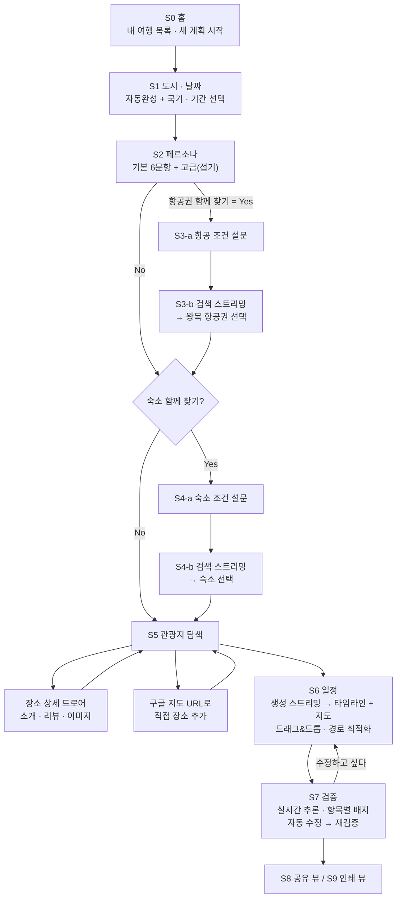
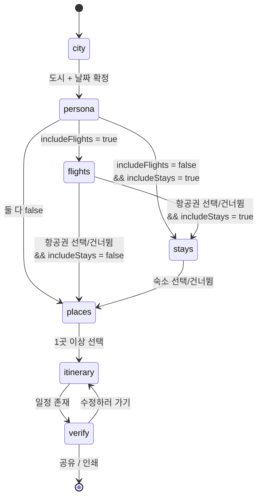
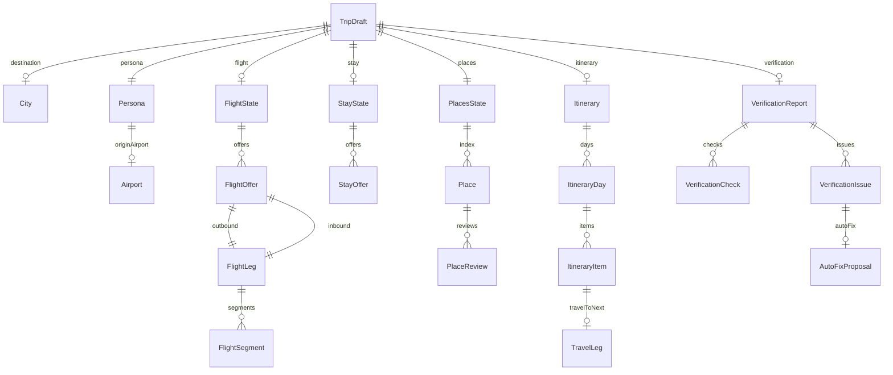
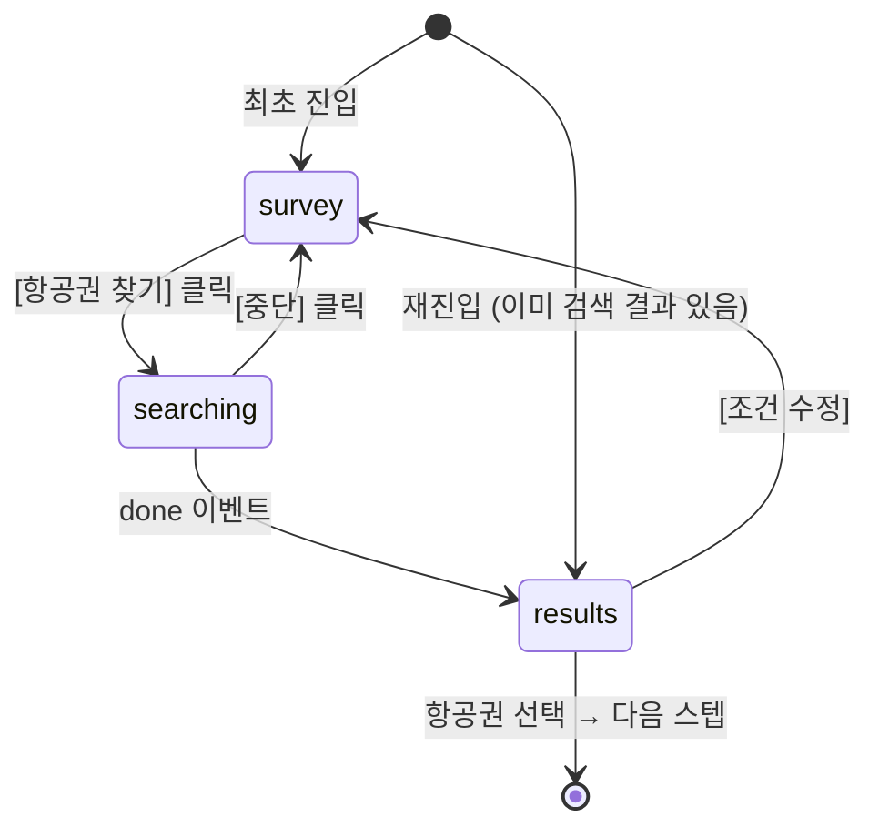

# JustGO — AI 여행 플래너 프론트엔드 UI/UX 명세서

> **문서 버전** v1.0 · **최종 수정** 2026-08-13 · **상태** 구현 착수 가능(Implementation-Ready)
> **프로젝트** 강원대 × 고려대 Summer Agentic AI 심화 몰입 캠프 1팀
> **관련 문서** [`design.md`](./design.md) — AI 디자인 도구용 프롬프트 세트

---

## 목차

| 장 | 제목 | 주 독자 |
|---|---|---|
| 0 | [문서 개요](#0-문서-개요) | 전원 |
| 1 | [제품 개요](#1-제품-개요) | 전원 |
| 2 | [기술 스택과 프로젝트 구조](#2-기술-스택과-프로젝트-구조) | FE 개발 |
| 3 | [디자인 시스템](#3-디자인-시스템) | FE 개발 · 디자인 |
| 4 | [정보 구조와 라우팅](#4-정보-구조와-라우팅) | FE 개발 |
| 5 | [데이터 모델](#5-데이터-모델) | FE 개발 · BE 개발 |
| 6 | [목 데이터와 에이전트 스트리밍 계약](#6-목-데이터와-에이전트-스트리밍-계약) | FE 개발 · BE/Agent 개발 |
| 7 | [화면별 상세 명세](#7-화면별-상세-명세) | FE 개발 · 디자인 |
| 8 | [공통 인터랙션 패턴](#8-공통-인터랙션-패턴) | FE 개발 · 디자인 |
| 9 | [검증 규칙 카탈로그](#9-검증-규칙-카탈로그) | FE 개발 · Agent 개발 |
| 10 | [반응형과 모바일 사양](#10-반응형과-모바일-사양) | FE 개발 · 디자인 |
| 11 | [접근성과 국제화](#11-접근성과-국제화) | FE 개발 |
| 12 | [성능 예산과 배포](#12-성능-예산과-배포) | FE 개발 |
| 13 | [테스트 전략과 수용 기준](#13-테스트-전략과-수용-기준) | FE 개발 · QA · 디자인 |
| 14 | [구현 로드맵](#14-구현-로드맵) | 전원 |
| 15 | [부록](#15-부록) | FE 개발 |

---

# 0. 문서 개요

## 0.1 이 문서의 목적

이 문서는 **AI 에이전트가 여행 계획을 만들어 주는 웹앱의 프론트엔드 UI/UX 전체 명세**다.
목표는 단 하나다.

> **이 문서만 읽고 구현하면, 추가 질문 없이 의도한 수준의 화면이 한 번에 나온다.**

그래서 이 문서는 "무엇을 만들지"가 아니라 **"어떤 픽셀, 어떤 상태, 어떤 순서로 반응하는지"** 를 기술한다. 화면마다 레이아웃 와이어프레임, 컴포넌트 목록, 상태 전이, 키보드 동작, 빈/로딩/에러 화면, 그리고 **실제로 화면에 박히는 한국어 문구**까지 포함한다.

## 0.2 범위 (In Scope)

| 구분 | 포함 내용 |
|---|---|
| 화면 | 홈, 도시·날짜 선택, 페르소나 설문, 항공권(설문·검색·선택), 숙소(설문·검색·선택), 관광지 탐색·선택, 일정 생성·편집(지도 연동), 일정 검증, 공유 뷰, 인쇄 뷰 |
| 인터랙션 | 리스트↔지도 양방향 동기화, 드래그&드롭 일정 편집, 경로 최적화, 1-클릭 장소 추가, 자동 저장, Undo 토스트, ⌘K 커맨드 팔레트, 에이전트 추론 스트리밍 |
| 디자인 | 디자인 토큰(라이트·다크), 타이포그래피, 컴포넌트 규칙, 모션 규격, 아이콘 매핑 |
| 데이터 | 프론트엔드 전체 TypeScript 타입, 목(mock) 데이터 스키마와 샘플, localStorage 지속화 규칙 |
| 에이전트 | **목 에이전트 스트리밍 계층** + 실제 백엔드로 교체하기 위한 계약(contract) 정의 |
| 품질 | 반응형 규격, 접근성(WCAG 2.1 AA), 성능 예산, 테스트 전략, 화면별 수용 기준 |

## 0.3 비범위 (Out of Scope)

| 제외 항목 | 이유 / 대체 방식 |
|---|---|
| 실제 백엔드 서버 구현 | 6장에서 계약만 정의. 프론트는 `MockTransport`로 동작 |
| 실제 LLM 에이전트 구현 | 시나리오 스크립트 기반 fake 스트리밍으로 동일한 UX 재현 |
| 실제 항공/숙소/지도 상용 API 연동 | 로컬 JSON 목데이터. 지도만 MapLibre + 무료 타일로 실제 렌더 |
| 로그인 · 회원가입 · 결제 | 익명 사용. 여행 데이터는 브라우저 localStorage에 저장 |
| 실시간 공동 편집(멀티플레이어) | 공유는 **읽기 전용 스냅샷 링크**로 대체 |
| 네이티브 앱 · 오프라인 모드 | 반응형 웹으로 모바일 대응 |
| 다국어 번역 실물 | 한국어만 제공. 단, i18n 구조(`messages/ko.json`)는 미리 갖춤 |

## 0.4 독자별 읽기 경로

| 독자 | 권장 순서 |
|---|---|
| **프론트엔드 개발자 (구현 담당)** | 2장 → 3장 → 4장 → 5장 → 6장 → 7장(전체) → 8장 → 13장 → 14장 |
| **디자이너 / AI 디자인 도구 사용자** | 1장 → 3장(특히 [3.14 금지 사항](#314-금지-사항-do-not)) → 7장(담당 화면) → 10장 → [13.6 디자인 검수 게이트](#136-디자인-검수-게이트-ai-티-점검) → `design.md` |
| **백엔드 · 에이전트 개발자** | 1장 → 5장 → 6장 → 9장 |
| **기획 · 발표 담당** | 0장 → 1장 → 7장 와이어프레임만 → 14장 |
| **처음 합류한 팀원** | 0장 → 1장 → 4장 → 그 다음 담당 영역 |

## 0.5 용어 사전

문서 전체에서 아래 용어를 **일관되게** 사용한다. 코드 식별자도 이 표를 따른다.

| 한국어 | 코드 식별자 | 정의 |
|---|---|---|
| 여행 | `Trip` | 하나의 여행 계획 단위. `tripId`로 식별 |
| 여행 초안 | `TripDraft` | 위저드 진행 중인 여행의 전체 상태 객체 (5장) |
| 스텝 | `Step` | 위저드의 단계 하나. 7개 존재 (`city`…`verify`) |
| 목적지 도시 | `City` | 여행 대상 도시. 국가·국기·좌표 포함 |
| 페르소나 | `Persona` | 사용자의 여행 성향·조건 응답 묶음 |
| 항공권 후보 | `FlightOffer` | 왕복 1건을 묶은 항공권 옵션 |
| 숙소 후보 | `StayOffer` | 숙소 1건 옵션 |
| 장소 | `Place` | 관광지·식당·카페 등 방문 가능한 지점 |
| 후보 장소 | `candidatePlaces` | 에이전트가 발견해 리스트에 보여준 장소들 |
| 선택 장소 | `selectedPlaces` | 사용자가 체크한 "가고 싶은 곳" |
| 직접 추가 장소 | `customPlace` | 구글 지도 URL로 사용자가 직접 넣은 장소 |
| 일정 | `Itinerary` | 날짜별로 배치된 최종 계획 |
| 일자 | `ItineraryDay` | 일정의 하루. `dayIndex`(0부터), 색상 배정됨 |
| 일정 항목 | `ItineraryItem` | 하루 안의 방문 블록 하나 (장소·시간·소요) |
| 이동 구간 | `TravelLeg` | 일정 항목 사이의 이동(수단·소요시간·거리) |
| 검증 | `Verification` | 검증 에이전트가 일정을 점검한 결과 |
| 검증 항목 | `VerificationCheck` | 검증 규칙 1건의 실행 결과 (✅/⚠️/❌) |
| 이슈 | `VerificationIssue` | 주의·충돌로 판정된 건. 자동 수정 대상 |
| 에이전트 이벤트 | `AgentEvent` | 스트리밍으로 내려오는 단위 메시지 |
| 추론 스트림 | `ThoughtStream` | 에이전트의 사고 과정을 실시간 표시하는 UI |
| 도구 호출 카드 | `ToolCallCard` | "항공편 검색 중…" 같은 도구 실행 표시 UI |

**표기 규칙**

- `코드체` = 파일·컴포넌트·타입·CSS 변수 식별자
- **굵게** = 화면에 실제로 표시되는 문구(UI 카피)
- ✅ 필수 · 🔶 선택 · ⛔ 금지
- 화면 ID는 `S0` ~ `S9` (7장)
- 검증 규칙 ID는 `V1` ~ `V10` (9장)

---

# 1. 제품 개요

## 1.1 한 줄 정의

> **도시와 날짜만 정하면, AI 에이전트가 항공권·숙소·관광지를 찾아 검증된 일정표까지 만들어 주는 여행 계획 웹앱.**

## 1.2 핵심 가치 제안

| # | 가치 | 어떻게 구현되는가 |
|---|---|---|
| 1 | **입력 부담 최소화** | 사용자가 확정해야 하는 건 **도시 + 날짜** 둘뿐. 나머지는 페르소나 설문의 선택형 문항으로 흘려보내고, 대부분 건너뛸 수 있다 |
| 2 | **AI 작업을 눈으로 보여준다** | 검색·생성·검증 모든 단계에서 에이전트의 추론 과정을 실시간 스트리밍으로 노출해 "기다리는 시간"을 "신뢰가 쌓이는 시간"으로 바꾼다 |
| 3 | **일정과 지도를 한 화면에** | Wanderlog의 핵심 강점. 좌측 일자별 타임라인 ↔ 우측 지도가 hover·클릭 단위로 동기화된다 |
| 4 | **검증된 계획** | 별도 검증 에이전트가 휴관일·이동시간·예산·접근성 등 10개 규칙으로 일정을 점검하고, 문제를 자동 수정까지 제안한다 |

## 1.3 사용자 여정 맵



**여정 상의 감정 곡선과 대응 설계**

| 구간 | 사용자 심리 | 설계 대응 |
|---|---|---|
| S1 진입 | "복잡하면 나갈게" | 화면에 입력 두 개만. 국기 + 도시 이미지로 여행 기분 부여 |
| S2 설문 | "질문 많으면 지친다" | 필수 6문항만 노출, 상단에 남은 문항 수, 언제든 **나머지는 나중에** |
| S3/S4 대기 | "멈춘 건가?" | 추론 스트림 + 도구 호출 카드 + 스켈레톤으로 진행감 유지, 6~14초 내 종료 |
| S5 탐색 | "이게 좋은 곳인지 모르겠다" | 상세 드로어에 이미지·평점·리뷰·AI 요약. 1-클릭 추가 + Undo |
| S6 결과 | "내 스타일이 맞나?" | 즉시 편집 가능(DnD·시간 조정), 지도로 동선 즉시 검증 |
| S7 검증 | "진짜 괜찮을까?" | 규칙별 근거 제시 + 자동 수정. 전부 통과 시 초록 배지로 안심 |

## 1.4 Wanderlog와의 관계

**의도적으로 그대로 가져오는 것 (인터랙션 DNA)**

1. 좌측 일정 리스트 + 우측 지도의 **한 화면 스플릿 뷰**
2. 리스트 항목 ↔ 지도 마커의 **양방향 hover/선택 하이라이트**
3. 일자별 섹션 + 항목 사이 **이동 시간 커넥터**
4. **경로 최적화**(자동 재정렬)
5. **1-클릭 장소 추가**
6. **자동 저장** + "모든 변경사항 저장됨" 인디케이터
7. 장소 카드에 사진·설명·평점이 자동으로 채워지는 느낌

**의도적으로 다르게 가는 것 (차별점)**

| 항목 | Wanderlog | JustGO |
|---|---|---|
| 시작 방식 | 빈 일정에 사용자가 직접 장소를 쌓는다 | **도시·날짜 → 페르소나** 만으로 에이전트가 후보를 먼저 제시 |
| 장소 발견 | 가이드 글 크롤링 결과에서 선택 | **에이전트가 페르소나 기반으로 큐레이션**한 리스트에서 체크 |
| 항공/숙소 | 예약 메일을 가져와 붙임 | **조건 설문 → 에이전트 검색 → 화면에서 선택** |
| 일정 생성 | 사용자가 배치 | **에이전트가 배치**, 사용자는 수정만 |
| 품질 보증 | 없음 | **검증 에이전트**가 10개 규칙으로 점검 + 자동 수정 |
| 비주얼 | 밝고 캐주얼, 채도 높음 | **Linear/Notion풍 미니멀** — 뉴트럴 + 단일 액센트, 고밀도 |

## 1.5 성공 기준

구현 완료를 판단하는 기준. 상세 체크리스트는 [13.5 화면별 수용 기준](#135-화면별-수용-기준)에 있다.

| 구분 | 기준 |
|---|---|
| 기능 완결성 | S0→S7 전체 흐름을 목데이터만으로 끊김 없이 완주 가능 |
| 인터랙션 충실도 | 1.4의 "그대로 가져오는 것" 7개가 모두 동작 |
| 편집 가능성 | 일정 항목의 순서·시간·일자를 자유롭게 재배치 가능 |
| 상태 견고성 | 어느 스텝에서 새로고침해도 진행 상태가 복원됨 |
| 반응형 | 1440 / 1024 / 768 / 375 폭에서 레이아웃 붕괴 없음 |
| 확장성 | `MockTransport` → `SseTransport` 교체만으로 실제 에이전트 연결 가능 |

---

# 2. 기술 스택과 프로젝트 구조

## 2.1 스택 결정과 근거

| 레이어 | 채택 | 버전 | 근거 |
|---|---|---|---|
| 프레임워크 | **Next.js (App Router)** | 15.x | Vercel 무설정 배포, 파일 기반 라우팅으로 스텝별 URL 구현이 자연스러움, 서버 컴포넌트로 목데이터 초기 로드 최적화 |
| 언어 | **TypeScript** | 5.6+ | `strict: true`. 5장 타입이 곧 계약서 역할 |
| 스타일 | **Tailwind CSS** | 3.4.x | 고밀도 UI를 빠르게 조립. 토큰을 CSS 변수 + Tailwind 테마로 이중 노출 |
| 컴포넌트 | **shadcn/ui** (Radix 기반) | latest | 코드 소유 방식이라 Linear풍으로 자유롭게 개조 가능. 접근성이 Radix로 기본 보장 |
| 전역 상태 | **Zustand** + `persist` | 5.x | 위저드 상태 하나(`TripDraft`)를 단일 스토어로. localStorage 동기화가 미들웨어 한 줄 |
| 비동기 상태 | **TanStack Query** | 5.x | 목 API의 캐싱·로딩·에러 상태 표준화. 실제 API 전환 시 그대로 유지 |
| 지도 | **MapLibre GL JS** | 4.x | 오픈소스, **API 키 불필요**, HTML 커스텀 마커·GeoJSON 라인·`flyTo`·`fitBounds` 전부 지원 |
| 지도 타일 | **OpenFreeMap** (`positron` 스타일) | — | 무료·무키·무제한. 뉴트럴 톤이라 Linear 팔레트와 충돌하지 않음 |
| 드래그&드롭 | **dnd-kit** | 6.x | 키보드 드래그를 기본 지원(접근성 필수 요건), 다중 컨테이너(일자 간 이동) 지원 |
| 날짜 | **react-day-picker** + **date-fns** | 9.x / 4.x | 레인지 선택·호버 프리뷰·로케일(ko) 처리 |
| 커맨드 팔레트 | **cmdk** | 1.x | ⌘K 팔레트 + 도시 자동완성 콤보박스 양쪽에 재사용 |
| 토스트 | **sonner** | 1.x | Undo 액션 버튼이 있는 토스트를 간결하게 |
| 애니메이션 | **Framer Motion** | 11.x | 드로어·바텀시트·스트리밍 등장, `prefers-reduced-motion` 자동 대응 |
| 아이콘 | **lucide-react** | latest | 1.5px 스트로크로 Linear 톤과 일치 |
| 폰트 | **Pretendard Variable** + **Inter** | — | 한글 본문 + 라틴/숫자. `next/font`로 self-host |
| 스키마 검증 | **Zod** | 3.x | 폼 검증 + localStorage 복원 시 스키마 방어 |
| 폼 | **react-hook-form** | 7.x | 페르소나·설문 폼의 리렌더 최소화 |
| 캐러셀 | **embla-carousel-react** | 8.x | 숙소 카드·장소 이미지 갤러리 |
| 단위 테스트 | **Vitest** + **RTL** | 2.x | 스토어 로직·유틸·상호작용 |
| E2E | **Playwright** | 1.4x | 해피패스 완주 + 시각 회귀 |
| 접근성 검사 | **@axe-core/playwright** | latest | CI에서 자동 스캔 |
| 린트·포맷 | **ESLint** + **Prettier** + `prettier-plugin-tailwindcss` | — | 클래스 정렬 자동화 |

**의도적으로 채택하지 않은 것**

| 미채택 | 이유 |
|---|---|
| Redux Toolkit | 서버 상태가 없고 단일 도메인 객체라 과설계 |
| MSW (Mock Service Worker) | 목 로직이 "스트리밍 연출"이라 네트워크 계층 가로채기보다 **제너레이터 함수**가 적합. 단, 6.6의 `AgentTransport` 추상화로 전환 경로는 열어둠 |
| Google Maps JS API | API 키·과금 필요. 구글 지도 URL 파싱은 지도 SDK와 무관하게 정규식으로 처리 가능 |
| Storybook | 캠프 기간 대비 설정 비용이 큼. 대신 `/dev/components` 갤러리 라우트로 대체 |
| next-intl / i18next | 언어가 하나뿐이라 과함. 자체 `useT()` 훅 + `messages/ko.json`으로 키 분리만 수행 (11.4) |

## 2.2 의존성 설치

```bash
# 1) 프로젝트 생성
npx create-next-app@latest justgo \
  --typescript --tailwind --eslint --app \
  --src-dir --import-alias "@/*" --use-npm

cd justgo

# 2) 런타임 의존성
npm i zustand @tanstack/react-query \
      maplibre-gl \
      @dnd-kit/core @dnd-kit/sortable @dnd-kit/modifiers @dnd-kit/utilities \
      react-day-picker date-fns \
      cmdk sonner framer-motion lucide-react \
      zod react-hook-form @hookform/resolvers \
      embla-carousel-react \
      class-variance-authority clsx tailwind-merge \
      nanoid

# 3) 개발 의존성
npm i -D prettier prettier-plugin-tailwindcss \
      vitest @vitejs/plugin-react jsdom \
      @testing-library/react @testing-library/user-event @testing-library/jest-dom \
      @playwright/test @axe-core/playwright \
      tailwindcss-animate @types/node

# 4) shadcn/ui 초기화 + 사용 컴포넌트 일괄 추가
npx shadcn@latest init
npx shadcn@latest add button input label select checkbox radio-group switch \
      slider textarea card badge separator tabs accordion collapsible \
      dialog sheet drawer popover tooltip dropdown-menu command \
      progress skeleton scroll-area toggle toggle-group avatar alert table

# 5) 폰트 (Pretendard self-host)
#    public/fonts/PretendardVariable.woff2 배치 → next/font/local 로 등록 (3.4 참조)

# 6) Playwright 브라우저
npx playwright install --with-deps chromium
```

## 2.3 폴더 구조

아래 트리는 **구현 완료 시점의 최종 형태**다. 문서 이후 장에서 언급되는 모든 파일이 여기에 존재한다.

```
justgo/
├── public/
│   ├── fonts/
│   │   └── PretendardVariable.woff2
│   ├── images/
│   │   ├── cities/                      # 도시 히어로 이미지 (webp, 1200x630)
│   │   ├── places/                      # 장소 사진 (webp, 800x600) 도시별 하위 폴더
│   │   ├── stays/                        # 숙소 사진
│   │   ├── airlines/                     # 항공사 로고 (svg, 24x24)
│   │   └── empty/                        # 빈 상태 일러스트 (svg)
│   └── og/
│       └── default.png                   # OG 이미지
│
├── messages/
│   └── ko.json                           # 모든 UI 문구 (11.4)
│
├── src/
│   ├── app/
│   │   ├── layout.tsx                    # 폰트·테마·Provider·Toaster
│   │   ├── globals.css                   # 디자인 토큰 CSS 변수 (3.2)
│   │   ├── page.tsx                      # S0 홈
│   │   ├── not-found.tsx
│   │   ├── error.tsx
│   │   │
│   │   ├── plan/
│   │   │   ├── new/
│   │   │   │   └── route.ts              # tripId 생성 → redirect
│   │   │   └── [tripId]/
│   │   │       ├── layout.tsx            # StepShell (진행바·푸터·자동저장·가드)
│   │   │       ├── city/page.tsx         # S1
│   │   │       ├── persona/page.tsx      # S2
│   │   │       ├── flights/page.tsx      # S3
│   │   │       ├── stays/page.tsx        # S4
│   │   │       ├── places/page.tsx       # S5
│   │   │       ├── itinerary/page.tsx    # S6
│   │   │       └── verify/page.tsx       # S7
│   │   │
│   │   ├── trip/
│   │   │   └── [tripId]/
│   │   │       ├── share/page.tsx        # S8 읽기 전용 공유
│   │   │       └── print/page.tsx        # S9 인쇄/PDF
│   │   │
│   │   ├── dev/
│   │   │   └── components/page.tsx       # 컴포넌트 갤러리 (개발용)
│   │   │
│   │   └── api/
│   │       └── import/
│   │           └── google-maps/route.ts  # 구글 지도 URL 파싱 (목 응답)
│   │
│   ├── components/
│   │   ├── ui/                           # shadcn 생성물 (개조 포함)
│   │   │
│   │   ├── layout/
│   │   │   ├── StepShell.tsx
│   │   │   ├── StepProgressBar.tsx
│   │   │   ├── StepFooter.tsx
│   │   │   ├── TripHeaderBar.tsx
│   │   │   ├── SaveIndicator.tsx
│   │   │   ├── CommandPalette.tsx
│   │   │   ├── ThemeToggle.tsx
│   │   │   └── SplitPane.tsx             # 좌 리스트 / 우 지도 리사이저
│   │   │
│   │   ├── home/
│   │   │   ├── HomeHero.tsx
│   │   │   ├── TripListCard.tsx
│   │   │   ├── TripListEmpty.tsx
│   │   │   └── QuickStartForm.tsx
│   │   │
│   │   ├── city/
│   │   │   ├── CityCombobox.tsx
│   │   │   ├── CityOptionRow.tsx
│   │   │   ├── FlagBadge.tsx
│   │   │   ├── CityHeroPreview.tsx
│   │   │   ├── TripDateRangePicker.tsx
│   │   │   └── DateSummaryChip.tsx
│   │   │
│   │   ├── persona/
│   │   │   ├── PersonaForm.tsx
│   │   │   ├── PersonaSection.tsx
│   │   │   ├── PersonaProgress.tsx
│   │   │   ├── ChoiceCard.tsx            # 큰 선택 카드 (예/아니오)
│   │   │   ├── CounterField.tsx
│   │   │   ├── ChipMultiSelect.tsx
│   │   │   ├── PaceSelector.tsx
│   │   │   ├── BudgetField.tsx
│   │   │   ├── AccessibilityGroup.tsx
│   │   │   ├── CompanionGroup.tsx
│   │   │   └── AirportCombobox.tsx
│   │   │
│   │   ├── agent/
│   │   │   ├── AgentStreamPanel.tsx
│   │   │   ├── ThoughtStream.tsx
│   │   │   ├── ToolCallCard.tsx
│   │   │   ├── AgentProgressChecklist.tsx
│   │   │   ├── ReasoningConsole.tsx
│   │   │   ├── StreamCursor.tsx
│   │   │   └── AgentErrorState.tsx
│   │   │
│   │   ├── flights/
│   │   │   ├── FlightSurveyForm.tsx
│   │   │   ├── AirlineMultiSelect.tsx
│   │   │   ├── TimeWindowPicker.tsx
│   │   │   ├── FlightFilterSidebar.tsx
│   │   │   ├── FlightSortTabs.tsx
│   │   │   ├── FlightCard.tsx
│   │   │   ├── FlightLegTimeline.tsx
│   │   │   ├── FlightSegmentDetail.tsx
│   │   │   ├── FlightSelectionBar.tsx
│   │   │   └── FlightSkeletonList.tsx
│   │   │
│   │   ├── stays/
│   │   │   ├── StaySurveyForm.tsx
│   │   │   ├── AmenityPicker.tsx
│   │   │   ├── StayFilterBar.tsx
│   │   │   ├── StayCard.tsx
│   │   │   ├── StayGallery.tsx
│   │   │   ├── StayDetailDrawer.tsx
│   │   │   ├── StaySelectionBar.tsx
│   │   │   └── StaySkeletonList.tsx
│   │   │
│   │   ├── places/
│   │   │   ├── PlaceDiscoveryHeader.tsx
│   │   │   ├── PlaceCategoryTabs.tsx
│   │   │   ├── PlaceSortSelect.tsx
│   │   │   ├── PlaceListItem.tsx
│   │   │   ├── PlaceDetailDrawer.tsx
│   │   │   ├── PlaceImageGallery.tsx
│   │   │   ├── PlaceReviewCard.tsx
│   │   │   ├── PlaceHoursAccordion.tsx
│   │   │   ├── PlaceSelectionBar.tsx
│   │   │   ├── GoogleMapsImportDialog.tsx
│   │   │   ├── ImportParsePreview.tsx
│   │   │   └── ManualPlaceForm.tsx
│   │   │
│   │   ├── itinerary/
│   │   │   ├── ItineraryBoard.tsx
│   │   │   ├── DaySection.tsx
│   │   │   ├── DaySectionHeader.tsx
│   │   │   ├── ItineraryItemCard.tsx
│   │   │   ├── TravelConnector.tsx
│   │   │   ├── TimeStepper.tsx
│   │   │   ├── DurationStepper.tsx
│   │   │   ├── DragOverlayCard.tsx
│   │   │   ├── DropPlaceholder.tsx
│   │   │   ├── OptimizeRouteButton.tsx
│   │   │   ├── OptimizeDiffDialog.tsx
│   │   │   ├── AddPlaceInlineButton.tsx
│   │   │   ├── ItineraryTabs.tsx          # 일정 / 지출 / 체크리스트
│   │   │   ├── ExpensePanel.tsx
│   │   │   └── ChecklistPanel.tsx
│   │   │
│   │   ├── verify/
│   │   │   ├── VerifyBoard.tsx
│   │   │   ├── VerifyChecklist.tsx
│   │   │   ├── VerifyCheckRow.tsx
│   │   │   ├── VerifyScoreCard.tsx
│   │   │   ├── VerifyIssueCard.tsx
│   │   │   ├── AutoFixDiffDialog.tsx
│   │   │   └── VerifiedBadge.tsx
│   │   │
│   │   ├── map/
│   │   │   ├── MapCanvas.tsx
│   │   │   ├── MapSyncProvider.tsx
│   │   │   ├── NumberedMarker.tsx
│   │   │   ├── PlaceMarker.tsx
│   │   │   ├── StayMarker.tsx
│   │   │   ├── AirportMarker.tsx
│   │   │   ├── RouteLine.tsx
│   │   │   ├── MapPopover.tsx
│   │   │   ├── MapControls.tsx
│   │   │   ├── DayColorLegend.tsx
│   │   │   └── MapListToggle.tsx          # 모바일 세그먼트
│   │   │
│   │   └── shared/
│   │       ├── RatingStars.tsx
│   │       ├── PriceText.tsx
│   │       ├── CategoryChip.tsx
│   │       ├── DurationText.tsx
│   │       ├── EmptyState.tsx
│   │       ├── ErrorState.tsx
│   │       ├── SectionTitle.tsx
│   │       ├── InfoTooltip.tsx
│   │       ├── UndoToast.tsx
│   │       └── BottomSheet.tsx
│   │
│   ├── lib/
│   │   ├── agent/
│   │   │   ├── contracts.ts              # AgentEvent 등 계약 타입 (6.3)
│   │   │   ├── transport.ts              # AgentTransport 인터페이스
│   │   │   ├── mockTransport.ts          # 스크립트 기반 fake 스트리밍
│   │   │   ├── sseTransport.ts           # 실제 백엔드용 (미사용 스텁)
│   │   │   ├── useAgentStream.ts
│   │   │   └── scripts/
│   │   │       ├── flightSearch.ts
│   │   │       ├── stitchStaySearch.ts
│   │   │       ├── placeDiscovery.ts
│   │   │       ├── cityInfo.ts
│   │   │       ├── itineraryGenerate.ts
│   │   │       └── itineraryVerify.ts
│   │   │
│   │   ├── store/
│   │   │   ├── tripStore.ts              # TripDraft 단일 스토어
│   │   │   ├── uiStore.ts                # 드로어·지도 포커스·필터
│   │   │   ├── tripListStore.ts          # 홈의 여행 목록
│   │   │   ├── persist.ts                # 스키마 버전·마이그레이션
│   │   │   └── selectors.ts
│   │   │
│   │   ├── verify/
│   │   │   ├── rules.ts                  # V1~V10 규칙 정의 (9장)
│   │   │   ├── runVerification.ts
│   │   │   └── autoFix.ts
│   │   │
│   │   ├── itinerary/
│   │   │   ├── generate.ts               # 목 일정 생성기
│   │   │   ├── optimizeRoute.ts          # 최근접 이웃 + 2-opt
│   │   │   ├── recalcTravel.ts           # 이동시간 재계산
│   │   │   └── reorder.ts                # DnD 결과 반영
│   │   │
│   │   ├── utils/
│   │   │   ├── cn.ts
│   │   │   ├── flag.ts                   # ISO 코드 → 국기 이모지
│   │   │   ├── date.ts
│   │   │   ├── currency.ts
│   │   │   ├── geo.ts                    # haversine, bounds
│   │   │   ├── googleMapsUrl.ts          # URL 파싱 (부록 15.4)
│   │   │   ├── search.ts                 # 한글 초성·로마자 매칭
│   │   │   ├── delay.ts
│   │   │   └── id.ts
│   │   │
│   │   ├── i18n/
│   │   │   └── useT.ts
│   │   │
│   │   └── types/
│   │       ├── trip.ts
│   │       ├── city.ts
│   │       ├── persona.ts
│   │       ├── flight.ts
│   │       ├── stay.ts
│   │       ├── place.ts
│   │       ├── itinerary.ts
│   │       ├── verification.ts
│   │       ├── agent.ts
│   │       └── index.ts
│   │
│   ├── mocks/
│   │   ├── cities.json
│   │   ├── airports.json
│   │   ├── airlines.json
│   │   ├── flights/{tokyo,osaka,paris,bangkok}.json
│   │   ├── stays/{tokyo,osaka,paris,bangkok}.json
│   │   ├── places/{tokyo,osaka,paris,bangkok}.json
│   │   ├── reviews/{tokyo,osaka,paris,bangkok}.json
│   │   └── index.ts                      # 로더 + 지연 래퍼
│   │
│   ├── hooks/
│   │   ├── useAutoSave.ts
│   │   ├── useStepGuard.ts
│   │   ├── useMediaQuery.ts
│   │   ├── useKeyboardShortcut.ts
│   │   ├── useHoverSync.ts
│   │   └── useReducedMotion.ts
│   │
│   └── config/
│       ├── steps.ts                      # 스텝 정의·순서·조건 (4.3)
│       ├── interests.ts                  # 관심 카테고리 10종
│       ├── amenities.ts
│       ├── categories.ts                 # 장소 카테고리
│       ├── dayColors.ts                  # 일자 6색 팔레트
│       └── map.ts                        # 타일 URL·기본 뷰
│
├── tests/
│   ├── unit/
│   │   ├── tripStore.test.ts
│   │   ├── optimizeRoute.test.ts
│   │   ├── runVerification.test.ts
│   │   ├── googleMapsUrl.test.ts
│   │   └── search.test.ts
│   ├── component/
│   │   ├── CityCombobox.test.tsx
│   │   ├── PersonaForm.test.tsx
│   │   ├── ItineraryItemCard.test.tsx
│   │   └── VerifyChecklist.test.tsx
│   └── e2e/
│       ├── happy-path.spec.ts
│       ├── keyboard-dnd.spec.ts
│       └── a11y.spec.ts
│
├── tailwind.config.ts
├── next.config.ts
├── vitest.config.ts
├── playwright.config.ts
├── components.json                       # shadcn 설정
├── .prettierrc
├── .eslintrc.json
├── spec.md
├── design.md
└── README.md
```

## 2.4 실행 명령

```bash
npm run dev            # 개발 서버 (http://localhost:3000)
npm run build          # 프로덕션 빌드
npm run start          # 빌드 결과 실행
npm run lint           # ESLint
npm run format         # Prettier 적용
npm run typecheck      # tsc --noEmit
npm run test           # Vitest 단위·컴포넌트 (--run)
npm run test:e2e       # Playwright
npm run test:a11y      # axe 스캔만
```

`package.json` 스크립트:

```json
{
  "scripts": {
    "dev": "next dev",
    "build": "next build",
    "start": "next start",
    "lint": "next lint",
    "format": "prettier --write \"src/**/*.{ts,tsx,css}\"",
    "typecheck": "tsc --noEmit",
    "test": "vitest --run",
    "test:watch": "vitest",
    "test:e2e": "playwright test",
    "test:a11y": "playwright test tests/e2e/a11y.spec.ts"
  }
}
```

## 2.5 코딩 컨벤션

| 대상 | 규칙 | 예 |
|---|---|---|
| 컴포넌트 파일 | `PascalCase.tsx`, 기본 export 1개 | `ItineraryItemCard.tsx` |
| 훅 | `useCamelCase.ts` | `useAgentStream.ts` |
| 유틸 | `camelCase.ts`, named export | `googleMapsUrl.ts` |
| 타입 | `PascalCase`, `type` 우선 (확장 필요 시 `interface`) | `type ItineraryItem = {...}` |
| 상수 객체 | `SCREAMING_SNAKE` 또는 `as const` 객체 | `DAY_COLORS`, `STEPS` |
| 이벤트 핸들러 | `handleX` (내부) / `onX` (props) | `handleDragEnd` / `onSelect` |
| 불리언 | `is/has/should/can` 접두 | `isVerified`, `hasConflict` |
| 서버 컴포넌트 | 기본. 상호작용 필요 시에만 `'use client'` | 목데이터 로딩은 서버에서 |
| `'use client'` 경계 | **페이지 단위가 아니라 컴포넌트 단위**로 최소화 | 지도·DnD·폼만 클라이언트 |
| Tailwind | 토큰 클래스만 사용. 임의값 `[...]`은 지도 오버레이 등 예외만 | `bg-surface` ⭕ / `bg-[#FAFAFA]` ❌ |
| 하드코딩 문구 | ⛔ 금지. 반드시 `messages/ko.json` 경유 | `t('city.title')` |
| `any` | ⛔ 금지. 불가피하면 `unknown` + 좁히기 | — |
| 파일 길이 | 300줄 초과 시 분리 검토 | — |

**import 순서** (ESLint로 강제)

```
1) react, next
2) 외부 패키지
3) @/lib, @/hooks, @/config
4) @/components
5) 상대 경로
6) 타입 전용 import (import type)
```

---

# 3. 디자인 시스템

## 3.1 디자인 원칙

이 앱의 비주얼은 **Linear / Notion**, 인터랙션은 **Wanderlog**다. 두 축이 충돌할 때의 판정 기준은 아래와 같다.

> **색·타이포·여백·모션은 Linear를 따른다. 레이아웃·상호작용·정보 배치는 Wanderlog를 따른다.**

| # | 원칙 | 구체적 의미 |
|---|---|---|
| 1 | **뉴트럴 우선, 액센트는 하나** | 화면의 95%는 흰색·회색·검정. 브랜드 색(`--primary`)은 주 행동 1개와 포커스에만. 예외는 지도 마커의 일자 색상 |
| 2 | **고밀도** | 한 화면에 최대한 많은 정보. 리스트 행 높이 36~40px, 카드 패딩 12~16px, 본문 14px. 여백으로 위계를 만들지 말고 **선과 굵기**로 만든다 |
| 3 | **테두리는 hairline, 그림자는 거의 없음** | 1px `rgba(0,0,0,.07)`. 그림자는 떠 있는 요소(드로어·팝오버·토스트)만 |
| 4 | **모션은 짧고 기능적** | 기본 140ms. 장식적 애니메이션 금지. 단, "상태가 변했다"는 사실은 반드시 움직임으로 알린다(번호 재부여, 배지 확정) |
| 5 | **지도는 UI가 아니라 데이터 뷰** | 지도 자체는 채도 낮은 `positron` 타일. 색은 우리가 올리는 마커·경로만 갖는다 |
| 6 | **AI의 작업은 숨기지 않는다** | 로딩 스피너 대신 **무엇을 하고 있는지 문장으로** 보여준다 |
| 7 | **되돌릴 수 있게** | 파괴적 동작은 전부 Undo 토스트를 띄운다. 확인 다이얼로그로 막지 않는다 |
| 8 | **정직하게** | 없는 수치·후기·로고를 만들지 않는다. 데이터가 없으면 그 섹션을 다른 구조로 바꾼다 |
| 9 | **"만든 것"처럼 보이게** | 생성 도구의 기본값(그라데이션, 이탤릭 제목, 번호 말머리, 3열 아이콘 카드)을 쓰지 않는다. 판정 목록은 [3.14 금지 사항](#314-금지-사항-do-not) |

## 3.2 컬러 토큰

### 3.2.1 정의 (`src/app/globals.css`)

> **색 공간은 OKLCH를 쓴다.** 지각적으로 균일해서 명도를 조절할 때 색조가 틀어지지 않고, 일자 색 6개처럼 **밝기를 맞춰야 하는 팔레트**를 만들 때 HSL보다 정확하다. 대비 계산도 예측 가능하다.

```css
@layer base {
  :root {
    /* ── 배경 계층 ─────────────────────────────── */
    --bg:                 oklch(100% 0 0);            /* 페이지 배경 */
    --surface:            oklch(98.4% 0 0);           /* 카드·패널 */
    --surface-hover:      oklch(96.7% 0.001 286);     /* 행 hover */
    --surface-active:     oklch(94.6% 0.002 286);     /* 행 pressed */
    --surface-sunken:     oklch(92% 0.004 286);       /* 트랙·구분 영역 */

    /* ── 테두리 ───────────────────────────────── */
    --border:             oklch(92% 0.004 286);       /* 기본 1px hairline */
    --border-strong:      oklch(87% 0.005 286);       /* 입력창·구분 강조 */

    /* ── 텍스트 ───────────────────────────────── */
    --text:               oklch(21% 0.006 286);       /* 본문·제목 · 16.6:1 */
    --text-secondary:     oklch(44.2% 0.017 286);     /* 보조 · 7.6:1 */
    --text-muted:         oklch(55.2% 0.016 286);     /* 캡션 · 4.6:1 AA */
    --text-disabled:      oklch(71.1% 0.013 286);     /* 비활성·플레이스홀더 (본문 금지) */
    --text-inverse:       oklch(100% 0 0);

    /* ── 브랜드 ───────────────────────────────── */
    --primary:            oklch(53.5% 0.163 274);     /* 흰 글자 대비 4.70:1 AA */
    --primary-hover:      oklch(48.5% 0.158 274);
    --primary-active:     oklch(43.5% 0.148 273);
    --primary-fg:         oklch(100% 0 0);
    --primary-subtle:     oklch(97% 0.012 274);       /* 선택 행 배경 */
    --primary-border:     oklch(87% 0.050 274);       /* 선택 행 테두리 */

    /* ── 상태: 성공/검증 통과 ─────────────────── */
    --success:            oklch(50% 0.115 148);       /* 텍스트·아이콘 · 5.08:1 */
    --success-solid:      oklch(58.5% 0.130 147);     /* 배지 채움 */
    --success-subtle:     oklch(97.5% 0.018 150);
    --success-border:     oklch(89% 0.045 150);

    /* ── 상태: 주의 ───────────────────────────── */
    --warning:            oklch(48% 0.105 76);        /* 텍스트 · 5.55:1 */
    --warning-solid:      oklch(63.5% 0.135 80);      /* 배지 채움 */
    --warning-subtle:     oklch(97.8% 0.025 95);
    --warning-border:     oklch(88% 0.070 88);

    /* ── 상태: 충돌/오류 ──────────────────────── */
    --danger:             oklch(53.5% 0.185 26);      /* 텍스트 · 5.03:1 */
    --danger-solid:       oklch(58% 0.180 26);        /* 배지 채움 */
    --danger-subtle:      oklch(96.8% 0.014 20);
    --danger-border:      oklch(86.5% 0.050 20);

    /* ── 상태: 정보 ───────────────────────────── */
    --info:               oklch(47% 0.080 245);
    --info-subtle:        oklch(97.5% 0.010 240);

    /* ── 일자 색상 (3.10). 모두 L≈50%로 맞춰 흰 글자 대비를 균일하게 ── */
    --day-1:              oklch(53.5% 0.163 274);     /* 인디고 */
    --day-2:              oklch(51%   0.135 46);      /* 테라코타 */
    --day-3:              oklch(48%   0.093 167);     /* 틸 */
    --day-4:              oklch(47%   0.145 328);     /* 플럼 */
    --day-5:              oklch(50%   0.105 258);     /* 스틸블루 */
    --day-6:              oklch(49.5% 0.145 12);      /* 로즈 */

    /* ── 지도 ─────────────────────────────────── */
    --map-route:          oklch(53.5% 0.163 274);     /* 경로 라인 기본 */
    --map-route-muted:    oklch(71.1% 0.013 286);     /* 비활성 일자 경로 */
    --map-overlay-bg:     oklch(100% 0 0);

    /* ── 기타 ─────────────────────────────────── */
    --ring:               oklch(53.5% 0.163 274);
    --overlay:            oklch(15% 0.010 286);       /* 모달 배경, opacity 0.4로 사용 */
    --skeleton:           oklch(94.6% 0.002 286);
    --code-bg:            oklch(97% 0.001 286);

    /* ── 형상 ─────────────────────────────────── */
    --radius-sm:  4px;
    --radius:     6px;    /* 컨트롤 기본 */
    --radius-md:  8px;    /* 카드 */
    --radius-lg:  12px;   /* 모달·드로어·바텀시트 */
    --radius-full: 9999px;

    /* ── 그림자 ───────────────────────────────── */
    --shadow-xs: 0 1px 1px rgb(0 0 0 / 0.03);
    --shadow-sm: 0 1px 2px rgb(0 0 0 / 0.04), 0 1px 3px rgb(0 0 0 / 0.03);
    --shadow-md: 0 4px 12px rgb(0 0 0 / 0.06), 0 1px 3px rgb(0 0 0 / 0.04);
    --shadow-lg: 0 12px 32px rgb(0 0 0 / 0.10), 0 2px 8px rgb(0 0 0 / 0.05);
    --shadow-drag: 0 8px 24px rgb(0 0 0 / 0.14), 0 0 0 1px rgb(94 106 210 / 0.35);

    /* ── 모션 ─────────────────────────────────── */
    /* 이징은 이 둘만. ⛔ 바운스·오버슈트 이징은 정의하지 않는다 (3.7) */
    --ease:        cubic-bezier(0.2, 0, 0, 1);
    --ease-out:    cubic-bezier(0.16, 1, 0.3, 1);
    --dur-instant: 80ms;
    --dur-fast:    140ms;
    --dur-normal:  200ms;
    --dur-slow:    320ms;
    --dur-map:     600ms;
  }

  .dark {
    --bg:                 oklch(15% 0.004 286);
    --surface:            oklch(19% 0.005 286);
    --surface-hover:      oklch(23% 0.006 286);
    --surface-active:     oklch(27% 0.006 286);
    --surface-sunken:     oklch(12% 0.004 286);

    --border:             oklch(31% 0.007 286);
    --border-strong:      oklch(38% 0.008 286);

    --text:               oklch(96% 0.003 286);
    --text-secondary:     oklch(75% 0.010 286);
    --text-muted:         oklch(62% 0.012 286);
    --text-disabled:      oklch(47% 0.012 286);
    --text-inverse:       oklch(21% 0.006 286);

    --primary:            oklch(72% 0.128 275);       /* 어두운 배경에서 밝게 뒤집는다 */
    --primary-hover:      oklch(78% 0.120 275);
    --primary-active:     oklch(68% 0.130 275);
    --primary-fg:         oklch(17% 0.020 275);
    --primary-subtle:     oklch(24% 0.045 275);
    --primary-border:     oklch(38% 0.075 275);

    --success:            oklch(72% 0.115 150);
    --success-solid:      oklch(60% 0.125 148);
    --success-subtle:     oklch(22% 0.035 150);
    --success-border:     oklch(34% 0.055 150);

    --warning:            oklch(78% 0.125 82);
    --warning-solid:      oklch(66% 0.135 80);
    --warning-subtle:     oklch(22% 0.035 85);
    --warning-border:     oklch(35% 0.060 85);

    --danger:             oklch(70% 0.150 25);
    --danger-solid:       oklch(58% 0.180 26);
    --danger-subtle:      oklch(23% 0.040 22);
    --danger-border:      oklch(36% 0.070 22);

    --info:               oklch(72% 0.090 245);
    --info-subtle:        oklch(23% 0.030 245);

    /* 일자 색상: 어두운 지도 위에서 묻히지 않게 L을 +18% 올린다 (색조·채도 유지) */
    --day-1:              oklch(71.5% 0.128 274);
    --day-2:              oklch(69%   0.115 46);
    --day-3:              oklch(66%   0.088 167);
    --day-4:              oklch(65%   0.125 328);
    --day-5:              oklch(68%   0.095 258);
    --day-6:              oklch(67.5% 0.125 12);

    --map-route:          oklch(72% 0.128 275);
    --map-route-muted:    oklch(47% 0.012 286);
    --map-overlay-bg:     oklch(19% 0.005 286);

    --ring:               oklch(72% 0.128 275);
    --overlay:            oklch(8% 0.006 286);
    --skeleton:           oklch(24% 0.006 286);
    --code-bg:            oklch(17% 0.005 286);

    --shadow-sm: 0 1px 2px rgb(0 0 0 / 0.4);
    --shadow-md: 0 4px 12px rgb(0 0 0 / 0.5);
    --shadow-lg: 0 12px 32px rgb(0 0 0 / 0.6);
  }
}
```

> **투명도 조합**: OKLCH 값에는 `hsl(var(--x) / 0.4)` 트릭을 쓸 수 없으므로, 투명도가 필요한 곳은 `color-mix(in oklch, var(--primary) 40%, transparent)`를 쓴다. Tailwind에서는 3.3의 `colors` 정의가 이를 감싼다.
>
> **값 검증**: 위 OKLCH 값은 3.2.2의 대비 목표에 맞춰 산출한 것이다. 구현 시 대비 검사기(예: APCA 또는 WCAG 계산기)로 **표의 대비 수치를 실제로 확인하고**, 어긋나면 `L` 값만 조정한다(색조·채도는 유지).

### 3.2.2 사용 규칙

| 상황 | 사용 토큰 | ⛔ 금지 |
|---|---|---|
| 페이지 배경 | `bg` | 회색 배경으로 페이지 전체를 채우지 않는다 |
| 카드·사이드 패널 | `surface` + `border` | 그림자로 카드를 띄우지 않는다 |
| 리스트 행 hover | `surface-hover` | 색상 액센트로 hover 표시 금지 |
| 선택된 행/카드 | `primary-subtle` 배경 + `primary-border` 1px | 채운 `primary` 배경 금지(가독성) |
| 주 CTA | `primary` 채움 + `primary-fg` | 화면당 1개만 |
| 보조 버튼 | `bg` + `border-strong` + `text` | — |
| 캡션·메타 | `text-muted` | `text-disabled`를 본문에 사용 금지 |
| 검증 배지 | `success/warning/danger` + 대응 `-subtle`, `-border` | 이모지만으로 상태 표현 금지(색+아이콘+텍스트 3중) |
| 일자 마커 | 3.10 일자 팔레트 | `primary` 재사용 금지(Day 1 제외) |

**대비 검증 결과** (라이트 모드, 배경 `#FFFFFF` 기준)

| 전경 | 대비 | 판정 |
|---|---|---|
| `--text` #18181B | 16.6:1 | AAA |
| `--text-secondary` #52525B | 7.6:1 | AAA |
| `--text-muted` #71717A | 4.6:1 | AA |
| `--primary` #5E6AD2 | 4.70:1 | AA |
| `--success` #2F7D42 | 5.08:1 | AA |
| `--warning` #8A6100 | 5.55:1 | AA |
| `--danger` #C93B3B | 5.03:1 | AA |
| 흰 글자 on `--primary` | 4.70:1 | AA |
| `--text-disabled` #A1A1AA | 2.8:1 | ⛔ 텍스트 금지 (비활성 표시·플레이스홀더 전용) |

## 3.3 Tailwind 설정

```ts
// tailwind.config.ts
import type { Config } from 'tailwindcss';

const config: Config = {
  darkMode: ['class'],
  content: ['./src/**/*.{ts,tsx}'],
  theme: {
    container: { center: true, padding: '1.5rem', screens: { '2xl': '1440px' } },
    extend: {
      colors: {
        // OKLCH 토큰은 var()로 그대로 참조한다. 투명도가 필요하면
        // color-mix(in oklch, ...)를 쓰거나 아래 alpha 토큰을 사용한다.
        bg: 'var(--bg)',
        surface: {
          DEFAULT: 'var(--surface)',
          hover: 'var(--surface-hover)',
          active: 'var(--surface-active)',
          sunken: 'var(--surface-sunken)',
        },
        border: {
          DEFAULT: 'var(--border)',
          strong: 'var(--border-strong)',
        },
        text: {
          DEFAULT: 'var(--text)',
          secondary: 'var(--text-secondary)',
          muted: 'var(--text-muted)',
          disabled: 'var(--text-disabled)',
          inverse: 'var(--text-inverse)',
        },
        primary: {
          DEFAULT: 'var(--primary)',
          hover: 'var(--primary-hover)',
          active: 'var(--primary-active)',
          fg: 'var(--primary-fg)',
          subtle: 'var(--primary-subtle)',
          border: 'var(--primary-border)',
        },
        success: {
          DEFAULT: 'var(--success)',
          solid: 'var(--success-solid)',
          subtle: 'var(--success-subtle)',
          border: 'var(--success-border)',
        },
        warning: {
          DEFAULT: 'var(--warning)',
          solid: 'var(--warning-solid)',
          subtle: 'var(--warning-subtle)',
          border: 'var(--warning-border)',
        },
        danger: {
          DEFAULT: 'var(--danger)',
          solid: 'var(--danger-solid)',
          subtle: 'var(--danger-subtle)',
          border: 'var(--danger-border)',
        },
        info: {
          DEFAULT: 'var(--info)',
          subtle: 'var(--info-subtle)',
        },
        skeleton: 'var(--skeleton)',
        // 일자 색상 (3.10). 값은 globals.css의 --day-1~6에 정의된다.
        // ⛔ 여기에 hex를 직접 쓰지 않는다.
        day: {
          1: 'var(--day-1)', 2: 'var(--day-2)', 3: 'var(--day-3)',
          4: 'var(--day-4)', 5: 'var(--day-5)', 6: 'var(--day-6)',
        },
      },
      // 포커스 링 등 투명도가 필요한 조합을 미리 이름으로 만든다
      ringColor: {
        focus: 'color-mix(in oklch, var(--ring) 40%, transparent)',
      },
      borderRadius: {
        sm: 'var(--radius-sm)',
        DEFAULT: 'var(--radius)',
        md: 'var(--radius-md)',
        lg: 'var(--radius-lg)',
      },
      boxShadow: {
        xs: 'var(--shadow-xs)',
        sm: 'var(--shadow-sm)',
        md: 'var(--shadow-md)',
        lg: 'var(--shadow-lg)',
        drag: 'var(--shadow-drag)',
      },
      fontFamily: {
        sans: ['var(--font-pretendard)', 'var(--font-inter)', 'system-ui', 'sans-serif'],
        mono: ['var(--font-mono)', 'ui-monospace', 'monospace'],
      },
      fontSize: {
        '2xs': ['11px', { lineHeight: '14px', letterSpacing: '0' }],
        xs:    ['12px', { lineHeight: '16px', letterSpacing: '-0.003em' }],
        sm:    ['13px', { lineHeight: '18px', letterSpacing: '-0.006em' }],
        base:  ['14px', { lineHeight: '20px', letterSpacing: '-0.011em' }],
        md:    ['15px', { lineHeight: '22px', letterSpacing: '-0.014em' }],
        lg:    ['16px', { lineHeight: '24px', letterSpacing: '-0.014em' }],
        xl:    ['20px', { lineHeight: '28px', letterSpacing: '-0.018em' }],
        '2xl': ['24px', { lineHeight: '32px', letterSpacing: '-0.021em' }],
        '3xl': ['32px', { lineHeight: '40px', letterSpacing: '-0.024em' }],
        '4xl': ['44px', { lineHeight: '52px', letterSpacing: '-0.028em' }],
      },
      spacing: { 4.5: '18px', 13: '52px', 15: '60px', 17: '68px' },
      transitionTimingFunction: {
        DEFAULT: 'var(--ease)',
        out: 'var(--ease-out)',
      },
      transitionDuration: {
        instant: 'var(--dur-instant)',
        fast: 'var(--dur-fast)',
        normal: 'var(--dur-normal)',
        slow: 'var(--dur-slow)',
      },
      zIndex: {
        map: '10', sticky: '20', bar: '30',
        drawer: '50', dialog: '70', popover: '80',
        toast: '90', palette: '100',
      },
      // 모션 어휘는 6개로 고정한다. 새 keyframe을 추가하기 전에 3.7의
      // 화면당 3개 예산을 먼저 확인한다.
      keyframes: {
        'fade-in':     { from: { opacity: '0' }, to: { opacity: '1' } },
        'slide-up':    { from: { opacity: '0', transform: 'translateY(6px)' }, to: { opacity: '1', transform: 'none' } },
        'slide-right': { from: { opacity: '0', transform: 'translateX(-6px)' }, to: { opacity: '1', transform: 'none' } },
        'marker-pop':  { from: { opacity: '0', transform: 'scale(0.86)' }, to: { opacity: '1', transform: 'scale(1)' } },
        'caret-blink': { '0%,100%': { opacity: '1' }, '50%': { opacity: '0' } },
        'check-draw':  { from: { strokeDashoffset: '24' }, to: { strokeDashoffset: '0' } },
        shimmer:       { '100%': { transform: 'translateX(100%)' } },
      },
      animation: {
        'fade-in': 'fade-in var(--dur-fast) var(--ease)',
        'slide-up': 'slide-up var(--dur-normal) var(--ease-out)',
        'slide-right': 'slide-right var(--dur-fast) var(--ease-out)',
        'marker-pop': 'marker-pop var(--dur-normal) var(--ease-out)',
        'caret-blink': 'caret-blink 1s step-end infinite',
        'check-draw': 'check-draw var(--dur-normal) var(--ease-out) forwards',
        shimmer: 'shimmer 1.4s infinite',
      },
    },
  },
  plugins: [require('tailwindcss-animate')],
};

export default config;
```

## 3.4 타이포그래피

### 3.4.1 폰트 등록

```tsx
// src/app/layout.tsx (발췌)
import localFont from 'next/font/local';
import { Inter, JetBrains_Mono } from 'next/font/google';

const pretendard = localFont({
  src: '../../public/fonts/PretendardVariable.woff2',
  weight: '45 920',
  display: 'swap',
  variable: '--font-pretendard',
});
const inter = Inter({ subsets: ['latin'], display: 'swap', variable: '--font-inter' });
const mono = JetBrains_Mono({ subsets: ['latin'], display: 'swap', variable: '--font-mono' });
```

- 한글은 **Pretendard Variable**, 라틴·숫자는 Pretendard가 커버하되 **Inter**를 폴백으로 둔다.
- 숫자는 `font-variant-numeric: tabular-nums`를 **가격·시간·소요시간** 표기에 강제한다 (`.tabular` 유틸 클래스). 값이 변할 때 폭이 흔들리지 않아야 한다.
- 추론 콘솔·코드성 표기만 **JetBrains Mono**.

### 3.4.2 타입 스케일 사용처

| 클래스 | 크기/행간 | 굵기 | 용도 |
|---|---|---|---|
| `text-4xl` | 44/52 | 600 | 홈 히어로 제목 (데스크톱) |
| `text-3xl` | 32/40 | 600 | 홈 히어로 제목 (모바일), 스텝 대제목 |
| `text-2xl` | 24/32 | 600 | 화면 제목 (**"어디로 떠나세요?"**) |
| `text-xl` | 20/28 | 600 | 섹션 제목, 드로어 제목, 일자 헤더 |
| `text-lg` | 16/24 | 500~600 | 카드 제목(장소명·숙소명), 가격 강조 |
| `text-md` | 15/22 | 400 | 드로어 본문(장소 소개) |
| `text-base` | 14/20 | 400 | **기본 본문**, 리스트 행, 폼 라벨·입력값 |
| `text-sm` | 13/18 | 400~500 | 메타 정보, 칩 라벨, 버튼(sm), 표 |
| `text-xs` | 12/16 | 400~500 | 캡션, 배지, 이동시간, 도움말 |
| `text-2xs` | 11/14 | 500 | 마커 번호, 태그, 인쇄용 |

**금지 사항**

- ⛔ 400 미만 굵기 사용 금지 (얇은 폰트는 한글 가독성 붕괴)
- ⛔ 700 이상 굵기 금지 (600까지만. Linear 톤 유지)
- ⛔ 한글 텍스트에 `letter-spacing` 양수값 금지
- ⛔ 3단계 이상 위계를 한 카드 안에 넣지 않는다 (제목 / 본문 / 메타 3단까지)

## 3.5 레이아웃 · 밀도 · 그리드

| 항목 | 값 |
|---|---|
| 최대 콘텐츠 폭 (폼 계열: S1, S2, 설문) | 720px, 중앙 정렬 |
| 최대 콘텐츠 폭 (홈) | 1200px |
| 스플릿 뷰 (S5, S6) | 좌측 리스트 `minmax(380px, 46%)` + 우측 지도 `1fr`. 드래그 리사이저로 340~640px 조절, 값은 `localStorage`에 저장 |
| 스플릿 뷰 (S4 숙소) | 좌측 리스트 52% + 우측 지도 48% |
| 헤더 높이 | `TripHeaderBar` 52px + `StepProgressBar` 40px = 총 92px (sticky) |
| 푸터 높이 | `StepFooter` 60px (sticky bottom) |
| 리스트 행 높이 | 기본 40px, 밀집형 36px, 카드형 auto (min 72px) |
| 카드 패딩 | 12px(컴팩트) / 16px(기본) / 20px(드로어 섹션) |
| 섹션 간격 | 24px(폼 그룹) / 32px(대섹션) |
| 인라인 갭 | 6px(아이콘-텍스트) / 8px(칩) / 12px(버튼 그룹) |
| 아이콘 크기 | 14px(인라인 메타) / 16px(기본) / 20px(헤더) / 24px(빈 상태) |
| 최소 터치 타깃 | 40×40px (모바일 44×44px) |

## 3.6 형상 · 테두리 · 그림자

| 요소 | radius | border | shadow |
|---|---|---|---|
| 버튼·입력·셀렉트 | `rounded` 6px | 1px `border-strong` (보조) / none (주) | none |
| 칩·태그 | `rounded-full` | 1px `border` | none |
| 카드 (리스트 항목) | `rounded-md` 8px | 1px `border` | none → hover 시 `shadow-xs` |
| 패널·사이드바 | `rounded-md` | 1px `border` | none |
| 팝오버·드롭다운 | `rounded-md` | 1px `border` | `shadow-md` |
| 드로어·시트 | `rounded-lg` (모바일은 상단만) | 1px `border` | `shadow-lg` |
| 다이얼로그 | `rounded-lg` | 1px `border` | `shadow-lg` |
| 토스트 | `rounded-md` | 1px `border` | `shadow-md` |
| 드래그 중 카드 | `rounded-md` | 없음 | `shadow-drag` (primary 링 포함) |
| 지도 마커 | `rounded-full` | 2px 흰색 | `0 1px 3px rgba(0,0,0,.3)` |
| 이미지·썸네일 | `rounded` (작음) / `rounded-md` (큼) | none | none |

## 3.7 모션 규격

### 3.7.1 상태 전이 (모션이 아니라 피드백. 예산에 포함하지 않는다)

이 항목들은 "애니메이션"이 아니라 **조작에 대한 즉각적 응답**이다. 없으면 UI가 죽은 것처럼 느껴진다.

| 상호작용 | 지속 | 이징 | 속성 |
|---|---|---|---|
| hover 색 변화 | 80ms | `ease` | `background-color`, `border-color` |
| 버튼 press | 60ms | `ease` | `scale(0.98)` |
| 포커스 링 | 즉시 | — | ⛔ 애니메이션 금지 |
| 팝오버·드롭다운 열기 | 140ms | `ease-out` | `opacity` + `translateY(-4px→0)` |
| 드로어 (우측) | 240ms | `ease-out` | `translateX(100%→0)` |
| 바텀시트 | 280ms | `ease-out` | `translateY` + 드래그 스냅 |
| 다이얼로그 | 160ms | `ease-out` | `opacity` + `scale(0.97→1)` |
| 토스트 진입 | 200ms | `ease-out` | `translateY(8px→0)` + `opacity` |
| 드래그 시작 | 즉시 | — | `shadow-drag`, `scale(1.02)`, `cursor: grabbing` |
| 드롭 정착 | 200ms | `ease-out` | dnd-kit 트랜스폼 |
| 지도 `flyTo` | 600ms | (MapLibre 내장) | `essential: true` |

### 3.7.2 모션 어휘 (6개. 이것만 쓴다)

| 이름 | 지속 | 이징 | 언제 |
|---|---|---|---|
| `fade-in` | 140ms | `ease` | 스켈레톤 → 실제 콘텐츠 교체 |
| `slide-up` | 200ms | `ease-out` | 리스트·카드·조건부 필드 등장 |
| `slide-right` | 140ms | `ease-out` | 상태 텍스트 교체 (스트림 헤더) |
| `marker-pop` | 200ms | `ease-out` | 지도 마커 등장. 인덱스당 24ms stagger |
| `caret-blink` | 1s 무한 | step-end | 스트리밍 타이핑 커서 |
| `check-draw` | 200ms | `ease-out` | 체크 확정 (체크박스, 검증 배지) |
| `shimmer` | 1.4s 무한 | linear | 스켈레톤 |

값이 변하는 숫자는 keyframe이 아니라 **JS 보간**으로 처리한다: 순번 재부여 240ms 롤링, 이동시간 300ms 카운트업.

### 3.7.3 화면당 모션 예산 — 3개 이하 ✅

> **한 화면에서 동시에 쓰는 모션 어휘는 3개까지다.** 없어도 정보가 전달되는 애니메이션은 넣지 않는다.

| 화면 | 허용 모션 (3개) |
|---|---|
| S0 홈 | hover 색 전환(전이) · `fade-in`("이어서" 버튼) |
| S1 도시·날짜 | `slide-up`(드롭다운) · `fade-in`(입력↔카드 교체) |
| S2 페르소나 | `slide-up`(조건부 문항) · `check-draw`(응답 완료) |
| S3 항공권 | `caret-blink` · `slide-up`(도구 카드) · `shimmer`(스켈레톤) |
| S4 숙소 | `marker-pop` · `shimmer` · hover 확대(전이) |
| S5 장소 | `slide-up`(항목 추가) · `check-draw` · `marker-pop` |
| S6 일정 | 순번 롤링 · 이동시간 카운트업 · `slide-up`(일자 섹션) |
| S7 검증 | `check-draw`(배지 확정) · 카운터 카운트업 · `caret-blink` |

⛔ **삭제한 것**: 마커 바운스(`marker-bounce`), 오버슈트/스프링 이징, 컨페티, 펄스 글로우, 패럴랙스. 리스트↔지도 hover 강조는 **바운스 없이 `scale`만** 쓴다(8.1).

**`prefers-reduced-motion: reduce` 대응** (✅ 필수)

```css
@media (prefers-reduced-motion: reduce) {
  *, *::before, *::after {
    animation-duration: 0.01ms !important;
    animation-iteration-count: 1 !important;
    transition-duration: 0.01ms !important;
  }
}
```

- 지도 `flyTo` → `jumpTo`로 대체
- 스트리밍 텍스트 → 타이핑 없이 문장 단위로 즉시 표시 (내용은 동일하게 순차 노출)
- 스켈레톤 shimmer → 정적 회색 블록

## 3.8 컴포넌트 규칙

shadcn 생성 컴포넌트를 아래 규격으로 **개조**한다. 원본 스타일을 그대로 쓰지 않는다.

### 3.8.1 Button

| variant | 배경 | 텍스트 | 테두리 | 용도 |
|---|---|---|---|---|
| `primary` | `primary` → hover `primary-hover` | `primary-fg` | none | 화면당 1개. 스텝 진행 CTA |
| `secondary` | `bg` → hover `surface-hover` | `text` | 1px `border-strong` | 보조 행동, 이전 버튼 |
| `ghost` | transparent → hover `surface-hover` | `text-secondary` → hover `text` | none | 아이콘 버튼, 툴바 |
| `subtle` | `surface` → hover `surface-hover` | `text` | none | 카드 내부 행동 |
| `danger` | transparent → hover `danger-subtle` | `danger` | none | 삭제 |
| `link` | none | `primary`, hover 밑줄 | none | 인라인 링크 |

| size | 높이 | 패딩 | 폰트 | 아이콘 |
|---|---|---|---|---|
| `xs` | 26px | 0 8px | `text-xs` 500 | 14px |
| `sm` | 32px | 0 10px | `text-sm` 500 | 16px |
| `md` (기본) | 36px | 0 14px | `text-base` 500 | 16px |
| `lg` | 44px | 0 20px | `text-md` 500 | 18px |
| `icon` | 32×32px | — | — | 16px |

공통: `rounded` 6px, `transition-colors duration-instant`, `active:scale-[0.98]`, 라벨 `whitespace-nowrap`(두 줄 줄바꿈 금지).

**8개 상태를 모두 구현한다** ✅ — 하나라도 빠지면 미완성으로 본다.

| 상태 | 구현 |
|---|---|
| `default` | 위 variant 표 |
| `hover` | variant별 hover 색, 80ms |
| `focus-visible` | `ring-2 ring-focus ring-offset-2 ring-offset-bg`. ⛔ 링 등장에 애니메이션 금지 |
| `active` | `scale(0.98)`, 60ms |
| `disabled` | `opacity-50 cursor-not-allowed` + `aria-disabled="true"` |
| `loading` | 좌측 16px `Loader2` 회전 + **라벨 유지**. 버튼 폭이 변하면 안 된다(아이콘 자리를 미리 확보) |
| `error` | 1px `danger` 보더 + 좌측 `CircleAlert` 16px. 라벨 유지 |
| `success` | 좌측 아이콘이 `Check` 16px `success`로 1.5초간 전환 후 원복 |

개발 중 8개 상태를 한눈에 보려면 `.is-hover` / `.is-focus` / `.is-active` 클래스를 실제 의사 클래스와 OR로 묶어 `/dev/components`에서 강제 렌더한다.

```css
.btn:hover, .btn.is-hover { background: var(--surface-hover); }
.btn:focus-visible, .btn.is-focus { outline: 2px solid var(--ring); }
.btn:active, .btn.is-active { transform: scale(0.98); }
```

### 3.8.2 Input / Textarea

- 높이 36px(기본) / 44px(S1 도시 검색처럼 강조되는 단일 입력)
- `bg` 배경, 1px `border-strong`, `rounded` 6px, 패딩 `0 10px`, `text-base`
- placeholder = `text-disabled`
- focus: `border-primary` + `ring-2 ring-ring/25` (오프셋 없음, 안쪽 링)
- error: `border-danger` + 하단 12px `text-danger` 메시지 + `aria-invalid="true"`
- 좌측 아이콘이 있으면 패딩 `0 10px 0 32px`, 아이콘은 `text-muted` 16px
- 우측 클리어 버튼(`X`)은 값이 있을 때만 표시

### 3.8.3 Select / Combobox

- 트리거는 Input과 동일 규격 + 우측 `ChevronDown` 16px `text-muted`
- 드롭다운: `rounded-md`, `shadow-md`, 1px `border`, 패딩 4px, 최대 높이 320px 스크롤
- 옵션 행: 높이 32px, 패딩 `0 8px`, hover `surface-hover`, 선택 시 우측 `Check` 16px `primary`
- 키보드 하이라이트와 마우스 hover는 **같은 시각 표현**을 쓰되, 활성 항목은 하나만 유지
- 검색형(Combobox, `cmdk`): 상단 검색 입력 고정, 그룹 헤더 `text-2xs` 500 `text-muted` 대문자 아님, 결과 없음 상태 필수

### 3.8.4 Checkbox / Radio / Switch

- Checkbox: 16×16px, `rounded-sm` 4px, 미선택 1px `border-strong`, 선택 시 `primary` 채움 + 흰 체크(`check-draw` 애니메이션)
- Radio: 16×16px 원형, 선택 시 내부 6px 점
- Switch: 트랙 36×20px `rounded-full`, off `surface-sunken` / on `primary`, 노브 16px 흰색 `shadow-xs`
- 라벨은 항상 클릭 가능(`<label>` 연결), 라벨 영역 hover 시 컨트롤도 hover 상태
- 리스트 안의 체크박스는 **행 전체가 토글 타깃** (S5 장소 리스트)

### 3.8.5 Chip (선택형 태그)

관심 카테고리·어메니티·시간대 등 다중 선택에 쓰는 핵심 컨트롤.

| 상태 | 스타일 |
|---|---|
| 기본 | `bg` 배경, 1px `border`, `text-secondary`, `text-sm` 500, 높이 32px, 패딩 `0 12px`, `rounded-full` |
| hover | `surface-hover` + `border-strong` |
| 선택 | `primary-subtle` 배경 + 1px `primary-border` + `primary` 텍스트 + 좌측 `Check` 14px |
| 비활성 | `opacity-50` |
| 아이콘 동반 | 좌측 16px 이모지 또는 lucide 아이콘 + 6px 갭 |

- 선택 시 폭이 변하면 레이아웃이 흔들리므로 **체크 아이콘 자리를 미리 확보**(선택 전엔 투명)
- 그룹은 `flex flex-wrap gap-2`, 키보드는 `Tab`으로 그룹 진입 → `←/→`로 이동 → `Space`로 토글 (`role="group"`)

### 3.8.6 Card

- `rounded-md`, 1px `border`, `bg` 배경, 패딩 16px
- 클릭 가능한 카드: hover 시 `border-strong` + `shadow-xs`, `cursor-pointer`, `transition duration-fast`
- 선택된 카드: `primary-border` 1px + `primary-subtle` 배경 + 좌측 3px `primary` 인디케이터 바(선택)
- 카드 내부 구조 순서 고정: `[썸네일] [제목 → 메타 → 태그] [우측 액션/가격]`
- ⛔ 카드 안에 카드를 중첩하지 않는다 (구분이 필요하면 `separator` 사용)

### 3.8.7 Badge

| variant | 스타일 | 용도 |
|---|---|---|
| `neutral` | `surface` 배경, `text-muted`, `text-xs` | 카테고리, 개수 |
| `primary` | `primary-subtle`+`primary-border`+`primary` | **추천**, 선택 표시 |
| `success` | `success-subtle`+`success-border`+`success` | **검증 완료**, **최저가** |
| `warning` | `warning-subtle`+`warning-border`+`warning` | **주의** |
| `danger` | `danger-subtle`+`danger-border`+`danger` | **충돌** |
| `solid-*` | 대응 `-solid` 채움 + 흰 글자 | 지도 마커, 강조 |

공통: 높이 20px, 패딩 `0 6px`, `rounded` 4px, `text-xs` 500. 아이콘 동반 시 12px + 4px 갭.

### 3.8.8 Drawer / Sheet / BottomSheet

| 컨텍스트 | 형태 |
|---|---|
| 데스크톱 상세(장소·숙소) | 우측 드로어, 폭 **440px**(장소) / **520px**(숙소), 전체 높이, `shadow-lg`, 배경 오버레이 `overlay/40`, `Esc` 닫기, 포커스 트랩 |
| 데스크톱 필터 | 좌측 인라인 사이드바 (드로어 아님) |
| 모바일 상세 | 바텀시트, 스냅 3단 (`peek` 30% → `half` 60% → `full` 92%), 드래그 핸들 36×4px `surface-sunken` |
| 모바일 필터 | 바텀시트 `half` |

- 드로어 헤더: 48px 높이, 좌측 제목 `text-xl` 600, 우측 `X` 아이콘 버튼, 하단 1px `border`, 스크롤 시 고정
- 드로어 푸터: 필요 시 60px, 상단 1px `border`, 주 CTA 전체 폭
- 열릴 때 배경 스크롤 락, 닫힐 때 **직전 포커스 요소로 복귀**

### 3.8.9 Tabs / Segmented Control

- **Tabs** (일정/지출/체크리스트, 정렬 탭): 하단 2px 인디케이터 `primary`, 비활성 `text-muted`, 활성 `text` 500, 높이 36px, 하단 1px `border` 전체 폭
- **Segmented** (모바일 지도/리스트 토글, 1인당/총액): `surface` 트랙 + `rounded` 6px, 활성 세그먼트 `bg` 배경 + `shadow-xs` + `text` 500, 트랙 패딩 2px, 세그먼트 높이 28px
- 인디케이터 이동은 `layoutId` (Framer Motion) 200ms

### 3.8.10 Tooltip / Popover

- Tooltip: `text-xs`, 검정 계열(`overlay`) 배경 + 흰 글자, 패딩 `4px 8px`, `rounded` 4px, 지연 400ms, 화살표 없음
- Popover(지도 마커, 정보): `bg` 배경, 1px `border`, `shadow-md`, `rounded-md`, 패딩 12px, 최대 폭 280px, 화살표 있음
- 툴팁에 담긴 정보는 **반드시 다른 경로로도 접근 가능**해야 한다 (터치 기기 대응)

### 3.8.11 Toast (sonner)

- 위치: 데스크톱 우하단 / 모바일 상단 중앙(하단 바 회피)
- 폭 최대 380px, `rounded-md`, 1px `border`, `shadow-md`, `bg` 배경
- 구조: `[아이콘 16px] [메시지 text-sm] [액션 버튼 text-sm 500 primary]`
- 기본 지속 4초, **Undo가 있으면 6초**
- 동시 최대 3개, 초과 시 오래된 것부터 사라짐
- 성공/오류는 좌측 아이콘 색으로만 구분 (배경 전체를 색칠하지 않는다)

### 3.8.12 Skeleton

- `bg-skeleton` + `shimmer` 오버레이(왼→오른쪽 흰 그라데이션)
- **실제 콘텐츠와 같은 크기·같은 개수**로 그린다. 항공권 5개, 숙소 4개, 장소 8개, 일정 카드는 일자별 3개
- 텍스트 스켈레톤은 마지막 줄을 60% 폭으로 (자연스러움)
- 스켈레톤 → 실제 전환은 `fade-in` 140ms, 레이아웃 시프트 0 (CLS 방어)

### 3.8.13 Progress / Slider

- Progress(스텝 진행, 검증 진행): 높이 4px, 트랙 `surface-sunken`, 바 `primary`, `rounded-full`, `transition-[width] duration-normal`
- Slider(가격·시간 범위): 트랙 4px, 활성 구간 `primary`, 노브 16px 흰색 + 1px `border-strong` + `shadow-xs`, 값 라벨은 노브 위 `text-xs` 말풍선
- 듀얼 노브 최소 간격 보장, 키보드 `←/→` 1스텝, `Shift+←/→` 10스텝

## 3.9 아이콘 매핑 (lucide-react)

| 의미 | 아이콘 | 사용처 |
|---|---|---|
| 도시·목적지 | `MapPin` | S1, 헤더 |
| 검색 | `Search` | 콤보박스, 리스트 검색 |
| 날짜 | `CalendarDays` | S1, 요약 칩 |
| 항공권 | `Plane` / `PlaneTakeoff` / `PlaneLanding` | S3, 진행바 |
| 숙소 | `BedDouble` | S4, 지도 마커 |
| 장소·관광 | `Landmark` | S5, 진행바 |
| 일정 | `ListOrdered` | S6, 진행바 |
| 검증 | `ShieldCheck` | S7, 진행바 |
| 인원 | `Users` / `User` / `Baby` | 페르소나 |
| 반려동물 | `PawPrint` | 페르소나 |
| 예산 | `Wallet` | 페르소나, 지출 |
| 페이스 | `Gauge` | 페르소나 |
| 도보 | `Footprints` | 이동 커넥터 |
| 대중교통 | `TrainFront` | 이동 커넥터 |
| 자동차·택시 | `Car` | 이동 커넥터 |
| 자전거 | `Bike` | 이동 커넥터 |
| 접근성 | `Accessibility` | 페르소나, 검증 |
| 평점 | `Star` (fill/half/outline) | 리뷰 |
| 리뷰 | `MessageSquareQuote` | 상세 드로어 |
| 영업시간 | `Clock` | 상세, 일정 |
| 소요시간 | `Hourglass` | 일정 항목 |
| 입장료 | `Ticket` | 상세 |
| 이미지 | `Image` / `Images` | 갤러리 |
| 드래그 핸들 | `GripVertical` | 일정 항목 |
| 더보기 메뉴 | `MoreVertical` | 일정 항목, 카드 |
| 추가 | `Plus` / `PlusCircle` | 1-클릭 추가 |
| 삭제 | `Trash2` | 일정 항목 |
| 되돌리기 | `Undo2` | Undo 토스트 |
| 경로 최적화 | `Wand2` | S6 툴바 |
| 지도 보기 | `Map` | 모바일 토글 |
| 리스트 보기 | `List` | 모바일 토글 |
| 확대/축소/전체 | `Plus`/`Minus`/`Maximize2` | 지도 컨트롤 |
| 링크 가져오기 | `Link2` | 구글맵 임포트 |
| 외부 링크 | `ExternalLink` | 출처 |
| 공유 | `Share2` | 헤더 |
| 인쇄 | `Printer` | 헤더 |
| 저장됨 | `Check` / `CloudCheck` | SaveIndicator |
| 검증 통과 | `CircleCheck` | 검증 배지 |
| 주의 | `TriangleAlert` | 검증 배지 |
| 충돌 | `CircleX` | 검증 배지 |
| 검사 중 | `Loader2` (spin) | 검증 진행 |
| AI·에이전트 | `Sparkles` | 스트림 패널, AI 요약 |
| 도구 호출 | `Wrench` | ToolCallCard |
| 추론 | `Brain` | ThoughtStream 헤더 |
| 필터 | `SlidersHorizontal` | 필터 사이드바 |
| 정렬 | `ArrowUpDown` | 정렬 셀렉트 |
| 접기/펼치기 | `ChevronDown` / `ChevronRight` | 아코디언, 일자 섹션 |
| 이전/다음 | `ArrowLeft` / `ArrowRight` | 스텝 푸터 |
| 닫기 | `X` | 드로어, 칩 제거 |
| 커맨드 | `Command` | ⌘K 힌트 |
| 테마 | `Sun` / `Moon` | 테마 토글 |
| 빈 상태 | `Compass` | 여행 없음 |
| 오류 | `CircleAlert` | 에러 상태 |

**규칙**: 스트로크 1.5px 고정(`strokeWidth={1.5}`), 크기는 3.5의 아이콘 스케일만 사용, `aria-hidden="true"` 기본 + 텍스트 없는 아이콘 버튼엔 `aria-label` ✅ 필수.

## 3.10 일자 색상 팔레트

일정의 각 일자에 순환 배정한다. 지도 마커·일자 헤더·경로 라인·범례가 **같은 색을 공유**해야 한다.

```ts
// src/config/dayColors.ts
/**
 * 값은 globals.css의 --day-1 ~ --day-6에만 존재한다.
 * 여기서는 CSS 변수 이름만 다룬다. ⛔ hex·OKLCH 리터럴을 쓰지 않는다.
 * OKLCH의 L을 약 47~53%로 맞춰 6색의 체감 밝기가 균일하다.
 */
export const DAY_COLORS = [
  { key: 'day1', varName: '--day-1', name: '인디고',   onWhite: 4.7 },
  { key: 'day2', varName: '--day-2', name: '테라코타', onWhite: 5.3 },
  { key: 'day3', varName: '--day-3', name: '틸',       onWhite: 5.2 },
  { key: 'day4', varName: '--day-4', name: '플럼',     onWhite: 6.0 },
  { key: 'day5', varName: '--day-5', name: '스틸블루', onWhite: 5.3 },
  { key: 'day6', varName: '--day-6', name: '로즈',     onWhite: 5.8 },
] as const;

export const getDayColor = (dayIndex: number) => DAY_COLORS[dayIndex % DAY_COLORS.length];

/** 지도 마커·경로처럼 inline style이 필요한 곳에서 쓴다 */
export const dayColorValue = (dayIndex: number) => `var(${getDayColor(dayIndex).varName})`;
```

- 모든 색이 **흰 글자 대비 4.5:1 이상** → 마커 안 번호를 흰색으로 써도 AA 충족
- 7일 이상이면 순환하되, **일자 헤더에 항상 날짜를 병기**하므로 혼동 없음
- ⛔ 색만으로 일자를 구분하지 않는다. 마커에는 **번호**, 헤더에는 **날짜**를 항상 함께 표기 (색각 이상 대응)
- 선택 상태는 색이 아니라 **링·굵기·크기**로 표현해 일자 색과 충돌시키지 않는다

## 3.11 검증 상태 표현 규칙

색 + 아이콘 + 텍스트의 **3중 인코딩**을 항상 유지한다.

| 상태 | 색 | 아이콘 | 텍스트 | 배지 |
|---|---|---|---|---|
| 대기 | `text-disabled` | `Circle` (빈 원) | **대기 중** | 없음 |
| 검사 중 | `primary` | `Loader2` 회전 | **검사 중…** | `primary` |
| 통과 | `success` | `CircleCheck` | **정상** | `success` |
| 주의 | `warning` | `TriangleAlert` | **주의** | `warning` |
| 충돌 | `danger` | `CircleX` | **충돌** | `danger` |
| 건너뜀 | `text-muted` | `MinusCircle` | **해당 없음** | `neutral` |

## 3.12 z-index 레이어

| 레이어 | 값 | 대상 |
|---|---|---|
| base | 0 | 일반 콘텐츠 |
| map overlay | 10 | 지도 컨트롤, 범례, 마커 팝오버 |
| sticky | 20 | 헤더 바, 진행바, 리스트 섹션 헤더 |
| bar | 30 | 스텝 푸터, 선택 요약 바, 모바일 토글 |
| drawer | 50 | 드로어·시트 (오버레이 49) |
| dialog | 70 | 다이얼로그 (오버레이 69) |
| popover | 80 | 드롭다운, 툴팁 |
| toast | 90 | 토스트 |
| palette | 100 | ⌘K 커맨드 팔레트 |

⛔ 임의 z-index(`z-[9999]`) 금지. 위 스케일만 사용.

## 3.13 다크 모드 규칙

- `class="dark"` 방식. `next-themes` 없이 자체 `ThemeToggle` + `localStorage` + `prefers-color-scheme` 초기값
- 다크에서는 **`primary`를 밝게** 뒤집는다(`#8E97E8`). 어두운 배경 위 대비 확보
- 다크에서는 그림자 대신 **테두리 대비**로 계층을 만든다 (`--border` 20% 명도)
- 일자 색상은 다크에서 명도 `+18%` 보정 필터를 적용한다 (마커가 어두운 지도 위에서 묻히지 않도록)
- 지도 타일은 다크일 때 `positron` → `dark-matter` 스타일로 교체
- 이미지에는 `dark:brightness-90` 정도만 적용, 반전 금지

## 3.14 금지 사항 (Do Not)

이 표는 **"AI가 만든 것처럼 보이는 패턴"** 을 걸러내는 필터다. 구현·리뷰·AI 도구 사용 시 모두 이 목록으로 점검한다.

### 3.14.1 시각 표현

| ⛔ | 이유 / 대체 |
|---|---|
| 그라데이션 배경 | Linear 톤 붕괴. 단색만. **예외 1개**: 이미지 위 텍스트 가독성용 어두운 오버레이 |
| 보라~파랑 그라데이션, 네온, 글로우 | AI 생성물의 가장 흔한 지문 |
| 글래스모피즘, 블러 배경 장식 | `backdrop-blur`는 sticky 바·오버레이 가독성 확보에만 |
| 채도 높은 원색·형광 CTA | `primary` 하나만 |
| 4px 이상 blur 그림자를 카드에 적용 | 1px 보더로 계층을 만든다 (3.6) |
| radius 16px 이상 (pill 제외) | 캐주얼해 보임 |
| 이모지를 기능 아이콘으로 사용 | lucide 사용. **예외는 국기 이모지 1종뿐** |
| 3D 렌더, 아이소메트릭 일러스트, 마스코트 | 빈 상태도 라인 아이콘 + 문구로 끝낸다 |

### 3.14.2 타이포그래피와 구조

| ⛔ | 이유 / 대체 |
|---|---|
| **이탤릭 제목** (`Built to <em>think</em>` 형태 포함) | 가장 알아보기 쉬운 AI 지문. 강조는 굵기·색으로. 이탤릭은 본문 안 강조에만 |
| 대문자 변환(`uppercase`) 라벨 | 가독성·톤 불일치 |
| 700 이상 / 400 미만 굵기 | 3.4.2 |
| **섹션 위 번호 말머리** (`01 · FEATURES`, `STEP 2`, `Chapter 3`) | 템플릿 지문. 사용자가 순서를 요구한 경우가 아니면 쓰지 않는다 |
| **말머리를 왼쪽 열, 제목을 오른쪽 열에 두는 2단 헤더** | 가장 흔한 "템플릿 에디토리얼" 지문. 라벨이 필요하면 제목 바로 위에 같은 열로 쌓는다 |
| "히어로 → 3열 아이콘 카드 → 후기 → 4단 링크 푸터" 리듬 | S0 홈에 특히 해당. 7장 S0의 구조를 따른다 |
| 좌측 텍스트 / 우측 이미지를 번갈아 반복하는 지그재그 섹션 | 같은 이유 |

### 3.14.3 내용의 정직성

| ⛔ | 이유 / 대체 |
|---|---|
| **없는 지표 만들기** (`50,000+ 팀이 사용`, `3배 빠른`, `만족도 98%`) | 이 제품에는 실사용 수치가 없다. 필요하면 그 섹션을 다른 구조로 바꾼다 |
| 존재하지 않는 후기·고객사 로고·수상 배지 | 같은 이유 |
| 실제 항공사 로고 사용 | 저작권. 단색 이니셜 마크로 대체 (15.x, `design.md` F-4) |
| 생성 이미지를 실제 장소 사진처럼 표시 | 사용자를 속인다. 목데이터는 `picsum` 시드 사용 (6.2.3) |
| **가짜 브라우저 창**(주소창 + 신호등 점 3개), 가짜 휴대폰 목업, 가짜 코드 창 크롬 | 실제 캡처를 얇은 보더의 `<figure>`로 감싸거나 생략 |

### 3.14.4 동작

| ⛔ | 이유 / 대체 |
|---|---|
| 200ms 초과 hover 트랜지션 | 느리게 느껴진다 |
| 바운스·오버슈트 이징 (UI 상태 변화) | `ease` / `ease-out` 둘만 (3.7) |
| 화면당 모션 어휘 4개 이상 | 3.7.3 예산 준수 |
| 컨페티, 펄스 글로우, 패럴랙스, 마커 바운스 | 정보를 주지 않는 장식 |
| `width`/`height`/`top`/`left` 애니메이션 | `transform`·`opacity`만 (진행바 폭은 예외) |
| 로딩 상태를 스피너 하나로 처리 | 6장 스트리밍 UI 사용 |
| 확인 다이얼로그로 삭제 막기 | Undo 토스트로 대체 (8.4) |

### 3.14.5 구현

| ⛔ | 이유 / 대체 |
|---|---|
| 하드코딩된 한국어 문자열 | `messages/ko.json` 경유 (11.3) |
| 임의 색상값 (`bg-[#FAFAFA]`, inline `oklch(...)`) | **토큰 이름으로만 참조**. 필요한 값이 없으면 토큰 블록에 새 변수로 올린 뒤 이름으로 쓴다 |
| 토큰을 우회한 `font-family` 선언 | `var(--font-*)`만 |
| 임의 z-index (`z-[9999]`) | 3.12 스케일만 |
| `100vh` | `100dvh` (10.4) |
| 인터랙티브 컴포넌트에 상태 8개 미구현 | 3.8.1 |

---

# 4. 정보 구조와 라우팅

## 4.1 사이트맵

```
/                                   S0  홈 — 내 여행 목록 + 빠른 시작
├── /plan/new                       (라우트 핸들러) tripId 생성 → /plan/{id}/city 리다이렉트
├── /plan/[tripId]                  StepShell 레이아웃 (헤더 · 진행바 · 푸터 · 자동저장 · 가드)
│   ├── /city                       S1  도시 · 날짜
│   ├── /persona                    S2  페르소나 설문
│   ├── /flights                    S3  항공권 (조건부: persona.includeFlights)
│   ├── /stays                      S4  숙소   (조건부: persona.includeStays)
│   ├── /places                     S5  관광지 탐색 · 선택
│   ├── /itinerary                  S6  일정 생성 · 편집 (지도)
│   └── /verify                     S7  검증
├── /trip/[tripId]/share            S8  읽기 전용 공유 뷰
├── /trip/[tripId]/print            S9  인쇄 · PDF 뷰
├── /dev/components                 개발용 컴포넌트 갤러리 (프로덕션 빌드에서 제외)
└── /api/import/google-maps         구글 지도 URL 파싱 (POST)
```

## 4.2 라우팅 표

| 화면 ID | 경로 | 파일 | 렌더링 | 진입 조건 | 미충족 시 |
|---|---|---|---|---|---|
| S0 | `/` | `app/page.tsx` | Server + Client 목록 | 없음 | — |
| — | `/plan/new` | `app/plan/new/route.ts` | Route Handler (GET) | 없음 | — |
| S1 | `/plan/[tripId]/city` | `.../city/page.tsx` | Client | `tripId` 존재 | `/` 로 리다이렉트 + 토스트 **"여행을 찾을 수 없습니다"** |
| S2 | `/plan/[tripId]/persona` | `.../persona/page.tsx` | Client | `destination` && `dateRange` | `../city` |
| S3 | `/plan/[tripId]/flights` | `.../flights/page.tsx` | Client | S2 완료 && `persona.includeFlights === true` | 조건 불충족 시 다음 유효 스텝 |
| S4 | `/plan/[tripId]/stays` | `.../stays/page.tsx` | Client | S2 완료 && `persona.includeStays === true` | 조건 불충족 시 다음 유효 스텝 |
| S5 | `/plan/[tripId]/places` | `.../places/page.tsx` | Client | S2 완료 | `../persona` |
| S6 | `/plan/[tripId]/itinerary` | `.../itinerary/page.tsx` | Client | `selectedIds.length >= 1` | `../places` + 토스트 **"가고 싶은 곳을 1곳 이상 선택해 주세요"** |
| S7 | `/plan/[tripId]/verify` | `.../verify/page.tsx` | Client | `itinerary !== null` | `../itinerary` |
| S8 | `/trip/[tripId]/share` | `.../share/page.tsx` | Client (읽기 전용) | `itinerary !== null` | 빈 상태 화면 |
| S9 | `/trip/[tripId]/print` | `.../print/page.tsx` | Client (`@media print` 최적화) | `itinerary !== null` | 빈 상태 화면 |

**`/plan/new` 동작**

```ts
// src/app/plan/new/route.ts
import { redirect } from 'next/navigation';
import { newTripId } from '@/lib/utils/id';

export async function GET() {
  redirect(`/plan/${newTripId()}/city`);
}
```

- `tripId` = `nanoid(10)` (URL-safe, 충돌 확률 무시 가능)
- 여행 데이터는 **클라이언트 localStorage**에만 존재한다. 서버는 `tripId`를 모른다
- 따라서 S1 진입 시 스토어에 해당 `tripId`가 없으면 **빈 초안을 새로 만든다**(에러가 아님). 단, `/persona` 이후 스텝에 직접 진입했는데 데이터가 없으면 리다이렉트한다

## 4.3 스텝 정의

```ts
// src/config/steps.ts
import { Plane, BedDouble, Landmark, ListOrdered, ShieldCheck, MapPin, Gauge } from 'lucide-react';
import type { TripDraft } from '@/lib/types';

export type StepId = 'city' | 'persona' | 'flights' | 'stays' | 'places' | 'itinerary' | 'verify';

export type StepDef = {
  id: StepId;
  index: number;               // 1-based 표시용
  label: string;               // 진행바 라벨 (짧게)
  title: string;               // 화면 제목
  icon: LucideIcon;
  /** 이 스텝이 현재 초안에서 필요한가 (false면 진행바에서 비활성 + 스킵) */
  isApplicable: (t: TripDraft) => boolean;
  /** 이 스텝에 들어갈 수 있는가 */
  canEnter: (t: TripDraft) => boolean;
  /** "다음"으로 넘어갈 수 있는가 */
  canLeave: (t: TripDraft) => boolean;
  /** canLeave 실패 시 보여줄 안내 */
  blockedReason: (t: TripDraft) => string | null;
};

export const STEPS: StepDef[] = [
  {
    id: 'city', index: 1, label: '도시', title: '어디로, 언제 떠나세요?', icon: MapPin,
    isApplicable: () => true,
    canEnter: () => true,
    canLeave: (t) => !!t.destination && !!t.dateRange,
    blockedReason: (t) =>
      !t.destination ? '여행할 도시를 선택해 주세요'
      : !t.dateRange ? '여행 날짜를 선택해 주세요' : null,
  },
  {
    id: 'persona', index: 2, label: '여행 스타일', title: '어떤 여행을 원하세요?', icon: Gauge,
    isApplicable: () => true,
    canEnter: (t) => !!t.destination && !!t.dateRange,
    canLeave: (t) =>
      t.persona.includeFlights !== null &&
      t.persona.includeStays !== null &&
      t.persona.travelers.adults >= 1 &&
      t.persona.companionType !== null &&
      t.persona.interests.length >= 1 &&
      (!t.persona.includeFlights || !!t.persona.originAirport),
    blockedReason: (t) =>
      t.persona.includeFlights === null ? '항공권을 함께 찾을지 선택해 주세요'
      : t.persona.includeStays === null ? '숙소를 함께 찾을지 선택해 주세요'
      : t.persona.includeFlights && !t.persona.originAirport ? '출발 공항을 선택해 주세요'
      : t.persona.companionType === null ? '누구와 함께 가는지 선택해 주세요'
      : t.persona.interests.length === 0 ? '관심 있는 활동을 1개 이상 선택해 주세요' : null,
  },
  {
    id: 'flights', index: 3, label: '항공권', title: '항공권을 찾아볼게요', icon: Plane,
    isApplicable: (t) => t.persona.includeFlights === true,
    canEnter: (t) => t.persona.includeFlights === true,
    canLeave: (t) => !!t.flight.selectedOfferId || t.flight.skipped,
    blockedReason: () => '항공권을 선택하거나 이 단계를 건너뛰어 주세요',
  },
  {
    id: 'stays', index: 4, label: '숙소', title: '숙소를 찾아볼게요', icon: BedDouble,
    isApplicable: (t) => t.persona.includeStays === true,
    canEnter: (t) => t.persona.includeStays === true,
    canLeave: (t) => !!t.stay.selectedOfferId || t.stay.skipped,
    blockedReason: () => '숙소를 선택하거나 이 단계를 건너뛰어 주세요',
  },
  {
    id: 'places', index: 5, label: '가고 싶은 곳', title: '어디를 가고 싶으세요?', icon: Landmark,
    isApplicable: () => true,
    canEnter: (t) => !!t.persona.completedAt,
    canLeave: (t) => t.places.selectedIds.length >= 1,
    blockedReason: () => '가고 싶은 곳을 1곳 이상 선택해 주세요',
  },
  {
    id: 'itinerary', index: 6, label: '일정', title: '일정을 만들었어요', icon: ListOrdered,
    isApplicable: () => true,
    canEnter: (t) => t.places.selectedIds.length >= 1,
    canLeave: (t) => t.itinerary !== null && t.itinerary.days.some((d) => d.items.length > 0),
    blockedReason: () => '일정을 먼저 생성해 주세요',
  },
  {
    id: 'verify', index: 7, label: '검증', title: '일정을 검증할게요', icon: ShieldCheck,
    isApplicable: () => true,
    canEnter: (t) => t.itinerary !== null,
    canLeave: () => true,
    blockedReason: () => null,
  },
];
```

**진행바에 표시되는 번호**는 `isApplicable`이 true인 스텝만 대상으로 **다시 매긴다**. 예: 항공권을 안 찾으면 `①도시 ②여행스타일 ③숙소 ④가고싶은곳 ⑤일정 ⑥검증`으로 6단계가 된다. (`index` 필드는 정의 순서용이며 표시에는 파생값을 쓴다)

## 4.4 스텝 머신 규칙



### 4.4.1 이동 규칙

| 규칙 | 내용 |
|---|---|
| **다음 스텝 계산** | `nextApplicableStep(current, draft)` — `isApplicable`이 true인 다음 스텝. 없으면 `verify` |
| **이전 스텝 계산** | `prevApplicableStep(current, draft)` — 동일 로직 역방향 |
| **진행바 클릭** | `isApplicable && canEnter`인 스텝만 클릭 가능. 미래 스텝도 조건 충족 시 이동 허용(자유 왕복) |
| **직접 URL 진입** | `canEnter`가 false면 **가장 가까운 진입 가능한 이전 스텝**으로 `router.replace()` + 토스트로 이유 안내 |
| **비적용 스텝 진입** | `isApplicable`이 false인 스텝 URL 진입 시 `nextApplicableStep`으로 조용히 리다이렉트 (토스트 없음) |
| **뒤로 가기(브라우저)** | 정상 동작. 스토어 상태는 유지되므로 데이터 손실 없음 |
| **앞으로 진행 시 저장** | 자동 저장이 항상 켜져 있으므로 별도 저장 동작 없음 |
| **`completedSteps` 갱신** | `canLeave`가 true인 상태로 스텝을 떠날 때 배열에 추가(중복 없이) |

### 4.4.2 되돌아가 수정할 때의 하위 데이터 무효화

사용자가 앞 스텝을 수정하면 뒤 스텝 결과가 낡을 수 있다. 아래 규칙으로 **자동 삭제하지 않고 "낡음(stale)" 표시**만 한다. 데이터를 지우면 사용자가 화를 낸다.

| 변경한 것 | 영향 | 처리 |
|---|---|---|
| 도시 변경 | 항공권·숙소·장소·일정·검증 전부 무의미 | 확인 다이얼로그: **"목적지를 바꾸면 지금까지 찾은 항공권·숙소·장소가 초기화됩니다. 계속할까요?"** → 확인 시 초기화 |
| 날짜 변경 (기간 길이 동일) | 일정의 날짜만 이동 | 일정 날짜 재매핑 + 검증 `stale` |
| 날짜 변경 (기간 길이 변경) | 일자 수 불일치 | 일정 재생성 필요. 배너: **"여행 기간이 바뀌었어요. 일정을 다시 만들어 주세요"** + `[일정 다시 만들기]` |
| 페르소나 변경 | 후보 장소·일정 품질에 영향 | 배너: **"여행 스타일이 바뀌었어요. 추천을 새로 받아볼까요?"** + `[다시 추천받기]`. 기존 선택은 유지 |
| 항공권 변경 | 도착/출발 시각 → 일정 첫날·마지막날 | 일정 `stale` + 검증 `stale`, `V3` 재검사 필요 표시 |
| 숙소 변경 | 이동시간 재계산 | 이동 구간 재계산 + 검증 `stale` |
| 선택 장소 추가/제거 | 일정 항목 불일치 | 추가된 장소는 `unassignedPlaceIds`로. 제거된 장소는 일정에서도 제거 + Undo 토스트 |
| 일정 편집 (모든 종류) | 검증 결과 무효 | `itinerary.version++` → `verification.overall = 'stale'` → 검증 배지에 취소선 + **"일정이 변경되어 재검증이 필요합니다"** |

## 4.5 `StepShell` 레이아웃

`app/plan/[tripId]/layout.tsx`가 모든 스텝을 감싼다.

```
┌──────────────────────────────────────────────────────────────────────────┐
│ TripHeaderBar (52px, sticky top-0, z-sticky)                             │
│ ┌──────────────────────────────────────────────────────────────────────┐ │
│ │ [←] 🇯🇵 도쿄  ·  6.12(목)–6.16(월) · 4박 5일 · 성인 2명               │ │
│ │                          [저장됨 ✓] [⌘K] [테마] [공유] [⋯]           │ │
│ └──────────────────────────────────────────────────────────────────────┘ │
├──────────────────────────────────────────────────────────────────────────┤
│ StepProgressBar (40px, sticky top-13, z-sticky)                          │
│  ①도시 ──── ②여행 스타일 ──── ③항공권 ──── ④숙소 ──── ⑤가고 싶은 곳 ──── │
│  ⑥일정 ──── ⑦검증                                                       │
├──────────────────────────────────────────────────────────────────────────┤
│                                                                          │
│  {children}  ← 스텝 페이지 (스크롤 영역)                                  │
│              폼 계열: max-w-[720px] mx-auto py-10                        │
│              스플릿 계열: h-[calc(100dvh-152px)] 전체 폭                  │
│                                                                          │
├──────────────────────────────────────────────────────────────────────────┤
│ StepFooter (60px, sticky bottom-0, z-bar)                                │
│  [← 이전]                    [이 단계 건너뛰기]      [다음: 숙소 →]       │
└──────────────────────────────────────────────────────────────────────────┘
```

### 4.5.1 `TripHeaderBar`

| 영역 | 내용 | 동작 |
|---|---|---|
| 좌측 | `←` 아이콘 버튼 | 홈(`/`)으로. 자동 저장되어 있으므로 확인 없음 |
| 좌측 | 국기 이모지 + 도시명 (`text-base` 500) | 클릭 → `/city`로 이동 (수정) |
| 좌측 | `·` 구분 후 날짜 요약 `text-sm text-muted` | 클릭 → `/city`로 이동 |
| 좌측 | `·` 인원 요약 `text-sm text-muted` (≥1024px에서만) | 클릭 → `/persona` |
| 우측 | `SaveIndicator` | 4.5.4 |
| 우측 | ⌘K 힌트 버튼 (`Command` 아이콘 + **"K"**) | 커맨드 팔레트 열기. ≥768px에서만 |
| 우측 | 테마 토글 | 라이트/다크 |
| 우측 | 공유 버튼 (`Share2`) | S6 이후에만 활성. 링크 복사 + 토스트 |
| 우측 | `⋯` 드롭다운 | **여행 이름 변경 / 인쇄 / 처음부터 다시 / 이 여행 삭제** |

- 도시 미선택 상태(S1 첫 진입)에서는 좌측이 **"새 여행"** 텍스트만
- 모바일(<768px): 도시명 + 날짜만, 우측은 `SaveIndicator` 점 + `⋯`

### 4.5.2 `StepProgressBar`

```
활성 이전:   ①  체크 아이콘(success) + 라벨(text-secondary) + 클릭 가능
활성:        ②  번호 배지(primary 채움) + 라벨(text 600) + 하단 2px primary 인디케이터
활성 이후:   ③  번호 배지(border만) + 라벨(text-muted) + 조건 충족 시 클릭 가능
비적용:      ④  번호 없음, 라벨 취소선 + text-disabled + "건너뜀" 툴팁, 클릭 불가
```

- 배지 크기 20px 원형, 번호 `text-2xs` 500
- 연결선: 1px `border`, 완료 구간은 `success`
- 전체 폭을 균등 분할하지 않고 **좌측 정렬 + 라벨 폭에 맞춤**, 넘치면 가로 스크롤(스크롤바 숨김) + 활성 항목 자동 `scrollIntoView`
- 모바일(<768px): 라벨 숨기고 **점 + 현재 스텝만 텍스트** — `● ● ● ○ ○` 형태 + 우측에 **"3/6 항공권"**
- 진행률 계산은 `isApplicable` 스텝만 대상

### 4.5.3 `StepFooter`

| 슬롯 | 표시 조건 | 라벨 예 |
|---|---|---|
| 좌: 이전 | 첫 스텝 아님 | **← 이전** (secondary, `sm`) |
| 중: 건너뛰기 | `flights`, `stays` 스텝에서만 | **이 단계 건너뛰기** (ghost, `sm`) |
| 우: 다음 | 항상 | **다음: {다음 스텝 라벨} →** (primary, `md`) |
| 우: 다음(마지막) | `verify` | **일정 공유하기** (primary) |

- `canLeave === false`면 다음 버튼은 **비활성**이 아니라 **활성 상태로 두고**, 클릭 시 `blockedReason` 토스트 + 문제 필드로 스크롤 + 포커스. (비활성 버튼은 이유를 알려주지 못한다)
- 스플릿 뷰 스텝(S5, S6)에서는 푸터가 지도 위에 얹히지 않도록 콘텐츠 높이에서 60px 차감
- `Enter` 키: 폼 스텝(S1, S2, 설문)에서 마지막 필드 이후 `Enter` = 다음 버튼

### 4.5.4 `SaveIndicator`

| 상태 | 표시 | 지속 |
|---|---|---|
| 유휴 | **모든 변경사항 저장됨** + `Check` 14px `text-muted` | 기본 |
| 저장 중 | **저장 중…** + `Loader2` 회전 | 800ms 디바운스 후 실제 쓰기 동안 |
| 저장 완료 직후 | **저장됨** + `Check` `success` | 1.5초 후 유휴 문구로 페이드 |
| 실패 | **저장 실패 · 다시 시도** + `CircleAlert` `danger` | 클릭 시 재시도 |

- 모바일에서는 텍스트 없이 점(4px)만: 유휴 `text-disabled`, 저장 중 `primary` 펄스, 완료 `success`
- `aria-live="polite"`로 상태 변화를 스크린리더에 알린다

## 4.6 URL 상태 vs 스토어 상태

| 데이터 | 저장 위치 | 이유 |
|---|---|---|
| 현재 스텝 | **URL 경로** | 딥링크·뒤로가기·공유 |
| `tripId` | **URL 경로** | 동일 |
| 여행 전체 데이터 | **Zustand + localStorage** | 용량이 크고 URL에 못 담음 |
| 장소 상세 드로어 열림/대상 | **URL 쿼리** `?place=osaka-castle` | 드로어 상태 공유·뒤로가기로 닫기 |
| 숙소 상세 드로어 | **URL 쿼리** `?stay=hotel-gracery` | 동일 |
| 리스트 필터·정렬 | **URL 쿼리** `?cat=food&sort=rating` | 필터 걸린 화면 공유 |
| 지도 카메라 위치 | 스토어(비지속) | URL에 넣으면 지저분함 |
| hover 하이라이트 대상 | 스토어(비지속) | 휘발성 |
| 스플릿 비율 | localStorage(전역, 여행 무관) | 사용자 취향 |
| 모바일 지도/리스트 토글 | 스토어(비지속) | 세션 한정 |

**쿼리 파라미터 규칙**: `useSearchParams` + `router.replace(..., { scroll: false })`로 히스토리를 오염시키지 않는다. 단 드로어 열기는 `router.push`로 넣어 **뒤로가기로 닫을 수 있게** 한다.

## 4.7 여행 목록 관리

```ts
// localStorage 키 구조
'justgo:trips'            → TripSummary[]              // 홈 목록용 경량 데이터
'justgo:trip:{tripId}'    → TripDraft                  // 여행별 전체 데이터
'justgo:prefs'            → { theme, splitRatio, currency }
```

```ts
type TripSummary = {
  id: string;
  title: string;
  cityName: string | null;
  countryFlag: string | null;
  heroImage: string | null;
  dateRange: { start: ISODate; end: ISODate } | null;
  currentStep: StepId;
  progressPercent: number;      // isApplicable 스텝 기준
  isVerified: boolean;
  updatedAt: string;
};
```

- 목록은 `updatedAt` 내림차순
- 최대 20개 유지. 초과 시 가장 오래된 것부터 정리하되 **삭제 전 토스트로 알린다**
- 여행 삭제는 두 키 모두 제거 + Undo 토스트(6초, 실제 삭제는 토스트 종료 후)

---

# 5. 데이터 모델

## 5.1 전체 구조



**정규화 원칙**

- `Place`는 `places.index`에 **단 한 벌만** 저장하고, 나머지(선택 목록·일정 항목)는 `placeId`로 참조한다. 같은 장소가 두 곳에서 다르게 표시되는 버그를 원천 차단한다.
- 렌더링 시 `usePlace(placeId)` 셀렉터로 조회한다.
- `FlightOffer` / `StayOffer`는 검색 결과 배열에 그대로 두고 `selectedOfferId`로 참조한다.
- 파생값(`endTime`, `totalTravelMinutes`, `nights` 등)은 **저장하지 않고 셀렉터로 계산**한다. 단, 계산 비용이 있는 이동시간(`TravelLeg`)은 캐시로 저장한다.

## 5.2 공통 타입

```ts
// src/lib/types/common.ts

/** 'YYYY-MM-DD' */
export type ISODate = string;
/** 'YYYY-MM-DDTHH:mm' — 타임존 없음. 항상 현지 시각으로 해석 */
export type ISODateTime = string;
/** 'HH:mm' 24시간 */
export type TimeHHMM = string;
/** ISO 8601 UTC 타임스탬프 (생성·수정 시각) */
export type Timestamp = string;
export type Minutes = number;
export type Meters = number;

export type LatLng = { lat: number; lng: number };
export type Bounds = { sw: LatLng; ne: LatLng };

export type CurrencyCode = 'KRW' | 'USD' | 'JPY' | 'EUR' | 'THB';
export type Money = { amount: number; currency: CurrencyCode };

/** 0=일요일 … 6=토요일 (JS Date.getDay()와 동일) */
export type Weekday = 0 | 1 | 2 | 3 | 4 | 5 | 6;

export type TimeWindow = 'dawn' | 'morning' | 'afternoon' | 'evening';
export const TIME_WINDOWS: Record<TimeWindow, { label: string; from: TimeHHMM; to: TimeHHMM }> = {
  dawn:      { label: '새벽 (00–06시)',  from: '00:00', to: '06:00' },
  morning:   { label: '오전 (06–12시)',  from: '06:00', to: '12:00' },
  afternoon: { label: '오후 (12–18시)',  from: '12:00', to: '18:00' },
  evening:   { label: '저녁 (18–24시)',  from: '18:00', to: '24:00' },
};

export type AsyncPhase = 'idle' | 'loading' | 'streaming' | 'success' | 'error';
```

## 5.3 도시와 공항

```ts
// src/lib/types/city.ts
export type City = {
  id: string;              // 'tokyo' — 목데이터 파일명과 일치
  name: string;            // '도쿄'
  nameEn: string;          // 'Tokyo'
  /** 검색 매칭용 별칭: 한글 변형·영문·로마자·구 표기 */
  aliases: string[];       // ['토쿄','동경','tokyo','tky']
  countryCode: string;     // 'JP' (ISO 3166-1 alpha-2)
  countryName: string;     // '일본'
  /** ISO 코드에서 파생 가능하지만 렌더 편의를 위해 저장 */
  flag: string;            // '🇯🇵'
  center: LatLng;
  defaultZoom: number;     // 11~13
  timezone: string;        // 'Asia/Tokyo'
  currency: CurrencyCode;  // 현지 통화
  heroImage: string;       // '/images/cities/tokyo.webp'
  /** 자동완성 정렬 가중치 (높을수록 위) */
  popularity: number;
  airportCodes: string[];  // ['NRT','HND']
  /** 목 장소·항공·숙소 데이터가 완비된 도시인지 */
  hasMockData: boolean;
  /** 목데이터 없는 도시 선택 시 대체로 쓸 도시 id */
  mockFallbackCityId?: string;
};

export type Airport = {
  code: string;            // 'ICN' (IATA)
  name: string;            // '인천국제공항'
  nameEn: string;          // 'Incheon Intl'
  cityId: string;
  cityName: string;        // '서울'
  countryCode: string;
  flag: string;
  location: LatLng;
  /** 같은 도시에 공항이 여러 개일 때 기본값 */
  isPrimary: boolean;
};
```

## 5.4 페르소나

```ts
// src/lib/types/persona.ts
export type CompanionType = 'solo' | 'couple' | 'family' | 'friends' | 'colleagues';
export type Pace = 'relaxed' | 'balanced' | 'packed';
export type InterestId =
  | 'food' | 'cafe' | 'nature' | 'museum' | 'history'
  | 'shopping' | 'nightlife' | 'activity' | 'photo' | 'relax';
export type TransportId = 'walk' | 'transit' | 'car' | 'taxi';
export type BudgetBasis = 'perPerson' | 'total';

export type Travelers = {
  adults: number;        // 1~20
  children: number;      // 0~10
  /** children과 길이가 같아야 함. 0~17 */
  childAges: number[];
  seniors: number;       // 0~10 (65세 이상)
  pets: boolean;
};

export type AccessibilityNeeds = {
  /** 하루 8,000보 이상 걸어도 괜찮은가 (기본 true) */
  longWalkOk: boolean;
  stroller: boolean;
  wheelchair: boolean;
  avoidStairs: boolean;
};

export type BudgetPref = {
  currency: CurrencyCode;
  /** null = 미입력(제약 없음) */
  amount: number | null;
  basis: BudgetBasis;
  includesFlight: boolean;
  includesStay: boolean;
};

export type Persona = {
  /** null = 아직 응답 안 함 (필수 문항) */
  includeFlights: boolean | null;
  includeStays: boolean | null;
  /** includeFlights === true일 때만 필수 */
  originAirport: Airport | null;
  travelers: Travelers;
  companionType: CompanionType | null;
  pace: Pace;                      // 기본 'balanced'
  interests: InterestId[];         // 최소 1개
  transports: TransportId[];       // 기본 ['walk','transit']
  accessibility: AccessibilityNeeds;
  budget: BudgetPref;
  /** 자유 입력 (선택). 에이전트 프롬프트에 그대로 전달 */
  freeNote: string;
  /** 설문 완료 시각. null이면 미완료 */
  completedAt: Timestamp | null;
};

export const DEFAULT_PERSONA: Persona = {
  includeFlights: null,
  includeStays: null,
  originAirport: null,
  travelers: { adults: 2, children: 0, childAges: [], seniors: 0, pets: false },
  companionType: null,
  pace: 'balanced',
  interests: [],
  transports: ['walk', 'transit'],
  accessibility: { longWalkOk: true, stroller: false, wheelchair: false, avoidStairs: false },
  budget: { currency: 'KRW', amount: null, basis: 'perPerson', includesFlight: true, includesStay: true },
  freeNote: '',
  completedAt: null,
};
```

**관심 카테고리 정의**

```ts
// src/config/interests.ts
/** icon은 lucide-react 컴포넌트 이름. ⛔ 이모지를 쓰지 않는다 (3.14.1) */
export const INTERESTS = [
  { id: 'food',      label: '맛집',            icon: 'UtensilsCrossed', matchCategories: ['food'] },
  { id: 'cafe',      label: '카페·디저트',      icon: 'Coffee',          matchCategories: ['cafe'] },
  { id: 'nature',    label: '자연·공원',        icon: 'Trees',           matchCategories: ['nature', 'viewpoint'] },
  { id: 'museum',    label: '미술관·박물관',    icon: 'Building2',       matchCategories: ['museum'] },
  { id: 'history',   label: '역사·문화',        icon: 'Landmark',        matchCategories: ['temple', 'history'] },
  { id: 'shopping',  label: '쇼핑',            icon: 'ShoppingBag',     matchCategories: ['shopping'] },
  { id: 'nightlife', label: '야경·나이트라이프', icon: 'Moon',            matchCategories: ['nightlife', 'viewpoint'] },
  { id: 'activity',  label: '액티비티·테마파크', icon: 'Ticket',          matchCategories: ['activity'] },
  { id: 'photo',     label: '사진 스팟',        icon: 'Camera',          matchCategories: ['viewpoint', 'attraction'] },
  { id: 'relax',     label: '휴양·온천',        icon: 'Waves',           matchCategories: ['relax'] },
] as const;
```

**페이스 정의**

```ts
export const PACE_CONFIG = {
  relaxed:  { label: '여유롭게', desc: '하루 2–3곳, 이동 최소화', placesPerDay: [2, 3], startTime: '10:00', endTime: '19:00' },
  balanced: { label: '적당히',   desc: '하루 3–4곳, 균형 잡힌 일정', placesPerDay: [3, 4], startTime: '09:00', endTime: '20:00' },
  packed:   { label: '빽빽하게', desc: '하루 5곳 이상, 최대한 많이', placesPerDay: [5, 7], startTime: '08:00', endTime: '21:30' },
} as const;
```

## 5.5 항공권

```ts
// src/lib/types/flight.ts
export type CabinClass = 'economy' | 'premium' | 'business' | 'first';

export type FlightSurvey = {
  /** 비어 있으면 '무관' */
  preferredAirlines: string[];      // ['KE','JL']
  excludedAirlines: string[];
  nonstopOnly: boolean;
  /** nonstopOnly=false일 때만 유효. null=무관 */
  maxLayoverMinutes: Minutes | null;
  /** 비어 있으면 '무관' */
  outboundWindows: TimeWindow[];
  inboundWindows: TimeWindow[];
  cabinClass: CabinClass;
  checkedBags: number;              // 0~3 (1인당)
  /** 1인당 상한. null=무관 */
  maxPrice: number | null;
  /** 출발 후보 공항 (도시에 여러 개일 때) */
  originAirportCodes: string[];
  destinationAirportCodes: string[];
  completedAt: Timestamp | null;
};

export type FlightSegment = {
  id: string;
  airlineCode: string;              // 'KE'
  airlineName: string;              // '대한항공'
  airlineLogo: string;              // '/images/airlines/KE.svg'
  flightNumber: string;             // 'KE703'
  aircraft?: string;                // 'Boeing 777-300ER'
  from: { code: string; name: string; terminal?: string };
  to: { code: string; name: string; terminal?: string };
  /** 현지 시각 */
  departAt: ISODateTime;
  arriveAt: ISODateTime;
  durationMinutes: Minutes;
};

export type FlightLeg = {
  direction: 'outbound' | 'inbound';
  segments: FlightSegment[];
  departAt: ISODateTime;
  arriveAt: ISODateTime;
  /** 이동 총 시간 (경유 대기 포함) */
  durationMinutes: Minutes;
  stops: number;
  layovers: { airportCode: string; airportName: string; minutes: Minutes }[];
  /** 출발일 대비 도착 날짜 차이. 1이면 다음날 도착 */
  dayOffset: number;
};

export type FlightTag = 'cheapest' | 'fastest' | 'recommended' | 'nonstop' | 'best-value';

export type FlightOffer = {
  id: string;
  outbound: FlightLeg;
  inbound: FlightLeg;
  /** 1인당 */
  price: Money;
  /** price × 유상 인원 */
  totalPrice: Money;
  cabinClass: CabinClass;
  baggage: { carryOnKg: number; checkedCount: number; checkedKg: number };
  refundable: boolean;
  tags: FlightTag[];
  seatsLeft?: number;
  bookingProvider: string;          // '대한항공 공식'
  /** 에이전트가 붙인 한 줄 추천 이유 */
  agentNote?: string;
};

export type FlightSortKey = 'recommended' | 'price' | 'duration' | 'departure' | 'arrival';

export type FlightFilterState = {
  priceMax: number | null;
  stops: ('nonstop' | '1stop' | '2plus')[];
  airlines: string[];
  outboundWindows: TimeWindow[];
  inboundWindows: TimeWindow[];
  maxDurationMinutes: Minutes | null;
};
```

## 5.6 숙소

```ts
// src/lib/types/stay.ts
export type StayType = 'hotel' | 'apartment' | 'hostel' | 'ryokan' | 'guesthouse';
export type LocationPriority = 'downtown' | 'nearStation' | 'nearAttractions' | 'quiet';
export type AmenityId =
  | 'wifi' | 'breakfast' | 'kitchen' | 'laundry' | 'parking' | 'pool'
  | 'gym' | 'ac' | 'luggage' | 'petFriendly' | 'nonSmoking' | 'accessible';

export type StaySurvey = {
  types: StayType[];                       // 비어 있으면 무관
  locationPriority: LocationPriority[];    // 최대 2개
  /** 1박 기준. null=무관 */
  nightlyBudget: { min: number; max: number } | null;
  /** 0~5, 0.5 단위. null=무관 */
  minRating: number | null;
  amenities: AmenityId[];
  rooms: number;                           // 1~5
  bedPreference: 'any' | 'twin' | 'double' | 'multiple';
  /** 선택한 항공편 도착 시각을 고려해 공항 접근성을 반영할지 */
  considerFlightArrival: boolean;
  completedAt: Timestamp | null;
};

export type StayOffer = {
  id: string;
  name: string;
  type: StayType;
  /** 호텔 등급. 없으면 null */
  starRating: number | null;
  /** 0~10 (Booking 스타일) */
  reviewScore: number;
  reviewCount: number;
  images: string[];                        // 최소 4장
  location: LatLng;
  address: string;
  neighborhood: string;                    // '신주쿠'
  /** '신주쿠역 도보 6분' */
  distanceSummary: string;
  nearestStation?: { name: string; walkMinutes: Minutes };
  /** 선택한 장소들 중심으로부터의 평균 거리 (정렬용) */
  distanceToPlacesKm?: number;
  nightlyPrice: Money;
  totalPrice: Money;                       // nightlyPrice × 숙박일 × 객실수
  taxIncluded: boolean;
  amenities: AmenityId[];
  cancellation: 'free' | 'partial' | 'none';
  cancellationNote?: string;               // '체크인 3일 전까지 무료'
  checkIn: TimeHHMM;                       // '15:00'
  checkOut: TimeHHMM;                      // '11:00'
  description: string;
  /** 항목별 평점 */
  reviewHighlights: { label: string; score: number }[];  // [{label:'청결도',score:9.2}]
  reviewQuotes: string[];                  // 리뷰 발췌 2~3개
  tags: ('best-location' | 'best-value' | 'recommended' | 'top-rated')[];
  agentNote?: string;
  bookingProvider: string;
};

export type StaySortKey = 'recommended' | 'price' | 'rating' | 'distance';
```

## 5.7 장소와 리뷰

```ts
// src/lib/types/place.ts
export type PlaceCategory =
  | 'attraction' | 'museum' | 'nature' | 'temple' | 'history'
  | 'food' | 'cafe' | 'shopping' | 'nightlife' | 'activity'
  | 'viewpoint' | 'relax' | 'other';

export type PlaceSource = 'agent' | 'user-google-maps' | 'user-manual';

export type OpeningHoursEntry = {
  weekday: Weekday;
  /** null = 휴무일 */
  open: TimeHHMM | null;
  close: TimeHHMM | null;
  lastEntry?: TimeHHMM;
  note?: string;                        // '마지막 입장 30분 전'
};

export type PlaceReview = {
  id: string;
  author: string;                       // '민지'
  authorInitial: string;                // 'ㅁ' 또는 'M'
  rating: number;                       // 1~5
  date: ISODate;
  text: string;
  language: 'ko' | 'en' | 'ja' | 'other';
  /** 원문이 외국어일 때 에이전트 번역 */
  translated?: string;
  helpfulCount?: number;
  source: 'google' | 'tripadvisor' | 'agent-summary';
};

export type Place = {
  id: string;                           // 'tokyo-sensoji'
  name: string;                         // '센소지'
  nameLocal?: string;                   // '浅草寺'
  category: PlaceCategory;
  subcategories: string[];              // ['사찰','아사쿠사']
  location: LatLng;
  address: string;
  neighborhood?: string;                // '아사쿠사'
  /** 5점 만점. null=평점 없음 */
  rating: number | null;
  reviewCount: number;
  images: string[];                     // 최소 3장, [0]이 대표
  /** 리스트 카드용 1–2문장 */
  summary: string;
  /** 상세 드로어용 3–5문장 */
  description: string;
  /** 에이전트가 참고한 출처 */
  sourceUrls: { label: string; url: string }[];
  openingHours: OpeningHoursEntry[];    // 7개 (일~토)
  /** openingHours에서 파생한 휴무 요일 캐시 (검증 V1에서 사용) */
  closedWeekdays: Weekday[];
  suggestedDurationMinutes: Minutes;    // 기본 체류 시간
  admission: { free: boolean; price?: Money; note?: string };
  needsReservation: boolean;
  reservationNote?: string;
  accessibility: {
    /** null = 정보 없음 */
    wheelchairAccessible: boolean | null;
    strollerFriendly: boolean | null;
    manyStairs: boolean | null;
  };
  bestTimeToVisit?: string;             // '이른 아침 (관광객 적음)'
  /** 실내 여부. V10 우천 대안 판정 */
  indoor: boolean;
  popularity: number;                   // 0~100
  /** 페르소나 관심사 매칭용 */
  interestTags: InterestId[];
  source: PlaceSource;
  googleMapsUrl?: string;
  reviews: PlaceReview[];               // 최소 3개
  /** 에이전트의 페르소나 기반 추천 이유 */
  agentNote?: string;                   // '아이와 함께 가기 좋아요'
  /** 사용자 직접 추가 장소의 원본 입력 */
  importMeta?: { originalUrl: string; importedAt: Timestamp; parseConfidence: 'high' | 'medium' | 'low' };
};

export type PlaceSortKey = 'recommended' | 'rating' | 'distance' | 'popularity';
```

## 5.8 일정

```ts
// src/lib/types/itinerary.ts
export type TravelMode = 'walk' | 'transit' | 'car' | 'taxi' | 'bike';

export type TravelLeg = {
  mode: TravelMode;
  minutes: Minutes;
  distanceMeters: Meters;
  /** 대안 수단 (커넥터에 함께 표시) */
  alternatives: { mode: TravelMode; minutes: Minutes }[];
  /** 지도에 그릴 경로. 목데이터는 직선 또는 2–3점 꺾은선 */
  polyline?: LatLng[];
  note?: string;                        // '지하철 1회 환승'
};

export type ItineraryItemKind =
  | 'place'          // 장소 방문
  | 'flight'         // 항공 이동 (첫날/마지막날)
  | 'stay-checkin'
  | 'stay-checkout'
  | 'meal'           // 식사 블록 (장소 미지정)
  | 'free'           // 자유 시간
  | 'buffer';        // 검증 자동수정으로 삽입된 여유 시간

export type ItineraryItem = {
  id: string;
  kind: ItineraryItemKind;
  /** kind==='place'일 때 필수. places.index의 키 */
  placeId?: string;
  /** kind==='flight'|'stay-*'일 때 참조 */
  offerRef?: { type: 'flight' | 'stay'; offerId: string; legDirection?: 'outbound' | 'inbound' };
  /** 표시용 제목. place가 있으면 place.name과 동일하게 유지 */
  title: string;
  startTime: TimeHHMM;
  durationMinutes: Minutes;
  note?: string;                        // 사용자 메모
  /** 에이전트가 이 시간에 배치한 이유 */
  agentReason?: string;
  cost?: Money;
  /** true면 경로 최적화·자동 수정에서 위치·시간을 바꾸지 않는다 */
  locked: boolean;
  /** 이 항목이 통과한 검증 규칙 ID (배지 표시용) */
  passedRuleIds: string[];
  /** 이 항목에 걸린 이슈 ID */
  issueIds: string[];
  /** 다음 항목까지의 이동. 마지막 항목은 null */
  travelToNext: TravelLeg | null;
};

export type ItineraryDay = {
  id: string;
  dayIndex: number;                     // 0-based
  date: ISODate;
  weekday: Weekday;
  /** 에이전트가 붙인 하루 테마 */
  title?: string;                       // '아사쿠사 & 스카이트리'
  /** DAY_COLORS의 key */
  colorKey: string;
  items: ItineraryItem[];
  totalCost: Money | null;
  agentSummary?: string;
  /** UI 상태이지만 사용자 의도이므로 지속 저장 */
  collapsed: boolean;
};

export type Itinerary = {
  id: string;
  generatedAt: Timestamp;
  /** 편집마다 +1. 검증 결과의 stale 판정 기준 */
  version: number;
  days: ItineraryDay[];
  /** 선택했지만 어느 날에도 배치되지 않은 장소 */
  unassignedPlaceIds: string[];
  totalCost: Money | null;
  agentSummary: string;
  agentHighlights: string[];            // 3–4개 불릿
};
```

**파생값 셀렉터** (저장하지 않는다)

```ts
// src/lib/store/selectors.ts
export const getItemEndTime      = (item: ItineraryItem) => TimeHHMM;   // start + duration
export const getDayTravelMinutes = (day: ItineraryDay) => Minutes;      // Σ travelToNext.minutes
export const getDayActiveMinutes = (day: ItineraryDay) => Minutes;      // Σ durationMinutes
export const getDaySpanMinutes   = (day: ItineraryDay) => Minutes;      // 첫 시작 ~ 마지막 종료
export const getDayPlaceCount    = (day: ItineraryDay) => number;       // kind==='place'만
export const getTripNights       = (t: TripDraft) => number;            // dateRange 기준
export const getTripDayCount     = (t: TripDraft) => number;            // nights + 1
export const getPayingTravelers  = (t: TripDraft) => number;            // adults + seniors + children(2세 이상)
export const getSelectedPlaces   = (t: TripDraft) => Place[];           // selectedIds → index 조회
export const getDayBounds        = (day: ItineraryDay) => Bounds;       // 지도 fitBounds용
```

## 5.9 검증

```ts
// src/lib/types/verification.ts
export type VerificationRuleId =
  | 'V1' | 'V2' | 'V3' | 'V4' | 'V5' | 'V6' | 'V7' | 'V8' | 'V9' | 'V10';

export type CheckStatus = 'pending' | 'running' | 'done';
export type CheckSeverity = 'pass' | 'warning' | 'conflict' | 'skipped';

export type VerificationCheck = {
  id: string;
  ruleId: VerificationRuleId;
  /** 체크리스트에 표시되는 짧은 이름 */
  label: string;                        // '영업시간 · 휴관일'
  /** 검사 중 표시되는 설명 */
  description: string;                  // '각 장소의 요일별 영업시간을 확인합니다'
  status: CheckStatus;
  severity: CheckSeverity;
  /** 이 검사가 다룬 대상 */
  targetRefs: { dayIndex: number; itemId?: string }[];
  /** 결과 한 줄 요약 */
  message: string;                      // '3개 장소 중 1건 휴관일 충돌'
  /** 추론 근거 (콘솔에 출력된 내용의 요약) */
  evidence: string[];
  startedAt?: number;                   // performance.now()
  finishedAt?: number;
};

export type AutoFixKind =
  | 'move-to-other-day' | 'shift-time' | 'swap-order' | 'replace-place'
  | 'remove-item' | 'add-buffer' | 'add-todo' | 'add-indoor-alternative'
  | 'split-day';

export type ItineraryChange = {
  op: 'move' | 'update-time' | 'reorder' | 'insert' | 'remove' | 'replace';
  dayIndex: number;
  itemId?: string;
  /** 사람이 읽는 diff 표현 */
  beforeLabel?: string;                 // 'Day 2 · 11:00 도쿄 국립박물관'
  afterLabel?: string;                  // 'Day 3 · 10:30 도쿄 국립박물관'
  /** 실제 적용에 필요한 데이터 */
  payload?: Record<string, unknown>;
};

export type AutoFixProposal = {
  id: string;
  kind: AutoFixKind;
  /** 버튼 아래 설명 */
  summary: string;                      // '월요일 휴관이므로 Day 3으로 옮깁니다'
  changes: ItineraryChange[];
  /** 적용 후 예상 효과 */
  impact?: string;                      // '이동시간 8분 증가'
};

export type VerificationIssue = {
  id: string;
  ruleId: VerificationRuleId;
  severity: 'warning' | 'conflict';
  title: string;                        // '센소지가 방문일에 휴관입니다'
  detail: string;
  evidence: string[];
  target: { dayIndex: number; itemId?: string };
  autoFix: AutoFixProposal | null;
  status: 'open' | 'fixed' | 'ignored';
};

export type VerificationOverall =
  | 'idle' | 'running' | 'verified' | 'has-warnings' | 'has-conflicts' | 'stale';

export type VerificationReport = {
  id: string;
  /** 검증 당시 itinerary.version. 현재 버전과 다르면 stale */
  itineraryVersion: number;
  startedAt: Timestamp;
  finishedAt: Timestamp | null;
  checks: VerificationCheck[];          // 10개 (V1~V10)
  issues: VerificationIssue[];
  summary: { pass: number; warning: number; conflict: number; skipped: number };
  overall: VerificationOverall;
  /** 추론 콘솔에 출력된 전체 로그 (재열람용) */
  logLines: string[];
};
```

## 5.10 여행 초안 (루트 객체)

```ts
// src/lib/types/trip.ts
export const TRIP_SCHEMA_VERSION = 1;

export type FlightState = {
  survey: FlightSurvey | null;
  offers: FlightOffer[];
  selectedOfferId: string | null;
  searchedAt: Timestamp | null;
  /** 사용자가 이 단계를 건너뛰었는지 */
  skipped: boolean;
  /** 페르소나·설문 변경 후 재검색이 필요한 상태 */
  stale: boolean;
};

export type StayState = {
  survey: StaySurvey | null;
  offers: StayOffer[];
  selectedOfferId: string | null;
  searchedAt: Timestamp | null;
  skipped: boolean;
  stale: boolean;
};

export type PlacesState = {
  /** 모든 장소의 단일 저장소 (정규화) */
  index: Record<string, Place>;
  /** 에이전트가 발견한 후보 (표시 순서 유지) */
  candidateIds: string[];
  /** 사용자가 체크한 가고 싶은 곳 (체크 순서 유지) */
  selectedIds: string[];
  /** 사용자가 직접 추가한 장소 */
  customIds: string[];
  discoveredAt: Timestamp | null;
  stale: boolean;
};

export type TripDraft = {
  schemaVersion: number;
  id: string;
  /** 기본값 '{도시명} 여행'. 사용자가 수정 가능 */
  title: string;
  createdAt: Timestamp;
  updatedAt: Timestamp;

  currentStep: StepId;
  completedSteps: StepId[];

  destination: City | null;
  dateRange: { start: ISODate; end: ISODate } | null;

  persona: Persona;
  flight: FlightState;
  stay: StayState;
  places: PlacesState;
  itinerary: Itinerary | null;
  verification: VerificationReport | null;
};

export const createEmptyTrip = (id: string): TripDraft => ({
  schemaVersion: TRIP_SCHEMA_VERSION,
  id,
  title: '새 여행',
  createdAt: new Date().toISOString(),
  updatedAt: new Date().toISOString(),
  currentStep: 'city',
  completedSteps: [],
  destination: null,
  dateRange: null,
  persona: DEFAULT_PERSONA,
  flight: { survey: null, offers: [], selectedOfferId: null, searchedAt: null, skipped: false, stale: false },
  stay:   { survey: null, offers: [], selectedOfferId: null, searchedAt: null, skipped: false, stale: false },
  places: { index: {}, candidateIds: [], selectedIds: [], customIds: [], discoveredAt: null, stale: false },
  itinerary: null,
  verification: null,
});
```

## 5.11 `tripStore` 액션

```ts
// src/lib/store/tripStore.ts
type TripActions = {
  // ── 라이프사이클 ──────────────────────────────
  load: (tripId: string) => void;                 // localStorage에서 복원, 없으면 생성
  reset: () => void;                              // 현재 여행 초기화 (도시·날짜만 유지)
  rename: (title: string) => void;
  remove: (tripId: string) => void;

  // ── S1 ────────────────────────────────────────
  setDestination: (city: City) => void;           // 도시 변경 시 하위 초기화 (4.4.2)
  setDateRange: (range: { start: ISODate; end: ISODate }) => void;

  // ── S2 ────────────────────────────────────────
  patchPersona: (patch: Partial<Persona>) => void;
  setTravelers: (patch: Partial<Travelers>) => void;
  toggleInterest: (id: InterestId) => void;
  toggleTransport: (id: TransportId) => void;
  completePersona: () => void;                    // completedAt 기록

  // ── S3 ────────────────────────────────────────
  setFlightSurvey: (survey: FlightSurvey) => void;
  setFlightOffers: (offers: FlightOffer[]) => void;
  selectFlight: (offerId: string | null) => void;
  skipFlights: () => void;

  // ── S4 ────────────────────────────────────────
  setStaySurvey: (survey: StaySurvey) => void;
  setStayOffers: (offers: StayOffer[]) => void;
  selectStay: (offerId: string | null) => void;
  skipStays: () => void;

  // ── S5 ────────────────────────────────────────
  setCandidatePlaces: (places: Place[]) => void;  // index 병합 + candidateIds 설정
  togglePlaceSelection: (placeId: string) => void;
  selectPlaces: (placeIds: string[]) => void;     // 일괄 (전체 선택 등)
  addCustomPlace: (place: Place) => void;         // index + customIds + selectedIds
  removeCustomPlace: (placeId: string) => void;

  // ── S6 ────────────────────────────────────────
  setItinerary: (itinerary: Itinerary) => void;
  moveItem: (args: { itemId: string; fromDay: number; toDay: number; toIndex: number }) => void;
  reorderItem: (args: { dayIndex: number; fromIndex: number; toIndex: number }) => void;
  updateItemTime: (itemId: string, startTime: TimeHHMM) => void;
  updateItemDuration: (itemId: string, minutes: Minutes) => void;
  updateItemNote: (itemId: string, note: string) => void;
  toggleItemLock: (itemId: string) => void;
  removeItem: (itemId: string) => void;
  insertPlaceItem: (args: { placeId: string; dayIndex: number; atIndex?: number }) => void;
  toggleDayCollapsed: (dayIndex: number) => void;
  setDayTitle: (dayIndex: number, title: string) => void;
  applyOptimizedRoute: (dayIndex: number, orderedItemIds: string[]) => void;
  /** 모든 편집 액션이 내부적으로 호출: version++, travelLeg 재계산, verification.stale */
  bumpItineraryVersion: () => void;

  // ── S7 ────────────────────────────────────────
  setVerification: (report: VerificationReport) => void;
  patchCheck: (checkId: string, patch: Partial<VerificationCheck>) => void;
  applyAutoFix: (issueId: string) => void;
  ignoreIssue: (issueId: string) => void;
  markVerificationStale: () => void;

  // ── 스텝 ──────────────────────────────────────
  setCurrentStep: (step: StepId) => void;
  markStepCompleted: (step: StepId) => void;

  // ── Undo ──────────────────────────────────────
  /** 최근 파괴적 변경 1건 스냅샷 (스택 아님, 단일) */
  pushUndoSnapshot: (label: string) => void;
  undoLast: () => void;
  clearUndo: () => void;
};
```

**액션 공통 규칙**

1. 모든 변경 액션은 마지막에 `updatedAt`을 갱신한다.
2. 일정을 건드리는 액션은 반드시 `bumpItineraryVersion()`을 거친다 → 이동시간 재계산 + 검증 `stale`.
3. 파괴적 액션(`removeItem`, `removeCustomPlace`, `remove`, `reset`)은 먼저 `pushUndoSnapshot(label)`을 호출한다.
4. Undo 스냅샷은 **1건만** 유지한다(직전 되돌리기). 무한 히스토리는 비범위.
5. 액션은 `immer` 없이 순수 불변 업데이트로 작성한다(Zustand 기본). 깊은 중첩은 헬퍼로 분리.

## 5.12 `uiStore` (비지속)

```ts
// src/lib/store/uiStore.ts
type UiState = {
  /** 리스트↔지도 동기화 (8.1) */
  hoveredPlaceId: string | null;
  hoveredItemId: string | null;
  focusedItemId: string | null;
  /** 지도에서 강조할 일자. null이면 전체 */
  activeDayIndex: number | null;

  /** 지도 카메라 명령 (선언적) */
  mapCommand: { type: 'flyTo'; center: LatLng; zoom?: number }
            | { type: 'fitBounds'; bounds: Bounds; padding?: number }
            | null;

  /** 드래그 상태 */
  draggingItemId: string | null;

  /** 에이전트 스트림 (화면별) */
  streams: Record<string, { phase: AsyncPhase; events: AgentEvent[]; error?: string }>;

  /** 모바일 지도/리스트 토글 */
  mobileView: 'list' | 'map';

  /** 스플릿 비율 (0.3~0.6) */
  splitRatio: number;
};
```

## 5.13 지속화와 마이그레이션

```ts
// src/lib/store/persist.ts
import { persist, createJSONStorage } from 'zustand/middleware';

export const TRIP_STORAGE_PREFIX = 'justgo:trip:';
export const TRIP_LIST_KEY = 'justgo:trips';
export const PREFS_KEY = 'justgo:prefs';

/** 스키마 버전이 올라갈 때마다 여기에 마이그레이션 추가 */
export const migrations: Record<number, (state: unknown) => unknown> = {
  // 1: 초기 버전 (마이그레이션 불필요)
};

export function migrateTrip(raw: unknown): TripDraft | null {
  const parsed = TripDraftSchema.safeParse(raw);   // Zod
  if (parsed.success) return parsed.data;
  // 스키마 불일치 → 복구 시도 후 실패 시 null (해당 여행은 목록에서 '손상' 표시)
  return null;
}
```

**규칙**

| 항목 | 규칙 |
|---|---|
| 저장 시점 | 스토어 변경 후 **800ms 디바운스** |
| 저장 단위 | 여행 하나 = 키 하나. 목록 요약은 별도 키로 동시 갱신 |
| 용량 방어 | 여행 1건이 1MB를 넘으면 `place.reviews`를 상위 3개로 잘라 저장 (렌더 시 부족분은 목데이터에서 재조회) |
| 용량 초과(`QuotaExceededError`) | 가장 오래된 여행부터 제거 + 토스트 **"저장 공간이 부족해 오래된 여행을 정리했어요"** |
| 스키마 불일치 | Zod 검증 실패 시 해당 여행을 목록에 **"열 수 없는 여행"** 으로 표시하고 삭제 버튼 제공. 앱 전체를 깨뜨리지 않는다 |
| SSR 안전성 | `persist`의 `skipHydration: true` + `useEffect`에서 `rehydrate()`. 하이드레이션 불일치 방지 |
| 하이드레이션 전 렌더 | 스켈레톤 표시. `hasHydrated` 플래그로 분기 |
| 민감정보 | 저장하지 않음 (로그인·결제 없음) |

---

# 6. 목 데이터와 에이전트 스트리밍 계약

## 6.1 이 계층이 필요한 이유

에이전트와 백엔드는 아직 없다. 그런데 이 앱의 UX 핵심은 **"에이전트가 일하는 걸 보여주는 것"** 이다. 따라서 프론트엔드는 처음부터 **스트리밍을 전제로** 설계되어야 하고, 나중에 진짜 에이전트가 붙을 때 화면 코드는 한 줄도 바뀌지 않아야 한다.

해법은 단일 추상화다.

```
화면 컴포넌트
     │  useAgentStream('flightSearch', input)
     ▼
AgentTransport (인터페이스)
     ├── MockTransport   ← 지금. 스크립트 + 지연 + 지터로 이벤트 생성
     └── SseTransport    ← 나중. fetch + EventSource로 서버 이벤트 수신
```

두 구현이 **같은 `AgentEvent` 스트림**을 내보내므로, 교체 지점은 `src/lib/agent/transport.ts` 한 곳이다.

## 6.2 목 데이터 파일 명세

### 6.2.1 파일 목록

| 파일 | 건수 | 용도 | 비고 |
|---|---|---|---|
| `mocks/cities.json` | **200** | 도시 자동완성 | 전 세계 인기 도시. 그중 4곳만 `hasMockData: true` |
| `mocks/airports.json` | **120** | 출발 공항 선택 | 한국 6 + 주요국 공항 |
| `mocks/airlines.json` | **28** | 항공사 필터·로고 | IATA 코드, 한글명, 로고 경로 |
| `mocks/flights/{city}.json` | 도시당 **24** | 항공권 검색 결과 | ICN 출발 기준. 다른 출발지는 가격 계수만 조정 |
| `mocks/stays/{city}.json` | 도시당 **18** | 숙소 검색 결과 | 유형·가격대·지역 분산 |
| `mocks/places/{city}.json` | 도시당 **40** | 관광지 원본 후보 | 에이전트가 카테고리 균형 후 최대 20건 반환 |
| `mocks/reviews/{city}.json` | 도시당 **200** | 장소 리뷰 | `placeId`로 그룹. 장소당 5개 |

**목데이터 완비 도시 (4곳)**

| `cityId` | 도시 | 국가 | 좌표 | 통화 |
|---|---|---|---|---|
| `tokyo` | 도쿄 | 🇯🇵 일본 | 35.6762, 139.6503 | JPY |
| `osaka` | 오사카 | 🇯🇵 일본 | 34.6937, 135.5023 | JPY |
| `paris` | 파리 | 🇫🇷 프랑스 | 48.8566, 2.3522 | EUR |
| `bangkok` | 방콕 | 🇹🇭 태국 | 13.7563, 100.5018 | THB |

목데이터가 없는 도시를 선택하면 `mockFallbackCityId`(기본 `tokyo`)의 데이터를 쓰되, **장소명·지역명만 선택 도시 것으로 치환하지 않는다**. 대신 S5 상단에 안내 배너를 띄운다.

> **"이 도시는 아직 데모 데이터가 준비되지 않았어요. 도쿄 데이터로 화면을 보여드립니다."** `[도쿄로 바꾸기]`

### 6.2.2 카테고리 배분 (도시당 40개 장소)

| 카테고리 | 개수 | 예 (도쿄) |
|---|---|---|
| `attraction` | 6 | 도쿄 스카이트리, 시부야 스크램블 교차로 |
| `temple` / `history` | 5 | 센소지, 메이지 신궁 |
| `museum` | 4 | 도쿄 국립박물관, 모리 미술관 |
| `nature` | 4 | 신주쿠 교엔, 우에노 공원 |
| `viewpoint` | 3 | 도쿄 타워, 시부야 스카이 |
| `food` | 7 | 츠키지 장외시장, 이치란 라멘 |
| `cafe` | 4 | 블루보틀 키요스미, 오니버스 커피 |
| `shopping` | 3 | 긴자 식스, 나카미세 상점가 |
| `nightlife` | 2 | 골든가이, 오모이데 요코초 |
| `activity` | 2 | 팀랩 플래닛, 도쿄 디즈니시 |
| **합계** | **40** | |

각 장소는 **실제 좌표**를 사용한다. 지도에 찍었을 때 실제 위치와 맞아야 동선·이동시간이 그럴듯해진다. 좌표가 틀리면 경로 최적화와 검증 결과가 모두 이상해 보인다.

### 6.2.3 이미지 전략

| 모드 | 설정 | 동작 |
|---|---|---|
| `picsum` (기본) | `MOCK_IMAGE_MODE=picsum` | `https://picsum.photos/seed/{placeId}-{n}/800/600` — 시드 고정이므로 항상 같은 이미지. API 키·과금 없음 |
| `local` | `MOCK_IMAGE_MODE=local` | `/images/places/{cityId}/{placeId}-{n}.webp` — 실제 사진을 넣었을 때 |

```ts
// next.config.ts
images: {
  remotePatterns: [
    { protocol: 'https', hostname: 'picsum.photos' },
    { protocol: 'https', hostname: 'images.unsplash.com' },
  ],
}
```

- 도시 히어로만 실제 이미지를 4장 준비한다(`/images/cities/{cityId}.webp`, 1200×630). 첫 화면 인상이 가장 중요하다
- 항공사 로고는 단색 SVG 28개를 직접 만든다(24×24, `currentColor`). 외부 로고 저작권 회피 목적으로 **가상 항공사명 + 이니셜 마크**를 사용해도 좋다
- 모든 `<Image>`에 `sizes` 지정 필수, 리스트 썸네일은 `loading="lazy"`, 드로어 첫 이미지는 `priority`

### 6.2.4 데이터 현실성 규칙

목데이터가 어설프면 화면이 어설퍼 보인다. 아래를 지킨다.

| 항목 | 규칙 |
|---|---|
| 항공 가격 | ICN→NRT 왕복 이코노미 **28만~95만원** 범위. 직항이 경유보다 평균 18% 비싸게 |
| 항공 소요 | ICN→NRT 직항 **135분**, 경유 시 **6~14시간** |
| 항공 출발 시각 | 06:00~22:00 사이에 분산. `:00`, `:05`, `:20`, `:35`, `:55` 등 자연스러운 분 단위 |
| 숙소 1박 | 도쿄 **7만~48만원**. 호스텔 3만~6만, 아파트 9만~18만, 호텔 12만~48만 |
| 숙소 평점 | 6.8~9.6 (10점) 사이. 리뷰 수는 평점과 약한 양의 상관 |
| 장소 평점 | 3.8~4.8 (5점). 4.9 이상은 만들지 않는다(비현실적) |
| 리뷰 수 | 인기 장소 8,000~40,000, 로컬 맛집 200~2,500 |
| 체류 시간 | 사찰 60~90분, 박물관 90~150분, 전망대 60~90분, 식당 60분, 카페 45분, 테마파크 300분 |
| 입장료 | 실제 수준. 센소지 무료, 스카이트리 2,100엔, 팀랩 3,800엔 |
| 영업시간 | 요일별로 다르게. **박물관은 월요일 휴관**을 반드시 몇 곳 넣는다(검증 `V1` 시연용) |
| 리뷰 문장 | 한국어 3~4개 + 영어 1개(번역 병기). 이모지 없이, 40~120자 |

**검증 시연을 위한 의도적 함정** — 목데이터에 아래를 심어 놓는다. 그래야 S7이 실제로 문제를 잡아낸다.

| 함정 | 심는 방법 | 걸리는 규칙 |
|---|---|---|
| 월요일 휴관 박물관 | 도쿄 국립박물관·모리 미술관 `openingHours[1].open = null` | `V1` |
| 멀리 떨어진 두 장소 연속 | 일정 생성기가 의도적으로 1건 배치 (거리 12km+) | `V2` |
| 항공 도착 당일 이른 일정 | 첫날 첫 항목을 도착 후 40분에 배치 | `V3` |
| 예약 필수 장소 | 팀랩·디즈니시 `needsReservation: true` | `V9` |
| 계단 많은 장소 | 일부 신사·전망대 `manyStairs: true` | `V7` |
| 비싼 항목 집중 | 하루에 고액 입장료 3곳 배치 | `V6` |

## 6.3 `AgentEvent` 계약

```ts
// src/lib/agent/contracts.ts

/** 에이전트 작업 종류 */
export type AgentTaskId =
  | 'flightSearch'
  | 'staySearch'
  | 'placeDiscovery'
  | 'cityInfo'
  | 'itineraryGenerate'
  | 'itineraryVerify';

/** 모든 이벤트의 공통 필드 */
type AgentEventBase = {
  /** 스트림 내 순번 (0부터) */
  seq: number;
  /** 스트림 시작 기준 경과 ms */
  at: number;
};

export type AgentEvent = AgentEventBase & (
  /** 상단 한 줄 상태. 덮어쓰기 표시 */
  | { type: 'status'; text: string }

  /** 추론 문장. 스트리밍 타이핑 대상 */
  | { type: 'thought'; id: string; text: string; done: boolean }

  /** 도구 호출 시작 */
  | { type: 'tool_call'; id: string; name: string; label: string; args?: Record<string, unknown> }

  /** 도구 호출 결과 */
  | { type: 'tool_result'; id: string; label: string; count?: number; ok: boolean; detail?: string }

  /** 부분 결과. 화면에 즉시 렌더 (카드가 하나씩 쌓이는 연출) */
  | { type: 'partial'; payload: unknown }

  /** 검증 전용: 개별 체크 상태 변경 */
  | { type: 'check_update'; check: VerificationCheck }

  /** 진행률 (0~1). 없으면 UI가 불확정 진행바 표시 */
  | { type: 'progress'; value: number }

  /** 최종 결과 */
  | { type: 'done'; payload: unknown; summary?: string }

  /** 실패 */
  | { type: 'error'; code: AgentErrorCode; message: string; retryable: boolean }
);

export type AgentErrorCode =
  | 'network' | 'timeout' | 'no_results' | 'invalid_input'
  | 'rate_limit' | 'agent_failed' | 'aborted';

/** 작업별 입력·출력 타입 매핑 */
export type AgentTaskIO = {
  flightSearch:      { input: FlightSearchInput;   output: FlightOffer[] };
  staySearch:        { input: StaySearchInput;     output: StayOffer[] };
  placeDiscovery:    { input: PlaceDiscoveryInput; output: Place[] };
  cityInfo:          { input: CityInfoInput;       output: CityInfo };
  itineraryGenerate: { input: ItineraryGenInput;   output: Itinerary };
  itineraryVerify:   { input: VerifyInput;         output: VerificationReport };
};

export type FlightSearchInput = {
  origin: string[]; destination: string[];
  departDate: ISODate; returnDate: ISODate;
  travelers: Travelers; survey: FlightSurvey;
};
export type StaySearchInput = {
  cityId: string; checkIn: ISODate; checkOut: ISODate;
  travelers: Travelers; survey: StaySurvey;
  /** 선택 장소 중심 좌표 — 위치 점수 계산용 */
  placesCentroid?: LatLng;
  arrivalTime?: TimeHHMM;
};
export type PlaceDiscoveryInput = {
  cityId: string; persona: Persona; dayCount: number;
};
export type CityInfoInput = {
  cityId: string;
  dateRange?: { start: ISODate; end: ISODate };
};
export type WebSource = {
  title: string; url: string; publisher: string; retrievedAt: Timestamp;
};
export type CityInfo = {
  cityId: string; cityName: string; countryName: string;
  timezone: string; currency: string; languages: string[];
  overview: string;
  weather: { summary: string; packingTips: string[] };
  transport: { summary: string; tips: string[] };
  safety: { summary: string; emergencyNumbers: string[]; tips: string[] };
  etiquetteTips: string[]; practicalTips: string[];
  sources: WebSource[]; fetchedAt: Timestamp;
};
export type ItineraryGenInput = {
  cityId: string; dateRange: { start: ISODate; end: ISODate };
  persona: Persona; places: Place[];
  flight: FlightOffer | null; stay: StayOffer | null;
};
export type VerifyInput = {
  itinerary: Itinerary; persona: Persona;
  places: Record<string, Place>;
  flight: FlightOffer | null; stay: StayOffer | null;
};
```

## 6.4 `AgentTransport` 인터페이스

```ts
// src/lib/agent/transport.ts
export type AgentTransport = {
  run<K extends AgentTaskId>(
    task: K,
    input: AgentTaskIO[K]['input'],
    options: { signal: AbortSignal }
  ): AsyncIterable<AgentEvent>;
};

/** 환경에 따라 구현 선택. 교체는 이 함수 하나만 수정 */
export function getTransport(): AgentTransport {
  return process.env.NEXT_PUBLIC_AGENT_MODE === 'live'
    ? sseTransport
    : mockTransport;
}
```

## 6.5 `MockTransport` 구현 규격

### 6.5.1 스크립트 스텝 타입

```ts
// src/lib/agent/mockTransport.ts
export type ScriptStep =
  /** 상태 한 줄 표시 후 대기 */
  | { kind: 'status'; text: string; ms: number }
  /** 추론 문장을 타이핑. cps = 초당 문자 수 (기본 42) */
  | { kind: 'thought'; text: string; cps?: number }
  /** 도구 호출 → runMs 후 결과 */
  | { kind: 'tool'; name: string; label: string; resultLabel: string;
      runMs: number; count?: number; args?: Record<string, unknown>; fail?: boolean }
  /** 결과 일부를 방출. take = 개수, ms = 방출 간격 */
  | { kind: 'partial'; take: number; ms: number }
  /** 검증 체크 1건 실행 (itineraryVerify 전용) */
  | { kind: 'check'; ruleId: VerificationRuleId; runMs: number }
  /** 진행률 갱신 */
  | { kind: 'progress'; value: number }
  /** 단순 대기 */
  | { kind: 'wait'; ms: number };

export type AgentScript = {
  task: AgentTaskId;
  steps: ScriptStep[];
  /** 실제 결과를 만드는 함수 (목데이터 + 입력 기반) */
  resolve: (input: unknown) => Promise<unknown>;
};
```

### 6.5.2 실행 규칙

| 규칙 | 내용 |
|---|---|
| 지터 | 모든 `ms`에 **±15% 랜덤**을 적용해 기계적인 느낌을 없앤다 |
| 타이핑 속도 | 기본 42 cps. 문장 끝(`.`, `요`, `다`)에서 **120ms 추가 정지** |
| 총 소요 | 작업별 목표: 도시 정보 5~8초, 항공 8~10초, 숙소 7~9초, 장소 발견 9~12초, 일정 생성 10~14초, 검증 11~15초 |
| `partial` 방출 | `resolve()` 결과 배열에서 앞에서부터 `take`개씩. 카드가 순차로 쌓이는 연출 |
| 취소 | `signal.aborted` 감지 시 즉시 `{type:'error', code:'aborted'}` 방출 후 종료 |
| 결정성 | `MOCK_SEED` 환경변수가 있으면 지터·랜덤을 시드 고정 → **E2E 테스트 안정화** |
| 강제 실패 | `?mockFail=flightSearch` 쿼리로 실패 경로를 재현할 수 있게 한다(에러 UI 개발용) |
| 느린 네트워크 | `?mockSlow=3` 으로 모든 지연 ×3 (스켈레톤 확인용) |

```ts
async function* runScript(script: AgentScript, input: unknown, signal: AbortSignal) {
  let seq = 0;
  const t0 = performance.now();
  const emit = (e: Omit<AgentEvent, 'seq' | 'at'>) =>
    ({ ...e, seq: seq++, at: Math.round(performance.now() - t0) }) as AgentEvent;

  const result = await script.resolve(input);   // 즉시 계산, 방출은 스크립트 순서대로

  for (const step of script.steps) {
    if (signal.aborted) { yield emit({ type: 'error', code: 'aborted', message: '취소되었습니다', retryable: true }); return; }
    // ... kind별 처리 (jitter 적용)
  }
  yield emit({ type: 'done', payload: result });
}
```

## 6.6 시나리오 스크립트

아래 문구는 **화면에 그대로 표시되는 실제 텍스트**다. `{}`는 입력값 치환.

### 6.6.1 `flightSearch` (목표 8~10초)

| # | 종류 | 내용 | 시간 |
|---|---|---|---|
| 1 | status | **검색 조건을 정리하고 있어요** | 500ms |
| 2 | thought | `{출발공항명}({출발코드}) → {도착도시}({도착코드들}), {출발일} 출발 · {귀국일} 귀국. {인원요약}, {좌석등급} 기준으로 찾습니다.` | 타이핑 |
| 3 | tool | `search_flights` · **항공편 데이터베이스 조회 중** → **{n}개 항공편 확인** | 1,600ms, count 128 |
| 4 | thought | `{조건요약}. 이 조건에 맞는 항공편만 남깁니다.`<br>(예: `직항만, 오전 출발 선호, 1인 90만원 이하`) | 타이핑 |
| 5 | tool | `apply_constraints` · **조건 필터 적용 중** → **{n}개 항공편이 조건을 통과** | 1,100ms, count 34 |
| 6 | thought | `가격과 소요시간, 도착 시각이 일정에 주는 영향을 함께 봅니다. 늦은 밤 도착은 첫날 일정을 줄이므로 감점했어요.` | 타이핑 |
| 7 | tool | `rank_offers` · **추천 순위 계산 중** → **상위 {n}개 선별** | 900ms, count 12 |
| 8 | partial | 상위 3건 방출 | 간격 180ms |
| 9 | status | **가격 변동을 확인하고 있어요** | 400ms |
| 10 | partial | 나머지 방출 | 간격 120ms |
| 11 | done | 요약: **{n}개 항공권을 찾았어요. 추천은 {항공사} {가격}입니다.** | — |

### 6.6.2 `staySearch` (목표 7~9초)

| # | 종류 | 내용 | 시간 |
|---|---|---|---|
| 1 | status | **숙소 조건을 확인하고 있어요** | 500ms |
| 2 | thought | `{도시} {체크인}–{체크아웃}, {객실수}개 객실 {인원요약}. {숙소유형요약} 중심으로 찾습니다.` | 타이핑 |
| 3 | tool | `search_stays` · **숙소 데이터베이스 조회 중** → **{n}곳 확인** | 1,500ms, count 214 |
| 4 | thought | `선택하신 가고 싶은 곳 {n}곳의 중심을 계산했어요. 이 지점에서 가까운 숙소에 가중치를 줍니다.` (선택 장소가 있을 때만) | 타이핑 |
| 5 | tool | `score_by_location` · **위치 점수 계산 중** → **역세권 {n}곳 우선** | 1,000ms, count 42 |
| 6 | thought | `1박 {예산범위}, 평점 {최소평점} 이상, {필수어메니티} 조건을 적용합니다.` | 타이핑 |
| 7 | tool | `apply_constraints` · **조건 필터 적용 중** → **{n}곳이 조건 충족** | 900ms, count 18 |
| 8 | partial | 상위 4건 | 간격 200ms |
| 9 | partial | 나머지 | 간격 140ms |
| 10 | done | **{n}곳을 찾았어요. {숙소명}이 위치·가격 균형이 가장 좋습니다.** | — |

### 6.6.3 `placeDiscovery` (목표 9~12초)

| # | 종류 | 내용 | 시간 |
|---|---|---|---|
| 1 | status | **{도시}를 살펴보고 있어요** | 600ms |
| 2 | thought | `{일수}일 일정, {동행요약}, {페이스라벨} 페이스. 관심사는 {관심사목록}입니다.` | 타이핑 |
| 3 | tool | `search_places` · **{도시} 장소 정보 수집 중** → **{n}곳 수집** | 2,000ms, count 312 |
| 4 | thought | `관심사에 맞는 장소를 먼저 골랐어요. {제외이유}` (예: `유아차 이용을 고려해 계단이 많은 곳은 뒤로 미뤘어요.`) | 타이핑 |
| 5 | tool | `filter_by_persona` · **여행 스타일 매칭 중** → **{n}곳 선별** | 1,400ms, count 86 |
| 6 | thought | `평점과 리뷰 수, 방문객 후기의 최신성을 함께 봤습니다.` | 타이핑 |
| 7 | tool | `fetch_details` · **소개 · 리뷰 · 사진 가져오는 중** → **{n}곳 상세 완료** | 1,800ms, count 20 |
| 8 | partial | 상위 5건 | 간격 150ms |
| 9 | progress | 0.6 | — |
| 10 | tool | `check_hours` · **영업시간 확인 중** → **{n}곳 확인** | 900ms, count 20 |
| 11 | partial | 나머지 최대 15건 | 간격 90ms |
| 12 | done | **{도시}에서 {n}곳을 찾았어요. 관심사에 맞는 곳을 위로 올려뒀습니다.** | — |

### 6.6.4 `itineraryGenerate` (목표 10~14초)

| # | 종류 | 내용 | 시간 |
|---|---|---|---|
| 1 | status | **일정을 설계하고 있어요** | 600ms |
| 2 | thought | `선택하신 {n}곳을 {일수}일에 배치합니다. {페이스라벨} 페이스이므로 하루 {최소}–{최대}곳을 목표로 합니다.` | 타이핑 |
| 3 | tool | `cluster_by_area` · **지역별로 묶는 중** → **{n}개 권역으로 분류** | 1,600ms, count 5 |
| 4 | thought | `같은 권역을 같은 날에 모아 이동을 줄였어요. {권역예시}` (예: `아사쿠사–우에노, 시부야–하라주쿠`) | 타이핑 |
| 5 | tool | `check_opening_hours` · **요일별 영업시간 대조 중** → **{n}건 조정** | 1,300ms, count 3 |
| 6 | thought | `{조정예시}` (예: `도쿄 국립박물관은 월요일 휴관이라 Day 3으로 옮겼습니다.`) | 타이핑 |
| 7 | tool | `estimate_travel` · **이동 시간 계산 중** → **{n}개 구간 계산** | 1,500ms, count 24 |
| 8 | partial | Day 1 | 400ms |
| 9 | thought | `첫날은 {도착시각} 도착이라 공항 이동과 체크인을 고려해 가볍게 잡았어요.` | 타이핑 |
| 10 | partial | Day 2 | 350ms |
| 11 | partial | Day 3 | 350ms |
| 12 | progress | 0.8 | — |
| 13 | tool | `assign_meals` · **식사 시간 배치 중** → **{n}개 식사 배치** | 900ms, count 8 |
| 14 | partial | 나머지 일자 | 간격 300ms |
| 15 | done | **{일수}일 일정을 완성했어요. 총 이동 시간은 {시간}입니다.** | — |

**일정 카드가 하나씩 쌓이는 연출** — `partial` 이벤트마다 해당 일자 섹션이 `slide-up` 200ms로 등장하고, 그 안의 항목은 60ms stagger로 나타난다. 동시에 지도 마커도 같은 순서로 `marker-pop`한다. 이 순간이 이 앱에서 가장 인상적인 장면이므로 **절대 스피너로 대체하지 않는다**.

### 6.6.5 `itineraryVerify` (목표 11~15초)

이 스크립트는 다른 것과 구조가 다르다. `check` 스텝이 좌측 체크리스트를 하나씩 확정한다.

| # | 종류 | 내용 | 시간 |
|---|---|---|---|
| 1 | status | **일정을 검증할게요** | 500ms |
| 2 | thought | `{일수}일 일정, 총 {n}개 방문지를 10개 항목으로 점검합니다.` | 타이핑 |
| 3 | check | `V1` 영업시간 · 휴관일 | 1,300ms |
| 4 | thought | `{V1결과문장}` (예: `Day 2의 도쿄 국립박물관이 월요일 휴관입니다. 근처 대안이나 다른 날 이동을 제안할게요.`) | 타이핑 |
| 5 | check | `V2` 이동 시간 실현성 | 1,200ms |
| 6 | thought | `{V2결과문장}` | 타이핑 |
| 7 | check | `V3` 항공 도착 · 출발 여유 | 900ms |
| 8 | check | `V4` 숙소 체크인 · 체크아웃 | 800ms |
| 9 | check | `V5` 하루 일정량 | 1,000ms |
| 10 | thought | `{V5결과문장}` (예: `Day 3은 활동 시간이 11시간 20분으로 '적당히' 페이스보다 깁니다.`) | 타이핑 |
| 11 | check | `V6` 예산 | 1,100ms |
| 12 | check | `V7` 접근성 | 900ms |
| 13 | check | `V8` 관심사 반영 | 800ms |
| 14 | check | `V9` 사전 예약 필요 | 900ms |
| 15 | check | `V10` 시즌 · 날씨 | 1,000ms |
| 16 | thought | `검증을 마쳤어요. 충돌 {n}건, 주의 {n}건을 찾았습니다. 자동 수정을 적용하면 대부분 해결됩니다.` | 타이핑 |
| 17 | done | 리포트 | — |

각 `check` 스텝은 3단계로 이벤트를 낸다.

```
check_update { status:'running', severity:'pass' }   ← 스피너 시작
  ... runMs 대기 (그 사이 추론 콘솔에 근거 로그 2~4줄 출력)
check_update { status:'done', severity: 실제결과, message, evidence }   ← 배지 확정 + check-draw 애니메이션
```

### 6.6.6 `cityInfo` (목표 5~8초)

완성된 정보와 출처가 함께 있어야 하므로 `partial`은 사용하지 않는다.

| # | 종류 | 내용 | 시간 |
|---|---|---|---|
| 1 | status | **도시 정보를 확인하고 있어요** | 400ms |
| 2 | thought | `{도시}의 교통과 여행 시기 정보를 공식 출처부터 확인합니다.` | 타이핑 |
| 3 | tool | `web_search` · **공식 도시 정보 검색 중** → **출처 {n}건 확인** | 1,500ms, count 3 |
| 4 | thought | `날씨, 교통, 안전 정보를 교차 확인해 여행 준비 팁으로 정리합니다.` | 타이핑 |
| 5 | tool | `verify_sources` · **출처와 최신성 확인 중** → **공식 출처 우선 정리** | 900ms |
| 6 | done | **{도시} 여행에 필요한 날씨·교통·안전 정보를 정리했어요.** | — |

## 6.7 `useAgentStream`

```ts
// src/lib/agent/useAgentStream.ts
export type UseAgentStreamResult<K extends AgentTaskId> = {
  phase: AsyncPhase;                    // idle | loading | streaming | success | error
  /** 상단 한 줄 상태 */
  status: string | null;
  /** 누적 추론 문장. 마지막 항목이 타이핑 중일 수 있다 */
  thoughts: { id: string; text: string; done: boolean }[];
  /** 도구 호출 이력 (진행 중 + 완료) */
  toolCalls: { id: string; name: string; label: string; resultLabel?: string; ok?: boolean; count?: number }[];
  /** 지금까지 도착한 부분 결과 */
  partials: unknown[];
  /** 검증 전용 */
  checks: VerificationCheck[];
  progress: number | null;
  /** 완료된 최종 결과 */
  data: AgentTaskIO[K]['output'] | null;
  summary: string | null;
  error: { code: AgentErrorCode; message: string; retryable: boolean } | null;
  /** 전체 로그 (콘솔 재열람용) */
  logLines: string[];

  start: (input: AgentTaskIO[K]['input']) => void;
  abort: () => void;
  retry: () => void;
  reset: () => void;
};

export function useAgentStream<K extends AgentTaskId>(task: K): UseAgentStreamResult<K>;
```

**동작 규칙**

| 규칙 | 내용 |
|---|---|
| 자동 시작 금지 | 반드시 명시적 `start(input)` 호출. 화면 진입 시 자동 실행이 필요하면 `useEffect`에서 조건 검사 후 1회 호출 |
| 중복 실행 방지 | `phase`가 `loading`/`streaming`이면 `start` 무시 |
| 언마운트 | 자동 `abort()` |
| 라우트 이탈 | 진행 중이면 확인 없이 `abort()`. 다시 들어오면 이미 저장된 결과 표시(있으면) 또는 재시작 |
| 결과 저장 | 화면 컴포넌트가 `data`를 받아 `tripStore`에 저장. 훅은 스토어를 모른다(단방향) |
| 캐시 | 같은 입력으로 재진입 시 스토어에 결과가 있으면 스트림을 실행하지 않고 결과만 표시. **다시 찾기** 버튼으로 강제 재실행 |
| 재시도 | `retry()`는 마지막 입력으로 재실행. 최대 3회, 이후 **다시 시도** 버튼만 노출 |

## 6.8 실패와 취소 UI

| 상황 | 표시 | 행동 |
|---|---|---|
| `network` | `ErrorState` — **"검색 결과를 가져오지 못했어요"** / **"네트워크 상태를 확인하고 다시 시도해 주세요"** | `[다시 시도]` (primary) + `[이 단계 건너뛰기]` |
| `timeout` | **"시간이 너무 오래 걸려요"** | `[다시 시도]` + `[조건 완화하기]`(설문으로 복귀) |
| `no_results` | `EmptyState` — **"조건에 맞는 결과가 없어요"** + 어떤 조건이 결과를 0으로 만들었는지 표시 | `[조건 수정하기]` + `[조건 없이 다시 찾기]` |
| `agent_failed` | **"AI가 응답하지 못했어요"** | `[다시 시도]` |
| `aborted` | 조용히 이전 상태로 복귀 (에러 UI 없음) | — |
| 진행 중 취소 | 스트림 패널 우상단 `[중단]` 버튼(ghost, `sm`) | `abort()` → 부분 결과가 있으면 **"{n}개까지 찾았어요"** 로 유지 |

- 에러 상태에서도 **이미 도착한 `partial` 결과는 지우지 않는다**. 상단에 경고 배너만 얹는다
- 실패 3회 후에는 목데이터 전체를 그냥 보여주는 **폴백 경로**를 둔다(데모 중단 방지)

## 6.9 실제 백엔드 전환 가이드

프론트 코드 변경 없이 아래만 준비하면 된다.

### 6.9.1 엔드포인트

```
POST /api/agent/{task}
  task ∈ cityInfo | flightSearch | staySearch | placeDiscovery | itineraryGenerate | itineraryVerify

Request:
  Content-Type: application/json
  Body: AgentTaskIO[task]['input']        // 6.3의 입력 타입 그대로

Response:
  Content-Type: text/event-stream
  각 이벤트: data: {AgentEvent JSON}\n\n
```

### 6.9.2 SSE 이벤트 예시

```
data: {"seq":0,"at":12,"type":"status","text":"검색 조건을 정리하고 있어요"}

data: {"seq":1,"at":540,"type":"thought","id":"t1","text":"인천(ICN) → 도쿄","done":false}

data: {"seq":2,"at":610,"type":"thought","id":"t1","text":"인천(ICN) → 도쿄(NRT/HND), 6월 12일 출발","done":false}

data: {"seq":3,"at":1180,"type":"tool_call","id":"c1","name":"search_flights","label":"항공편 데이터베이스 조회 중","args":{"origin":["ICN"],"destination":["NRT","HND"]}}

data: {"seq":4,"at":2760,"type":"tool_result","id":"c1","label":"128개 항공편 확인","count":128,"ok":true}

data: {"seq":5,"at":6200,"type":"partial","payload":{"id":"f-001","outbound":{...}}}

data: {"seq":6,"at":9100,"type":"done","payload":[{...}],"summary":"12개 항공권을 찾았어요"}
```

- `thought`는 **누적 전체 텍스트**를 보낸다(델타 아님). 클라이언트 구현이 단순해지고 유실에 강하다
- `seq`가 건너뛰면 클라이언트는 경고만 로깅하고 계속 진행한다
- 서버는 15초마다 `: keepalive\n\n` 주석을 보내 프록시 타임아웃을 방지한다

### 6.9.3 전환 체크리스트

```
□ NEXT_PUBLIC_AGENT_MODE=live 설정
□ sseTransport.ts의 fetch URL을 실제 게이트웨이로 변경
□ 백엔드가 6.3의 AgentEvent 스키마를 정확히 준수하는지 계약 테스트
□ 출력 타입(FlightOffer 등)이 5장 타입과 일치하는지 Zod로 런타임 검증
□ 타임아웃 정책(클라이언트 45초) 합의
□ 부분 실패 시 partial 유지 동작 확인
□ 목 폴백 경로를 유지할지 결정 (데모용으로 남겨두는 것을 권장)
```

## 6.10 목 데이터 샘플

`Place` 1건 전체 예시 (나머지 필드 형식의 기준):

```json
{
  "id": "tokyo-sensoji",
  "name": "센소지",
  "nameLocal": "浅草寺",
  "category": "temple",
  "subcategories": ["사찰", "아사쿠사"],
  "location": { "lat": 35.7148, "lng": 139.7967 },
  "address": "2-3-1 Asakusa, Taito City, Tokyo",
  "neighborhood": "아사쿠사",
  "rating": 4.5,
  "reviewCount": 32841,
  "images": [
    "https://picsum.photos/seed/tokyo-sensoji-1/800/600",
    "https://picsum.photos/seed/tokyo-sensoji-2/800/600",
    "https://picsum.photos/seed/tokyo-sensoji-3/800/600"
  ],
  "summary": "628년에 창건된 도쿄에서 가장 오래된 사찰. 붉은 가미나리몬과 나카미세 상점가가 함께 있습니다.",
  "description": "센소지는 도쿄에서 가장 오래된 사찰로, 매년 3천만 명이 찾는 아사쿠사의 상징입니다. 거대한 붉은 등이 걸린 가미나리몬을 지나면 200미터 길이의 나카미세 상점가가 이어지고, 그 끝에 본당이 있습니다. 이른 아침에는 관광객이 적어 사진 찍기 좋고, 저녁에는 조명이 켜진 오층탑을 볼 수 있습니다. 경내는 평탄해서 유아차도 다니기 편합니다.",
  "sourceUrls": [
    { "label": "센소지 공식", "url": "https://www.senso-ji.jp/" },
    { "label": "도쿄 관광 공식", "url": "https://www.gotokyo.org/" }
  ],
  "openingHours": [
    { "weekday": 0, "open": "06:00", "close": "17:00" },
    { "weekday": 1, "open": "06:00", "close": "17:00" },
    { "weekday": 2, "open": "06:00", "close": "17:00" },
    { "weekday": 3, "open": "06:00", "close": "17:00" },
    { "weekday": 4, "open": "06:00", "close": "17:00" },
    { "weekday": 5, "open": "06:00", "close": "17:00" },
    { "weekday": 6, "open": "06:00", "close": "17:00", "note": "주말은 매우 혼잡" }
  ],
  "closedWeekdays": [],
  "suggestedDurationMinutes": 90,
  "admission": { "free": true, "note": "본당 참배 무료" },
  "needsReservation": false,
  "accessibility": { "wheelchairAccessible": true, "strollerFriendly": true, "manyStairs": false },
  "bestTimeToVisit": "이른 아침 07–09시 (관광객 적음)",
  "indoor": false,
  "popularity": 96,
  "interestTags": ["history", "photo", "shopping"],
  "source": "agent",
  "googleMapsUrl": "https://maps.app.goo.gl/example",
  "reviews": [
    {
      "id": "r-sensoji-1",
      "author": "민지",
      "authorInitial": "ㅁ",
      "rating": 5,
      "date": "2026-04-18",
      "text": "아침 7시에 갔더니 사람이 거의 없어서 사진을 마음껏 찍었어요. 8시 넘으니 단체 관광객이 몰려오기 시작했습니다.",
      "language": "ko",
      "helpfulCount": 42,
      "source": "google"
    },
    {
      "id": "r-sensoji-2",
      "author": "Daniel",
      "authorInitial": "D",
      "rating": 4,
      "date": "2026-03-02",
      "text": "Beautiful temple but extremely crowded in the afternoon. The shopping street is fun for souvenirs.",
      "translated": "아름다운 사찰이지만 오후에는 매우 혼잡합니다. 상점가는 기념품 사기에 좋아요.",
      "language": "en",
      "source": "google"
    }
  ],
  "agentNote": "유아차 이동이 편하고 입장료가 없어 가족 여행 첫날에 적합해요"
}
```

---

# 7. 화면별 상세 명세

## 7.0 이 장을 읽는 방법

화면마다 아래 9개 항목을 같은 순서로 기술한다.

| 항목 | 내용 |
|---|---|
| **목적** | 이 화면이 해결하는 사용자 과제 한 줄 |
| **레이아웃** | ASCII 와이어프레임 (데스크톱 1440px 기준) |
| **컴포넌트** | 사용 컴포넌트 목록과 각각의 규격 |
| **데이터** | 읽고 쓰는 스토어 필드 |
| **인터랙션** | 트리거 → 피드백 → 결과 3단으로 기술 |
| **상태** | 빈 / 로딩 / 스트리밍 / 에러 / 성공 상태의 화면 |
| **반응형** | 브레이크포인트별 변형 |
| **키보드·접근성** | 단축키, 포커스 순서, ARIA |
| **카피** | 화면에 표시되는 실제 한국어 문구 전체 |

와이어프레임 기호:

```
┌─┐ │ └─┘   영역 경계
[버튼]        버튼
[  입력  ]    입력 필드
(●) ( )      라디오 선택/미선택
[✓] [ ]      체크박스
◀ ▶ ▾ ▸      방향·접힘 표시
⠿             드래그 핸들
⋮             더보기 메뉴
▓░            채워짐/빈 (진행바)
◻             lucide 아이콘 자리
```

> **와이어프레임 안의 이모지는 아이콘 자리를 표시하는 임시 기호다.** 실제 구현에서는 **전부 lucide 아이콘으로 대체한다** (3.9 매핑표, 3.14.1 금지 사항). 국기 이모지(🇯🇵)만 실제로 화면에 표시되는 유일한 이모지다.
>
> 예: 와이어프레임의 `🚶 12분` → 구현은 `<Footprints size={14} /> 12분`, `🆓 무료` → `<Ticket size={12} /> 무료`

---

## S0. 홈 — 내 여행 목록

### 목적

돌아온 사용자는 **진행 중인 여행을 3초 안에 이어서** 열고, 처음 온 사용자는 **무엇을 하는 앱인지 이해하고 시작**한다.

### 레이아웃

```
┌────────────────────────────────────────────────────────────────────────────┐
│  JustGO                                        [테마] [⌘K]               │  56px
├────────────────────────────────────────────────────────────────────────────┤
│                                                                            │
│                                                                            │
│              도시와 날짜만 정하세요.                                        │  text-4xl 600
│              나머지는 AI가 계획합니다.                                       │
│                                                                            │
│              항공권부터 관광지, 하루 동선까지.                                │  text-lg
│              검증까지 마친 여행 일정을 만들어 드려요.                          │  text-secondary
│                                                                            │
│        ┌──────────────────────────────────────────────┬───────────────┐    │
│        │ 🔍  어디로 떠나세요?                          │  새 여행 시작 → │    │  56px
│        └──────────────────────────────────────────────┴───────────────┘    │
│                                                                            │
│         인기:  🇯🇵 도쿄   🇯🇵 오사카   🇫🇷 파리   🇹🇭 방콕                  │  text-sm
│                                                                            │
├────────────────────────────────────────────────────────────────────────────┤
│                                                                            │
│  내 여행                                                      3개           │  text-xl 600
│                                                                            │
│  ┌───────────────────┐ ┌───────────────────┐ ┌───────────────────┐        │
│  │ ▓▓▓▓ 이미지 ▓▓▓▓  │ │ ▓▓▓▓ 이미지 ▓▓▓▓  │ │ ▓▓▓▓ 이미지 ▓▓▓▓  │        │  160px
│  │             [✓검증]│ │                   │ │                   │        │
│  ├───────────────────┤ ├───────────────────┤ ├───────────────────┤        │
│  │ 🇯🇵 도쿄 여행      │ │ 🇫🇷 파리 여행      │ │ 🇹🇭 방콕 여행   ⋮ │        │
│  │ 6.12–6.16 · 4박5일│ │ 9.03–9.10 · 7박8일│ │ 날짜 미정         │        │
│  │ ▓▓▓▓▓▓▓▓▓▓ 완료   │ │ ▓▓▓▓▓░░░░ 일정     │ │ ▓░░░░░░░░ 여행스타일│        │
│  │ 2시간 전          │ │ 어제              │ │ 3일 전            │        │
│  │        [이어서 →] │ │        [이어서 →] │ │        [이어서 →] │        │
│  └───────────────────┘ └───────────────────┘ └───────────────────┘        │
│                                                                            │
├────────────────────────────────────────────────────────────────────────────┤
│   도시와 날짜를 고르면 AI가 항공권·숙소·관광지를 찾아 일정을 만들고 검증합니다.  │  sm muted
└────────────────────────────────────────────────────────────────────────────┘
```

> **구조 규칙 (중요)**: 이 화면은 이 앱의 유일한 랜딩 성격 화면이다. AI 도구와 템플릿이
> 기본값으로 만드는 **"히어로 → 3열 아이콘 카드 → 후기 → 4단 링크 푸터"** 리듬을
> 의도적으로 쓰지 않는다. 블록은 **① 바로 시작하는 검색 · ② 내가 하던 일 이어가기** 둘뿐이고,
> 제품 설명은 맨 아래 한 줄로 압축한다. 후기·지표·고객사 로고 섹션은 만들지 않는다
> (실제 수치가 없으므로 만들면 거짓이 된다 — 3.14.3).

### 컴포넌트

| 컴포넌트 | 규격 |
|---|---|
| `HomeHero` | 상하 패딩 96px(데스크톱) / 56px(모바일), 최대 폭 720px 중앙, 배경 `bg` 단색 |
| `QuickStartForm` | 높이 56px, `rounded-md`, 1px `border-strong`, 좌측 `CityCombobox`(border 없음) + 우측 `[새 여행 시작]` primary `lg` 버튼. 포커스 시 전체 컨테이너에 `ring-2` |
| 인기 도시 칩 | `CategoryChip` 스타일, 4개, 클릭 = 즉시 해당 도시로 새 여행 시작 |
| `TripListCard` | 폭 `minmax(280px, 1fr)`, 그리드 `repeat(auto-fill, ...)` 최대 3열, 갭 16px |
| `TripListEmpty` | `EmptyState` — `Compass` 아이콘 40px + 제목 + 설명 + primary CTA |
| 하단 한 줄 설명 | `text-sm text-muted` 1행, 중앙 정렬, 상단 `border-t` 1px, 상하 패딩 24px. ⛔ 링크 컬럼 푸터를 만들지 않는다 |

**`TripListCard` 내부 구조**

```
[히어로 이미지 160px, object-cover, rounded-md 상단만]
  └ 우상단 오버레이: 검증 완료 시 success 배지 [✓ 검증 완료]
  └ 우상단 오버레이: hover 시 ⋮ 메뉴 버튼 (bg/80 backdrop-blur)
[본문 패딩 14px]
  ├ 1행: 국기 16px + 제목 text-base 500 (1줄 말줄임)
  ├ 2행: 날짜 요약 text-sm text-muted  (없으면 "날짜 미정")
  ├ 3행: 진행바 4px + 현재 스텝 라벨 text-xs text-muted
  ├ 4행: 상대 시간 text-xs text-disabled
  └ hover 시 우하단에 [이어서 →] subtle 버튼 슬라이드 인
```

- 카드 전체가 클릭 타깃(현재 스텝으로 이동). `[이어서]`는 시각적 어포던스일 뿐 별도 링크 아님
- 진행률 = `completedSteps.length / isApplicable 스텝 수 × 100`
- 검증 완료 카드는 진행바 대신 **`success` 채운 바 + "완료"**

### 데이터

| 읽기 | `tripListStore.trips: TripSummary[]` |
| 쓰기 | 삭제 / 이름 변경 / 복제 |

### 인터랙션

| # | 트리거 | 피드백 | 결과 |
|---|---|---|---|
| 1 | 히어로 입력에 텍스트 입력 | 드롭다운 즉시 열림, 200ms 디바운스 없이 로컬 필터링 | 도시 후보 표시 |
| 2 | 도시 선택 | 입력에 `🇯🇵 도쿄` 칩 형태로 표시, 버튼이 **`[도쿄 여행 시작 →]`** 으로 변경 | — |
| 3 | `[새 여행 시작]` 클릭 (도시 선택됨) | 버튼 로딩 | `/plan/new?city=tokyo` → S1이 도시 채워진 상태로 열림 |
| 4 | `[새 여행 시작]` 클릭 (도시 미선택) | — | `/plan/new` → S1 빈 상태, 도시 입력에 자동 포커스 |
| 5 | 인기 도시 칩 클릭 | 칩 press 애니메이션 | `/plan/new?city={id}` |
| 6 | 여행 카드 클릭 | 카드 press | 해당 여행의 `currentStep`으로 이동 |
| 7 | 카드 `⋮` → **이름 변경** | 인라인 편집 모드(입력 필드로 변신, 텍스트 전체 선택) | `Enter` 저장 / `Esc` 취소 |
| 8 | 카드 `⋮` → **복제** | 토스트 **"여행을 복제했어요"** | 새 `tripId`로 복사, 목록 최상단 |
| 9 | 카드 `⋮` → **삭제** | 카드가 140ms 페이드 아웃 + Undo 토스트 6초 | 토스트 종료 시 실제 삭제. Undo 클릭 시 복원 |
| 10 | 여행 20개 초과 | 토스트 **"여행은 최대 20개까지 저장돼요. 오래된 여행을 정리했어요"** | 가장 오래된 것 제거 |

### 상태

| 상태 | 화면 |
|---|---|
| 하이드레이션 전 | 히어로는 정상 렌더(정적), 목록 영역만 카드 3개 스켈레톤 |
| 여행 없음 | 목록 섹션 대신 `TripListEmpty`: `Compass` 아이콘 + **"아직 계획한 여행이 없어요"** + **"위에서 도시를 검색해 첫 여행을 시작해 보세요"** |
| 손상된 여행 있음 | 해당 카드를 회색 처리 + **"열 수 없는 여행"** + `[삭제]`만 |
| 목록 1~2개 | 그리드가 좌측 정렬되도록 `justify-start` (빈 칸을 늘리지 않는다) |

### 반응형

| 폭 | 변형 |
|---|---|
| ≥1200px | 카드 3열, 히어로 `text-4xl` |
| 768–1199px | 카드 2열, 히어로 `text-3xl` |
| <768px | 카드 1열, 히어로 `text-3xl` + 패딩 56px, `QuickStartForm`이 **2행으로 분리**(입력 위 / 버튼 아래 전체 폭), 인기 도시 칩은 가로 스크롤 |

### 키보드·접근성

- 진입 시 자동 포커스 없음 (스크린리더 사용자 혼란 방지). 단 `/plan/new`에서 되돌아온 경우는 히어로 입력에 포커스
- `⌘K` / `Ctrl+K` → 커맨드 팔레트 (여행 검색 + 새 여행 만들기)
- 카드는 `<a>` 래핑 (`role` 추가 불필요), `⋮` 메뉴는 카드 링크 안에 중첩하지 않고 **형제 요소**로 배치 (중첩 인터랙티브 금지)
- 카드 목록에 `aria-label="내 여행 3개"`
- 진행바에 `role="progressbar"` + `aria-valuenow`
- 히어로 제목은 `<h1>`, 섹션 제목은 `<h2>`

### 카피

```
페이지 제목(<title>)   JustGO — AI 여행 계획
히어로 제목            도시와 날짜만 정하세요.\n나머지는 AI가 계획합니다.
히어로 설명            항공권부터 관광지, 하루 동선까지.\n검증까지 마친 여행 일정을 만들어 드려요.
검색 placeholder       어디로 떠나세요?
시작 버튼              새 여행 시작
시작 버튼(도시 선택 시) {도시명} 여행 시작
인기 라벨              인기
목록 제목              내 여행
목록 개수              {n}개
날짜 미정              날짜 미정
이어서 버튼            이어서
진행 라벨              {스텝라벨}
완료 라벨              완료
검증 배지              검증 완료
빈 상태 제목           아직 계획한 여행이 없어요
빈 상태 설명           위에서 도시를 검색해 첫 여행을 시작해 보세요
빈 상태 CTA            새 여행 시작
메뉴: 이름 변경        이름 변경
메뉴: 복제             복제
메뉴: 삭제             삭제
삭제 토스트            여행을 삭제했어요
삭제 Undo              되돌리기
복제 토스트            여행을 복제했어요
하단 설명              도시와 날짜를 고르면 AI가 항공권·숙소·관광지를 찾아 일정을 만들고 검증합니다.
손상 카드              열 수 없는 여행
```

---

## S1. 도시와 날짜

### 목적

**두 개의 입력만으로** 여행의 골격을 확정한다. 사용자가 "이 앱 쉽다"고 판단하는 화면.

### 레이아웃

**도시 미선택 상태**

```
┌────────────────────────────────────────────────────────────────────────────┐
│ ← 새 여행                                     [저장됨✓] [⌘K] [☾] [⋯]      │
├────────────────────────────────────────────────────────────────────────────┤
│ ①도시 ─── ②여행 스타일 ─── ③항공권 ─── ④숙소 ─── ⑤가고 싶은 곳 ─── ⑥일정 ─── ⑦검증│
├────────────────────────────────────────────────────────────────────────────┤
│                                                                            │
│            ┌──────────────────────── 720px ────────────────────────┐       │
│            │                                                        │       │
│            │  어디로, 언제 떠나세요?                                 │  2xl  │
│            │  도시와 날짜만 정하면 나머지는 AI가 준비합니다.           │  base │
│            │                                                        │       │
│            │  ─────────────────────────────────────────────         │       │
│            │  목적지                                                 │  sm 500│
│            │  ┌────────────────────────────────────────────────┐   │       │
│            │  │ 🔍 도시 이름을 입력하세요                        │   │  48px │
│            │  └────────────────────────────────────────────────┘   │       │
│            │  ┌────────────────────────────────────────────────┐   │       │
│            │  │ 최근 검색                                        │   │       │
│            │  │  🇯🇵 도쿄        일본                            │   │  36px │
│            │  │ 인기 도시                                        │   │       │
│            │  │  🇯🇵 오사카      일본            [데모 데이터]    │   │       │
│            │  │  🇫🇷 파리        프랑스          [데모 데이터]    │   │       │
│            │  │  🇹🇭 방콕        태국            [데모 데이터]    │   │       │
│            │  │  🇺🇸 뉴욕        미국                            │   │       │
│            │  │  🇪🇸 바르셀로나  스페인                          │   │       │
│            │  └────────────────────────────────────────────────┘   │       │
│            │                                                        │       │
│            │  여행 날짜                                              │       │
│            │  ┌────────────────────────────────────────────────┐   │       │
│            │  │ 📅 도시를 먼저 선택해 주세요                     │   │ 비활성 │
│            │  └────────────────────────────────────────────────┘   │       │
│            └────────────────────────────────────────────────────────┘       │
├────────────────────────────────────────────────────────────────────────────┤
│                                                    [다음: 여행 스타일 →]   │
└────────────────────────────────────────────────────────────────────────────┘
```

**도시 선택 + 날짜 선택 중**

```
            ┌──────────────────────── 720px ────────────────────────┐
            │  어디로, 언제 떠나세요?                                 │
            │                                                        │
            │  목적지                                                 │
            │  ┌────────────────────────────────────────────────┐   │
            │  │ ▓▓▓▓▓▓▓▓▓ 도쿄 히어로 이미지 ▓▓▓▓▓▓▓▓▓▓▓▓▓▓▓▓ │   │ 132px
            │  │                                                 │   │
            │  │  🇯🇵 도쿄                            [변경]     │   │
            │  │  일본 · JPY · GMT+9                             │   │
            │  └────────────────────────────────────────────────┘   │
            │                                                        │
            │  여행 날짜                          4박 5일            │
            │  ┌────────────────────────────────────────────────┐   │
            │  │      2026년 6월          │      2026년 7월       │   │
            │  │  일 월 화 수 목 금 토    │  일 월 화 수 목 금 토 │   │
            │  │     1  2  3  4  5  6    │            1  2  3  4 │   │
            │  │   7  8  9 10 11 ▐12▌13  │   5  6  7  8  9 10 11 │   │
            │  │  14 15 ░░░░░░░░░░░ 20   │  12 13 14 15 16 17 18 │   │
            │  │  ▐16▌17 18 19 ...       │                       │   │
            │  └────────────────────────────────────────────────┘   │
            │                                                        │
            │  6월 12일 목요일 → 6월 16일 월요일                      │  base 500
            │  4박 5일                                               │  sm muted
            └────────────────────────────────────────────────────────┘
```

### 컴포넌트

#### `CityCombobox` (핵심)

| 속성 | 값 |
|---|---|
| 기반 | `cmdk` `Command` (`shouldFilter={false}` — 직접 필터링) |
| 트리거 | 높이 48px 입력, 좌측 `Search` 16px `text-muted`, `text-base`, placeholder **"도시 이름을 입력하세요"** |
| 드롭다운 | 입력과 같은 폭, 최대 높이 **360px**, `rounded-md`, `shadow-md`, 패딩 4px, 열림 애니메이션 `slide-up` 140ms |
| 그룹 | `최근 검색`(최대 3) → `인기 도시`(최대 6) → 입력 시 `검색 결과` |
| 그룹 헤더 | `text-2xs` 500 `text-muted`, 패딩 `6px 8px 4px` |
| 옵션 행 | 높이 36px, 좌측 국기 20px + 도시명 `text-base` + 국가명 `text-sm text-muted` + 우측 `데모 데이터` 배지 |
| 활성 행 | `surface-hover` 배경 + 좌측 2px `primary` 인디케이터 |
| 결과 없음 | 높이 72px, `text-sm text-muted` **"'{입력값}'에 해당하는 도시를 찾지 못했어요"** + `text-xs` **"영어 이름으로도 검색해 보세요"** |
| 최대 표시 | 검색 결과 12개 (그 이상은 **"+{n}개 더 있어요. 더 구체적으로 입력해 보세요"**) |

**검색 매칭 규칙** (`src/lib/utils/search.ts`)

| 우선순위 | 규칙 | 예 |
|---|---|---|
| 1 | 도시명 정확 일치 | `도쿄` → 도쿄 |
| 2 | 도시명 접두 일치 | `오사` → 오사카 |
| 3 | 한글 초성 일치 | `ㄷㅋ` → 도쿄 / `ㅂㄹㅅ` → 바르셀로나 |
| 4 | 영문명 접두 (대소문자 무시) | `tok` → Tokyo |
| 5 | 별칭(`aliases`) 포함 | `동경` → 도쿄 / `tky` → 도쿄 |
| 6 | 국가명 일치 | `일본` → 도쿄, 오사카, 교토… |
| 정렬 | 같은 우선순위 안에서는 `hasMockData` 우선 → `popularity` 내림차순 | |
| 제외 | 공백·특수문자 무시, 자모 분해 후 비교 | |

```ts
// 초성 추출
const CHO = ['ㄱ','ㄲ','ㄴ','ㄷ','ㄸ','ㄹ','ㅁ','ㅂ','ㅃ','ㅅ','ㅆ','ㅇ','ㅈ','ㅉ','ㅊ','ㅋ','ㅌ','ㅍ','ㅎ'];
export const getChosung = (s: string) =>
  [...s].map((c) => {
    const code = c.charCodeAt(0) - 0xac00;
    return code >= 0 && code <= 11171 ? CHO[Math.floor(code / 588)] : c;
  }).join('');
```

#### `CityHeroPreview`

- 높이 132px, `rounded-md` overflow hidden, 배경 = `city.heroImage` `object-cover`
- 하단 그라데이션 오버레이 (⚠️ 3.14에서 그라데이션을 금지했으나 **이미지 위 텍스트 가독성 확보용 오버레이는 예외**로 허용: `linear-gradient(transparent, rgba(0,0,0,.55))`)
- 좌하단: 국기 20px + 도시명 `text-xl` 600 흰색 / 그 아래 `국가 · 통화 · GMT오프셋` `text-sm` 흰색 80%
- 우상단: `[변경]` 버튼 (`bg/90` backdrop-blur, `sm`) → 콤보박스로 복귀 + 자동 포커스
- 이미지 로드 실패/없음: `surface` 배경 + 큰 국기 이모지 40px 중앙

#### `TripDateRangePicker`

| 속성 | 값 |
|---|---|
| 기반 | `react-day-picker` v9, `mode="range"`, `locale={ko}` |
| 표시 | 데스크톱 **2개월 나란히**, 모바일 **1개월 + 세로 스크롤로 6개월** |
| 셀 | 36×36px, `rounded`, `text-sm` |
| 오늘 | 하단 2px 점 `primary` |
| 과거 날짜 | `disabled`, `text-disabled`, 클릭 불가 |
| 선택 시작·종료 | `primary` 채움 + 흰 글자, `rounded` (시작은 좌측만, 종료는 우측만 둥글게) |
| 사이 범위 | `primary-subtle` 배경, `text` 색 유지 |
| hover 프리뷰 | 시작만 선택된 상태에서 다른 날짜 hover 시 **그 구간을 점선 테두리로 미리 표시** + 상단에 **"{n}박"** 툴팁 |
| 최대 기간 | **30일**. 초과 선택 시 토스트 **"여행 기간은 최대 30일까지 선택할 수 있어요"** 후 종료일만 갱신 |
| 최소 기간 | 1일 (당일치기 허용). 같은 날 두 번 클릭 = 당일 여행, 요약은 **"당일 여행"** |
| 월 이동 | 좌우 `ChevronLeft/Right` 아이콘 버튼, 과거 월로는 이동 불가 |
| 빠른 선택 | 캘린더 상단에 칩: **주말 (금–일)** / **3박 4일** / **1주일** — 클릭 시 다음 가능한 해당 기간 자동 선택 |

**선택 로직**

```
클릭 1회 → start 설정, end = null, hover 프리뷰 활성
클릭 2회 (start 이후 날짜) → end 설정, 완료
클릭 2회 (start 이전 날짜) → start를 새 날짜로 교체 (범위 리셋)
start === end 클릭 → 당일 여행으로 확정
확정된 범위 안의 날짜 클릭 → 그 날짜를 새 start로 리셋
```

#### `DateSummaryChip`

- 캘린더 아래 표시: `6월 12일 목요일 → 6월 16일 월요일` (`text-base` 500) + `4박 5일` (`text-sm text-muted`)
- 라벨 우측에 `[초기화]` ghost `xs` (범위 있을 때만)
- 날짜 미선택: **"여행 날짜를 선택해 주세요"** `text-sm text-muted`

### 데이터

| 읽기 | `destination`, `dateRange` |
| 쓰기 | `setDestination(city)`, `setDateRange({start, end})` |
| 부수효과 | 도시 확정 시 `title`을 **"{도시명} 여행"** 으로 자동 설정 (사용자가 수정한 적 없을 때만) |

### 인터랙션

| # | 트리거 | 피드백 | 결과 |
|---|---|---|---|
| 1 | 입력 포커스 | 드롭다운 열림 (최근 + 인기) | — |
| 2 | 타이핑 | **디바운스 없이 즉시** 필터 (로컬 200건이므로 지연 불필요), 매칭 부분 `text` 500으로 강조 | 결과 갱신 |
| 3 | `↓`/`↑` | 활성 행 이동 + `scrollIntoView({block:'nearest'})` | — |
| 4 | `Enter` | 활성 행 선택 | 도시 확정 |
| 5 | `Esc` | 드롭다운 닫기 (입력값 유지) | — |
| 6 | 도시 선택 | 콤보박스가 `CityHeroPreview`로 **140ms 크로스페이드**, 날짜 필드 활성화 + **자동으로 캘린더 열림**, 목적지 국가로 페이지 상단 헤더 갱신 | `setDestination` |
| 7 | 목데이터 없는 도시 선택 | 프리뷰 아래 `info` 배너: **"이 도시는 데모 데이터가 없어 도쿄 데이터로 화면을 보여드려요"** | 진행은 허용 |
| 8 | `[변경]` 클릭 | 프리뷰 → 콤보박스 크로스페이드 + 포커스, **기존 도시명이 입력값으로 미리 채워지고 전체 선택** | — |
| 9 | 도시를 다른 도시로 변경 (하위 데이터 있음) | 확인 다이얼로그 (4.4.2) | 확인 시 하위 초기화 |
| 10 | 날짜 1차 클릭 | 시작일 확정, hover 프리뷰 시작, 요약에 **"돌아오는 날을 선택해 주세요"** | — |
| 11 | 날짜 2차 클릭 | 범위 채움 애니메이션 (좌→우 140ms), 요약 갱신, **다음 버튼이 primary로 활성감 부여** | `setDateRange` |
| 12 | 빠른 선택 칩 | 캘린더가 해당 월로 이동 + 범위 자동 선택 | — |
| 13 | `[다음]` (도시 없음) | 토스트 **"여행할 도시를 선택해 주세요"** + 콤보박스로 스크롤 + 포커스 + `ring-danger` 1회 플래시 | 이동 차단 |
| 14 | `[다음]` (날짜 없음) | 토스트 **"여행 날짜를 선택해 주세요"** + 캘린더로 스크롤 + 열기 | 이동 차단 |
| 15 | 둘 다 완료 후 `Enter` | — | 다음 스텝 |

### 상태

| 상태 | 화면 |
|---|---|
| 초기 (URL에 `?city=` 있음) | 도시 프리뷰가 이미 채워진 상태로 진입 + 캘린더 자동 열림 + 날짜 영역에 포커스 |
| 도시만 선택 | 날짜 영역 활성, 다음 버튼은 활성 상태(클릭 시 안내) |
| 로딩 | 도시 목록은 정적 JSON이라 로딩 없음. 히어로 이미지만 `blur` placeholder |
| 에러 | 없음 (외부 호출 없음) |

### 반응형

| 폭 | 변형 |
|---|---|
| ≥1024px | 캘린더 2개월 나란히, 콘텐츠 720px 중앙 |
| 768–1023px | 캘린더 2개월 유지하되 셀 32px로 축소 |
| <768px | 콘텐츠 좌우 패딩 16px. 캘린더는 **바텀시트로 전환** — 날짜 필드 탭 → 시트 열림(`half`), 1개월 표시 + 세로 스크롤 6개월, 시트 하단 고정 `[적용]` 버튼. 히어로 프리뷰 높이 108px |

### 키보드·접근성

| 키 | 동작 |
|---|---|
| `Tab` | 도시 입력 → 날짜 필드 → 빠른 선택 칩 → 캘린더 → 이전/다음 버튼 |
| 도시 입력 `↓↑ Enter Esc` | 위 인터랙션 표 |
| 캘린더 `←→↑↓` | 일 단위 / 주 단위 이동 |
| 캘린더 `PageUp/Down` | 월 이동 |
| 캘린더 `Home/End` | 주의 시작/끝 |
| 캘린더 `Enter`/`Space` | 날짜 선택 |

- 콤보박스: `role="combobox"` + `aria-expanded` + `aria-controls` + `aria-activedescendant`
- 옵션: `role="option"` + `aria-selected`
- 결과 개수를 `aria-live="polite"`로 알림: **"검색 결과 6개"**
- 캘린더는 `react-day-picker`의 기본 ARIA를 유지하고, 선택 결과를 `aria-live`로 알림: **"6월 12일부터 6월 16일까지, 4박 5일 선택됨"**
- 국기 이모지는 `aria-hidden` + 국가명 텍스트로 정보 전달 (이모지를 스크린리더가 읽으면 소음)

### 카피

```
화면 제목             어디로, 언제 떠나세요?
화면 설명             도시와 날짜만 정하면 나머지는 AI가 준비합니다.
목적지 라벨           목적지
도시 placeholder      도시 이름을 입력하세요
그룹: 최근            최근 검색
그룹: 인기            인기 도시
그룹: 결과            검색 결과
데모 배지             데모 데이터
결과 없음 제목        '{입력값}'에 해당하는 도시를 찾지 못했어요
결과 없음 힌트        영어 이름으로도 검색해 보세요
결과 초과             +{n}개 더 있어요. 더 구체적으로 입력해 보세요
변경 버튼             변경
데모 없음 배너        이 도시는 데모 데이터가 없어 도쿄 데이터로 화면을 보여드려요
도시 변경 확인 제목    목적지를 바꿀까요?
도시 변경 확인 본문    지금까지 찾은 항공권·숙소·가고 싶은 곳이 모두 초기화됩니다.
도시 변경 확인 확인    목적지 변경
도시 변경 확인 취소    취소
날짜 라벨             여행 날짜
날짜 비활성 안내      도시를 먼저 선택해 주세요
날짜 미선택           여행 날짜를 선택해 주세요
날짜 진행 중          돌아오는 날을 선택해 주세요
빠른 선택: 주말       주말 (금–일)
빠른 선택: 3박        3박 4일
빠른 선택: 1주        1주일
기간 요약             {n}박 {n+1}일
당일 여행             당일 여행
날짜 초기화           초기화
최대 기간 토스트      여행 기간은 최대 30일까지 선택할 수 있어요
도시 미선택 토스트    여행할 도시를 선택해 주세요
날짜 미선택 토스트    여행 날짜를 선택해 주세요
다음 버튼             다음: 여행 스타일
```

---

## S2. 페르소나 설문

### 목적

에이전트가 좋은 결과를 내기 위한 최소한의 조건을 **질문처럼 느껴지지 않게** 받는다. 응답 필수는 4개(+조건부 1개)뿐이고, 나머지는 기본값이 이미 들어 있다.

### 문항 구성

| 그룹 | # | 문항 | 컨트롤 | 필수 | 기본값 |
|---|---|---|---|---|---|
| 1. 함께 찾을 것 | Q1 | 항공권을 함께 찾아드릴까요? | `ChoiceCard` ×2 | ✅ | 없음 |
| 1 | Q1a | 어디서 출발하세요? | `AirportCombobox` | ✅ (Q1=예) | 최근 사용 공항 |
| 1 | Q2 | 숙소를 함께 찾아드릴까요? | `ChoiceCard` ×2 | ✅ | 없음 |
| 2. 누구와, 어떻게 | Q3 | 누구와 함께 가세요? | `ChoiceCard` ×5 (컴팩트) | ✅ | 없음 |
| 2 | Q4 | 인원은 몇 명인가요? | `CounterField` ×3 + 아동 연령 + 스위치 | 🔶 | 성인 2 |
| 2 | Q5 | 여행 페이스는 어떻게 할까요? | `PaceSelector` ×3 | 🔶 | 적당히 |
| 2 | Q6 | 어떤 걸 좋아하세요? | `ChipMultiSelect` ×10 | ✅ (1개+) | 없음 |
| 3. 더 자세히 (접힘) | Q7 | 주로 어떻게 이동하실 건가요? | `ChipMultiSelect` ×4 | 🔶 | 도보·대중교통 |
| 3 | Q8 | 고려해야 할 점이 있나요? | `Switch` ×4 | 🔶 | 모두 off |
| 3 | Q9 | 예산은 어느 정도인가요? | `BudgetField` | 🔶 | 미입력 |
| 3 | Q10 | 더 하고 싶은 말이 있나요? | `Textarea` | 🔶 | 빈 값 |

### 레이아웃

```
┌────────────────────────────────────────────────────────────────────────────┐
│ ← 🇯🇵 도쿄 · 6.12–6.16 · 4박5일               [저장됨✓] [⌘K] [☾] [⋯]      │
├────────────────────────────────────────────────────────────────────────────┤
│ ✓도시 ─── ②여행 스타일 ─── ③항공권 ─── ④숙소 ─── ⑤가고 싶은 곳 ─── ⑥일정 ─── ⑦검증│
├────────────────────────────────────────────────────────────────────────────┤
│         ┌───────────────────────── 720px ─────────────────────────┐        │
│         │  어떤 여행을 원하세요?                                    │  2xl   │
│         │  몇 가지만 알려주시면 AI가 취향에 맞춰 찾아드려요.          │  base  │
│         │                                                          │        │
│         │  ▓▓▓▓▓▓░░░░░░░░░  필수 4개 중 2개 완료                    │  4px+xs│
│         │                                                          │        │
│         │ ══ 함께 찾을 것 ═══════════════════════════════════════   │  sm 500│
│         │                                                          │        │
│         │  항공권을 함께 찾아드릴까요?                    ✓         │  base 500│
│         │  ┌─────────────────────┐ ┌─────────────────────┐        │        │
│         │  │ ✈  네, 찾아주세요   │ │ ⊘  아니요, 괜찮아요 │        │  76px  │
│         │  │ 조건에 맞는 왕복    │ │ 이미 예약했거나     │        │        │
│         │  │ 항공권을 비교해요   │ │ 직접 알아볼게요     │        │        │
│         │  │                 [●]│ │                     │        │        │
│         │  └─────────────────────┘ └─────────────────────┘        │        │
│         │                                                          │        │
│         │  어디서 출발하세요?                                       │        │
│         │  ┌────────────────────────────────────────────────┐     │        │
│         │  │ ✈ 🇰🇷 인천국제공항 (ICN)                    ▾  │     │  36px  │
│         │  └────────────────────────────────────────────────┘     │        │
│         │                                                          │        │
│         │  숙소를 함께 찾아드릴까요?                                │        │
│         │  ┌─────────────────────┐ ┌─────────────────────┐        │        │
│         │  │ 🛏 네, 찾아주세요   │ │ ⊘  아니요, 괜찮아요 │        │        │
│         │  └─────────────────────┘ └─────────────────────┘        │        │
│         │                                                          │        │
│         │ ══ 누구와, 어떻게 ═════════════════════════════════════   │        │
│         │                                                          │        │
│         │  누구와 함께 가세요?                                      │        │
│         │  ┌──────┐┌──────┐┌──────┐┌──────┐┌──────┐              │        │
│         │  │ ◻    ││ ◻    ││ ◻    ││ ◻    ││ ◻    │              │  64px  │
│         │  │ 혼자 ││ 연인 ││ 가족 ││ 친구 ││ 동료 │              │        │
│         │  └──────┘└──────┘└──────┘└──────┘└──────┘              │        │
│         │  (◻ = lucide 아이콘 20px: User / Heart / Users /         │        │
│         │   UsersRound / Briefcase)                               │        │
│         │                                                          │        │
│         │  인원은 몇 명인가요?                                      │        │
│         │  성인 (13세 이상)                        [−]  2  [+]     │  40px  │
│         │  아동 (2–12세)                           [−]  0  [+]     │        │
│         │  어르신 (65세 이상)                      [−]  0  [+]     │        │
│         │  ────────────────────────────────────────────            │        │
│         │  반려동물과 함께 가요                          [  ○]      │        │
│         │                                                          │        │
│         │  여행 페이스는 어떻게 할까요?                              │        │
│         │  ┌────────────┐┌────────────┐┌────────────┐            │        │
│         │  │ 여유롭게   ││ 적당히  [●]││ 빽빽하게   │            │  72px  │
│         │  │ 하루 2–3곳 ││ 하루 3–4곳 ││ 하루 5곳+  │            │        │
│         │  │ 이동 최소화││ 균형 잡힌  ││ 최대한 많이│            │        │
│         │  └────────────┘└────────────┘└────────────┘            │        │
│         │                                                          │        │
│         │  어떤 걸 좋아하세요?               2개 선택               │        │
│         │  (✓◻ 맛집) (◻ 카페·디저트) (✓◻ 자연·공원)               │  32px  │
│         │  (◻ 미술관·박물관) (◻ 역사·문화) (◻ 쇼핑)                │        │
│         │  (◻ 야경·나이트라이프) (◻ 액티비티·테마파크)              │        │
│         │  (◻ 사진 스팟) (◻ 휴양·온천)                             │        │
│         │  (◻ = lucide 아이콘 16px. 5.4 INTERESTS의 icon 필드)     │        │
│         │                                                          │        │
│         │ ▸ 더 자세히 알려주기  (선택)                              │  36px  │
│         │   이동 수단 · 고려사항 · 예산 · 메모                       │  xs    │
│         └──────────────────────────────────────────────────────────┘        │
├────────────────────────────────────────────────────────────────────────────┤
│  [← 이전]                                        [다음: 항공권 →]          │
└────────────────────────────────────────────────────────────────────────────┘
```

**그룹 3 펼침 상태**

```
         │ ▾ 더 자세히 알려주기  (선택)                              │
         │                                                          │
         │  주로 어떻게 이동하실 건가요?                              │
         │  (✓◻ 도보) (✓◻ 대중교통) (◻ 렌터카) (◻ 택시)             │
         │  (◻ = Footprints / TrainFront / Car / CarTaxiFront)      │
         │                                                          │
         │  고려해야 할 점이 있나요?                                  │
         │  많이 걸어도 괜찮아요                          [●  ]      │
         │  유아차를 사용해요                             [  ○]      │
         │  휠체어를 사용해요                             [  ○]      │
         │  계단이 많은 곳은 피하고 싶어요                 [  ○]      │
         │                                                          │
         │  예산은 어느 정도인가요?                                   │
         │  ┌────────┐ ┌──────────────────────┐ ┌───────────────┐  │
         │  │ KRW  ▾ │ │ 1,200,000            │ │ 1인당 │ 총액  │  │
         │  └────────┘ └──────────────────────┘ └───────────────┘  │
         │  [✓] 항공권 포함   [✓] 숙소 포함                          │
         │  1인당 120만원 · 4박 5일 기준 하루 24만원                  │  xs muted│
         │                                                          │
         │  더 하고 싶은 말이 있나요?                                 │
         │  ┌────────────────────────────────────────────────┐     │
         │  │ 예: 아이가 라멘을 좋아해요. 비 오는 날 갈 만한   │     │  72px  │
         │  │ 실내 장소도 알려주세요.                          │     │        │
         │  └────────────────────────────────────────────────┘     │
```

### 컴포넌트

#### `PersonaProgress`

- 4px 진행바(`primary`) + 우측 `text-xs text-muted` **"필수 {total}개 중 {done}개 완료"**
- `total` = 4 (Q1=예면 5), `done` = 응답 완료 수
- 전부 완료 시 바가 `success`로 전환 + **"모두 완료됐어요"**
- 진행바는 `sticky`하지 않는다 (720px 폼은 스크롤이 짧다)

#### `PersonaSection`

- 그룹 제목: `text-sm` 500 `text-muted`, 좌우 1px `border` 라인으로 감싼 형태(`═══ 제목 ═══`)
- 그룹 간 간격 32px, 문항 간 간격 24px
- 문항 라벨: `text-base` 500 + 응답 완료 시 우측에 `Check` 14px `success`
- 문항 도움말: 라벨 아래 `text-sm text-muted` (있는 경우만)

#### `ChoiceCard` (Q1, Q2)

| 속성 | 값 |
|---|---|
| 크기 | 2열 그리드, 높이 76px, `gap-3` |
| 구조 | 좌상단 아이콘 20px → 제목 `text-base` 500 → 설명 `text-sm text-muted` (2줄까지) |
| 미선택 | `bg` + 1px `border`, hover 시 `border-strong` + `surface-hover` |
| 선택 | `primary-subtle` + 1px `primary-border` + 우하단 `CircleCheck` 18px `primary` |
| 구현 | `role="radiogroup"` + `role="radio"`. 라디오 버튼을 시각적으로 숨기지 않고 카드 자체가 컨트롤 |

**Q3 동행 유형은 컴팩트 변형**: 5열 그리드, 높이 64px, 아이콘 20px + 라벨 `text-sm`만 (설명 없음). <640px에서는 3열 2행.

#### `CounterField` (Q4)

- 행 높이 40px, 좌측 라벨 `text-base` + 보조 설명 `text-sm text-muted`, 우측 `[−] 값 [+]`
- 버튼 28×28px `subtle` variant, 값은 32px 폭 중앙 정렬 `text-base` 500 `tabular-nums`
- 최소값에서 `−` 비활성, 최대값에서 `+` 비활성 (성인 1~20, 아동 0~10, 어르신 0~10)
- **아동 연령 입력**: 아동 수 ≥ 1이면 아래에 연령 셀렉트가 개수만큼 나타난다 — `아동 1: [ 6세 ▾]` (0~17). 등장 애니메이션 `slide-up` 200ms, 개수 감소 시 마지막 것부터 제거
- 총 인원이 9명을 넘으면 `info` 힌트: **"인원이 많으면 숙소·항공권 선택지가 줄어들 수 있어요"**

#### `PaceSelector` (Q5)

- 3열 그리드, 높이 72px, 구조: 제목 `text-base` 500 → 방문지 수 `text-sm` → 설명 `text-xs text-muted`
- 선택 스타일은 `ChoiceCard`와 동일
- 선택 변경 시 하단에 파생 정보 `text-xs text-muted`: **"하루 {시작}–{종료}, {최소}–{최대}곳 방문 기준으로 일정을 만들어요"**

#### `ChipMultiSelect` (Q6, Q7)

- 3.8.5 Chip 규격 그대로. `flex-wrap gap-2`
- 이모지 아이콘 16px + 라벨 `text-sm`
- 라벨 우측 카운터: **"{n}개 선택"** (`text-xs text-muted`). 0개면 **"1개 이상 선택해 주세요"** (`text-xs text-warning`)
- Q6는 최소 1개 필수, 최대 제한 없음. 6개를 넘기면 힌트: **"많이 고르면 취향이 흐려질 수 있어요. 3–5개를 권해요"**

#### `AccessibilityGroup` (Q8)

- 스위치 4개, 행 높이 40px, 좌측 라벨 `text-base`, 우측 `Switch`
- **"많이 걸어도 괜찮아요"** 는 기본 on(`longWalkOk: true`). off로 바꾸면 `info` 힌트: **"하루 이동 거리를 줄여서 일정을 만들어요"**
- 휠체어 on → 유아차도 자동 on 하지 않는다(별개 조건). 단 둘 중 하나라도 on이면 계단 회피가 자동 on + 힌트 **"계단이 많은 곳을 자동으로 제외해요"**

#### `BudgetField` (Q9)

```
[통화 Select 88px] [금액 Input 1fr] [1인당|총액 Segmented 140px]
[✓ 항공권 포함] [✓ 숙소 포함]
파생 요약 텍스트
```

- 통화: KRW / USD / JPY / EUR / THB. 기본값은 **사용자 로케일 기준 KRW**, 목적지 통화를 `info` 툴팁으로 안내
- 금액: `type="text"` + `inputMode="numeric"`, 입력 중 **천 단위 콤마 자동 삽입**, 붙여넣기 시 숫자만 추출
- 파생 요약: **"1인당 120만원 · {n}박 {n+1}일 기준 하루 {계산값}"** — 금액·기준·기간이 바뀔 때마다 갱신
- 포함 범위 체크박스 해제 시 요약에 반영: **"항공권·숙소 제외, 현지 활동비 기준"**
- 빈 값 허용. 비우면 검증 규칙 `V6`(예산)이 `skipped`가 된다는 것을 힌트로 알림: **"비워두면 예산 검증을 건너뛰어요"**

#### `AirportCombobox` (Q1a)

- `CityCombobox`와 같은 구조. 옵션 행: 국기 + 공항명 + `(IATA)` `text-muted` + 도시명
- 그룹: `국내 공항`(한국 6개) → `최근 사용` → `검색 결과`
- 기본 선택: 이전에 사용한 공항이 있으면 그것, 없으면 **인천국제공항(ICN)**
- 목적지 도시에 공항이 여러 개면 이 화면에서는 묻지 않고 **S3 설문에서 다중 선택**으로 처리한다

### 데이터

| 읽기 | `persona`, `destination`(통화 안내), `dateRange`(예산 파생 계산) |
| 쓰기 | `patchPersona`, `setTravelers`, `toggleInterest`, `toggleTransport`, `completePersona` |
| 부수효과 | `Q1`을 "아니요"로 바꾸면 `originAirport`를 지우지 않고 유지 (다시 "네"로 돌아올 때 편의) |

### 인터랙션

| # | 트리거 | 피드백 | 결과 |
|---|---|---|---|
| 1 | Q1 "네" 선택 | 카드 선택 표시 + 아래에 **출발 공항 문항이 `slide-up` 200ms로 나타남** + 진행바 증가 | `includeFlights: true`, `total`이 5로 증가 |
| 2 | Q1 "아니요" 선택 | 출발 공항 문항이 140ms 축소 후 제거 | `includeFlights: false`, 진행바의 `total`이 4로 감소 |
| 3 | 문항 응답 완료 | 라벨 우측에 `Check`가 `check-draw` 200ms로 그려짐 + 진행바 애니메이션 | — |
| 4 | 아동 수 `+` | 연령 셀렉트 1개 추가 등장 | `childAges` 배열 push(기본 6세) |
| 5 | 관심 칩 클릭 | 칩이 선택 스타일로 80ms 전환 + 카운터 갱신 | `toggleInterest` |
| 6 | 그룹 3 헤더 클릭 | `ChevronRight` → `ChevronDown` 회전 140ms + 콘텐츠 높이 애니메이션 220ms | 펼침 상태는 `uiStore`에 세션 저장 |
| 7 | 예산 금액 입력 | 콤마 자동 삽입, 파생 요약 실시간 갱신 | `budget.amount` |
| 8 | `[다음]` (필수 미완료) | 토스트에 `blockedReason` + **첫 번째 미완료 문항으로 스크롤(smooth) + 라벨 `ring-danger` 1회 플래시** | 이동 차단 |
| 9 | `[다음]` (완료) | — | `completePersona()` → 다음 유효 스텝 |
| 10 | 페르소나 변경 후 재진입 (하위 데이터 존재) | S5 상단에 배너 (4.4.2) | 기존 선택 유지 |

### 상태

| 상태 | 화면 |
|---|---|
| 초기 | 그룹 1·2 펼침, 그룹 3 접힘. 기본값이 들어간 문항(인원·페이스)은 이미 체크 표시 |
| 부분 완료 | 진행바 부분 채움. 미완료 문항은 특별한 표시를 하지 않는다(빨간 테두리로 미리 겁주지 않음) |
| 완료 | 진행바 `success` + **"모두 완료됐어요"** |
| 되돌아와 수정 | 이전 응답 그대로 표시. 스크롤은 맨 위 |

### 반응형

| 폭 | 변형 |
|---|---|
| ≥768px | 위 레이아웃 그대로. `ChoiceCard` 2열, 동행 5열, 페이스 3열 |
| 640–767px | `ChoiceCard` 2열 유지(높이 88px), 동행 3열 2행, 페이스 3열(높이 84px), 예산 필드 2행 분리 |
| <640px | 좌우 패딩 16px. `ChoiceCard` **1열**(높이 68px, 아이콘 좌측 인라인), 동행 3열 2행, 페이스 1열, `CounterField` 그대로, 예산 3행 분리, 칩은 그대로 wrap |

### 키보드·접근성

- 각 문항은 `<fieldset>` + `<legend>`(시각적으로는 라벨 스타일)
- `ChoiceCard`/`PaceSelector`: `role="radiogroup"`, `←→`로 이동, `Space`로 선택, 그룹 전체가 하나의 탭 스톱
- 칩 그룹: `role="group"`, 각 칩은 `role="checkbox"` + `aria-checked`, `Tab`으로 그룹 진입 후 `←→` 이동, `Space` 토글
- `CounterField`: `role="spinbutton"` + `aria-valuenow/min/max`, `↑↓`로 증감
- 조건부 문항 등장 시 `aria-live="polite"`로 알림: **"출발 공항 문항이 추가되었습니다"**
- 진행 상태를 `role="progressbar"` + `aria-valuetext="필수 4개 중 2개 완료"`

### 카피

```
화면 제목             어떤 여행을 원하세요?
화면 설명             몇 가지만 알려주시면 AI가 취향에 맞춰 찾아드려요.
진행 표시             필수 {total}개 중 {done}개 완료
진행 완료             모두 완료됐어요

그룹 1 제목           함께 찾을 것
Q1                   항공권을 함께 찾아드릴까요?
Q1 예 제목            네, 찾아주세요
Q1 예 설명            조건에 맞는 왕복 항공권을 비교해요
Q1 아니요 제목        아니요, 괜찮아요
Q1 아니요 설명        이미 예약했거나 직접 알아볼게요
Q1a                  어디서 출발하세요?
Q1a placeholder      공항 또는 도시 이름
Q1a 그룹: 국내        국내 공항
Q1a 그룹: 최근        최근 사용
Q2                   숙소를 함께 찾아드릴까요?
Q2 예 설명            조건에 맞는 숙소를 비교해요
Q2 아니요 설명        이미 예약했거나 직접 알아볼게요

그룹 2 제목           누구와, 어떻게
Q3                   누구와 함께 가세요?
Q3 옵션               혼자 / 연인 / 가족 / 친구 / 동료
Q4                   인원은 몇 명인가요?
Q4 성인               성인 (13세 이상)
Q4 아동               아동 (2–12세)
Q4 어르신             어르신 (65세 이상)
Q4 아동 연령          아동 {i}
Q4 반려동물           반려동물과 함께 가요
Q4 인원 힌트          인원이 많으면 숙소·항공권 선택지가 줄어들 수 있어요
Q5                   여행 페이스는 어떻게 할까요?
Q5 여유               여유롭게 / 하루 2–3곳 / 이동 최소화
Q5 보통               적당히 / 하루 3–4곳 / 균형 잡힌 일정
Q5 빽빽               빽빽하게 / 하루 5곳 이상 / 최대한 많이
Q5 파생               하루 {시작}–{종료}, {최소}–{최대}곳 방문 기준으로 일정을 만들어요
Q6                   어떤 걸 좋아하세요?
Q6 카운터             {n}개 선택
Q6 미선택             1개 이상 선택해 주세요
Q6 과다 힌트          많이 고르면 취향이 흐려질 수 있어요. 3–5개를 권해요

그룹 3 제목           더 자세히 알려주기
그룹 3 부제           이동 수단 · 고려사항 · 예산 · 메모
그룹 3 배지           선택
Q7                   주로 어떻게 이동하실 건가요?
Q7 옵션               도보 / 대중교통 / 렌터카 / 택시
Q8                   고려해야 할 점이 있나요?
Q8 걷기               많이 걸어도 괜찮아요
Q8 걷기 힌트          하루 이동 거리를 줄여서 일정을 만들어요
Q8 유아차             유아차를 사용해요
Q8 휠체어             휠체어를 사용해요
Q8 계단               계단이 많은 곳은 피하고 싶어요
Q8 계단 자동 힌트     계단이 많은 곳을 자동으로 제외해요
Q9                   예산은 어느 정도인가요?
Q9 금액 placeholder   금액 입력
Q9 기준               1인당 / 총액
Q9 항공 포함          항공권 포함
Q9 숙소 포함          숙소 포함
Q9 파생               1인당 {금액} · {n}박 {n+1}일 기준 하루 {일평균}
Q9 제외 파생          항공권·숙소 제외, 현지 활동비 기준
Q9 빈 값 힌트         비워두면 예산 검증을 건너뛰어요
Q10                  더 하고 싶은 말이 있나요?
Q10 placeholder      예: 아이가 라멘을 좋아해요. 비 오는 날 갈 만한 실내 장소도 알려주세요.

다음 버튼             다음: {다음 스텝 라벨}
```

---

## S3. 항공권

### 목적

**조건을 먼저 묻고**(사용자가 원하는 걸 모른 채 100개를 보여주지 않는다) → **에이전트가 찾는 과정을 보여주고** → **왕복 묶음 단위로 하나를 고르게** 한다.

### 3단 페이즈 구조

이 화면은 하나의 라우트(`/flights`)에서 3개 페이즈를 전환한다. URL은 `?phase=survey|searching|results`로 반영해 뒤로가기가 동작하게 한다.



### 페이즈 1: 조건 설문

```
┌────────────────────────────────────────────────────────────────────────────┐
│         ┌───────────────────────── 720px ─────────────────────────┐        │
│         │  항공권을 찾기 전에                                       │  2xl   │
│         │  조건을 알려주시면 맞는 것만 골라드려요. 모두 선택 사항이에요.│  base  │
│         │                                                          │        │
│         │  ┌────────────────────────────────────────────────────┐ │        │
│         │  │ 🇰🇷 인천 (ICN)  →  🇯🇵 도쿄 (NRT · HND)          │ │  요약  │
│         │  │ 6.12(목) 출발 · 6.16(월) 귀국 · 성인 2명 · 이코노미│ │  카드  │
│         │  │                                          [수정]    │ │  72px  │
│         │  └────────────────────────────────────────────────────┘ │        │
│         │                                                          │        │
│         │  도착 공항                                                │        │
│         │  (✓ 나리타 NRT) (✓ 하네다 HND)                           │        │
│         │  둘 다 선택하면 더 많은 항공편을 비교해요                    │  xs    │
│         │                                                          │        │
│         │  경유                                                     │        │
│         │  ( ● 직항만 )  ( ○ 경유도 괜찮아요 )                      │        │
│         │  ┌ 경유 선택 시 ─────────────────────────────┐           │        │
│         │  │ 최대 경유 시간   ●───────────○   4시간    │           │        │
│         │  └───────────────────────────────────────────┘           │        │
│         │                                                          │        │
│         │  가는 날 출발 시간대                    무관              │        │
│         │  ( 새벽 00–06 ) (✓ 오전 06–12 ) ( 오후 12–18 ) ( 저녁 18–24 )│     │
│         │                                                          │        │
│         │  오는 날 출발 시간대                    무관              │        │
│         │  ( 새벽 ) ( 오전 ) (✓ 오후 ) (✓ 저녁 )                    │        │
│         │                                                          │        │
│         │  선호 항공사                          전체 12개           │        │
│         │  ┌────────────────────────────────────────────────┐     │        │
│         │  │ 🔍 항공사 검색                                  │     │        │
│         │  │ [✓] KE 대한항공        [ ] OZ 아시아나항공      │     │        │
│         │  │ [✓] JL 일본항공        [ ] NH 전일본공수        │     │        │
│         │  │ [ ] LJ 진에어          [ ] TW 티웨이항공        │     │        │
│         │  │                              모두 해제하면 무관 │     │        │
│         │  └────────────────────────────────────────────────┘     │        │
│         │                                                          │        │
│         │  좌석 등급                                                │        │
│         │  ( ● 이코노미 ) ( ○ 프리미엄 ) ( ○ 비즈니스 ) ( ○ 퍼스트 )  │        │
│         │                                                          │        │
│         │  위탁 수하물 (1인당)                     [−]  1  [+]      │        │
│         │                                                          │        │
│         │  1인당 가격 상한                                          │        │
│         │  ●──────────────────○  90만원                            │        │
│         │  예산 120만원 중 항공권에 90만원까지                        │  xs    │
│         └──────────────────────────────────────────────────────────┘        │
├────────────────────────────────────────────────────────────────────────────┤
│  [← 이전]           [이 단계 건너뛰기]        [항공권 찾기 →]              │
└────────────────────────────────────────────────────────────────────────────┘
```

**컴포넌트: `FlightSurveyForm`**

| 필드 | 컨트롤 | 규격 |
|---|---|---|
| 요약 카드 | 읽기 전용 카드 | 높이 72px, `surface` 배경, 좌측 `🇰🇷 인천 (ICN) → 🇯🇵 도쿄` `text-base` 500 + 2행 메타 `text-sm text-muted`, 우측 `[수정]` ghost `sm` → S1/S2로 이동 |
| 도착 공항 | `ChipMultiSelect` | 목적지 도시의 `airportCodes`가 2개 이상일 때만 표시. 전부 해제 시 자동으로 전부 선택 |
| 경유 | `RadioGroup` 2개 | 인라인. "경유도 괜찮아요" 선택 시 아래 슬라이더가 `slide-up`으로 등장 |
| 최대 경유 시간 | `Slider` | 1~12시간, 1시간 스텝, 기본 4시간. 값 라벨 `{n}시간` |
| 시간대 (가는 날/오는 날) | `ChipMultiSelect` ×4 | 라벨 우측에 현재 상태: 전부 해제면 **"무관"**, 아니면 **"{n}개 선택"** |
| 선호 항공사 | `AirlineMultiSelect` | 최대 높이 200px 스크롤 박스, 상단 검색 입력, 2열 체크박스 그리드. 각 행: 로고 20px + 코드 `text-xs text-muted` + 항공사명 `text-sm`. 하단 고정 힌트 **"모두 해제하면 무관"** |
| 좌석 등급 | `RadioGroup` 4개 | 인라인 칩 형태 |
| 위탁 수하물 | `CounterField` | 0~3 |
| 가격 상한 | `Slider` | 범위는 목데이터 최저~최고가로 자동 설정, 10,000원 스텝. 값 라벨 `{n}만원`. 예산(Q9) 입력이 있으면 아래에 파생 힌트 |

- 모든 필드는 **선택 사항**이다. 아무것도 건드리지 않고 `[항공권 찾기]`를 눌러도 진행된다
- 조건이 결과를 0건으로 만들 것 같으면(목데이터 사전 계산) 버튼 위에 `warning` 힌트: **"이 조건에 맞는 항공권이 없을 수 있어요. 조건을 조금 넓혀보세요"**

### 페이즈 2: 검색 스트리밍

```
┌────────────────────────────────────────────────────────────────────────────┐
│         ┌───────────────────────── 880px ─────────────────────────┐        │
│         │  ┌────────────────────────────────────────────────────┐ │        │
│         │  │ ✦ 항공권을 찾고 있어요                    [중단]   │ │  헤더  │
│         │  │ ▓▓▓▓▓▓▓▓▓▓▓▓▓░░░░░░░░░░░                         │ │  48px  │
│         │  ├────────────────────────────────────────────────────┤ │        │
│         │  │ 🧠 추론                                            │ │        │
│         │  │                                                    │ │        │
│         │  │ 인천(ICN) → 도쿄(NRT/HND), 6월 12일 출발 · 6월 16일 │ │  추론  │
│         │  │ 귀국. 성인 2명, 이코노미 기준으로 찾습니다.          │ │  스트림│
│         │  │                                                    │ │        │
│         │  │ 직항만, 오전 출발 선호, 1인 90만원 이하. 이 조건에   │ │        │
│         │  │ 맞는 항공편만 남깁니다.▊                            │ │        │
│         │  │                                                    │ │        │
│         │  │ ┌──────────────────────────────────────────────┐  │ │        │
│         │  │ │ 🔧 search_flights                        ✓  │  │ │  도구  │
│         │  │ │ 항공편 데이터베이스 조회 중                     │  │ │  카드  │
│         │  │ │ → 128개 항공편 확인                          │  │ │  64px  │
│         │  │ └──────────────────────────────────────────────┘  │ │        │
│         │  │ ┌──────────────────────────────────────────────┐  │ │        │
│         │  │ │ 🔧 apply_constraints                    ⟳   │  │ │        │
│         │  │ │ 조건 필터 적용 중…                            │  │ │        │
│         │  │ └──────────────────────────────────────────────┘  │ │        │
│         │  └────────────────────────────────────────────────────┘ │        │
│         │                                                          │        │
│         │  ┌────────────────────────────────────────────────────┐ │        │
│         │  │ ░░░░░░░░░░░░░  스켈레톤 카드 ×5  ░░░░░░░░░░░░░░░░ │ │        │
│         │  └────────────────────────────────────────────────────┘ │        │
│         └──────────────────────────────────────────────────────────┘        │
└────────────────────────────────────────────────────────────────────────────┘
```

**컴포넌트: `AgentStreamPanel`** (S3·S4·S5·S6에서 공용)

| 영역 | 규격 |
|---|---|
| 컨테이너 | `rounded-md`, 1px `border`, `bg` 배경. 그림자 없음 |
| 헤더 | 48px. 좌측 `Sparkles` 16px `primary` + 상태 텍스트 `text-base` 500 (`status` 이벤트로 갱신, 교체 시 `slide-right` 140ms). 우측 `[중단]` ghost `xs` |
| 진행바 | 헤더 하단 2px. `progress` 이벤트가 있으면 확정 진행바, 없으면 `primary` 인디케이터가 좌→우 왕복하는 불확정 바(1.4s 루프) |
| 본문 | 패딩 16px, 최대 높이 **320px**, 새 콘텐츠 도착 시 **자동 하단 스크롤**(사용자가 위로 스크롤하면 자동 스크롤 정지 + 우하단에 `[최신으로]` 버튼) |
| `ThoughtStream` | `text-base` `text-secondary`, 문장 단위 단락(간격 12px). 타이핑 중 문장 끝에 2px 커서 `caret-blink`. 완료된 문장은 `text` 색으로 전환 |
| `ToolCallCard` | 높이 64px, `surface` 배경, `rounded`, 1px `border`. 1행: `Wrench` 14px + 도구명 `font-mono text-xs text-muted` + 우측 상태(`⟳ Loader2` 회전 / `✓ Check success` / `✗ danger`). 2행: 한글 라벨 `text-sm`. 3행(완료 시): `→ {resultLabel}` `text-sm text-muted`. 등장 `slide-up` 200ms |
| 스켈레톤 | 패널 아래에 결과 카드와 동일 크기로 5개. `partial`이 도착하면 앞에서부터 실제 카드로 교체(교체 시 레이아웃 시프트 0) |

- 스트리밍 중에도 `StepFooter`는 보이지만 `[다음]`은 비활성 대신 **"검색이 끝나면 선택할 수 있어요"** 툴팁
- 3.7의 `prefers-reduced-motion`에서는 타이핑 없이 문장이 한 번에 나타나되 **순서와 타이밍은 유지**한다

### 페이즈 3: 결과와 선택

```
┌────────────────────────────────────────────────────────────────────────────┐
│ ← 🇯🇵 도쿄 · 6.12–6.16                        [저장됨✓] [⌘K] [☾] [⋯]      │
├────────────────────────────────────────────────────────────────────────────┤
│ ✓도시 ─ ✓여행 스타일 ─ ③항공권 ─ ④숙소 ─ ⑤가고 싶은 곳 ─ ⑥일정 ─ ⑦검증    │
├────────────────────────────────────────────────────────────────────────────┤
│  ✦ 12개 항공권을 찾았어요. 추천은 대한항공 68만 4천원입니다.   [추론 보기 ▾] │  44px
├──────────────────┬─────────────────────────────────────────────────────────┤
│ 필터        초기화│  추천순 │ 최저가 │ 최단시간 │ 출발 이른순 │ 도착 늦은순  │  36px
│                  ├─────────────────────────────────────────────────────────┤
│ 가격             │ ┌─────────────────────────────────────────────────────┐ │
│ ●────────○       │ │ ⭐추천                                    684,000원 │ │
│ 28만 – 95만      │ │ ─────────────────────────────────────────  1인당    │ │
│                  │ │ [KE] 대한항공                                        │ │
│ 경유             │ │                                                      │ │
│ [✓] 직항 (8)     │ │ 09:05 ●────── 2시간 15분 ──────● 11:20              │ │
│ [ ] 1회 경유 (3) │ │ ICN         직항                NRT                  │ │
│ [ ] 2회+ (1)     │ │ 6.12 목                                              │ │
│                  │ │                                                      │ │
│ 항공사           │ │ 14:30 ●────── 2시간 30분 ──────● 17:00              │ │
│ [✓] 대한항공 (4) │ │ NRT         직항                ICN                  │ │
│ [✓] 일본항공 (3) │ │ 6.16 월                                              │ │
│ [ ] 아시아나 (2) │ │                                                      │ │
│                  │ │ 🧳 수하물 23kg×1  ·  환불 가능  ·  2석 남음          │ │
│ 가는 날 출발     │ │ ─────────────────────────────────────────────────── │ │
│ ( 새벽 ) (✓오전) │ │ ✦ 오전 도착이라 첫날 일정을 넉넉하게 쓸 수 있어요     │ │
│ ( 오후 ) ( 저녁 )│ │                                     [상세 ▾] [선택] │ │
│                  │ └─────────────────────────────────────────────────────┘ │
│ 오는 날 출발     │ ┌─────────────────────────────────────────────────────┐ │
│ ( 새벽 ) ( 오전 )│ │ 💰최저가                                  412,000원 │ │
│ (✓오후) (✓저녁) │ │ [LJ] 진에어  ...                                     │ │
│                  │ └─────────────────────────────────────────────────────┘ │
│ 총 소요시간      │ ┌─────────────────────────────────────────────────────┐ │
│ ●────────○ 14시간│ │ ⚡최단시간 ...                                       │ │
│                  │ └─────────────────────────────────────────────────────┘ │
│ ─────────────    │                                                         │
│ [조건 다시 설정] │                     ⋮ (12개 중 12개 표시)               │
├──────────────────┴─────────────────────────────────────────────────────────┤
│ ✈ 대한항공 KE703 · 왕복 684,000원 (1인) · 총 1,368,000원      [다음: 숙소 →]│  56px
└────────────────────────────────────────────────────────────────────────────┘
```

**컴포넌트 규격**

| 컴포넌트 | 규격 |
|---|---|
| 결과 요약 바 | 44px, `primary-subtle` 배경, 좌측 `Sparkles` + `agentSummary`, 우측 `[추론 보기]` ghost `xs` → 클릭 시 스트림 패널을 아코디언으로 재표시(로그 보존) |
| `FlightFilterSidebar` | 폭 220px, 좌측 고정, `sticky top-[152px]`, 자체 스크롤. 섹션 간 1px `border-t`, 섹션 제목 `text-sm` 500. 각 옵션에 **해당 개수**를 `text-xs text-muted`로 표기. 상단에 `[초기화]` (변경된 필터 있을 때만 표시) |
| `FlightSortTabs` | 5개 탭, 3.8.9 Tabs 규격. 기본 `추천순` |
| `FlightCard` | 패딩 16px, `rounded-md`, 1px `border`. hover 시 `border-strong` + `shadow-xs`. 선택 시 `primary-border` + `primary-subtle` + 좌측 3px `primary` 바 |
| `FlightLegTimeline` | 한 줄에 `출발시각 ●──── 소요 ────● 도착시각`. 좌우 시각 `text-lg` 500 `tabular-nums`, 중앙 선 1px `border-strong`, 소요시간 `text-xs text-muted` 중앙 위, 공항 코드 `text-sm text-muted` 시각 아래, 날짜 `text-xs text-disabled`. 경유가 있으면 선 위에 경유 지점 점 + `NRT 1시간 40분 경유` |
| 다음날 도착 표시 | 도착 시각 우측에 `+1일` `text-xs warning` 배지 |
| 가격 | 우상단 `text-xl` 600 `tabular-nums` + 아래 `1인당` `text-xs text-muted`. `totalPrice`는 하단 선택 바에만 표시 |
| 태그 배지 | 좌상단. `추천`=primary, `최저가`=success, `최단시간`=neutral, `직항`=neutral |
| `agentNote` | 카드 하단 1px `border-t` 위에 `Sparkles` 12px + `text-sm text-secondary` |
| `[상세]` | 클릭 시 `FlightSegmentDetail`이 카드 안에서 아코디언 확장(220ms). 세그먼트별 항공기 기종·터미널·기내식 여부, 경유 대기 시간 시각화 |
| `[선택]` | primary `sm`. 이미 선택된 카드는 **`선택됨` + `Check`** 로 바뀌고 `secondary` variant |
| `FlightSelectionBar` | 하단 56px sticky `z-bar`, `bg` + 상단 1px `border` + `shadow-md`(위 방향). 좌측 선택 요약, 우측 `[다음]` primary. 미선택 시 좌측은 **"항공권을 선택해 주세요"** `text-muted` |

**정렬 규칙**

| 탭 | 정렬 키 |
|---|---|
| 추천순 | `tags`에 `recommended` 우선 → 에이전트 점수 내림차순 |
| 최저가 | `price.amount` 오름차순 |
| 최단시간 | `outbound.durationMinutes + inbound.durationMinutes` 오름차순 |
| 출발 이른순 | `outbound.departAt` 오름차순 |
| 도착 늦은순 | `inbound.arriveAt` 내림차순 |

### 인터랙션

| # | 트리거 | 피드백 | 결과 |
|---|---|---|---|
| 1 | `[항공권 찾기]` | 페이즈 전환 `fade-in` 140ms, 스트림 시작 | `?phase=searching`, `useAgentStream.start()` |
| 2 | `[중단]` | 스트림 정지, **부분 결과가 있으면 그것만 결과 페이즈로** + 배너 **"{n}개까지 찾았어요. 다시 찾을까요?"** | `abort()` |
| 3 | `partial` 도착 | 스켈레톤 1개가 실제 카드로 크로스페이드 140ms | — |
| 4 | 필터 변경 | 결과 리스트가 **재정렬 없이 필터링만** 적용, 각 카드 `fade` 100ms, 상단 카운터 갱신 **"12개 중 8개 표시"** | URL 쿼리 동기화 |
| 5 | 필터로 결과 0건 | 리스트 영역에 `EmptyState` + **어떤 필터가 원인인지 표시** (예: **"'직항' 조건을 해제하면 3개가 더 나와요"**) + `[그 필터 해제]` 버튼 | — |
| 6 | 정렬 탭 변경 | 리스트가 **FLIP 애니메이션**으로 재정렬(220ms). 선택된 카드는 하이라이트 유지 | — |
| 7 | 카드 `[선택]` | 카드가 선택 스타일로 140ms 전환, 이전 선택은 해제, 하단 바 좌측 요약이 `slide-up`으로 갱신 | `selectFlight(id)` |
| 8 | 선택된 카드 재클릭 | 선택 해제 | `selectFlight(null)` |
| 9 | `[상세]` | 아코디언 확장, 화살표 180° 회전 | — |
| 10 | `[조건 다시 설정]` | 설문 페이즈로 복귀(입력값 보존) | `?phase=survey` |
| 11 | 조건 변경 후 재검색 | 이전 결과·선택 초기화 확인 없이 진행(새 검색이 의도) | `setFlightOffers([])` → 스트림 |
| 12 | `[이 단계 건너뛰기]` | 토스트 **"항공권 없이 계획할게요. 나중에 추가할 수 있어요"** | `skipFlights()` → 다음 스텝 |
| 13 | 재진입 (결과 존재) | 설문·스트리밍 건너뛰고 결과 페이즈. 상단에 `[다시 찾기]` ghost 버튼 | — |

### 상태

| 상태 | 화면 |
|---|---|
| 설문 | 페이즈 1 |
| 스트리밍 | 페이즈 2 (스켈레톤 5개) |
| 결과 (선택 전) | 하단 바 좌측 **"항공권을 선택해 주세요"**, `[다음]` 활성이지만 클릭 시 안내 토스트 |
| 결과 (선택 후) | 하단 바에 요약, `[다음]` 정상 동작 |
| 결과 0건 (검색 자체) | `EmptyState` **"조건에 맞는 항공권이 없어요"** + `[조건 넓히기]` + `[조건 없이 다시 찾기]` |
| 에러 | 6.8 표 |
| 건너뜀 | 진행바에서 이 스텝이 `건너뜀`으로 표시, S6 일정에 항공 항목이 생성되지 않음 |

### 반응형

| 폭 | 변형 |
|---|---|
| ≥1280px | 필터 사이드바 220px 고정 + 결과 리스트 |
| 1024–1279px | 사이드바 200px, 카드 내부 메타를 2행으로 |
| 768–1023px | 사이드바를 **상단 필터 바 + 바텀시트**로 전환. 상단에 `[필터 (3)]` 버튼 + 정렬 셀렉트 |
| <768px | 카드가 세로 스택 구조로 변경: 가격을 카드 상단 우측에서 **하단 전체 폭**으로 이동, `FlightLegTimeline`의 소요시간 라벨을 선 아래로. 하단 선택 바는 2행(요약 위, 버튼 아래 전체 폭) 72px |

### 키보드·접근성

- 결과 리스트는 `role="radiogroup"`(왕복 묶음 중 하나 선택), 각 카드는 `role="radio"` + `aria-checked`
- `↑↓`로 카드 이동, `Space`/`Enter`로 선택, `→`로 상세 확장
- 필터 변경 결과를 `aria-live="polite"`로: **"12개 중 8개 표시"**
- 스트림 패널은 `role="log"` + `aria-live="polite"` + `aria-atomic="false"` — 새 문장만 읽힌다
- 도구 호출 카드의 상태 변화는 `aria-live`에서 제외(소음). 대신 완료 시 결과만 알림
- 가격은 `<data value="684000">684,000원</data>`로 마크업

### 카피

```
설문 제목             항공권을 찾기 전에
설문 설명             조건을 알려주시면 맞는 것만 골라드려요. 모두 선택 사항이에요.
요약 수정             수정
도착 공항             도착 공항
도착 공항 힌트        둘 다 선택하면 더 많은 항공편을 비교해요
경유                  경유
경유 직항             직항만
경유 허용             경유도 괜찮아요
최대 경유 시간        최대 경유 시간
가는 날 시간대        가는 날 출발 시간대
오는 날 시간대        오는 날 출발 시간대
시간대 무관           무관
선호 항공사           선호 항공사
항공사 검색           항공사 검색
항공사 힌트           모두 해제하면 무관
좌석 등급             좌석 등급
좌석 옵션             이코노미 / 프리미엄 / 비즈니스 / 퍼스트
수하물                위탁 수하물 (1인당)
가격 상한             1인당 가격 상한
가격 상한 파생        예산 {예산}원 중 항공권에 {상한}원까지
0건 예상 경고         이 조건에 맞는 항공권이 없을 수 있어요. 조건을 조금 넓혀보세요
찾기 버튼             항공권 찾기

스트림 헤더           항공권을 찾고 있어요
스트림 중단           중단
추론 섹션             추론
최신으로              최신으로
중단 후 배너          {n}개까지 찾았어요. 다시 찾을까요?
중단 후 재검색        다시 찾기

결과 요약             {n}개 항공권을 찾았어요. 추천은 {항공사} {가격}입니다.
추론 보기             추론 보기
필터 제목             필터
필터 초기화           초기화
필터 가격             가격
필터 경유             경유
필터 직항             직항
필터 1회              1회 경유
필터 2회              2회 이상
필터 항공사           항공사
필터 소요시간         총 소요시간
조건 다시 설정        조건 다시 설정
정렬 탭               추천순 / 최저가 / 최단시간 / 출발 이른순 / 도착 늦은순
표시 개수             {total}개 중 {shown}개 표시
배지 추천             추천
배지 최저가           최저가
배지 최단             최단시간
배지 직항             직항
1인당                 1인당
직항 라벨             직항
경유 라벨             {공항} {시간} 경유
다음날 도착           +1일
수하물 표기           수하물 {kg}kg×{n}
환불 가능             환불 가능
환불 불가             환불 불가
남은 좌석             {n}석 남음
상세                  상세
선택                  선택
선택됨                선택됨
미선택 안내           항공권을 선택해 주세요
선택 요약             {항공사} {편명} · 왕복 {가격} (1인) · 총 {총액}
0건 제목              조건에 맞는 항공권이 없어요
0건 설명              조건을 넓히면 결과를 볼 수 있어요
0건 필터 원인         '{필터명}' 조건을 해제하면 {n}개가 더 나와요
0건 CTA1              조건 넓히기
0건 CTA2              조건 없이 다시 찾기
건너뛰기 토스트       항공권 없이 계획할게요. 나중에 추가할 수 있어요
다음 버튼             다음: {다음 스텝 라벨}
```

---

## S4. 숙소

### 목적

S3와 동일한 3단 구조. 차이는 **위치가 결정적**이라는 점이므로 지도를 결과 화면에 함께 놓는다.

### 페이즈 1: 조건 설문

```
         ┌───────────────────────── 720px ─────────────────────────┐
         │  숙소를 찾기 전에                                        │
         │  위치와 예산만 정해도 충분해요.                            │
         │                                                          │
         │  ┌────────────────────────────────────────────────────┐ │
         │  │ 🇯🇵 도쿄 · 6.12(목) 체크인 – 6.16(월) 체크아웃      │ │
         │  │ 4박 · 성인 2명 · 1개 객실              [수정]      │ │
         │  └────────────────────────────────────────────────────┘ │
         │                                                          │
         │  어떤 숙소를 찾으세요?                    전체            │
         │  (✓🏨 호텔) (🏠 아파트·민박) (🛏 호스텔)                 │
         │  (⛩ 료칸) (🏡 게스트하우스)                              │
         │                                                          │
         │  위치는 뭐가 중요해요?                최대 2개            │
         │  (✓🏙 도심 한가운데) (✓🚇 역에서 가까운 곳)               │
         │  (🗺 관광지 근처) (🌙 조용한 동네)                        │
         │                                                          │
         │  1박 예산                                                │
         │  ●──────────●   8만원 – 22만원                          │
         │  4박 기준 32만 – 88만원                                   │  xs
         │                                                          │
         │  최소 평점                                                │
         │  ( 무관 ) ( 7.0+ ) (● 8.0+ ) ( 9.0+ )                    │
         │                                                          │
         │  꼭 있어야 하는 것                                        │
         │  (✓📶 와이파이) (🍳 조식) (🍽 취사 가능) (🧺 세탁기)      │
         │  (🅿 주차) (🏊 수영장) (💪 헬스장) (❄ 에어컨)             │
         │  (🧳 짐 보관) (🐾 반려동물) (🚭 금연) (♿ 배리어프리)      │
         │                                                          │
         │  객실 수                                 [−]  1  [+]      │
         │                                                          │
         │  침대 구성                                                │
         │  (● 무관 ) ( 트윈 ) ( 더블 ) ( 침대 여러 개 )              │
         │                                                          │
         │  [✓] 선택한 항공편 도착 시간(11:20)을 고려해 주세요        │
         │      늦은 도착이면 체크인 가능 시간을 함께 확인해요          │  xs
         └──────────────────────────────────────────────────────────┘
```

| 필드 | 컨트롤 | 비고 |
|---|---|---|
| 숙소 유형 | `ChipMultiSelect` ×5 | 전부 해제 = 전체 |
| 위치 우선순위 | `ChipMultiSelect` ×4 | **최대 2개**. 3번째 선택 시 토스트 **"위치 조건은 2개까지 고를 수 있어요"** |
| 1박 예산 | 듀얼 `Slider` | 목데이터 범위 자동. 5,000원 스텝. 아래 총액 파생 |
| 최소 평점 | `RadioGroup` ×4 | 무관 / 7.0+ / 8.0+ / 9.0+ |
| 어메니티 | `ChipMultiSelect` ×12 | 3열 wrap |
| 객실 수 | `CounterField` | 1~5. 인원 대비 부족하면 힌트 **"성인 4명이면 2개 객실을 권해요"** |
| 침대 구성 | `RadioGroup` ×4 | — |
| 항공 도착 고려 | `Checkbox` | S3에서 항공권을 선택했을 때만 표시. 도착 시각을 라벨에 삽입 |

### 페이즈 2: 검색 스트리밍

S3의 `AgentStreamPanel`과 동일. 스크립트는 6.6.2. 스켈레톤은 **숙소 카드 4개** + 우측 지도 영역은 회색 블록(`skeleton`).

### 페이즈 3: 결과와 선택 (스플릿 뷰)

```
┌────────────────────────────────────────────────────────────────────────────┐
│  ✦ 18곳을 찾았어요. 호텔 그레이스리 신주쿠가 위치·가격 균형이 좋습니다.[추론 ▾]│  44px
├──────────────────────────────────────────┬─────────────────────────────────┤
│ [필터 (2)] [추천순 ▾]        18곳         │                                 │
├──────────────────────────────────────────┤        ●                        │
│ ┌──────────────────────────────────────┐ │     ●  22                       │
│ │ ┌────────┐ 🏆 위치 최고               │ │        만                       │
│ │ │▓ 이미지│ 호텔 그레이스리 신주쿠      │ │            ●14만               │
│ │ │▓ ◀ ▶  │ ★★★★ 호텔 · 신주쿠        │ │      ▣ 18만 ← 선택됨            │
│ │ │▓ 1/6  │ ● 8.7 훌륭해요 (2,431)     │ │                                 │
│ │ └────────┘ 🚇 신주쿠역 도보 6분        │ │   ●         ●11만              │
│ │            📶 🍳 🧳 ♿                 │ │  9만                            │
│ │            무료 취소 가능              │ │                                 │
│ │            ─────────────────────────  │ │       [+] [−] [⤢]              │
│ │            ✦ 관광지 접근성이 가장 좋아요│ │                                 │
│ │            180,000원 /1박   [선택]     │ │                                 │
│ │            총 720,000원                │ │                                 │
│ └──────────────────────────────────────┘ │                                 │
│ ┌──────────────────────────────────────┐ │                                 │
│ │ ┌────────┐ 💰 가성비                  │ │                                 │
│ │ │▓ 이미지│ 신주쿠 그란벨 호텔          │ │                                 │
│ │ └────────┘ ...              [선택]    │ │                                 │
│ └──────────────────────────────────────┘ │                                 │
├──────────────────────────────────────────┴─────────────────────────────────┤
│ 🛏 호텔 그레이스리 신주쿠 · 4박 720,000원                  [다음: 가고 싶은 곳 →]│
└────────────────────────────────────────────────────────────────────────────┘
```

**컴포넌트 규격**

| 컴포넌트 | 규격 |
|---|---|
| 스플릿 | 좌 52% (최소 420px) / 우 48%. `SplitPane` 리사이저 공유 |
| `StayFilterBar` | 상단 40px. `[필터 (n)]` secondary `sm` → 좌측 인라인 패널 슬라이드(280px) 또는 모바일 바텀시트. `[정렬 ▾]` 셀렉트. 우측 결과 수 |
| `StayCard` | 높이 168px, 패딩 12px, `flex gap-12px`. 좌측 `StayGallery` 128×144px, 우측 정보 |
| `StayGallery` | `embla-carousel`. `rounded`, 좌우 화살표는 **hover 시에만** 표시(28px 원형 `bg/90`), 하단 중앙에 `1/6` 카운터 `text-2xs` 흰색 pill. 카드 hover 없이 스와이프(터치)도 동작 |
| 평점 | `● 8.7` — 8px 원형 점(점수 구간별 색: 9+ `success`, 8+ `primary`, 7+ `text-secondary`, 그 이하 `text-muted`) + 점수 `text-base` 500 + 등급어 `text-sm` + 리뷰 수 `text-xs text-muted` |
| 등급어 | 9.0+ **최고예요** / 8.5+ **훌륭해요** / 8.0+ **좋아요** / 7.0+ **괜찮아요** / 그 이하 **보통이에요** |
| 위치 요약 | `TrainFront` 14px + `distanceSummary` `text-sm` |
| 어메니티 아이콘 | 최대 5개 16px `text-muted`, 초과 시 `+{n}` |
| 취소 정책 | `free` → **무료 취소 가능** `text-success`, `partial` → **부분 환불** `text-warning`, `none` → **환불 불가** `text-muted` |
| 가격 | 우하단 `text-lg` 600 `tabular-nums` + `/1박` `text-xs text-muted`, 아래 총액 `text-sm text-muted` |
| 태그 배지 | `위치 최고` / `가성비` / `추천` / `평점 높음` |
| 지도 마커 | 가격 pill 마커 — `bg` 배경 + 1px `border-strong` + `text-xs` 500 `tabular-nums` (`18만`), 높이 24px, hover 시 `primary-border` + `scale(1.08)`, 선택 시 `primary` 채움 + 흰 글자. 카드↔마커 8.1 동기화 규칙 적용 |
| 마커 팝오버 | 클릭 시 280px 팝오버: 썸네일 + 이름 + 평점 + 가격 + `[선택]` |

### 인터랙션

S3와 동일한 패턴에 아래를 추가한다.

| # | 트리거 | 피드백 | 결과 |
|---|---|---|---|
| 1 | 카드 hover | 대응 지도 마커 `scale(1.08)` + `primary-border` + z 상승 (⛔ 바운스 없음) | — |
| 2 | 마커 hover | 대응 카드 `surface-hover` + 리스트 자동 스크롤(`block:'nearest'`) | — |
| 3 | 마커 클릭 | 팝오버 열림 + 카드에 포커스 링 | — |
| 4 | 카드 클릭(선택 버튼 외) | `StayDetailDrawer` 열림 (폭 520px) | `?stay={id}` push |
| 5 | 결과 도착 | 지도가 전체 마커를 `fitBounds`(패딩 48px, 600ms) | — |
| 6 | 숙소 선택 | 마커가 `primary` 채움으로 전환 + 지도가 해당 마커로 `flyTo`(zoom 14) | `selectStay(id)` |
| 7 | 선택 장소가 이미 있음 | 지도에 **선택 장소들을 반투명 회색 점**으로 함께 표시 + 범례 **"가고 싶은 곳"** | 위치 판단 보조 |

**`StayDetailDrawer` 구조** (우측 520px)

```
┌─ 헤더 48px ─────────────────────────────────┐
│ 호텔 그레이스리 신주쿠                    [X] │
├─────────────────────────────────────────────┤
│ ▓▓▓▓▓▓▓ 이미지 갤러리 (16:10) ▓▓▓▓▓▓▓▓▓▓▓ │  292px
│ ◀  ● ○ ○ ○ ○ ○   1/6                    ▶ │
├─────────────────────────────────────────────┤
│ ★★★★ 호텔 · 신주쿠                          │
│ ● 8.7 훌륭해요 · 리뷰 2,431개               │
│                                             │
│ 청결도 9.1 ▓▓▓▓▓▓▓▓▓░                      │
│ 위치   9.4 ▓▓▓▓▓▓▓▓▓▓                      │
│ 시설   8.2 ▓▓▓▓▓▓▓▓░░                      │
│ 가격   7.9 ▓▓▓▓▓▓▓▓░░                      │
│                                             │
│ 소개                                        │
│ 신주쿠역 동쪽 출구에서 도보 6분 거리에…       │
│                                             │
│ 리뷰에서 자주 나온 말                        │
│ "역이 정말 가까워요" · "방은 좁지만 깨끗"     │
│                                             │
│ 편의시설                                     │
│ 📶 무료 와이파이   🍳 조식 (유료)            │
│ 🧳 짐 보관        ♿ 배리어프리              │
│                                             │
│ 위치                                        │
│ ┌───────── 미니 지도 160px ──────────┐     │
│ └────────────────────────────────────┘     │
│ 신주쿠역 도보 6분 · 가고 싶은 곳까지 평균 2.4km│
│                                             │
│ 체크인 · 체크아웃                            │
│ 체크인 15:00 이후 · 체크아웃 11:00 이전       │
│ 무료 취소: 체크인 3일 전까지                  │
├─ 푸터 60px ─────────────────────────────────┤
│ 180,000원/1박 · 총 720,000원      [이 숙소 선택]│
└─────────────────────────────────────────────┘
```

### 반응형

| 폭 | 변형 |
|---|---|
| ≥1280px | 스플릿 52/48 |
| 1024–1279px | 스플릿 58/42, 카드 높이 152px |
| 768–1023px | 지도 숨김, 리스트 전체 폭 + 상단에 `[지도 보기]` 버튼 → 전체 화면 지도 오버레이 |
| <768px | `MapListToggle` 세그먼트(하단 고정). 카드는 **세로 구조**(이미지 상단 전체 폭 16:9, 정보 하단), 높이 auto. 상세는 바텀시트 |

### 키보드·접근성

- 카드 리스트 `role="radiogroup"`, 카드 `role="radio"`
- 갤러리: `←→`로 이미지 이동, `aria-label="이미지 1/6"`, 자동 재생 없음
- 지도 마커는 `tabindex="0"` + `role="button"` + `aria-label="호텔 그레이스리 신주쿠, 1박 18만원, 평점 8.7"`
- 지도를 쓸 수 없는 경우를 위해 카드에 위치 정보(`distanceSummary`)가 항상 텍스트로 존재
- 드로어 열림 시 포커스는 헤더 제목으로, 닫으면 원래 카드로 복귀

### 카피

```
설문 제목             숙소를 찾기 전에
설문 설명             위치와 예산만 정해도 충분해요.
유형 라벨             어떤 숙소를 찾으세요?
유형 전체             전체
유형 옵션             호텔 / 아파트·민박 / 호스텔 / 료칸 / 게스트하우스
위치 라벨             위치는 뭐가 중요해요?
위치 최대             최대 2개
위치 옵션             도심 한가운데 / 역에서 가까운 곳 / 관광지 근처 / 조용한 동네
위치 초과 토스트      위치 조건은 2개까지 고를 수 있어요
예산 라벨             1박 예산
예산 파생             {n}박 기준 {최소} – {최대}
평점 라벨             최소 평점
평점 옵션             무관 / 7.0+ / 8.0+ / 9.0+
어메니티 라벨         꼭 있어야 하는 것
객실 수               객실 수
객실 힌트             성인 {n}명이면 {m}개 객실을 권해요
침대 라벨             침대 구성
침대 옵션             무관 / 트윈 / 더블 / 침대 여러 개
항공 고려             선택한 항공편 도착 시간({시각})을 고려해 주세요
항공 고려 힌트        늦은 도착이면 체크인 가능 시간을 함께 확인해요
찾기 버튼             숙소 찾기

스트림 헤더           숙소를 찾고 있어요
결과 요약             {n}곳을 찾았어요. {숙소명}이 위치·가격 균형이 좋습니다.
결과 수               {n}곳
필터 버튼             필터
정렬 옵션             추천순 / 낮은 가격순 / 평점 높은순 / 가고 싶은 곳에서 가까운순
등급어                최고예요 / 훌륭해요 / 좋아요 / 괜찮아요 / 보통이에요
리뷰 수               리뷰 {n}개
1박                   /1박
총액                  총 {금액}
취소 무료             무료 취소 가능
취소 부분             부분 환불
취소 불가             환불 불가
배지 위치             위치 최고
배지 가성비           가성비
배지 추천             추천
배지 평점             평점 높음
어메니티 초과         +{n}
지도 범례 숙소        숙소
지도 범례 장소        가고 싶은 곳
지도 보기             지도 보기
리스트 보기           목록 보기

드로어 소개           소개
드로어 평점 항목      청결도 / 위치 / 시설 / 가격
드로어 리뷰 요약      리뷰에서 자주 나온 말
드로어 편의시설       편의시설
드로어 위치           위치
드로어 위치 파생      {역명} 도보 {n}분 · 가고 싶은 곳까지 평균 {거리}
드로어 체크인         체크인 · 체크아웃
드로어 체크인 값      체크인 {시각} 이후 · 체크아웃 {시각} 이전
드로어 취소           무료 취소: {정책}
드로어 CTA            이 숙소 선택
드로어 CTA 선택됨     선택됨

미선택 안내           숙소를 선택해 주세요
선택 요약             {숙소명} · {n}박 {총액}
0건 제목              조건에 맞는 숙소가 없어요
건너뛰기 토스트       숙소 없이 계획할게요. 나중에 추가할 수 있어요
다음 버튼             다음: 가고 싶은 곳
```

---

## S5. 가고 싶은 곳 고르기

### 목적

에이전트가 큐레이션한 장소를 **훑고, 자세히 보고, 체크**한다. 원하는 곳이 없으면 **구글 지도 링크로 직접 추가**한다. 이 화면의 출력(`selectedIds`)이 S6 일정 생성의 입력이다.

### 페이즈 구조

| 페이즈 | 조건 | 화면 |
|---|---|---|
| `discovering` | 최초 진입 (`discoveredAt === null`) | `AgentStreamPanel` + 스켈레톤 8개 (스크립트 6.6.3) |
| `browsing` | 발견 완료 | 스플릿 뷰 (아래) |

발견 중에도 `partial`로 도착한 장소는 **즉시 리스트에 쌓이고 체크할 수 있다**. 검색이 끝날 때까지 기다리게 하지 않는다.

### 레이아웃 (`browsing`)

```
┌────────────────────────────────────────────────────────────────────────────┐
│ ← 🇯🇵 도쿄 · 6.12–6.16 · 4박5일               [저장됨✓] [⌘K] [☾] [⋯]      │
├────────────────────────────────────────────────────────────────────────────┤
│ ✓도시 ─ ✓여행 스타일 ─ ✓항공권 ─ ✓숙소 ─ ⑤가고 싶은 곳 ─ ⑥일정 ─ ⑦검증    │
├────────────────────────────────────────────────────────────────────────────┤
│ ✦ 도쿄에서 20곳을 찾았어요. 관심사에 맞는 곳을 위로 올려뒀습니다. [추론 ▾]   │  44px
├───────────────────────────────────────────┬────────────────────────────────┤
│ ┌───────────────────────────────────────┐ │                                │
│ │🔍 장소 검색                            │ │        ○      ○                │
│ └───────────────────────────────────────┘ │           ●                    │
│ 전체 20 │ 맛집 4 │ 관광 4 │ 자연 3 │ 미술관 3 │ ▸│      ○   ●  ○                │
│                          [추천순 ▾] [+ 링크로 추가]│    ●                        │
├───────────────────────────────────────────┤   ○      ●   ○                 │
│ ┌───────────────────────────────────────┐ │            ▣ 숙소              │
│ │[✓]┌────┐ 센소지                  ⭐   │ │    ○   ●                       │
│ │   │ ▓▓ │ 사찰 · 아사쿠사              │ │                                │
│ │   │ ▓▓ │ ★4.5 (32,841) · 1시간 30분  │ │  ○         ○     ●             │
│ │   └────┘ 628년 창건. 도쿄에서 가장 오래된│ │                                │
│ │          사찰로 가미나리몬과 나카미세…   │ │      [+][−][⤢]  ● 선택 ○ 후보  │
│ │          🆓 무료  ✦ 가족 여행에 적합    │ │                                │
│ └───────────────────────────────────────┘ │                                │
│ ┌───────────────────────────────────────┐ │                                │
│ │[ ]┌────┐ 도쿄 스카이트리                │ │                                │
│ │   │ ▓▓ │ 전망대 · 오시아게             │ │                                │
│ │   └────┘ ★4.4 (58,120) · 2시간        │ │                                │
│ │          💳 2,100엔  ⚠ 예약 권장       │ │                                │
│ └───────────────────────────────────────┘ │                                │
│ ┌───────────────────────────────────────┐ │                                │
│ │[✓]┌────┐ 도쿄 국립박물관          🚫월 │ │                                │
│ │   │ ▓▓ │ 박물관 · 우에노              │ │                                │
│ │   └────┘ ★4.6 (21,004) · 2시간 30분   │ │                                │
│ └───────────────────────────────────────┘ │                                │
│                    ⋮ 37곳 더                                               │
├───────────────────────────────────────────┴────────────────────────────────┤
│ ✓ 12곳 선택  ·  예상 소요 18시간 40분  ·  하루 평균 2.4곳   [다음: 일정 →]  │  56px
└────────────────────────────────────────────────────────────────────────────┘
```

### 컴포넌트

#### `PlaceCategoryTabs`

- 전체 + 실제로 존재하는 카테고리만 표시, 각 탭에 개수 `text-xs text-muted`
- 스크롤 가능한 탭 바(넘치면 우측에 `▸` 페이드 + 스크롤). 3.8.9 Tabs 규격
- 탭 선택은 **필터**이지 정렬이 아니다. 선택 상태는 URL `?cat=food`

#### `PlaceSortSelect`

| 옵션 | 정렬 |
|---|---|
| 추천순 (기본) | 페르소나 관심사 매칭 점수 → `popularity` |
| 평점 높은순 | `rating` 내림차순, null은 마지막 |
| 리뷰 많은순 | `reviewCount` 내림차순 |
| 숙소에서 가까운순 | 선택 숙소로부터 거리. 숙소 없으면 옵션 자체를 숨김 |
| 선택한 곳 먼저 | `selectedIds` 순서 → 나머지 |

#### `PlaceListItem`

| 영역 | 규격 |
|---|---|
| 행 높이 | auto (최소 96px), 패딩 12px, 1px `border`, `rounded-md`, 간격 8px |
| 체크박스 | 좌측 16px, 수직 중앙 아님 — **상단 정렬**(제목 라인과 맞춤) |
| 썸네일 | 64×64px `rounded`, `object-cover`. 없으면 카테고리 아이콘 `surface` 배경 |
| 1행 | 장소명 `text-base` 500 (1줄 말줄임) + 우측 배지 영역 |
| 2행 | `카테고리 · 지역` `text-sm text-muted` |
| 3행 | `RatingStars` + 평점 `text-sm` 500 + `(리뷰수)` `text-xs text-muted` + `·` + `DurationText` |
| 4행 | `summary` `text-sm text-secondary` **2줄 말줄임** |
| 5행 | 메타 칩 (모두 lucide 아이콘 12px + `text-xs`): 입장료 `Ticket` + **무료** / **2,100엔** · 예약 `CalendarClock` + **예약 권장**(`warning`) · 휴관 `CalendarX` + **월 휴관**(`danger`) · `agentNote` `Sparkles` + `text-secondary` |
| 우측 배지 | 관심사 일치 = `Star` 12px `primary`(툴팁 **"'역사·문화' 관심사와 맞아요"**) · 직접 추가 = neutral 배지 **직접 추가** |
| hover | `surface-hover` + `border-strong`. 우하단에 `[자세히]` ghost `xs`가 페이드 인 |
| 선택 | `primary-subtle` 배경 + `primary-border` + 좌측 3px `primary` 바 |
| 클릭 타깃 | **행 전체 = 체크 토글**. 썸네일·제목·`[자세히]` 클릭 = 상세 드로어 |

> **중요**: 행 전체가 토글이므로, 상세를 여는 영역을 명확히 분리해야 한다. 썸네일과 제목에 hover 시 밑줄을 주어 "여기는 링크"임을 알린다.

#### 휴관 배지 규칙

여행 기간과 겹치는 휴관일이 있으면 표시한다.

```
🚫월  →  여행 기간 중 월요일이 포함되고 그날 휴관인 경우
```

툴팁: **"6월 15일(월) 휴관이에요. 다른 날로 배치할게요"**

#### `PlaceSelectionBar` (하단 56px sticky)

```
✓ 12곳 선택  ·  예상 소요 18시간 40분  ·  하루 평균 2.4곳     [모두 해제]  [다음: 일정 →]
```

| 요소 | 규칙 |
|---|---|
| 선택 수 | `text-base` 500. 0곳이면 **"가고 싶은 곳을 골라주세요"** `text-muted` |
| 예상 소요 | Σ `suggestedDurationMinutes` (이동시간 제외). `text-sm text-muted` |
| 하루 평균 | 선택 수 ÷ 일수, 소수 첫째 자리. **페이스 대비 판정**을 색으로: 범위 내 `text-muted`, 초과 `text-warning` + 툴팁 **"'적당히' 페이스는 하루 3–4곳이에요. 조금 많아요"**, 미달 `text-muted` + **"조금 여유로워요"** |
| `[모두 해제]` | ghost `xs`, 1곳 이상일 때만. 클릭 시 Undo 토스트 |
| `[다음]` | primary. 0곳이면 클릭 시 안내 토스트 |

#### 지도 (우측)

| 마커 | 규격 |
|---|---|
| 미선택 후보 | 10px 원, `bg` 채움 + 2px `border-strong` 테두리 |
| 선택됨 | 24px 원, `primary` 채움 + 2px 흰 테두리 + 중앙에 **선택 순번** 흰 글자 `text-2xs` 500 |
| hover | `scale(1.25)` + `shadow`, z 상승 |
| 숙소 | 사각형 마커 24×24px `rounded`, `BedDouble` 아이콘 흰색, `text-secondary` 채움 |
| 클러스터 | 줌 11 이하에서 반경 40px 내 마커를 묶음 — 원 32px, `surface` + `border-strong`, 개수 표시. 클릭 시 확대 |
| 범례 | 좌하단, `bg/90` backdrop-blur, `● 선택  ○ 후보  ▣ 숙소` `text-xs` |
| 초기 카메라 | 후보 전체 `fitBounds`(패딩 56px) |
| 마커 팝오버 | 클릭 시 260px: 썸네일 80px + 이름 + 평점 + 소요시간 + `[+ 추가]` / `[✓ 추가됨]` |

### `PlaceDetailDrawer` (우측 440px)

```
┌─ 헤더 48px ──────────────────────────────┐
│ 센소지                                [X] │
├──────────────────────────────────────────┤
│ ▓▓▓▓▓▓ 이미지 갤러리 (4:3) ▓▓▓▓▓▓▓▓▓▓▓ │  330px
│ ◀   ● ○ ○   1/3                       ▶ │
├──────────────────────────────────────────┤
│ 사찰 · 아사쿠사                            │  sm muted
│ ★★★★☆ 4.5   리뷰 32,841개                │
│ (⛩️ 역사·문화) (📷 사진 스팟) (🛍️ 쇼핑)     │  칩
│                                          │
│ ┌──────────────────────────────────────┐ │
│ │ ✦ 유아차 이동이 편하고 입장료가 없어    │ │  primary-subtle
│ │   가족 여행 첫날에 적합해요            │ │  agentNote
│ └──────────────────────────────────────┘ │
│                                          │
│ 소개                                      │
│ 센소지는 도쿄에서 가장 오래된 사찰로, 매년   │
│ 3천만 명이 찾는 아사쿠사의 상징입니다. 거대한│
│ 붉은 등이 걸린 가미나리몬을 지나면 200미터   │
│ 길이의 나카미세 상점가가 이어지고…          │
│ 출처: 센소지 공식 ↗  도쿄 관광 공식 ↗      │  xs
│                                          │
│ ┌──────────┬──────────┬──────────┐      │
│ │ 🕐 1시간30분│ 🎫 무료   │ 📅 예약 불필요│      │  정보 그리드
│ └──────────┴──────────┴──────────┘      │
│                                          │
│ 영업시간                          오늘 열림 │
│ ▸ 목요일  06:00 – 17:00              오늘 │
│   (펼치면 7일 전체 + 휴관 표시)             │
│ 💡 이른 아침 07–09시 (관광객 적음)          │
│                                          │
│ 접근성                                    │
│ ♿ 휠체어 가능   👶 유아차 가능   🪜 계단 적음│
│                                          │
│ 리뷰 32,841개                              │
│ ┌──────────────────────────────────────┐ │
│ │ (ㅁ) 민지          ★★★★★  2026.04.18 │ │
│ │ 아침 7시에 갔더니 사람이 거의 없어서    │ │
│ │ 사진을 마음껏 찍었어요. 8시 넘으니…     │ │
│ │ 👍 42                                 │ │
│ └──────────────────────────────────────┘ │
│ ┌──────────────────────────────────────┐ │
│ │ (D) Daniel         ★★★★☆  2026.03.02 │ │
│ │ 아름다운 사찰이지만 오후에는 매우 혼잡  │ │
│ │ 합니다. 상점가는 기념품 사기에 좋아요.  │ │
│ │ 원문 보기 ▾                            │ │
│ └──────────────────────────────────────┘ │
│              [리뷰 더 보기]                │
│                                          │
│ 위치                                      │
│ ┌────────── 미니 지도 160px ─────────┐   │
│ └───────────────────────────────────┘   │
│ 2-3-1 Asakusa, Taito City, Tokyo    복사 │
│ 구글 지도에서 보기 ↗                       │
│                                          │
│ 근처에 있는 곳                             │
│ · 나카미세 상점가  도보 2분                │
│ · 아사쿠사 문화관광센터  도보 4분          │
├─ 푸터 60px ───────────────────────────────┤
│              [+ 가고 싶은 곳에 추가]        │
└──────────────────────────────────────────┘
```

| 섹션 | 규격 |
|---|---|
| 갤러리 | `embla`, 4:3, 좌우 화살표(hover), 하단 도트, 클릭 시 **라이트박스**(전체 화면, `←→` 이동, `Esc` 닫기) |
| `agentNote` | `primary-subtle` 배경 카드, `Sparkles` 14px, `text-sm` |
| 소개 | `text-md` `text-secondary`, 4줄 초과 시 `[더 보기]`로 확장 |
| 출처 | `text-xs`, `ExternalLink` 12px, 새 탭 (`rel="noopener noreferrer"`) |
| 정보 그리드 | 3열, `surface` 배경, 각 셀 아이콘 + `text-sm`. 소요시간 / 입장료 / 예약 필요 |
| 영업시간 | `PlaceHoursAccordion` — 접힌 상태는 오늘 요일만 + 우측 상태 배지(**오늘 열림** `success` / **오늘 휴관** `danger` / **곧 닫아요** `warning`). 펼치면 7일 전체, 오늘 행 `text` 500, 휴관 행 `text-muted` + **휴관** |
| 방문 팁 | `bestTimeToVisit`을 `💡` + `text-sm text-secondary` |
| 접근성 | 3개 아이콘 + 라벨. `null`(정보 없음)은 **표시하지 않는다**(모르는 걸 아는 척하지 않는다) |
| 리뷰 | 기본 3개, `[리뷰 더 보기]`로 +3개씩. 카드: 아바타 이니셜 24px 원형 `surface` + 이름 `text-sm` 500 + 별 + 날짜 `text-xs text-muted` + 본문 `text-sm` (3줄 후 더보기) + `👍 {n}` |
| 외국어 리뷰 | 번역문을 기본 표시 + `[원문 보기 ▾]`로 원문 토글 |
| 미니 지도 | 160px, 상호작용 비활성(`interactive: false`) + 클릭 시 우측 큰 지도가 해당 위치로 `flyTo` |
| 주소 | `text-sm` + `[복사]` ghost `xs` → 토스트 **"주소를 복사했어요"** |
| 구글 지도 링크 | `googleMapsUrl`이 있으면 표시 |
| 근처에 있는 곳 | 반경 1km 내 후보 장소 최대 3개, 클릭 시 그 장소의 드로어로 전환 |
| 푸터 CTA | 전체 폭 primary `lg`. 이미 선택됨이면 **`✓ 추가됨` + `secondary`** (클릭 시 해제) |

### 구글 지도 URL로 직접 추가

#### `GoogleMapsImportDialog`

트리거: 리스트 상단 `[+ 링크로 추가]` secondary `sm` (`Link2` 아이콘)

**단계 1 — 입력**

```
┌─────────────── 다이얼로그 480px ───────────────┐
│ 가고 싶은 곳 직접 추가                      [X] │
├───────────────────────────────────────────────┤
│ 구글 지도에서 장소를 찾아 링크를 복사해 붙여넣어  │
│ 주세요.                                        │
│                                               │
│ ┌───────────────────────────────────────────┐ │
│ │ 🔗 https://maps.app.goo.gl/...            │ │  44px
│ └───────────────────────────────────────────┘ │
│                                               │
│ ▸ 링크를 어디서 복사하나요?                     │
│   (펼치면 3단계 안내 + 예시 이미지)              │
│                                               │
│              [취소]  [장소 가져오기]            │
└───────────────────────────────────────────────┘
```

- 입력 필드는 붙여넣기 즉시 **URL 형식 검증**(정규식). 유효하지 않으면 아래에 `text-danger` **"구글 지도 링크가 아닌 것 같아요"**
- 클립보드에 구글 지도 URL이 있으면 다이얼로그 열릴 때 `[붙여넣기]` 버튼 제안 (권한 있을 때만)
- 도움말 아코디언: **"1. 구글 지도에서 장소를 검색해요 → 2. '공유' 버튼을 눌러요 → 3. '링크 복사'를 눌러 여기에 붙여넣어요"**

**단계 2 — 파싱 애니메이션** (`ImportParsePreview`)

3단계를 순차로 보여준다. 총 2.4초.

```
┌───────────────────────────────────────────────┐
│ 링크를 확인하고 있어요                          │
│                                               │
│  ✓  링크 형식 확인                             │  700ms
│  ⟳  좌표 추출 중…                              │  900ms
│  ○  장소 정보 가져오기                          │  800ms
└───────────────────────────────────────────────┘
```

각 단계는 `Loader2` 회전 → `Check` `success`(`check-draw`)로 전환. 실패 시 해당 단계가 `CircleX` `danger`로 멈춘다.

**단계 3 — 미리보기와 확인**

```
┌───────────────────────────────────────────────┐
│ 이 장소를 추가할까요?                       [X] │
├───────────────────────────────────────────────┤
│ ┌───────────────────────────────────────────┐ │
│ │ ┌──────┐ 아사쿠사 멘치카츠                 │ │
│ │ │ ▓▓▓▓ │ 음식점 · 아사쿠사                │ │
│ │ │ ▓▓▓▓ │ ★4.3 (1,204) · 30분 예상        │ │
│ │ └──────┘ 35.7118, 139.7965                │ │
│ └───────────────────────────────────────────┘ │
│                                               │
│ ┌─ 정확도 보통 ─────────────────────────────┐ │
│ │ 링크에서 좌표는 찾았지만 장소 이름이 정확하지│ │  warning
│ │ 않을 수 있어요. 아래에서 수정할 수 있습니다. │ │
│ └───────────────────────────────────────────┘ │
│                                               │
│ 장소 이름    [ 아사쿠사 멘치카츠            ]  │
│ 카테고리     [ 음식점                    ▾ ]  │
│ 예상 체류    [ 30 ] 분                        │
│                                               │
│         [다른 링크 넣기]  [가고 싶은 곳에 추가]  │
└───────────────────────────────────────────────┘
```

- 지도 미니 프리뷰를 우측에 넣어 좌표가 맞는지 눈으로 확인시킨다 (`parseConfidence`가 `medium`/`low`일 때만)
- `parseConfidence`에 따른 배너:

| 신뢰도 | 조건 | 배너 |
|---|---|---|
| `high` | `@lat,lng` + `/place/{name}` 모두 추출 | 배너 없음 |
| `medium` | 좌표는 있으나 이름이 불확실 | `warning` — **"링크에서 좌표는 찾았지만 장소 이름이 정확하지 않을 수 있어요"** |
| `low` | 좌표 없음, 검색어만 추출 | `warning` — **"좌표를 찾지 못했어요. 이름으로 대략적인 위치를 추정했습니다"** + 지도에서 핀을 드래그해 위치 보정 허용 |

**단계 3-대안 — 파싱 실패 시 `ManualPlaceForm`**

```
┌───────────────────────────────────────────────┐
│ 링크를 읽지 못했어요                        [X] │
├───────────────────────────────────────────────┤
│ 단축 링크는 확장이 필요할 수 있어요.             │
│ 직접 입력해서 추가할 수도 있습니다.              │
│                                               │
│ 장소 이름 *   [                            ]  │
│ 카테고리 *    [ 선택                     ▾ ]  │
│ 주소 또는 위치 [                            ]  │
│   또는 지도에서 클릭해 위치를 지정하세요          │
│ ┌───────── 지도 200px (클릭으로 핀 지정) ────┐ │
│ └───────────────────────────────────────────┘ │
│ 예상 체류    [ 60 ] 분                        │
│ 메모         [                            ]  │
│                                               │
│              [취소]  [추가]                    │
└───────────────────────────────────────────────┘
```

#### URL 파싱 규칙

부록 [15.4](#154-구글-지도-url-파싱-규칙)에 정규식 전문. 요약:

| 패턴 | 예 | 추출 | 신뢰도 |
|---|---|---|---|
| `/@lat,lng,zoom` | `.../@35.7148,139.7967,17z` | 좌표 | high |
| `/place/{name}/@lat,lng` | `.../place/Senso-ji/@35.71,139.79,17z` | 이름 + 좌표 | high |
| `!3dLAT!4dLNG` | `...!3d35.7148!4d139.7967` | 좌표 | high |
| `?q=lat,lng` | `?q=35.7148,139.7967` | 좌표 | high |
| `?q={name}` | `?q=센소지` | 이름만 | low |
| `maps.app.goo.gl/{id}` | 단축 URL | 서버 라우트에서 `HEAD` 리다이렉트 추적 후 재파싱 | 원본에 따름 |
| `/dir/...` | 경로 안내 URL | 목적지만 추출 | medium |

- 단축 URL 확장은 `/api/import/google-maps` 라우트 핸들러에서 처리(CORS 회피). **목 구현에서는 사전 정의된 매핑 테이블 + 실패 시 `low` 신뢰도 폴백**
- 좌표가 목적지 도시 중심에서 **200km를 넘으면** 경고: **"이 장소는 도쿄에서 멀리 떨어져 있어요. 맞나요?"** + `[그래도 추가]`

#### 추가 후 동작

1. `addCustomPlace(place)` → `index` + `customIds` + **`selectedIds`에 자동 포함**
2. 리스트 **최상단**에 삽입 + `slide-up` 200ms + 2초간 `primary-subtle` 하이라이트
3. 지도가 새 마커로 `flyTo`(zoom 15) + `marker-pop`
4. 토스트: **"'{장소명}'을 추가했어요"** + `[되돌리기]`
5. 리스트 항목에 **`직접 추가`** 배지 + `⋮` 메뉴에 **정보 수정 / 삭제**

### 데이터

| 읽기 | `places.index`, `candidateIds`, `selectedIds`, `customIds`, `persona`, `stay.selectedOfferId`, `dateRange` |
| 쓰기 | `setCandidatePlaces`, `togglePlaceSelection`, `selectPlaces`, `addCustomPlace`, `removeCustomPlace` |

### 인터랙션

| # | 트리거 | 피드백 | 결과 |
|---|---|---|---|
| 1 | 최초 진입 | 스트림 시작 (자동), 스켈레톤 8개 | `placeDiscovery` |
| 2 | `partial` 도착 | 리스트에 항목이 `slide-up` 150ms로 추가 + 지도 마커 `marker-pop` | 즉시 선택 가능 |
| 3 | 행 클릭 | 체크박스 `check-draw` + 행 배경 전환 140ms + 지도 마커가 선택 스타일로 + **선택 순번 부여** + 하단 바 카운터 롤링 | `togglePlaceSelection` |
| 4 | 선택 해제 | 마커가 후보 스타일로 축소 + **뒤 순번들이 앞으로 재부여**(숫자 롤링) | — |
| 5 | 제목/썸네일 클릭 | 드로어 우측에서 240ms 슬라이드 인, 지도는 해당 장소로 `flyTo` | `?place={id}` push |
| 6 | 드로어에서 `[추가]` | 버튼이 `✓ 추가됨`으로 전환 + 리스트 행도 동시 갱신 | — |
| 7 | 드로어 `Esc` / `[X]` / 오버레이 클릭 | 240ms 슬라이드 아웃, 포커스 원래 행으로 | `router.back()` |
| 8 | 카테고리 탭 변경 | 리스트가 필터링(`fade` 100ms), **지도 마커도 함께 필터링**(선택된 것은 카테고리 무관 항상 표시) | `?cat=` |
| 9 | 검색 입력 | 200ms 디바운스 후 이름·지역·카테고리 부분 일치 필터 | — |
| 10 | 정렬 변경 | FLIP 재정렬 220ms | `?sort=` |
| 11 | `[모두 해제]` | 전체 해제 + Undo 토스트 **"12곳 선택을 해제했어요"** | `pushUndoSnapshot` |
| 12 | 마커 hover | 대응 행 `surface-hover` + 자동 스크롤 | 8.1 |
| 13 | 행 hover | 마커 `scale(1.25)` + z 상승 (⛔ 바운스 없음) | 8.1 |
| 14 | `[다음]` (0곳) | 토스트 **"가고 싶은 곳을 1곳 이상 선택해 주세요"** + 리스트 첫 항목으로 스크롤 | 차단 |
| 15 | `[다음]` (선택 수 < 일수) | 확인 다이얼로그 **"{n}곳으로 {m}일 일정을 만들면 여유가 많이 남아요. 계속할까요?"** + `[더 고르기]` / `[이대로 진행]` | 경고 후 허용 |
| 16 | `[+ 링크로 추가]` | 다이얼로그 열림 | — |

### 상태

| 상태 | 화면 |
|---|---|
| 발견 중 | 스트림 패널 + 스켈레톤. 상단 필터·정렬은 비활성 |
| 발견 완료 | 스플릿 뷰. 선택 0곳 |
| 필터 결과 0건 | 리스트 영역 `EmptyState` — **"'{카테고리}'에 해당하는 곳이 없어요"** + `[전체 보기]` |
| 검색 결과 0건 | **"'{검색어}'와 맞는 곳이 없어요"** + `[링크로 직접 추가]` 유도 |
| 목데이터 없는 도시 | 상단 `info` 배너 (6.2.1) |
| 재진입 | 저장된 후보·선택 그대로. 상단에 `[다시 추천받기]` ghost |
| 페르소나 변경 후 재진입 | `warning` 배너 **"여행 스타일이 바뀌었어요. 추천을 새로 받아볼까요?"** + `[다시 추천받기]`. 기존 선택 유지 |

### 반응형

| 폭 | 변형 |
|---|---|
| ≥1280px | 스플릿 좌 46%(최소 420px) / 우 54%, 리사이저 |
| 1024–1279px | 스플릿 50/50, 리스트 항목 썸네일 56px |
| 768–1023px | 지도 숨김 + 상단 `[지도 보기]` → 전체 화면 지도. 리스트 전체 폭 |
| <768px | `MapListToggle` 하단 세그먼트. 리스트 항목: 썸네일 48px, `summary` 1줄, 메타 칩 2개까지. 드로어 → **바텀시트**(`half` 스냅, 드래그로 `full`). 하단 선택 바는 2행 72px. 카테고리 탭 가로 스크롤 |

### 키보드·접근성

| 키 | 동작 |
|---|---|
| `Tab` | 검색 → 탭 → 정렬 → 링크 추가 → 리스트(첫 항목) → 하단 바 |
| 리스트 `↑↓` | 항목 이동 (포커스) |
| `Space` | 선택 토글 |
| `Enter` | 상세 드로어 열기 |
| `Esc` | 드로어·다이얼로그 닫기 |
| `⌘A` | 리스트 포커스 상태에서 표시된 항목 전체 선택 |

- 리스트는 `role="list"`, 각 항목 `role="listitem"`, 내부 체크박스는 진짜 `<input type="checkbox">`에 `aria-describedby`로 요약 연결
- 선택 수 변경을 `aria-live="polite"`: **"12곳 선택됨"**
- 드로어 `role="dialog"` + `aria-modal="true"` + `aria-labelledby`
- 라이트박스는 포커스 트랩 + `aria-label="이미지 확대 보기"`
- 지도 마커 `tabindex="0"` + `aria-label="센소지, 사찰, 평점 4.5, 선택됨"`
- 지도 없이도 완결되도록 리스트에 지역명·거리 정보가 텍스트로 존재

### 카피

```
스트림 헤더           도쿄를 살펴보고 있어요
결과 요약             {도시}에서 {n}곳을 찾았어요. 관심사에 맞는 곳을 위로 올려뒀습니다.
검색 placeholder      장소 검색
탭 전체               전체
정렬 옵션             추천순 / 평점 높은순 / 리뷰 많은순 / 숙소에서 가까운순 / 선택한 곳 먼저
링크 추가 버튼        + 링크로 추가
자세히                자세히
직접 추가 배지        직접 추가
관심사 일치 툴팁      '{관심사}' 관심사와 맞아요
휴관 배지 툴팁        {날짜} 휴관이에요. 다른 날로 배치할게요
무료                  무료
예약 권장             예약 권장
예약 필수             예약 필수

선택 바 미선택        가고 싶은 곳을 골라주세요
선택 바 개수          {n}곳 선택
선택 바 소요          예상 소요 {시간}
선택 바 평균          하루 평균 {n}곳
평균 많음 툴팁        '{페이스}' 페이스는 하루 {최소}–{최대}곳이에요. 조금 많아요
평균 적음 툴팁        조금 여유로워요. 더 골라도 좋아요
모두 해제             모두 해제
해제 토스트           {n}곳 선택을 해제했어요
0곳 토스트            가고 싶은 곳을 1곳 이상 선택해 주세요
적은 선택 확인 제목   조금 더 골라볼까요?
적은 선택 확인 본문   {n}곳으로 {m}일 일정을 만들면 여유가 많이 남아요.
적은 선택 확인 취소   더 고르기
적은 선택 확인 확인   이대로 진행

지도 범례             선택 / 후보 / 숙소
지도 보기             지도 보기
목록 보기             목록 보기

드로어 소개           소개
드로어 출처           출처
드로어 더보기         더 보기
드로어 소요           예상 체류
드로어 입장료         입장료
드로어 예약           예약
드로어 예약 불필요    예약 불필요
드로어 영업시간       영업시간
드로어 오늘 열림      오늘 열림
드로어 오늘 휴관      오늘 휴관
드로어 곧 닫음        곧 닫아요
드로어 휴관           휴관
드로어 오늘           오늘
드로어 접근성         접근성
드로어 휠체어         휠체어 가능
드로어 유아차         유아차 가능
드로어 계단           계단 적음
드로어 계단 많음      계단 많음
드로어 리뷰           리뷰 {n}개
드로어 리뷰 더보기    리뷰 더 보기
드로어 원문           원문 보기
드로어 위치           위치
드로어 주소 복사      복사
드로어 주소 복사 토스트 주소를 복사했어요
드로어 구글맵         구글 지도에서 보기
드로어 근처           근처에 있는 곳
드로어 근처 거리      도보 {n}분
드로어 CTA            + 가고 싶은 곳에 추가
드로어 CTA 추가됨     ✓ 추가됨

임포트 제목           가고 싶은 곳 직접 추가
임포트 설명           구글 지도에서 장소를 찾아 링크를 복사해 붙여넣어 주세요.
임포트 placeholder    https://maps.app.goo.gl/...
임포트 붙여넣기       붙여넣기
임포트 도움말 제목    링크를 어디서 복사하나요?
임포트 도움말 1       구글 지도에서 장소를 검색해요
임포트 도움말 2       '공유' 버튼을 눌러요
임포트 도움말 3       '링크 복사'를 눌러 여기에 붙여넣어요
임포트 형식 오류      구글 지도 링크가 아닌 것 같아요
임포트 버튼           장소 가져오기
임포트 진행 제목      링크를 확인하고 있어요
임포트 단계 1         링크 형식 확인
임포트 단계 2         좌표 추출
임포트 단계 3         장소 정보 가져오기
임포트 확인 제목      이 장소를 추가할까요?
임포트 신뢰도 보통    링크에서 좌표는 찾았지만 장소 이름이 정확하지 않을 수 있어요. 아래에서 수정할 수 있습니다.
임포트 신뢰도 낮음    좌표를 찾지 못했어요. 이름으로 대략적인 위치를 추정했습니다. 지도에서 핀을 옮겨 조정해 주세요.
임포트 원거리 경고    이 장소는 {도시}에서 멀리 떨어져 있어요. 맞나요?
임포트 원거리 확인    그래도 추가
임포트 이름           장소 이름
임포트 카테고리       카테고리
임포트 체류           예상 체류
임포트 다시           다른 링크 넣기
임포트 추가           가고 싶은 곳에 추가
임포트 성공 토스트    '{장소명}'을 추가했어요

수동 제목             링크를 읽지 못했어요
수동 설명             단축 링크는 확장이 필요할 수 있어요. 직접 입력해서 추가할 수도 있습니다.
수동 이름             장소 이름
수동 카테고리         카테고리
수동 주소             주소 또는 위치
수동 지도 힌트        또는 지도에서 클릭해 위치를 지정하세요
수동 메모             메모
수동 추가             추가

필터 0건              '{카테고리}'에 해당하는 곳이 없어요
필터 0건 CTA          전체 보기
검색 0건              '{검색어}'와 맞는 곳이 없어요
검색 0건 CTA          링크로 직접 추가
다시 추천             다시 추천받기
페르소나 변경 배너    여행 스타일이 바뀌었어요. 추천을 새로 받아볼까요?
다음 버튼             다음: 일정
```

---

## S6. 일정과 지도

### 목적

이 앱의 **핵심 화면**. Wanderlog의 "일정과 지도를 한 화면에"를 그대로 구현하고, 에이전트가 만든 결과를 사용자가 즉시 손볼 수 있게 한다.

### 페이즈 구조

| 페이즈 | 조건 | 화면 |
|---|---|---|
| `generating` | `itinerary === null` | `AgentStreamPanel` + 일자 섹션이 하나씩 쌓임 (스크립트 6.6.4) |
| `editing` | 일정 존재 | 스플릿 뷰 |

`generating` 중에도 이미 도착한 일자는 **접거나 스크롤할 수 있다**. 다만 편집(DnD·삭제)은 `done` 이후에 활성화한다.

### 레이아웃 (`editing`)

```
┌────────────────────────────────────────────────────────────────────────────┐
│ ← 🇯🇵 도쿄 · 6.12–6.16 · 4박5일 · 성인2       [저장됨✓] [⌘K] [☾] [공유] [⋯]│
├────────────────────────────────────────────────────────────────────────────┤
│ ✓도시 ─ ✓여행 스타일 ─ ✓항공권 ─ ✓숙소 ─ ✓가고 싶은 곳 ─ ⑥일정 ─ ⑦검증    │
├────────────────────────────────────────────────────────────────────────────┤
│ ✦ 5일 일정을 완성했어요. 총 이동 시간은 4시간 12분입니다.        [추론 ▾]    │  44px
├──────────────────────────────────────────┬─────────────────────────────────┤
│ 일정 │ 지출 │ 준비물          [✦ 경로 최적화]│                                 │  36px
├──────────────────────────────────────────┤          ③                      │
│                                          │       ②   ╲                     │
│ ▾ ● Day 1   6/12 목   아사쿠사 & 스카이트리│        ╲───④                    │
│   4곳 · 활동 7시간 20분 · 이동 52분    ⋮ │     ①                           │
│                                          │      ╲                          │
│   ┌──────────────────────────────────┐   │       ▣ 숙소                     │
│   │⠿ ✈  11:20  나리타 공항 도착      │   │                                 │
│   │      KE703 · 공항→숙소 1시간 20분 │   │  ┌── 마커 hover 팝오버 ──┐      │
│   └──────────────────────────────────┘   │  │ ② 도쿄 스카이트리     │      │
│        ╎ 🚇 78분 · 🚕 62분      경로보기 │  │ 전망대 · 14:00–16:00  │      │
│   ┌──────────────────────────────────┐   │  └───────────────────────┘      │
│   │⠿ ▣  14:00  호텔 그레이스리 체크인 │   │                                 │
│   └──────────────────────────────────┘   │                                 │
│        ╎ 🚶 8분                          │  ● Day1 ○ Day2 ○ Day3 ○ Day4 ○5 │
│   ┌──────────────────────────────────┐   │                                 │
│   │⠿ ①  15:00  센소지         ✓   ⋮ │   │        [+] [−] [⤢]              │
│   │  ┌──┐ 사찰 · 1시간 30분          │   │                                 │
│   │  │▓▓│ ★4.5 · 무료               │   │                                 │
│   │  └──┘ ✦ 오후 햇빛이 좋아요        │   │                                 │
│   └──────────────────────────────────┘   │                                 │
│        ╎ 🚶 12분 · 🚇 6분        경로보기 │                                 │
│   ┌──────────────────────────────────┐   │                                 │
│   │⠿ ②  17:00  도쿄 스카이트리  ⚠  ⋮ │   │                                 │
│   │  ┌──┐ 전망대 · 2시간             │   │                                 │
│   │  │▓▓│ ★4.4 · 2,100엔            │   │                                 │
│   │  └──┘ ⚠ 예산 초과 가능           │   │                                 │
│   └──────────────────────────────────┘   │                                 │
│        ╎ 🚶 4분                          │                                 │
│   ┌──────────────────────────────────┐   │                                 │
│   │⠿ 🍽 19:30  저녁 (자유)       ⋮ │   │                                 │
│   └──────────────────────────────────┘   │                                 │
│                                          │                                 │
│   [+ 장소 추가]                           │                                 │
│                                          │                                 │
│ ▸ ● Day 2   6/13 금   시부야 & 하라주쿠   │                                 │
│   5곳 · 활동 8시간 10분 · 이동 1시간 8분  │                                 │
│                                          │                                 │
│ ▸ ● Day 3   6/14 토   우에노 & 야네센     │                                 │
│                                          │                                 │
│ ┌──────────────────────────────────────┐ │                                 │
│ │ 아직 배치하지 않은 곳 2개          ▾ │ │                                 │
│ │ · 하라주쿠 다케시타 거리   [Day에 추가]│ │                                 │
│ │ · 오다이바 해변공원        [Day에 추가]│ │                                 │
│ └──────────────────────────────────────┘ │                                 │
├──────────────────────────────────────────┴─────────────────────────────────┤
│  [← 가고 싶은 곳]                                       [일정 검증 →]       │
└────────────────────────────────────────────────────────────────────────────┘
```

### 컴포넌트

#### `ItineraryTabs`

| 탭 | 내용 |
|---|---|
| **일정** (기본) | 위 레이아웃 |
| **지출** | `ExpensePanel` — 항목별 비용 표 + 카테고리별 합계 + 예산 대비 게이지 |
| **준비물** | `ChecklistPanel` — 체크리스트. 에이전트가 예약 필요 장소·날씨 대비 항목을 자동 생성 |

우측에 `[✦ 경로 최적화]` secondary `sm` (`Wand2` 아이콘). `일정` 탭에서만 표시.

#### `DaySectionHeader` (높이 56px, `sticky` within scroll container)

```
▾ ●  Day 1   6/12 목   아사쿠사 & 스카이트리                              ⋮
     4곳 · 활동 7시간 20분 · 이동 52분
```

| 요소 | 규격 |
|---|---|
| 접기 화살표 | `ChevronDown`/`ChevronRight` 16px, 회전 140ms |
| 일자 색 점 | 10px 원, `DAY_COLORS[dayIndex]` |
| `Day N` | `text-base` 600 |
| 날짜 | `text-base` `text-secondary` — `6/12 목` |
| 일자 제목 | `text-base` `text-muted`, 클릭 시 인라인 편집 (`setDayTitle`) |
| 2행 메타 | `text-xs text-muted` — `{n}곳 · 활동 {시간} · 이동 {시간}` |
| 이동 시간 경고 | 이동이 활동의 40%를 넘으면 `text-warning` + 툴팁 **"이동이 많아요. 경로 최적화를 해보세요"** |
| `⋮` 메뉴 | **이 날 경로 최적화 / 일자 제목 변경 / 이 날 비우기 / 아래에 하루 추가**(비범위: 기간 변경 필요 안내) |
| sticky | 스크롤 시 상단에 붙음. 붙었을 때 하단 1px `border` + `bg/95` backdrop-blur |

#### `ItineraryItemCard`

```
┌────────────────────────────────────────────┐
│⠿ ①  15:00  센소지                    ✓  ⋮ │  ← 1행 40px
│  ┌────┐ 사찰 · 1시간 30분                  │  ← 2행
│  │ ▓▓ │ ★4.5 · 무료                       │  ← 3행
│  └────┘ ✦ 오후 햇빛이 좋아요                │  ← 4행 (agentReason)
└────────────────────────────────────────────┘
```

| 요소 | 규격 |
|---|---|
| 카드 | 패딩 12px, `rounded-md`, 1px `border`, `bg`. hover 시 `border-strong` + `shadow-xs` |
| 드래그 핸들 `⠿` | `GripVertical` 16px `text-disabled`, hover 시 `text-muted` + `cursor: grab`. **카드 hover 시에만 보임**(그 전엔 opacity 0, 공간은 확보) |
| 순번 배지 | 20px 원, 일자 색 채움 + 흰 숫자 `text-2xs` 500. `kind === 'place'`만 번호 부여 |
| 비장소 아이콘 | `flight` → `Plane`, `stay-checkin/out` → `BedDouble`, `meal` → `Utensils`(lucide `UtensilsCrossed`), `free` → `Coffee`, `buffer` → `Hourglass`. 20px 원 `surface` 배경 + 아이콘 12px `text-secondary` |
| 시간 | `text-base` 500 `tabular-nums`. 클릭 시 `TimeStepper` 팝오버 |
| 제목 | `text-base` 500 (1줄 말줄임). 클릭 시 `PlaceDetailDrawer`(S5와 동일 컴포넌트 재사용) |
| 검증 배지 | `✓` `success` 12px (통과) / `⚠` `warning` / `✗` `danger`. 클릭 시 해당 이슈 팝오버 + `[검증 화면에서 보기]` |
| `⋮` 메뉴 | **시간 변경 / 체류 시간 변경 / 다른 날로 이동 ▸ / 메모 추가 / 고정(잠금) / 삭제** |
| 썸네일 | 40×40px `rounded`, `kind === 'place'`만 |
| 2행 | `카테고리 · 체류시간` `text-sm text-muted`. 체류시간 클릭 시 `DurationStepper` |
| 3행 | 평점 + 입장료 `text-sm text-muted` |
| 4행 | `agentReason` — `Sparkles` 12px + `text-xs text-secondary` (있을 때만) |
| 사용자 메모 | 있으면 5행에 `text-sm` + 좌측 2px `border-l` `border-strong` |
| 잠금 상태 | 우상단에 `Lock` 12px `text-muted` + 툴팁 **"고정됨 · 최적화·자동 수정에서 제외돼요"**. 카드 좌측 3px `border-l` `text-secondary` |
| 선택/포커스 | `focusedItemId`일 때 `ring-2 ring-ring/40` |
| 지도 연동 hover | `surface-hover` |

#### `TravelConnector` (항목 사이)

```
      ╎ 🚶 12분 · 🚇 6분                    경로보기
```

| 요소 | 규격 |
|---|---|
| 높이 | 28px (컴팩트). 카드 사이 좌측 정렬, 순번 배지 중심선과 맞춘 세로 점선 `╎` (1px dashed `border`) |
| 주 수단 | 아이콘 14px + `{n}분` `text-xs` 500 `text-secondary` |
| 대안 수단 | `·` 구분 후 최대 1개 `text-xs text-muted` |
| 거리 | 500m 이상이면 `text-xs text-muted`로 `· 1.2km` 추가 |
| `[경로보기]` | ghost `xs`, hover 시에만 표시. 클릭 시 지도에 해당 구간만 강조(다른 구간 `map-route-muted`로 흐림) + 3초 후 복원 |
| 이동 과다 | 60분 초과 시 아이콘·텍스트 `text-warning` + 툴팁 **"이동이 1시간을 넘어요"** |
| 이동 불가 | 검증 `V2` 충돌 시 `text-danger` + `⚠` + 툴팁 **"다음 일정 시작까지 시간이 부족해요"** |
| 갱신 애니메이션 | DnD 후 값이 바뀌면 숫자 카운트업 300ms + `warning`/`success` 배경 플래시 |

#### `OptimizeRouteButton` + `OptimizeDiffDialog`

클릭 시 즉시 적용하지 않고 **미리보기 다이얼로그**를 띄운다.

```
┌──────────────── 다이얼로그 560px ─────────────────┐
│ 경로를 최적화할까요?                            [X]│
├───────────────────────────────────────────────────┤
│ 이동 시간이 가장 짧아지도록 순서를 다시 정했어요.     │
│                                                   │
│  Day 1   이동 52분  →  38분        14분 절약 ↓    │
│  ┌─────────────────────────────────────────────┐ │
│  │ 1. 센소지                    (변동 없음)     │ │
│  │ 2. 도쿄 스카이트리    ③ → ②   위로 이동 ↑   │ │
│  │ 3. 아사쿠사 멘치카츠  ② → ③   아래로 이동 ↓ │ │
│  └─────────────────────────────────────────────┘ │
│                                                   │
│  Day 2   이동 1시간 8분  →  1시간 8분   변동 없음 │
│                                                   │
│  Day 3   이동 1시간 22분 → 54분     28분 절약 ↓   │
│  ┌─────────────────────────────────────────────┐ │
│  │ ...                                          │ │
│  └─────────────────────────────────────────────┘ │
│                                                   │
│ 총 42분을 절약할 수 있어요.                        │
│ 🔒 고정한 2개 항목은 그대로 유지했어요.             │
│                                                   │
│  [ ] 이 날만 적용                                 │
│              [취소]  [최적화 적용]                 │
└───────────────────────────────────────────────────┘
```

| 규칙 | 내용 |
|---|---|
| 알고리즘 | 최근접 이웃으로 초기 해 → **2-opt** 개선 (일자별 독립). `locked: true` 항목은 위치 고정 |
| 제외 | `kind`가 `flight`·`stay-checkin`·`stay-checkout`인 항목은 항상 위치 고정 |
| 영업시간 | 최적화 결과가 휴관/영업시간을 위반하면 그 순서를 후보에서 제외. 불가피하면 경고 표기 |
| 시간 재배치 | 순서 변경 후 첫 항목 시작 시각을 유지하고 이후를 이동시간+체류시간으로 재계산 |
| 개선 없음 | 절약이 0분이면 다이얼로그 대신 토스트 **"이미 가장 효율적인 순서예요"** |
| diff 표현 | 변경된 항목만 `③ → ②` 표기 + 방향 화살표. 변동 없는 항목은 `(변동 없음)` `text-muted` |
| 적용 | `applyOptimizedRoute(dayIndex, orderedItemIds)` → 순번 롤링 애니메이션 + 지도 경로 리드로우 + Undo 토스트 |

#### `TimeStepper` / `DurationStepper` (팝오버)

```
┌─────────────────┐        ┌─────────────────┐
│ 시작 시간        │        │ 체류 시간        │
│  [−]  15:00 [+] │        │  [−] 1시간30분[+]│
│  15분 단위        │        │  15분 단위        │
│ ─────────────── │        │ ─────────────── │
│ [✓] 이후 일정도  │        │ [✓] 이후 일정도  │
│     같이 밀기     │        │     같이 밀기     │
└─────────────────┘        └─────────────────┘
```

- 15분 단위 증감. `↑↓` 키도 동작, `Shift+↑↓`는 1시간
- **"이후 일정도 같이 밀기"** 기본 체크 (사용자 의도로 저장, 세션 유지)
- 해제 시 해당 항목만 이동 → 겹침이 생기면 즉시 `TravelConnector`가 `danger`로 표시
- 변경 즉시 반영(적용 버튼 없음). 팝오버 닫기는 외부 클릭 또는 `Esc`

#### 미배치 장소 패널

`unassignedPlaceIds`가 1개 이상일 때 리스트 하단에 표시.

- `warning-subtle` 배경, `rounded-md`, 접이식(기본 펼침)
- 제목: **"아직 배치하지 않은 곳 {n}개"**
- 각 행: 장소명 + `[Day에 추가 ▾]` 드롭다운(일자 목록) 또는 **드래그해서 원하는 위치에 놓기**
- 드래그 소스로도 동작한다 (dnd-kit 다중 컨테이너)

#### `ExpensePanel` (지출 탭)

```
┌────────────────────────────────────────────────┐
│ 예산 1인당 120만원 · 항공권·숙소 포함            │
│ ▓▓▓▓▓▓▓▓▓▓▓▓▓▓▓░░░░░  1,042,000 / 1,200,000 │
│ 87% 사용 · 158,000원 남음                       │
├────────────────────────────────────────────────┤
│ 항공권          684,000원                      │
│ 숙소            360,000원  (4박, 1인 기준)      │
│ 입장료 · 활동     58,000원   ▾ 6건              │
│ 식사 (추정)      120,000원   ▾ 8건              │
│ 교통 (추정)       32,000원                     │
├────────────────────────────────────────────────┤
│ 합계          1,254,000원  ⚠ 예산 초과 54,000원 │
└────────────────────────────────────────────────┘
```

- 입장료는 `place.admission.price` 합, 식사·교통은 **추정치**임을 명시 (`(추정)` 라벨 + 툴팁으로 산정 기준)
- 예산 초과 시 게이지 `danger`, 합계 행 `danger`
- 예산 미입력이면 게이지 없이 합계만
- 각 카테고리 `▾`로 펼치면 항목별 내역

#### `ChecklistPanel` (준비물 탭)

- 에이전트 자동 생성 항목(검증 `V9`·`V10` 결과 연동) + 사용자 추가
- 그룹: **예약 필요** / **날씨 대비** / **직접 추가**
- 각 항목: 체크박스 + 텍스트 + 관련 장소 링크. 체크 상태는 저장
- 예: **"팀랩 플래닛 사전 예약 (Day 3)"**, **"6월은 장마철 — 우산 준비"**

### 지도 (우측)

| 요소 | 규격 |
|---|---|
| `NumberedMarker` | 28px 원, 일자 색 채움 + 2px 흰 테두리 + 흰 숫자 `text-xs` 500. `shadow: 0 1px 3px rgba(0,0,0,.3)` |
| 비활성 일자 마커 | `activeDayIndex`가 설정되면 다른 일자 마커는 opacity 0.35 + 크기 20px로 축소 |
| 숙소 마커 | 26×26px `rounded` 사각, `text-secondary` 채움, `BedDouble` 흰색 14px |
| 공항 마커 | 26×26px 원, `text-muted` 채움, `Plane` 흰색 14px |
| `RouteLine` | 일자별 GeoJSON LineString. 폭 3px, 일자 색, opacity 0.75, `line-cap: round`. 비활성 일자는 폭 2px + `map-route-muted` |
| 이동 수단 표현 | 도보 구간은 **점선**(`line-dasharray: [1,2]`), 대중교통·차량은 실선 |
| 강조 구간 | `[경로보기]` 클릭 시 해당 구간만 폭 5px + 나머지 opacity 0.2 |
| `DayColorLegend` | 좌하단 `bg/90` backdrop-blur `rounded` 패딩 8px. 일자별 점 + `Day N`. 클릭 시 그 일자만 표시(`activeDayIndex` 설정), 재클릭 시 전체 복원 |
| `MapControls` | 우하단 세로 스택: `[+]` `[−]` `[⤢ 전체보기]`. 32×32px, `bg` + 1px `border` + `shadow-sm` |
| 초기 카메라 | 전체 일정 `fitBounds`(패딩 64px) |
| 일자 섹션 스크롤 연동 | 좌측에서 어떤 일자 섹션이 뷰포트 상단에 걸리면 그 일자를 `activeDayIndex`로 설정 + 지도가 해당 일자 `fitBounds`(600ms). **사용자가 지도를 직접 조작한 뒤 3초 동안은 이 자동 이동을 멈춘다** |
| 마커 hover 팝오버 | 240px: 순번 + 이름 + `카테고리 · 시작–종료 시각`. 클릭 시 상세 드로어 |

### 데이터

| 읽기 | `itinerary`, `places.index`, `flight`, `stay`, `persona`, `verification`(배지) |
| 쓰기 | `setItinerary`, `moveItem`, `reorderItem`, `updateItemTime`, `updateItemDuration`, `updateItemNote`, `toggleItemLock`, `removeItem`, `insertPlaceItem`, `toggleDayCollapsed`, `setDayTitle`, `applyOptimizedRoute` |
| 모든 편집 | `bumpItineraryVersion()` 경유 → 이동시간 재계산 + `verification.overall = 'stale'` |

### 인터랙션

| # | 트리거 | 피드백 | 결과 |
|---|---|---|---|
| 1 | 최초 진입 | 스트림 시작, 일자 섹션이 `partial`마다 `slide-up` 200ms + 내부 항목 60ms stagger + 지도 마커 동시 `marker-pop` | `itineraryGenerate` |
| 2 | 항목 hover | 카드 `surface-hover` + 대응 마커 `scale(1.18)` + z 상승 (⛔ 바운스 없음) | `uiStore.hoveredItemId` |
| 3 | 마커 hover | 팝오버 + 대응 카드 `surface-hover` + 리스트 자동 스크롤(`block:'nearest'`, smooth) | — |
| 4 | 마커 클릭 | 카드에 `ring-2` 포커스 + 리스트 스크롤 | `focusedItemId` |
| 5 | 카드 제목 클릭 | `PlaceDetailDrawer` (S5 재사용) | `?place={id}` |
| 6 | 드래그 시작 | 원본 자리에 `DropPlaceholder`(점선 테두리 + `primary-subtle`), 커서에 `DragOverlayCard`(`shadow-drag` + `scale(1.02)` + 살짝 기울임 1.5°) | `draggingItemId` |
| 7 | 같은 날 안에서 드롭 | 순번 롤링 240ms + `TravelConnector` 값 카운트업 + 지도 경로 리드로우 | `reorderItem` |
| 8 | 다른 날 헤더/영역에 드롭 | 항목 이동 + **양쪽 일자의 순번·이동시간 모두 재계산** + 마커 색이 새 일자 색으로 전환(200ms) | `moveItem` |
| 9 | 접힌 일자 위에서 1초 hover | 자동 펼침 (`toggleDayCollapsed`) | 드롭 가능 |
| 10 | 미배치 패널에서 드래그 | 일자 안으로 드롭 가능 | `insertPlaceItem` |
| 11 | 시간 클릭 | `TimeStepper` 팝오버 | `updateItemTime` |
| 12 | 체류시간 클릭 | `DurationStepper` 팝오버 | `updateItemDuration` |
| 13 | `⋮` → 삭제 | 카드 140ms 축소 페이드 + Undo 토스트 6초 **"'{장소명}'을 일정에서 뺐어요"** | `removeItem` + 미배치 패널로 이동 |
| 14 | `⋮` → 다른 날로 이동 | 서브메뉴에 일자 목록 | `moveItem` (해당 일자 마지막에) |
| 15 | `⋮` → 고정 | `Lock` 아이콘 표시 + 토스트 **"고정했어요. 최적화·자동 수정에서 제외돼요"** | `toggleItemLock` |
| 16 | `[+ 장소 추가]` | 팝오버에 미배치 장소 목록 + 하단 `[가고 싶은 곳 더 고르기]`(→ S5) | `insertPlaceItem` |
| 17 | `[✦ 경로 최적화]` | `OptimizeDiffDialog` | 확인 시 적용 |
| 18 | 일자 헤더 클릭 | 접기/펼치기 220ms | `toggleDayCollapsed` |
| 19 | 일자 색 점 클릭 (범례) | 그 일자만 지도에 강조 | `activeDayIndex` |
| 20 | 좌측 스크롤 | 지도가 현재 일자로 `fitBounds` (사용자 지도 조작 후 3초 유예) | — |
| 21 | 검증 배지 클릭 | 팝오버에 이슈 요약 + `[검증 화면에서 보기]` | S7로 이동 + 해당 이슈 하이라이트 |
| 22 | `[일정 검증]` | — | S7 이동 |
| 23 | 하루가 비게 됨 | 그 일자 섹션에 `EmptyState` (컴팩트) **"이 날은 아직 비어 있어요"** + `[장소 추가]` | — |

### 상태

| 상태 | 화면 |
|---|---|
| 생성 중 | 스트림 패널 + 일자가 순차 등장. 편집 컨트롤(핸들·`⋮`·최적화) 비활성 |
| 생성 완료 | 위 레이아웃. 하단 `[일정 검증]` primary |
| 검증 완료 후 재진입 | 각 항목에 `✓`/`⚠`/`✗` 배지, 상단에 `success` 배너 **"이 일정은 검증을 통과했어요"** |
| 편집 후 (검증 무효) | 상단 배너가 `warning`으로 전환 **"일정이 변경되어 재검증이 필요해요"** + `[다시 검증]`. 기존 배지에 취소선 + opacity 0.5 |
| 미배치 있음 | 하단 미배치 패널 |
| 빈 일자 존재 | 해당 섹션 컴팩트 빈 상태 |
| 재생성 | `⋮` → **일정 다시 만들기** → 확인 다이얼로그 **"지금 일정과 수정한 내용이 사라집니다"** |
| 에러 | 6.8 표. 생성 실패 시 `[다시 시도]` + `[직접 만들기]`(빈 일자만 생성) |

### 반응형

| 폭 | 변형 |
|---|---|
| ≥1280px | 스플릿 좌 46%(340~640px 리사이저) / 우 54% |
| 1024–1279px | 스플릿 52/48. 카드 3·4행을 한 행으로 압축 |
| 768–1023px | 지도 숨김 + `[지도 보기]` → 전체 화면 오버레이(일자 범례 포함). 리스트 전체 폭 |
| <768px | `MapListToggle` 하단 세그먼트 고정. 카드: 썸네일 32px, `agentReason` 숨김(`⋮`에서 확인), 드래그 핸들 **항상 표시**. `TravelConnector` 대안 수단 숨김. 최적화 버튼은 `⋮` 메뉴로 이동. 하단 푸터 2행 |
| 모바일 DnD | 롱프레스 300ms 후 드래그 시작(스크롤과 충돌 방지) + 햅틱(가능한 경우) |

### 키보드·접근성

| 키 | 동작 |
|---|---|
| `Tab` | 탭바 → 최적화 → Day1 헤더 → Day1 항목들 → Day2 헤더 → … → 푸터 |
| 항목 `↑↓` | 항목 간 포커스 이동 (일자 경계 넘어감) |
| `Space` (핸들 포커스) | 키보드 드래그 모드 시작 (dnd-kit `KeyboardSensor`) |
| 드래그 모드 `↑↓` | 위/아래로 한 칸 이동 |
| 드래그 모드 `←→` | 이전/다음 일자로 이동 |
| 드래그 모드 `Space`/`Enter` | 드롭 확정 |
| 드래그 모드 `Esc` | 취소, 원위치 |
| `⌥↑` / `⌥↓` | 드래그 모드 없이 즉시 한 칸 이동 (단축) |
| `Enter` (카드 포커스) | 상세 드로어 |
| `Delete` / `Backspace` | 항목 삭제 (Undo 토스트) |
| `⌘Z` | Undo |
| `[` / `]` | 이전/다음 일자 섹션으로 스크롤 |
| `⌘K` | 커맨드 팔레트 (8.5) |

- 리스트: `role="list"`, 일자 섹션 `role="group"` + `aria-labelledby`(헤더 id)
- 드래그 결과를 `aria-live="assertive"`로: **"센소지를 Day 1의 2번째로 옮겼습니다. 이동 시간 12분"**
- dnd-kit `announcements` 커스터마이즈로 드래그 전 과정을 한국어로 안내
- 지도 마커 `tabindex="0"` + `aria-label="Day 1, 1번, 센소지, 15시 00분부터 1시간 30분"`
- 지도 없이도 일정을 완전히 파악·편집할 수 있어야 한다 — 이동시간·거리·순서가 모두 텍스트로 존재
- 순번 배지는 색만이 아니라 **숫자**로 정보 전달 (색각 이상 대응)

### 카피

```
스트림 헤더           일정을 설계하고 있어요
결과 요약             {n}일 일정을 완성했어요. 총 이동 시간은 {시간}입니다.
탭                    일정 / 지출 / 준비물
최적화 버튼           경로 최적화

일자 헤더             Day {n}
일자 메타             {n}곳 · 활동 {시간} · 이동 {시간}
일자 이동 경고        이동이 많아요. 경로 최적화를 해보세요
일자 제목 placeholder  이 날의 테마 (선택)
일자 메뉴 최적화      이 날 경로 최적화
일자 메뉴 제목        일자 제목 변경
일자 메뉴 비우기      이 날 비우기
일자 빈 상태          이 날은 아직 비어 있어요
일자 빈 상태 CTA      장소 추가

항목 공항 도착        {공항} 도착
항목 공항 출발        {공항} 출발
항목 체크인           {숙소명} 체크인
항목 체크아웃         {숙소명} 체크아웃
항목 식사             {아침|점심|저녁} (자유)
항목 자유             자유 시간
항목 여유             이동 여유 시간
항목 메뉴 시간        시간 변경
항목 메뉴 체류        체류 시간 변경
항목 메뉴 이동        다른 날로 이동
항목 메뉴 메모        메모 추가
항목 메뉴 고정        고정
항목 메뉴 고정 해제   고정 해제
항목 메뉴 삭제        삭제
고정 툴팁             고정됨 · 최적화·자동 수정에서 제외돼요
고정 토스트           고정했어요. 최적화·자동 수정에서 제외돼요
삭제 토스트           '{장소명}'을 일정에서 뺐어요
장소 추가 버튼        + 장소 추가
장소 추가 더 고르기   가고 싶은 곳 더 고르기

커넥터 도보           도보
커넥터 대중교통       대중교통
커넥터 택시           택시
커넥터 경로보기       경로보기
커넥터 이동 과다      이동이 1시간을 넘어요
커넥터 시간 부족      다음 일정 시작까지 시간이 부족해요

시간 팝오버 제목      시작 시간
체류 팝오버 제목      체류 시간
단위 안내             15분 단위
이후 밀기             이후 일정도 같이 밀기

최적화 제목           경로를 최적화할까요?
최적화 설명           이동 시간이 가장 짧아지도록 순서를 다시 정했어요.
최적화 절약           {n}분 절약
최적화 변동 없음      변동 없음
최적화 위로           위로 이동
최적화 아래로         아래로 이동
최적화 총 절약        총 {n}분을 절약할 수 있어요.
최적화 고정 유지      고정한 {n}개 항목은 그대로 유지했어요.
최적화 이 날만        이 날만 적용
최적화 적용           최적화 적용
최적화 개선 없음      이미 가장 효율적인 순서예요
최적화 완료 토스트    경로를 최적화했어요. {n}분 절약

미배치 제목           아직 배치하지 않은 곳 {n}개
미배치 추가           Day에 추가

지출 예산             예산 {기준} {금액} · {포함범위}
지출 사용             {비율}% 사용 · {금액} 남음
지출 초과             예산 초과 {금액}
지출 항공             항공권
지출 숙소             숙소
지출 활동             입장료 · 활동
지출 식사             식사 (추정)
지출 교통             교통 (추정)
지출 합계             합계
지출 추정 툴팁        1인 1식 15,000원, 하루 2식 기준으로 추정했어요
지출 예산 없음        예산을 입력하면 남은 금액을 보여드려요

준비물 예약           예약 필요
준비물 날씨           날씨 대비
준비물 직접           직접 추가
준비물 추가           + 항목 추가

검증 통과 배너        이 일정은 검증을 통과했어요
검증 무효 배너        일정이 변경되어 재검증이 필요해요
검증 다시             다시 검증
검증 배지 팝오버      검증 화면에서 보기

다시 만들기           일정 다시 만들기
다시 만들기 확인 제목  일정을 다시 만들까요?
다시 만들기 확인 본문  지금 일정과 직접 수정한 내용이 사라집니다.
직접 만들기           직접 만들기
지도 보기             지도 보기
목록 보기             목록 보기
다음 버튼             일정 검증
```

---

## S7. 일정 검증

### 목적

**"이 일정 진짜 괜찮을까?"** 에 근거로 답한다. 검증 에이전트의 추론을 실시간으로 보여주고, 발견한 문제를 자동으로 고칠 수 있게 한다.

### 페이즈 구조

| 페이즈 | 조건 | 화면 |
|---|---|---|
| `intro` | `verification === null` | 검증 대상 요약 + `[검증 시작]` |
| `running` | 검증 진행 중 | 체크리스트 + 추론 콘솔 (스크립트 6.6.5) |
| `report` | 완료 | 스코어카드 + 이슈 목록 |
| `stale` | `itinerary.version !== verification.itineraryVersion` | 이전 리포트 + 재검증 안내 |

### 레이아웃 (`running`)

```
┌────────────────────────────────────────────────────────────────────────────┐
│ ← 🇯🇵 도쿄 · 6.12–6.16                        [저장됨✓] [⌘K] [☾] [⋯]      │
├────────────────────────────────────────────────────────────────────────────┤
│ ✓도시 ─ ✓여행 스타일 ─ ✓항공권 ─ ✓숙소 ─ ✓가고 싶은 곳 ─ ✓일정 ─ ⑦검증    │
├──────────────────────────────────────────┬─────────────────────────────────┤
│                                          │ 🧠 추론 과정          [중단]     │
│  일정을 검증하고 있어요                    │─────────────────────────────────│
│  ▓▓▓▓▓▓▓▓▓▓▓▓░░░░░░░░  6/10             │ 5일 일정, 총 17개 방문지를 10개  │
│                                          │ 항목으로 점검합니다.             │
│  ┌────────────────────────────────────┐  │                                 │
│  │ ✓ 영업시간 · 휴관일          충돌 1 │  │ [V1] 영업시간 · 휴관일          │
│  │   Day 2 도쿄 국립박물관 월요일 휴관 │  │ > 17개 장소의 요일별 영업시간    │
│  ├────────────────────────────────────┤  │   조회                          │
│  │ ✓ 이동 시간 실현성           주의 1 │  │ > Day 2 (6/13 금) 확인 완료      │
│  │   Day 3 이동 시간이 촉박해요        │  │ > Day 3 (6/14 토) 확인 완료      │
│  ├────────────────────────────────────┤  │ ⚠ 도쿄 국립박물관: 월요일 휴관    │
│  │ ✓ 항공 도착 · 출발 여유        정상 │  │   방문 예정 6/15(월) 11:00       │
│  ├────────────────────────────────────┤  │ → 충돌 1건                       │
│  │ ✓ 숙소 체크인 · 체크아웃       정상 │  │                                 │
│  ├────────────────────────────────────┤  │ Day 2의 도쿄 국립박물관이 월요일  │
│  │ ✓ 하루 일정량                주의 1 │  │ 휴관입니다. 근처 대안이나 다른   │
│  │   Day 3 활동 11시간 20분            │  │ 날 이동을 제안할게요.            │
│  ├────────────────────────────────────┤  │                                 │
│  │ ⟳ 예산                    검사 중… │  │ ┌─────────────────────────────┐ │
│  ├────────────────────────────────────┤  │ │ 🔧 check_budget          ⟳ │ │
│  │ ○ 접근성                      대기 │  │ │ 예산 대비 비용 계산 중…       │ │
│  ├────────────────────────────────────┤  │ └─────────────────────────────┘ │
│  │ ○ 관심사 반영                  대기 │  │                                 │
│  ├────────────────────────────────────┤  │ ▊                               │
│  │ ○ 사전 예약 필요               대기 │  │                                 │
│  ├────────────────────────────────────┤  │                                 │
│  │ ○ 시즌 · 날씨                  대기 │  │                                 │
│  └────────────────────────────────────┘  │                                 │
└──────────────────────────────────────────┴─────────────────────────────────┘
```

### 레이아웃 (`report`)

```
├────────────────────────────────────────────────────────────────────────────┤
│  ┌──────────────────────────────────────────────────────────────────────┐  │
│  │  검증을 마쳤어요                                     [추론 다시 보기]  │  │
│  │                                                                      │  │
│  │   ⬤ 7      ⚠ 2        ✗ 1           검사 10개 · 12.4초 소요          │  │
│  │   정상      주의       충돌                                           │  │
│  │                                                                      │  │
│  │  충돌 1건을 해결하면 일정이 완성돼요.        [자동 수정 모두 적용]      │  │
│  └──────────────────────────────────────────────────────────────────────┘  │
│                                                                            │
│  해결해야 할 것                                                             │
│  ┌──────────────────────────────────────────────────────────────────────┐  │
│  │ ✗ 충돌   영업시간 · 휴관일                                     [V1]  │  │
│  │ 도쿄 국립박물관이 방문일에 휴관입니다                                  │  │
│  │                                                                      │  │
│  │ Day 4 · 6/15(월) 11:00 방문 예정                                     │  │
│  │ 이 박물관은 매주 월요일 휴관입니다.                                    │  │
│  │                                                                      │  │
│  │ 근거                                                                  │  │
│  │ · 영업시간: 화–일 09:30–17:00, 월요일 휴관                            │  │
│  │ · 6월 15일은 월요일                                                   │  │
│  │                                                                      │  │
│  │ ┌──────────────────────────────────────────────────────────────────┐ │  │
│  │ │ ✦ 제안   Day 3(6/14 토) 10:30으로 옮기기                         │ │  │
│  │ │ Day 3에 우에노 공원이 있어 같은 지역이라 이동이 늘지 않아요.        │ │  │
│  │ │ 이동시간 +4분                                                     │ │  │
│  │ └──────────────────────────────────────────────────────────────────┘ │  │
│  │                                                                      │  │
│  │        [일정에서 보기]   [무시하기]   [이 수정 적용]                   │  │
│  └──────────────────────────────────────────────────────────────────────┘  │
│  ┌──────────────────────────────────────────────────────────────────────┐  │
│  │ ⚠ 주의   하루 일정량                                           [V5]  │  │
│  │ Day 3 활동 시간이 페이스보다 길어요                                    │  │
│  │ ...                                                        [제안 ▾]  │  │
│  └──────────────────────────────────────────────────────────────────────┘  │
│  ┌──────────────────────────────────────────────────────────────────────┐  │
│  │ ⚠ 주의   사전 예약 필요                                        [V9]  │  │
│  │ 예약이 필요한 곳이 2군데 있어요                                        │  │
│  │ ...                                            [준비물에 추가하기]    │  │
│  └──────────────────────────────────────────────────────────────────────┘  │
│                                                                            │
│  통과한 항목 7개                                                     ▾     │
│  (접힘 — 펼치면 각 항목의 검사 내용과 근거)                                  │
├────────────────────────────────────────────────────────────────────────────┤
│  [← 일정 수정]                          [다시 검증]   [일정 공유하기 →]     │
└────────────────────────────────────────────────────────────────────────────┘
```

### 컴포넌트

#### `VerifyChecklist` (좌측, `running`·`report` 공통)

| 요소 | 규격 |
|---|---|
| 컨테이너 | `rounded-md`, 1px `border`, 행 사이 1px `border-t` |
| 행 높이 | 48px (메시지 있으면 auto, 최대 2행) |
| 행 구조 | 좌측 상태 아이콘 16px → 규칙 라벨 `text-base` → 우측 결과 배지 |
| 상태 아이콘 | 3.11 표 (대기 `Circle` / 검사 중 `Loader2` 회전 / 통과 `CircleCheck` / 주의 `TriangleAlert` / 충돌 `CircleX` / 해당없음 `MinusCircle`) |
| 확정 애니메이션 | `Loader2` → 결과 아이콘으로 교체 시 `check-draw` 200ms + `scale(0.8→1)` |
| 결과 배지 | **정상** / **주의 {n}** / **충돌 {n}** / **해당 없음** |
| 2행 메시지 | 문제가 있을 때만 `text-sm text-muted` (예: `Day 2 도쿄 국립박물관 월요일 휴관`) |
| 진행바 | 체크리스트 위 4px + `{done}/10` `text-xs text-muted` |
| 클릭 | `report` 페이즈에서 해당 이슈 카드로 스크롤 + 하이라이트 |

#### `ReasoningConsole` (우측)

| 요소 | 규격 |
|---|---|
| 컨테이너 | `rounded-md`, 1px `border`, `code-bg` 배경 |
| 헤더 | 40px, `Brain` 14px + **추론 과정** `text-sm` 500 + 우측 `[중단]`(running) / `[접기]`(report) |
| 본문 | `font-mono text-xs`, 행간 20px, 패딩 12px, 최대 높이 **520px**, 자동 하단 스크롤 |
| 규칙 헤더 | `[V1] 영업시간 · 휴관일` — `text-sm` 500 `text-secondary`, 위 여백 12px |
| 로그 행 | `> ` 접두 + `text-muted`. 도구 조회·중간 결과 |
| 경고 행 | `⚠ ` 접두 + `text-warning` |
| 충돌 행 | `✗ ` 접두 + `text-danger` |
| 결론 행 | `→ ` 접두 + `text-secondary` 500 |
| 자연어 추론 | `font-sans text-sm text-secondary` 단락 (모노스페이스 아님 — 문장은 읽기 쉬워야 한다) |
| 타이핑 커서 | `▊` 2px `primary`, `caret-blink` |
| 사용자 스크롤 | 위로 올리면 자동 스크롤 정지 + `[최신으로]` 버튼 |
| `report`에서 | 접힌 상태로 시작. `[추론 다시 보기]`로 전체 로그(`logLines`) 재열람 |

#### `VerifyScoreCard`

| 요소 | 규격 |
|---|---|
| 컨테이너 | `rounded-md`, 1px `border`, 패딩 20px. 배경은 결과에 따라: 전부 통과 `success-subtle`, 주의만 `warning-subtle`, 충돌 있음 `danger-subtle` |
| 제목 | **검증을 마쳤어요** `text-xl` 600 |
| 카운터 3개 | 가로 배치. 숫자 `text-3xl` 600 `tabular-nums` + 라벨 `text-sm`. 색은 각 상태색. 0이면 `text-disabled` |
| 카운터 등장 | 숫자 카운트업 400ms (0 → 값) |
| 메타 | 우측 `검사 {n}개 · {n}초 소요` `text-xs text-muted` |
| 결론 문장 | 하단. 상태별 카피(아래 카피 섹션) |
| `[자동 수정 모두 적용]` | primary `md`. 자동 수정 가능한 이슈가 2개 이상일 때만. 클릭 시 `AutoFixDiffDialog`(일괄 모드) |
| 전부 통과 시 | 카운터 대신 큰 `CircleCheck` 40px `success` + **"문제를 찾지 못했어요"** + `[일정 공유하기]` 강조 |

#### `VerifyIssueCard`

| 요소 | 규격 |
|---|---|
| 컨테이너 | `rounded-md`, 1px `border`, 패딩 16px. 좌측 3px `border-l`: 충돌 `danger`, 주의 `warning` |
| 헤더 | 심각도 배지 + 규칙 라벨 `text-sm` 500 + 우측 규칙 ID `[V1]` `text-2xs font-mono text-disabled` |
| 제목 | `text-base` 500 |
| 대상 | `Day {n} · {날짜} {시각} 방문 예정` `text-sm text-muted` |
| 설명 | `text-sm text-secondary` |
| 근거 | **근거** 라벨 + 불릿 리스트 `text-sm text-muted`. `evidence` 배열 |
| 제안 카드 | `primary-subtle` 배경 `rounded` 패딩 12px. `Sparkles` 12px + **제안** + 요약 `text-sm` 500 → 이유 `text-sm text-secondary` → 영향 `text-xs text-muted` (예: `이동시간 +4분`) |
| 제안 없음 | 제안 카드 대신 `text-sm text-muted` **"자동으로 고칠 수 없어요. 일정에서 직접 조정해 주세요"** |
| 액션 | `[일정에서 보기]` secondary · `[무시하기]` ghost · `[이 수정 적용]` primary |
| 해결됨 | 카드가 `success-subtle`로 전환 + 헤더에 **해결됨** 배지 + 액션이 `[되돌리기]`만. 140ms 후 목록 하단으로 이동 |
| 무시됨 | opacity 0.55 + **무시함** 배지 + `[되돌리기]` |
| 다수 대상 | 대상이 여러 개면 대상 목록을 리스트로 (`V9` 예약 필요 2곳) |

#### `AutoFixDiffDialog`

```
┌──────────────── 다이얼로그 560px ─────────────────┐
│ 이렇게 수정할까요?                              [X]│
├───────────────────────────────────────────────────┤
│ ✗ 영업시간 충돌 해결                               │
│ ┌───────────────────────────────────────────────┐ │
│ │ 이전  Day 4 · 6/15(월) 11:00  도쿄 국립박물관   │ │  danger-subtle
│ │ 이후  Day 3 · 6/14(토) 10:30  도쿄 국립박물관   │ │  success-subtle
│ └───────────────────────────────────────────────┘ │
│                                                   │
│ 함께 바뀌는 것                                     │
│ · Day 3의 우에노 공원이 13:00 → 13:40으로 밀립니다 │
│ · Day 3 이동 시간 54분 → 58분                      │
│ · Day 4에 2시간 30분 여유가 생깁니다                │
│                                                   │
│ ⚠ Day 4가 비어 보일 수 있어요. 미배치 장소를 넣어    │
│   보세요.                                          │
│                                                   │
│              [취소]  [적용하고 다시 검증]           │
└───────────────────────────────────────────────────┘
```

| 규칙 | 내용 |
|---|---|
| diff 표기 | `이전`/`이후` 2행. 변경 필드만 강조(굵게), 나머지는 `text-muted` |
| 연쇄 영향 | **함께 바뀌는 것** 섹션에 파생 변경을 사람 말로 나열 |
| 부작용 경고 | 있으면 `warning` 힌트 |
| 일괄 모드 | 이슈별 섹션을 아코디언으로 나열 + 각 섹션에 체크박스(선택 해제 가능) + 하단 **"{n}건 중 {m}건 적용"** |
| 적용 | `applyAutoFix(issueId)` → 일정 반영 → `bumpItineraryVersion()` → **자동으로 재검증 실행** → Undo 토스트 |
| 재검증 | 적용 후 `running` 페이즈로 돌아가되 **영향받은 규칙만** 재실행(빠른 재검증, 3~5초). 나머지는 이전 결과 유지 |

#### `VerifiedBadge`

- S6 일정 항목·일자 헤더·`TripHeaderBar`·홈 카드에서 공용
- 통과: `CircleCheck` 12px `success` (툴팁 **"검증 통과"**)
- 주의: `TriangleAlert` 12px `warning` (툴팁에 이슈 제목)
- 충돌: `CircleX` 12px `danger`
- `stale`: 배지에 취소선 + opacity 0.5 + 툴팁 **"일정이 바뀌어 재검증이 필요해요"**

### 데이터

| 읽기 | `itinerary`, `verification`, `places.index`, `persona`, `flight`, `stay` |
| 쓰기 | `setVerification`, `patchCheck`, `applyAutoFix`, `ignoreIssue`, `markVerificationStale` |

### 인터랙션

| # | 트리거 | 피드백 | 결과 |
|---|---|---|---|
| 1 | 최초 진입 | `intro` 화면: 검증 대상 요약(일수·장소 수·검사 항목 10개) + `[검증 시작]` primary `lg` | — |
| 2 | `[검증 시작]` | `running` 전환, 체크리스트 10행이 전부 `대기`로 그려짐 | `itineraryVerify` 스트림 |
| 3 | `check_update {running}` | 해당 행 아이콘이 `Loader2`로, 행 배경 `primary-subtle` 살짝 | — |
| 4 | 콘솔 로그 도착 | 우측에 행 추가 + 자동 스크롤 | — |
| 5 | `check_update {done}` | 아이콘 `check-draw` 확정 + 배지 등장 + 행 배경 복원 + 진행바 증가 | — |
| 6 | 완료 | 좌측 체크리스트가 `report` 레이아웃으로 재배치(스코어카드 위로 삽입, 300ms), 콘솔 접힘 | `setVerification` |
| 7 | 체크리스트 행 클릭 | 해당 이슈 카드로 smooth 스크롤 + 2초 `primary-subtle` 하이라이트 | — |
| 8 | `[일정에서 보기]` | S6로 이동 + 해당 항목으로 스크롤 + `ring-2` 하이라이트 3초 + 지도 `flyTo` | `?focus={itemId}` |
| 9 | `[이 수정 적용]` | `AutoFixDiffDialog` | — |
| 10 | 다이얼로그 `[적용하고 다시 검증]` | 이슈 카드가 `success-subtle`로 전환 + 카운터 갱신(롤링) + 영향 규칙 재검증 3~5초 | `applyAutoFix` |
| 11 | `[무시하기]` | 카드 opacity 0.55 + **무시함** 배지 + 카운터에서 제외 | `ignoreIssue` |
| 12 | `[자동 수정 모두 적용]` | 일괄 다이얼로그 | — |
| 13 | 전부 해결 | 스코어카드가 `success-subtle`로 전환 + `CircleCheck` 등장 + **"모든 문제를 해결했어요"** + 축하 애니메이션(체크 마크 스케일 1회, 컨페티 ⛔ 금지) | — |
| 14 | S6에서 일정 편집 후 재진입 | `stale` 페이즈: 이전 리포트를 opacity 0.6으로 + 상단 `warning` 배너 **"일정이 바뀌었어요. 다시 검증해 주세요"** + `[다시 검증]` primary | — |
| 15 | `[중단]` | 스트림 정지. 완료된 검사 결과만 유지 + 배너 **"{n}개 항목까지 검사했어요"** + `[이어서 검증]` | `abort()` |
| 16 | `[일정 공유하기]` | 공유 링크 복사 + 토스트 | S8 링크 |
| 17 | 통과 항목 섹션 펼침 | 7개 항목의 검사 내용·근거 표시 | — |

### 상태

| 상태 | 화면 |
|---|---|
| `intro` | 요약 + `[검증 시작]` |
| `running` | 좌 체크리스트 / 우 콘솔 |
| `report` (충돌 있음) | 스코어카드 `danger-subtle` + 이슈 목록 |
| `report` (주의만) | 스코어카드 `warning-subtle` |
| `report` (전부 통과) | 스코어카드 `success-subtle` + 큰 체크 + 공유 CTA 강조 |
| `stale` | 흐린 이전 리포트 + 재검증 배너 |
| 중단됨 | 부분 결과 + `[이어서 검증]` |
| 에러 | 6.8 표. 부분 결과 유지 |

### 반응형

| 폭 | 변형 |
|---|---|
| ≥1280px | 좌 체크리스트 46% / 우 콘솔 54% (`running`). `report`는 단일 컬럼 최대 880px 중앙 |
| 1024–1279px | 좌 50 / 우 50 |
| 768–1023px | `running`에서 콘솔을 체크리스트 **아래로** 세로 배치(콘솔 최대 높이 320px) |
| <768px | 동일 세로 배치. 이슈 카드 패딩 12px, 액션 버튼 3개를 2행으로(주 액션이 전체 폭 위, 보조 2개 아래). `AutoFixDiffDialog`는 바텀시트 `full` |

### 키보드·접근성

| 키 | 동작 |
|---|---|
| `Tab` | 체크리스트 → 스코어카드 액션 → 이슈 카드 순서 |
| 체크리스트 `↑↓` | 행 이동 |
| `Enter` | 해당 이슈로 이동 |
| 이슈 카드 `Enter` | `[이 수정 적용]` 실행 |
| `Esc` | 다이얼로그 닫기 |

- 체크리스트는 `role="list"`, 각 행 `role="listitem"` + `aria-live="polite"`로 상태 확정만 알림: **"영업시간 · 휴관일: 충돌 1건"**
- 콘솔은 `role="log"` + `aria-live="polite"` + `aria-relevant="additions"`. 다만 로그가 너무 많으면 소음이므로 **규칙 헤더와 결론 행만** `aria-live` 대상으로 하고 상세 로그는 `aria-hidden`
- 진행률 `role="progressbar"` + `aria-valuetext="10개 중 6개 검사 완료"`
- 심각도는 색 + 아이콘 + 텍스트 3중 인코딩(3.11)
- 스코어카드 숫자에 `aria-label="정상 7개, 주의 2개, 충돌 1개"`

### 카피

```
intro 제목            일정을 검증할게요
intro 설명            휴관일, 이동 시간, 예산, 접근성 등 10가지를 확인합니다.
intro 요약            {n}일 일정 · 방문지 {m}곳 · 검사 항목 10개
intro CTA             검증 시작

running 제목          일정을 검증하고 있어요
running 진행          {done}/{total}
콘솔 제목             추론 과정
중단                  중단
최신으로              최신으로
중단 후 배너          {n}개 항목까지 검사했어요
이어서 검증           이어서 검증

상태 대기             대기
상태 검사중           검사 중…
상태 정상             정상
상태 주의             주의 {n}
상태 충돌             충돌 {n}
상태 해당없음         해당 없음

report 제목           검증을 마쳤어요
report 정상           정상
report 주의           주의
report 충돌           충돌
report 메타           검사 {n}개 · {sec}초 소요
report 결론 통과      문제를 찾지 못했어요. 이대로 떠나셔도 좋아요.
report 결론 주의      큰 문제는 없어요. 주의 {n}건만 확인해 보세요.
report 결론 충돌      충돌 {n}건을 해결하면 일정이 완성돼요.
report 전부해결       모든 문제를 해결했어요
추론 다시 보기        추론 다시 보기
자동 수정 모두        자동 수정 모두 적용

이슈 섹션 제목        해결해야 할 것
이슈 근거             근거
이슈 제안             제안
이슈 제안 없음        자동으로 고칠 수 없어요. 일정에서 직접 조정해 주세요
이슈 영향             이동시간 {n}분
이슈 대상             Day {n} · {날짜} {시각} 방문 예정
이슈 일정에서 보기    일정에서 보기
이슈 무시             무시하기
이슈 적용             이 수정 적용
이슈 해결됨           해결됨
이슈 무시함           무시함
이슈 되돌리기         되돌리기
통과 섹션             통과한 항목 {n}개

diff 제목             이렇게 수정할까요?
diff 이전             이전
diff 이후             이후
diff 연쇄             함께 바뀌는 것
diff 적용             적용하고 다시 검증
diff 일괄 카운트      {total}건 중 {selected}건 적용

stale 배너            일정이 바뀌었어요. 다시 검증해 주세요
stale 배지 툴팁       일정이 바뀌어 재검증이 필요해요
다시 검증             다시 검증
검증 통과 툴팁        검증 통과
일정 수정             일정 수정
공유 버튼             일정 공유하기
공유 토스트           공유 링크를 복사했어요
```

---

## S8. 공유 뷰 (읽기 전용)

### 목적

완성된 일정을 **편집 컨트롤 없이** 보여준다. 링크를 받은 사람이 앱 사용법을 몰라도 이해할 수 있어야 한다.

### 구현 방식

localStorage 기반이라 서버에 데이터가 없다. 두 가지 중 하나를 선택한다.

| 방식 | 구현 | 채택 |
|---|---|---|
| **URL 압축 인코딩** | `TripDraft`의 필수 필드만 추려 `LZ-string`으로 압축 → `/trip/[tripId]/share#{payload}` 해시에 담기 | ✅ **채택** (백엔드 불필요, 링크만으로 완결) |
| 서버 저장 | 스냅샷을 DB에 저장 | ❌ 비범위 |

- 해시에 담는 필드: 도시, 날짜, 인원, 일정(일자·항목·시각·장소 최소 정보), 선택 항공·숙소 요약, 검증 요약
- 장소 상세(리뷰·이미지 전체)는 담지 않고 **목데이터에서 `placeId`로 재조회**한다. 조회 실패 시 이름·시각만 표시
- 링크 길이가 브라우저 한계(2,000자)를 넘으면 경고: **"일정이 커서 링크가 길어요. 인쇄용 PDF를 권해요"** + `[인쇄하기]`

### 레이아웃

```
┌────────────────────────────────────────────────────────────────────────────┐
│  JustGO                                       [이 일정 복사해서 편집하기] │  56px
├────────────────────────────────────────────────────────────────────────────┤
│  🇯🇵 도쿄 여행                                              ✓ 검증 완료     │
│  6월 12일 목요일 – 6월 16일 월요일 · 4박 5일 · 성인 2명                      │
│                                                                            │
│  ✈ 대한항공 KE703  ICN 09:05 → NRT 11:20  ·  왕복 684,000원                │
│  🛏 호텔 그레이스리 신주쿠  4박  ·  720,000원                                │
├──────────────────────────────────────────┬─────────────────────────────────┤
│  ● Day 1   6/12 목   아사쿠사 & 스카이트리 │                                 │
│    4곳 · 활동 7시간 20분 · 이동 52분      │        (지도 · 읽기 전용)        │
│                                          │                                 │
│    ①  15:00  센소지          1시간 30분  │                                 │
│        사찰 · 아사쿠사 · ★4.5 · 무료      │                                 │
│        ╎ 🚶 12분                          │                                 │
│    ②  17:00  도쿄 스카이트리      2시간  │                                 │
│        ...                               │                                 │
│                                          │                                 │
│  ● Day 2   6/13 금   시부야 & 하라주쿠    │                                 │
│    ...                                   │                                 │
├──────────────────────────────────────────┴─────────────────────────────────┤
│  JustGO로 만든 일정입니다.                     [나도 만들어보기]           │
└────────────────────────────────────────────────────────────────────────────┘
```

### 규칙

| 항목 | 규칙 |
|---|---|
| 제거하는 것 | 드래그 핸들, `⋮` 메뉴, `[+ 장소 추가]`, 최적화 버튼, 스텝 진행바, 스텝 푸터, 편집 팝오버, 미배치 패널 |
| 유지하는 것 | 일자 섹션(접기 가능), 항목 카드(읽기 전용), 이동 커넥터, 지도 + 리스트 동기화(hover·클릭), 상세 드로어(읽기 전용) |
| 지도 | 상호작용 유지(팬·줌), 마커 클릭 시 팝오버까지. 편집 관련 동작 없음 |
| 검증 | 헤더에 요약 배지만. 항목별 배지는 표시(툴팁으로 이유) |
| 지출·준비물 | 탭으로 유지(읽기 전용) |
| `[이 일정 복사해서 편집하기]` | 해시 payload를 새 `tripId`로 복원 → `/plan/{newId}/itinerary`로 이동 + 토스트 **"내 여행 목록에 복사했어요"** |
| 하단 CTA | **[나도 만들어보기]** → `/` |
| 메타 태그 | `og:title` = `{도시} 여행 · {기간}`, `og:description` = 일자 요약, `og:image` = 도시 히어로 |
| 데이터 없음 | payload가 없거나 손상 → `EmptyState` **"일정을 불러올 수 없어요"** + **"링크가 잘렸을 수 있어요. 다시 받아보세요"** + `[홈으로]` |

---

## S9. 인쇄 · PDF 뷰

### 목적

여행 중 종이나 PDF로 들고 다닐 수 있는 형태. **화면 UI가 아니라 문서**로 설계한다.

### 레이아웃 (A4 세로, 210×297mm)

```
┌─────────────────────────────────────────────┐
│  도쿄 여행                          JustGO │  헤더 (모든 페이지)
│  2026.6.12(목) – 6.16(월) · 4박 5일 · 2명    │
│  ────────────────────────────────────────── │
│                                             │
│  항공  대한항공 KE703                        │
│        ICN 6/12 09:05 → NRT 11:20 (2h15m)   │
│        NRT 6/16 14:30 → ICN 17:00 (2h30m)   │
│  숙소  호텔 그레이스리 신주쿠 · 4박            │
│        신주쿠역 도보 6분 · 체크인 15:00        │
│                                             │
│  ═══ Day 1 · 6/12 (목) ═══════════════════   │
│  아사쿠사 & 스카이트리                        │
│                                             │
│  11:20  나리타 공항 도착                      │
│         ↓ 지하철 78분                        │
│  14:00  호텔 체크인                          │
│         ↓ 도보 8분                           │
│  15:00  ① 센소지                    1h30m   │
│         사찰 · 아사쿠사 · 무료                 │
│         2-3-1 Asakusa, Taito City            │
│         ↓ 도보 12분                          │
│  17:00  ② 도쿄 스카이트리            2h      │
│         전망대 · ¥2,100 · 예약 권장           │
│                                             │
│  [Day 1 지도 · 흑백 라인 + 번호 마커]          │  80mm
│                                             │
│  ═══ Day 2 · 6/13 (금) ═══════════════════   │
│  ...                                        │
│                                             │
│  ─────────────────────────────────────────  │
│  준비물                                      │
│  □ 팀랩 플래닛 사전 예약 (Day 3)              │
│  □ 6월은 장마철 — 우산 준비                   │
│                                             │
│  예상 비용  1,254,000원 (2인 기준)            │
│                                             │
│                              1 / 3 페이지    │  푸터
└─────────────────────────────────────────────┘
```

### 인쇄 CSS 규칙

```css
@media print {
  /* 색 → 흑백 최적화 */
  :root { --primary: 0 0% 20%; --text-muted: 0 0% 40%; }

  /* 숨김 */
  .no-print,
  header nav, .step-progress, .step-footer,
  button:not(.print-keep), .map-controls, .drawer, .toast { display: none !important; }

  /* 페이지 설정 */
  @page { size: A4 portrait; margin: 14mm 12mm; }

  /* 일자별 페이지 나누기 */
  .day-section { break-inside: avoid; break-after: auto; }
  .day-section + .day-section { break-before: auto; }
  .itinerary-item { break-inside: avoid; }

  /* 지도는 정적 이미지로 대체 */
  .map-canvas { display: none; }
  .map-print-image { display: block; width: 100%; height: 80mm; }

  /* 링크 URL 노출 */
  a[href^="http"]::after { content: " (" attr(href) ")"; font-size: 9pt; color: #666; }

  /* 배경 인쇄 (사용자 설정 의존이므로 배경에 의미를 두지 않는다) */
  * { -webkit-print-color-adjust: exact; print-color-adjust: exact; }
}
```

| 항목 | 규칙 |
|---|---|
| 폰트 크기 | 본문 10pt, 시각 11pt 600, 일자 헤더 13pt 600, 제목 18pt |
| 지도 | MapLibre 캔버스를 `map.getCanvas().toDataURL()`로 캡처해 ``로 삽입. 일자별 1장, 폭 100% × 높이 80mm. 캡처 실패 시 지도 생략(레이아웃 깨지지 않게) |
| 색 | 일자 색은 **패턴/굵기**로 대체. 마커는 검정 원 + 흰 숫자 |
| 이미지 | 장소 사진은 인쇄에서 **제외**(잉크 절약, 정보 밀도 우선) |
| 페이지 나누기 | 일자 섹션 내부 분할 금지. 항목 내부 분할 금지 |
| 푸터 | 페이지 번호 `{n} / {total}` |
| 진입 | S6·S7·S8의 `⋮` → **인쇄** 또는 `⌘P`. `/print` 라우트 진입 시 **자동으로 인쇄 다이얼로그를 열지 않는다**(미리보기 후 사용자가 실행) |
| PDF | 브라우저의 "PDF로 저장" 사용. 별도 라이브러리 없음 |
| 상단 안내 | 화면(인쇄 아님)에서는 상단에 `[인쇄하기]` + **"브라우저 인쇄에서 'PDF로 저장'을 선택하면 파일로 받을 수 있어요"** |

---

# 8. 공통 인터랙션 패턴

7장 여러 화면에서 반복되는 동작을 여기에서 한 번만 정의한다. 화면 명세와 충돌하면 **화면 명세가 우선**한다.

## 8.1 리스트 ↔ 지도 동기화

S4·S5·S6이 공유하는 프로토콜. `MapSyncProvider`가 `uiStore`를 통해 양방향으로 연결한다.

| 방향 | 트리거 | 효과 |
|---|---|---|
| 리스트 → 지도 | 항목 `mouseenter` (150ms 지연) | 해당 마커 `scale(1.18~1.25)` 80ms + `z-index` 최상위. ⛔ 바운스·펄스 금지 |
| 리스트 → 지도 | 항목 `mouseleave` (100ms 지연) | 원상 복귀 |
| 리스트 → 지도 | 항목 클릭/포커스 | `flyTo(center, zoom 15)` 600ms + 마커 팝오버 열기 |
| 지도 → 리스트 | 마커 `mouseenter` | 대응 행 `surface-hover` + `scrollIntoView({block:'nearest', behavior:'smooth'})` |
| 지도 → 리스트 | 마커 클릭 | 대응 행에 `ring-2` 포커스 + 스크롤 |
| 지도 → 리스트 | 지도 이동(팬/줌) | 리스트를 필터링하지 **않는다**. Wanderlog도 하지 않는다 |

**지연(debounce) 규칙**: `mouseenter` 150ms / `mouseleave` 100ms. 리스트를 빠르게 스크롤할 때 마커가 난리 나는 것을 막는다.

**자동 스크롤 억제**: 사용자가 리스트를 직접 스크롤하는 동안(마지막 스크롤 이벤트 후 500ms)은 지도발 자동 스크롤을 무시한다.

**지도 자동 이동 억제**: 사용자가 지도를 직접 조작한 뒤 **3초** 동안은 리스트발 `flyTo`/`fitBounds`를 무시한다. `uiStore.mapUserInteractedAt` 타임스탬프로 판정.

```ts
// 선언적 지도 명령 패턴 — 컴포넌트는 명령만 넣고, MapCanvas가 소비 후 null로 되돌린다
setMapCommand({ type: 'flyTo', center: place.location, zoom: 15 });
```

## 8.2 드래그 앤 드롭

| 항목 | 규격 |
|---|---|
| 라이브러리 | `@dnd-kit/core` + `sortable` |
| 센서 | `PointerSensor`(활성화 거리 6px) + `KeyboardSensor` + 모바일은 `TouchSensor`(지연 300ms, 허용 이동 5px) |
| 컨테이너 | 일자마다 하나 + 미배치 패널 하나 (다중 컨테이너) |
| 충돌 감지 | `closestCenter` |
| 모디파이어 | `restrictToVerticalAxis`는 쓰지 않는다 (일자 간 이동이 필요) |
| 드래그 오버레이 | `DragOverlay` + `DragOverlayCard` — `shadow-drag`, `scale(1.02)`, `rotate(1.5deg)`, opacity 1 |
| 원본 자리 | `DropPlaceholder` — 같은 높이, 점선 1px `primary-border`, `primary-subtle` 배경 |
| 드롭 가능 영역 표시 | 대상 일자 섹션에 1px `primary-border` 링 |
| 접힌 섹션 | 1초 hover 시 자동 펼침 |
| 스크롤 | 컨테이너 상·하단 60px 진입 시 자동 스크롤(초당 400px) |
| 드롭 후 | 순번 롤링 → 이동시간 재계산 → 지도 경로 리드로우 → `bumpItineraryVersion()` |
| 취소 | `Esc` 또는 유효하지 않은 영역에 드롭 → 원위치 복귀 200ms |
| 키보드 대체 | S6 키보드 표 참조. `announcements`를 한국어로 커스터마이즈 |

```ts
const announcements = {
  onDragStart: ({ active }) => `${active.data.current?.title}을(를) 집었습니다. 방향키로 옮기고 스페이스로 놓으세요.`,
  onDragOver:  ({ active, over }) => `${active.data.current?.title}을(를) ${over?.data.current?.label} 위치로 옮기는 중입니다.`,
  onDragEnd:   ({ active, over }) => `${active.data.current?.title}을(를) ${over?.data.current?.label}에 놓았습니다.`,
  onDragCancel:({ active }) => `${active.data.current?.title} 이동을 취소했습니다.`,
};
```

## 8.3 자동 저장

| 항목 | 규격 |
|---|---|
| 트리거 | `tripStore` 상태 변경 (persist 미들웨어) |
| 디바운스 | **800ms** |
| 인디케이터 | `SaveIndicator` 4상태 (4.5.4) |
| 실패 처리 | `QuotaExceededError` → 오래된 여행 정리 후 재시도 1회 → 실패 시 인디케이터 `danger` + 토스트 |
| 이탈 경고 | ⛔ 사용하지 않는다. 자동 저장이 있으므로 `beforeunload` 경고는 사용자를 불안하게만 만든다 |
| 저장 단위 | 여행 1건 + 목록 요약 동시 갱신 |

## 8.4 Undo 토스트

| 항목 | 규격 |
|---|---|
| 대상 동작 | 일정 항목 삭제, 장소 선택 전체 해제, 직접 추가 장소 삭제, 여행 삭제, 경로 최적화 적용, 자동 수정 적용 |
| 스냅샷 | `pushUndoSnapshot(label)` — 직전 상태 **1건만** 보관 |
| 토스트 | 6초, `[되돌리기]` 액션 버튼 + `⌘Z` 동시 지원 |
| 실제 반영 시점 | 삭제는 **즉시 반영**하고 스냅샷으로 복원 가능하게 한다(지연 삭제는 상태가 꼬인다). 예외: 여행 삭제는 토스트 종료 후 실제 제거 |
| 되돌린 뒤 | 토스트 **"되돌렸어요"** 1.5초 + 스냅샷 소거 |
| 만료 | 다른 파괴적 동작이 발생하면 이전 스냅샷은 폐기 |

## 8.5 커맨드 팔레트 (⌘K)

```
┌──────────────── 팔레트 560px ─────────────────┐
│ 🔍 무엇을 찾으세요?                            │
├───────────────────────────────────────────────┤
│ 이동                                           │
│  📍 도시와 날짜                          ⌘1   │
│  ⚙ 여행 스타일                          ⌘2   │
│  ✈ 항공권                               ⌘3   │
│  🛏 숙소                                 ⌘4   │
│  🏛 가고 싶은 곳                         ⌘5   │
│  📋 일정                                 ⌘6   │
│  🛡 검증                                 ⌘7   │
│ 동작                                           │
│  ✦ 경로 최적화                                │
│  🛡 일정 검증하기                              │
│  🔗 구글 지도 링크로 장소 추가                  │
│  📤 공유 링크 복사                             │
│  🖨 인쇄                                      │
│  ☾ 다크 모드 켜기                             │
│ 내 여행                                        │
│  🇯🇵 도쿄 여행                                 │
│  🇫🇷 파리 여행                                 │
│ 장소 검색                                      │
│  센소지 · Day 1 15:00                         │
└───────────────────────────────────────────────┘
```

| 항목 | 규격 |
|---|---|
| 열기 | `⌘K` / `Ctrl+K`, 헤더 버튼 |
| 라이브러리 | `cmdk` |
| 그룹 | 이동 / 동작 / 내 여행 / 장소 검색 (컨텍스트에 따라 표시) |
| 스텝 이동 | `canEnter`가 false인 스텝은 `text-disabled` + 툴팁으로 이유 표시, 선택 불가 |
| 장소 검색 | 현재 일정·후보 장소를 이름으로 검색 → 선택 시 해당 위치로 이동 + 하이라이트 |
| 닫기 | `Esc`, 오버레이 클릭, 항목 선택 |
| 빈 결과 | **"'{입력값}'에 대한 결과가 없어요"** |

## 8.6 스켈레톤과 로딩

| 상황 | 처리 |
|---|---|
| 에이전트 작업 | **스켈레톤 금지 아님** — 스트림 패널 + 결과 개수만큼 스켈레톤 (6.5) |
| 하이드레이션 대기 | 목록·일정 영역만 스켈레톤, 정적 헤더는 즉시 렌더 |
| 이미지 | `next/image` `placeholder="blur"`(로컬) 또는 `surface` 배경 |
| 지도 타일 | MapLibre 기본 회색 배경. 로드 전 `skeleton` 오버레이 + `fade-out` |
| 개수 | 항공 5 · 숙소 4 · 장소 8 · 일정 일자별 3 |
| 전환 | `fade-in` 140ms, **레이아웃 시프트 0** (스켈레톤과 실제 카드의 높이가 같아야 한다) |

## 8.7 빈 상태와 에러 상태

**`EmptyState`**

```
┌───────────────────────────────┐
│         (아이콘 40px)          │  text-disabled
│                               │
│        제목 (text-lg 500)      │
│   설명 (text-sm text-muted)    │
│                               │
│     [주 CTA]  [보조 CTA]       │
└───────────────────────────────┘
```

- 세로 패딩 48px, 중앙 정렬, 최대 폭 360px
- 아이콘은 lucide 라인 아이콘. ⛔ 일러스트레이션·이모지 남용 금지
- 설명은 **"왜 비었는지 + 무엇을 하면 되는지"** 두 요소를 포함

**`ErrorState`**

- `CircleAlert` 40px `danger`
- 제목은 사용자 언어로 (⛔ "500 Internal Server Error" 금지)
- 항상 **재시도 경로**를 제공. 재시도 불가면 대안 경로
- 개발 모드에서만 하단에 `details` 아코디언으로 원본 에러 표시

## 8.8 토스트 사용 규칙

| 상황 | 유형 | 예 |
|---|---|---|
| 되돌릴 수 있는 파괴적 동작 | Undo 토스트 (6초) | 삭제, 전체 해제 |
| 완료 알림 | 성공 토스트 (4초) | 복사, 최적화 적용 |
| 차단 안내 | 경고 토스트 (4초) + 해당 필드로 스크롤·포커스 | 필수 미입력 |
| 시스템 문제 | 오류 토스트 (6초) + 재시도 액션 | 저장 실패 |
| ⛔ 사용 금지 | 화면에 이미 보이는 정보의 중복 알림 | "필터가 적용되었습니다" |

동시 최대 3개. 4번째가 오면 가장 오래된 것이 사라진다.

## 8.9 숫자·시간·통화 표기

| 대상 | 규칙 | 예 |
|---|---|---|
| 금액 (KRW) | 천 단위 콤마 + `원`, 만 단위 축약은 **지도 마커·차트에서만** | `684,000원` / 마커 `18만` |
| 금액 (외화) | 통화 기호 + 콤마 | `¥2,100` / `€24` / `฿350` |
| 시각 | 24시간 `HH:mm` | `15:00` |
| 소요·체류 시간 | 60분 미만 `{n}분`, 이상 `{h}시간 {m}분`, 분이 0이면 `{h}시간` | `45분` / `1시간 30분` / `2시간` |
| 날짜 (짧게) | `M/D 요일` | `6/12 목` |
| 날짜 (길게) | `M월 D일 요일` | `6월 12일 목요일` |
| 기간 | `{n}박 {n+1}일` | `4박 5일` |
| 거리 | 1km 미만 `{n}m`(10m 단위), 이상 `{n.n}km` | `840m` / `1.2km` |
| 평점 (5점) | 소수 1자리 | `4.5` |
| 평점 (10점) | 소수 1자리 | `8.7` |
| 리뷰 수 | 천 단위 콤마 | `32,841` |
| 상대 시간 | 1분 미만 **방금**, 1시간 미만 `{n}분 전`, 24시간 미만 `{n}시간 전`, 7일 미만 `{n}일 전`, 이상 `M월 D일` | `2시간 전` |
| 정렬 | 변하는 숫자는 모두 `tabular-nums` | — |

---

# 9. 검증 규칙 카탈로그

## 9.1 개요

10개 규칙을 `src/lib/verify/rules.ts`에 선언적으로 정의한다. 각 규칙은 순수 함수이며, 입력은 `VerifyInput`(6.3), 출력은 `VerificationCheck` + `VerificationIssue[]`다.

```ts
export type VerificationRule = {
  id: VerificationRuleId;
  label: string;
  description: string;
  /** 이 규칙을 실행할 수 있는가 (데이터 부족 시 skipped) */
  isApplicable: (input: VerifyInput) => boolean;
  /** 건너뛴 이유 */
  skipReason?: (input: VerifyInput) => string;
  run: (input: VerifyInput) => { severity: CheckSeverity; message: string; evidence: string[]; issues: VerificationIssue[] };
};

export const RULES: VerificationRule[] = [V1, V2, V3, V4, V5, V6, V7, V8, V9, V10];
```

**심각도 판정 원칙**

| 심각도 | 의미 | 예 |
|---|---|---|
| `conflict` (❌) | **실행이 물리적으로 불가능**하거나 확실히 실패한다 | 휴관일 방문, 이동 시간 부족 |
| `warning` (⚠️) | 가능하지만 **경험이 나빠질 수 있다** | 하루 일정 과다, 예산 초과 |
| `pass` (✅) | 문제 없음 | — |
| `skipped` | 판정할 데이터가 없음 | 예산 미입력, 항공권 미선택 |

⛔ **애매하면 `warning`으로.** `conflict`를 남발하면 사용자가 검증을 신뢰하지 않는다.

## 9.2 규칙 상세

### V1 · 영업시간 · 휴관일

| 항목 | 내용 |
|---|---|
| 라벨 | **영업시간 · 휴관일** |
| 설명 | 각 장소의 요일별 영업시간을 방문 시각과 대조합니다 |
| 적용 조건 | `kind === 'place'` 항목이 1개 이상 |
| 판정 | 각 항목에 대해 방문일의 `weekday`로 `openingHours` 조회 |
| ❌ 충돌 | `open === null` (휴관) **또는** 방문 시작이 `close` 이후 **또는** 방문 종료가 `open` 이전 |
| ⚠️ 주의 | 방문 종료가 `close` 이후로 넘침(체류 시간이 잘림) **또는** `lastEntry`를 지나 도착 |
| 근거 | `영업시간: 화–일 09:30–17:00, 월요일 휴관` / `6월 15일은 월요일` |
| 자동 수정 | `move-to-other-day` — 같은 지역 장소가 있는 다른 일자 중, 그 날 영업하고 시간 여유가 있는 곳으로 이동. 없으면 `shift-time`(같은 날 영업시간 내로 이동). 둘 다 불가면 `null` |
| 메시지 | `{장소명}이 방문일에 휴관입니다` / `{장소명} 방문 시각이 영업시간을 벗어납니다` |

### V2 · 이동 시간 실현성

| 항목 | 내용 |
|---|---|
| 라벨 | **이동 시간 실현성** |
| 설명 | 다음 장소까지 이동할 시간이 충분한지 확인합니다 |
| 적용 조건 | 한 일자에 항목이 2개 이상 |
| 판정 | `여유 = 다음 항목 시작 − (현재 항목 시작 + 체류) − 이동시간` |
| ❌ 충돌 | 여유 < 0분 |
| ⚠️ 주의 | 0분 ≤ 여유 < 10분 (촉박) **또는** 단일 구간 이동이 90분 초과 |
| 근거 | `센소지 15:00–16:30 → 도쿄 스카이트리 17:00` / `이동 도보 12분 + 대기` / `여유 18분` |
| 자동 수정 | `shift-time` — 이후 항목을 필요한 만큼 뒤로 밀기(연쇄). 하루 종료 시각(페이스 기준)을 넘기면 `swap-order`(순서 교체) → 그것도 안 되면 마지막 항목을 다음 날로 `move-to-other-day` |
| 메시지 | `Day {n} {장소A} → {장소B} 이동 시간이 부족합니다` |

### V3 · 항공 도착 · 출발 여유

| 항목 | 내용 |
|---|---|
| 라벨 | **항공 도착 · 출발 여유** |
| 설명 | 비행기 시각과 첫날·마지막날 일정이 겹치지 않는지 확인합니다 |
| 적용 조건 | `flight !== null` |
| 건너뜀 | **항공권을 선택하지 않아 건너뛰었어요** |
| 판정 (도착) | `첫 일정 시작 − (도착 시각 + 입국·수하물 60분 + 공항→시내 이동시간)` |
| 판정 (출발) | `(출발 시각 − 체크인 120분 − 시내→공항 이동시간) − 마지막 일정 종료` |
| ❌ 충돌 | 여유 < 0분 |
| ⚠️ 주의 | 여유 < 60분 |
| 근거 | `NRT 도착 11:20` / `입국·수하물 60분 예상` / `공항→신주쿠 78분` / `첫 일정 15:00 시작 · 여유 22분` |
| 자동 수정 | 도착일 → 첫 항목을 뒤로 밀기 또는 제거(미배치로 이동). 출발일 → 마지막 항목 제거 또는 `add-buffer` |
| 메시지 | `도착 후 첫 일정까지 시간이 부족합니다` / `마지막 일정 후 공항 이동 시간이 부족합니다` |

### V4 · 숙소 체크인 · 체크아웃

| 항목 | 내용 |
|---|---|
| 라벨 | **숙소 체크인 · 체크아웃** |
| 설명 | 체크인·체크아웃 시각과 일정이 맞는지 확인합니다 |
| 적용 조건 | `stay !== null` |
| 건너뜀 | **숙소를 선택하지 않아 건너뛰었어요** |
| ⚠️ 주의 | 체크인 항목이 숙소 `checkIn` 시각보다 이르다 **또는** 마지막날 체크아웃(`checkOut`) 이후에 일정이 있는데 짐 보관 항목이 없다 |
| ❌ 충돌 | 체크인 항목이 아예 없는데 숙소가 선택되어 있다 (일정 생성 오류) |
| 근거 | `체크인 15:00 이후 가능` / `일정상 14:00 도착` / `1시간 이르게 도착` |
| 자동 수정 | `shift-time`(체크인을 15:00으로) 또는 `add-buffer`(짐 보관 30분 블록 삽입, 제목 **"숙소에 짐 맡기기"**) |
| 메시지 | `체크인 시각보다 이르게 도착합니다` / `체크아웃 후 짐 보관이 필요할 수 있어요` |

### V5 · 하루 일정량

| 항목 | 내용 |
|---|---|
| 라벨 | **하루 일정량** |
| 설명 | 페이스에 비해 하루가 너무 빡빡하거나 비어 있지 않은지 확인합니다 |
| 적용 조건 | 항목이 1개 이상인 일자 존재 |
| 기준 | `PACE_CONFIG[pace]` — `placesPerDay`, `startTime`, `endTime` |
| ⚠️ 주의 (과다) | 장소 수 > `placesPerDay[1]` **또는** 총 구간(첫 시작~마지막 종료)이 페이스 허용 시간 + 60분 초과 **또는** 이동시간이 활동시간의 40% 초과 |
| ⚠️ 주의 (부족) | 장소 수 < `placesPerDay[0]` 이고 미배치 장소가 남아 있다 |
| ❌ 충돌 | 없음 (물리적으로 불가능한 것은 아니다) |
| 근거 | `'적당히' 페이스는 하루 3–4곳` / `Day 3에 6곳 배치` / `활동 11시간 20분 (기준 11시간)` |
| 자동 수정 | 과다 → `move-to-other-day`(가장 여유로운 일자로 마지막 항목 이동) 또는 `split-day`. 부족 → `insert`(미배치 장소 중 지역이 맞는 것 추가) |
| 메시지 | `Day {n} 활동 시간이 페이스보다 길어요` / `Day {n}이 조금 비어 있어요` |

### V6 · 예산

| 항목 | 내용 |
|---|---|
| 라벨 | **예산** |
| 설명 | 예상 비용이 입력한 예산 안에 들어오는지 확인합니다 |
| 적용 조건 | `persona.budget.amount !== null` |
| 건너뜀 | **예산을 입력하지 않아 건너뛰었어요** |
| 계산 | `항공(포함 시) + 숙소(포함 시) + Σ 입장료 + 식사 추정 + 교통 추정`. 식사는 1인 1식 15,000원 × 하루 2식, 교통은 하루 8,000원/인 |
| ⚠️ 주의 | 총액 > 예산 **또는** 총액 > 예산의 90% |
| ❌ 충돌 | 없음 |
| 근거 | `예산 1인 1,200,000원 (항공·숙소 포함)` / `항공 684,000 + 숙소 360,000 + 활동 58,000 + 식사 120,000 + 교통 32,000` / `합계 1,254,000원 · 54,000원 초과` |
| 자동 수정 | `replace-place` — 가장 비싼 유료 항목을 같은 카테고리의 무료·저가 후보로 교체 제안. 또는 `remove-item` |
| 메시지 | `예상 비용이 예산을 {금액} 초과합니다` / `예산의 {n}%를 사용합니다` |

### V7 · 접근성

| 항목 | 내용 |
|---|---|
| 라벨 | **접근성** |
| 설명 | 입력한 이동·접근 조건에 맞지 않는 장소가 있는지 확인합니다 |
| 적용 조건 | `accessibility`에서 `longWalkOk === false` 또는 `stroller`/`wheelchair`/`avoidStairs` 중 하나 이상 true |
| 건너뜀 | **특별한 접근성 조건이 없어 건너뛰었어요** |
| ⚠️ 주의 | `wheelchair` && `place.accessibility.wheelchairAccessible === false` / `stroller` && `strollerFriendly === false` / `avoidStairs` && `manyStairs === true` / `!longWalkOk` && 하루 도보 이동 합계 > 3km |
| ❌ 충돌 | 없음 (본인 판단 여지가 있다) |
| 정보 없음 | `null`인 항목은 판정하지 않고 근거에 **"정보 없음"** 으로만 기록 |
| 근거 | `휠체어 이용 조건 설정됨` / `{장소명}: 휠체어 접근 불가` / `Day 2 도보 이동 4.2km` |
| 자동 수정 | `replace-place`(접근 가능한 같은 카테고리 후보로 교체) 또는 없음 |
| 메시지 | `{n}곳이 입력한 접근 조건과 맞지 않아요` / `Day {n} 도보 이동이 많아요` |

### V8 · 관심사 반영

| 항목 | 내용 |
|---|---|
| 라벨 | **관심사 반영** |
| 설명 | 선택한 관심사가 일정에 골고루 반영됐는지 확인합니다 |
| 적용 조건 | `persona.interests.length >= 1` |
| 판정 | 각 관심사별로 일정에 대응 장소가 1개 이상 있는지 |
| ⚠️ 주의 | 반영되지 않은 관심사가 1개 이상 **또는** 한 카테고리가 전체 장소의 60%를 초과 |
| ❌ 충돌 | 없음 |
| 근거 | `선택한 관심사: 맛집, 자연·공원, 역사·문화` / `'자연·공원' 관련 장소 0곳` / `'역사·문화' 8곳 중 5곳 (63%)` |
| 자동 수정 | `insert` — 미배치 장소 또는 후보 중 누락 관심사에 해당하는 장소를 여유 있는 일자에 추가 제안 |
| 메시지 | `'{관심사}' 관련 장소가 없어요` / `{카테고리}에 편중되어 있어요` |

### V9 · 사전 예약 필요

| 항목 | 내용 |
|---|---|
| 라벨 | **사전 예약 필요** |
| 설명 | 미리 예약해야 하는 장소가 있는지 확인합니다 |
| 적용 조건 | 항상 |
| ⚠️ 주의 | `place.needsReservation === true`인 항목이 1개 이상 |
| ❌ 충돌 | 없음 |
| 근거 | `팀랩 플래닛: 날짜 지정 예약 필수` / `도쿄 디즈니시: 파크 티켓 사전 구매 권장` |
| 자동 수정 | `add-todo` — **준비물** 탭에 예약 항목 자동 생성 (`{장소명} 사전 예약 (Day {n})` + 예약 링크가 있으면 함께) |
| 메시지 | `예약이 필요한 곳이 {n}군데 있어요` |
| 특이사항 | 이 규칙의 자동 수정은 일정을 바꾸지 않으므로 diff 다이얼로그 없이 **즉시 적용** + 토스트. 버튼 라벨도 `[준비물에 추가하기]` |

### V10 · 시즌 · 날씨

| 항목 | 내용 |
|---|---|
| 라벨 | **시즌 · 날씨** |
| 설명 | 여행 시기의 날씨나 시즌 이슈를 확인합니다 |
| 적용 조건 | 항상 |
| 판정 | 목적지 + 월을 `SEASON_NOTES` 테이블과 대조 (도시별 우기·혹서·혹한·성수기·연휴 정보) |
| ⚠️ 주의 | 우기/혹서/혹한에 해당하는데 **하루 야외 장소 비율이 70%를 넘는 일자**가 있다 / 여행 기간에 현지 공휴일이 있어 휴관 가능성이 있다 |
| ❌ 충돌 | 없음 |
| 근거 | `도쿄 6월: 장마철 (평균 강수 12일)` / `Day 2는 4곳 모두 야외` / `6월 15일은 현지 공휴일` |
| 자동 수정 | `add-indoor-alternative` — 해당 일자에 실내 대안 장소(`indoor: true`)를 **대체가 아니라 후보로** 메모에 추가 + 준비물에 **"우산 준비"** 추가 |
| 메시지 | `{월}월 {도시}는 {시즌이슈}예요. Day {n}은 실내 대안을 준비해 두세요` |

```ts
// src/lib/verify/seasonNotes.ts (발췌)
export const SEASON_NOTES: Record<string, Record<number, { issue: string; detail: string }>> = {
  tokyo:   { 6: { issue: '장마철', detail: '평균 강수 12일' }, 7: { issue: '혹서', detail: '평균 최고 30도' }, 8: { issue: '혹서 · 태풍', detail: '태풍 가능' } },
  osaka:   { 6: { issue: '장마철', detail: '평균 강수 11일' }, 8: { issue: '혹서', detail: '평균 최고 33도' } },
  paris:   { 1: { issue: '혹한 · 짧은 일조', detail: '일몰 17시' }, 8: { issue: '휴가철 휴업', detail: '일부 상점 휴업' } },
  bangkok: { 5: { issue: '우기 시작', detail: '오후 소나기 빈번' }, 9: { issue: '우기 절정', detail: '평균 강수 20일' }, 4: { issue: '혹서', detail: '평균 최고 35도' } },
};
```

## 9.3 실행 순서와 의존성

| 순서 | 규칙 | 의존 |
|---|---|---|
| 1 | V1 영업시간 | 없음 |
| 2 | V2 이동 시간 | 없음 |
| 3 | V3 항공 여유 | 없음 |
| 4 | V4 숙소 | 없음 |
| 5 | V5 하루 일정량 | 없음 |
| 6 | V6 예산 | 없음 |
| 7 | V7 접근성 | 없음 |
| 8 | V8 관심사 | 없음 |
| 9 | V9 예약 | 없음 |
| 10 | V10 시즌 | 없음 |

전부 독립적이다. 순서는 **사용자 체감 중요도** 순이며(실행 불가 → 경험 저하 → 정보성), 병렬 실행 가능하지만 UI 연출을 위해 순차로 보여준다.

## 9.4 자동 수정 적용 후 재검증

```
자동 수정 적용
  → 일정 변경 (ItineraryChange[] 적용)
  → bumpItineraryVersion()
  → 영향 규칙만 재실행
```

| 적용한 수정 종류 | 재실행 규칙 |
|---|---|
| `move-to-other-day` | V1, V2, V5, V8, V10 |
| `shift-time` | V1, V2, V3, V4 |
| `swap-order` | V2 |
| `replace-place` | V1, V6, V7, V8, V10 |
| `remove-item` | V2, V5, V6, V8 |
| `add-buffer` | V2, V4, V5 |
| `add-todo` | 없음 (일정 미변경) |
| `add-indoor-alternative` | 없음 (메모만 추가) |
| `split-day` | V1, V2, V3, V5 |

재검증 시 UI는 **해당 규칙 행만** `검사 중`으로 되돌리고 나머지는 결과를 유지한다. 총 3~5초.

## 9.5 규칙 테스트 요건

각 규칙은 최소 3개 케이스를 단위 테스트한다 (`tests/unit/runVerification.test.ts`).

| 케이스 | 예 (V1) |
|---|---|
| 통과 | 모든 장소가 방문일에 영업 → `pass` |
| 위반 감지 | 월요일 휴관 장소를 월요일에 배치 → `conflict` 1건, 대상 itemId 정확 |
| 건너뜀 | 장소 항목이 없는 일정 → `skipped` |
| 자동 수정 | 제안된 `changes`를 적용하면 재실행 시 `pass`가 되는지 |

---

# 10. 반응형과 모바일 사양

## 10.1 브레이크포인트

```ts
// tailwind 기본값을 그대로 사용
sm: 640px   md: 768px   lg: 1024px   xl: 1280px   2xl: 1440px
```

| 구간 | 이름 | 기준 기기 | 레이아웃 전략 |
|---|---|---|---|
| ≥1280px | 데스크톱 | 노트북·모니터 | 스플릿 뷰 + 사이드바 |
| 1024–1279px | 좁은 데스크톱 | 13" 노트북 | 스플릿 유지, 밀도 상승 |
| 768–1023px | 태블릿 | iPad 세로 | **지도 분리** (버튼으로 전체 화면) |
| 640–767px | 큰 모바일 | — | 단일 컬럼 |
| <640px | 모바일 | iPhone 375–430 | 단일 컬럼 + 하단 토글 |

**설계 기준 해상도**: 1440×900(데스크톱), 375×812(모바일). 이 두 폭에서 픽셀 단위로 검수한다.

## 10.2 화면별 변형 요약

| 화면 | ≥1280 | 1024–1279 | 768–1023 | <768 |
|---|---|---|---|---|
| S0 홈 | 카드 3열 | 카드 2열 | 카드 2열 | 카드 1열, `QuickStartForm` 2행 |
| S1 도시·날짜 | 720px 중앙, 캘린더 2개월 | 동일, 셀 32px | 동일 | 캘린더 → **바텀시트** 1개월 |
| S2 페르소나 | 720px 중앙 | 동일 | `ChoiceCard` 2열 | `ChoiceCard` 1열 |
| S3 항공권 설문 | 720px 중앙 | 동일 | 동일 | 슬라이더 폭 100% |
| S3 항공권 결과 | 사이드바 220 + 리스트 | 사이드바 200 | 상단 필터바 + **바텀시트** | 카드 세로 구조, 하단바 2행 |
| S4 숙소 결과 | 스플릿 52/48 | 58/42 | 지도 숨김 + `[지도 보기]` | `MapListToggle` |
| S5 장소 | 스플릿 46/54 | 50/50 | 지도 숨김 + 버튼 | `MapListToggle`, 드로어 → 바텀시트 |
| S6 일정 | 스플릿 46/54 | 52/48 | 지도 숨김 + 버튼 | `MapListToggle`, 롱프레스 DnD |
| S7 검증 | 좌 체크 46 / 우 콘솔 54 | 50/50 | 콘솔을 **아래로** | 동일, 다이얼로그 → 바텀시트 |
| S8 공유 | 스플릿 | 스플릿 | 지도 아래로 | 단일 컬럼 |
| S9 인쇄 | A4 고정 | A4 | A4 | A4 |

## 10.3 모바일 전용 컴포넌트

### `MapListToggle`

```
┌──────────────────────────────┐
│   [ 목록 ]  [  지도  ]        │  ← 하단 고정, 세그먼트
└──────────────────────────────┘
```

| 항목 | 규격 |
|---|---|
| 위치 | `fixed bottom-0`, 안전 영역(`env(safe-area-inset-bottom)`) 포함, `z-bar` |
| 크기 | 높이 52px, 세그먼트 트랙 폭 200px 중앙 정렬 |
| 스타일 | 3.8.9 Segmented. 컨테이너는 `bg/95` + backdrop-blur + 상단 1px `border` |
| 배지 | 목록 세그먼트에 선택 수 표시 (예: `목록 12`) |
| 전환 | 200ms 크로스페이드. 지도 모드에서 지도는 `100dvh - 헤더 - 토글` |
| 지도 모드 | 하단에 미니 카드 캐러셀(선택 항목 스와이프) — 마커 탭 시 해당 카드로 스크롤 |

### `BottomSheet`

| 항목 | 규격 |
|---|---|
| 스냅 | `peek` 30% / `half` 60% / `full` 92% (`dvh` 기준) |
| 핸들 | 상단 중앙 36×4px `surface-sunken` `rounded-full`, 터치 영역 44px |
| 드래그 | 속도 기반 스냅. 아래로 빠르게 끌면 닫기 |
| 배경 | `overlay/40`, 탭하면 닫기 |
| 스크롤 | 내부 스크롤이 최상단일 때만 시트 드래그가 시작(스크롤 충돌 방지) |
| 상단 라운드 | `rounded-t-lg` 12px |
| 안전 영역 | 하단 CTA에 `pb-[env(safe-area-inset-bottom)]` |

## 10.4 모바일 필수 요건 (하드 플로어)

아래 7개는 **선택이 아니다.** 375px에서 하나라도 어기면 그 화면은 미완성이다.

| # | 요건 | 구현 |
|---|---|---|
| 1 | **가로 스크롤 0** | `html, body { overflow-x: clip; }` — ⛔ `hidden`이 아니다(`hidden`은 `position: sticky`를 깨뜨린다) |
| 2 | **클릭 가능한 텍스트는 한 줄** | 버튼·내비 링크·CTA·하단 바 라벨이 두 줄로 줄바꿈되면 안 된다. `whitespace-nowrap` + 라벨 축약. 예: **"다음: 가고 싶은 곳"** → 모바일에서 **"다음"** |
| 3 | **이미지 그리드 트랙은 `minmax(0, 1fr)`** | 맨 `1fr`은 이미지의 고유 폭이 트랙을 밀어내 가로 스크롤을 만든다 |
| 4 | **큰 제목의 강제 줄바꿈** | `h1, h2 { overflow-wrap: anywhere; min-width: 0; }` — 긴 도시명·숙소명이 넘치지 않게 |
| 5 | **`100dvh` 사용** | ⛔ `100vh` 금지. 스플릿 뷰 높이는 `calc(100dvh - 152px)` |
| 6 | **섹션 헤더는 1열로 붕괴** | 좌우로 나뉜 헤더(제목 좌 / 액션 우)는 모바일에서 세로 스택 |
| 7 | **하단 고정 바가 콘텐츠를 가리지 않음** | 스크롤 영역에 하단 바 높이 + `env(safe-area-inset-bottom)` 만큼 패딩 |

```css
html, body { overflow-x: clip; }

@media (max-width: 767px) {
  h1, h2, .display { overflow-wrap: anywhere; min-width: 0; }
  input, textarea, select { font-size: 16px; }  /* iOS 자동 확대 방지 */
  .split-pane { height: calc(100dvh - var(--shell-h)); }
}
```

## 10.5 터치 최적화

| 항목 | 규칙 |
|---|---|
| 최소 터치 타깃 | **44×44px** (데스크톱 40px에서 확대) |
| 간격 | 인접 터치 타깃 사이 최소 8px |
| hover 의존 금지 | hover에만 존재하는 기능은 모바일에서 **항상 표시** (드래그 핸들, `⋮` 메뉴, 갤러리 화살표) |
| 툴팁 대체 | 툴팁 정보는 탭으로 열리는 팝오버 또는 인라인 텍스트로 |
| 스와이프 | 갤러리·캐러셀만. **리스트 항목 스와이프 삭제는 쓰지 않는다**(오작동 위험) |
| DnD | 롱프레스 300ms 후 활성. 시작 시 햅틱(`navigator.vibrate(10)`, 지원 시) |
| 지도 제스처 | 1핑거 팬, 2핑거 줌·회전. 회전은 비활성(`dragRotate: false`)해서 실수 방지 |
| 입력 확대 방지 | ⛔ `maximum-scale=1`로 막지 않는다(확대를 못 하게 하면 접근성 위반). **모바일에서만 입력 폰트를 16px로 올린다** (10.4) |

## 10.6 반응형 검수 체크리스트

```
□ 1440 / 1280 / 1024 / 768 / 430 / 375 폭에서 가로 스크롤 없음
□ html, body에 overflow-x: clip 적용 (hidden 아님)
□ 375px에서 버튼·링크·CTA 라벨이 두 줄로 줄바꿈되지 않음
□ 이미지가 들어가는 모든 그리드 트랙이 minmax(0, 1fr)
□ 큰 제목에 overflow-wrap: anywhere + min-width: 0
□ 100vh를 쓴 곳이 0곳 (전부 100dvh)
□ 하단 고정 바가 콘텐츠 마지막 항목을 가리지 않음 (스크롤 영역에 하단 패딩)
□ 바텀시트가 열린 상태에서 배경 스크롤 잠김
□ 지도 모드 ↔ 목록 모드 전환 시 스크롤 위치 보존
□ 가로 모드(landscape) 375×812 → 812×375에서 깨지지 않음
□ 태블릿에서 지도 전체 화면 오버레이의 닫기 버튼이 안전 영역 안에 있음
□ 터치 타깃이 모두 44×44px 이상
□ hover에만 존재하는 기능이 모바일에서 항상 표시됨 (드래그 핸들·더보기·갤러리 화살표)
```

---

# 11. 접근성과 국제화

## 11.1 접근성 기준선

목표는 **WCAG 2.1 AA**. 전용 장을 두기보다 3장 컴포넌트 규칙과 7장 화면 명세에 이미 녹여두었고, 여기서는 전역 원칙만 정리한다.

| 항목 | 규칙 |
|---|---|
| 색 대비 | 3.2.2 대비 표 준수. `text-disabled`는 텍스트에 사용 금지 |
| 색 단독 정보 전달 금지 | 검증 상태는 색+아이콘+텍스트(3.11), 일자는 색+번호+날짜(3.10) |
| 포커스 가시성 | 모든 인터랙티브 요소에 `focus-visible:ring-2 ring-ring/40`. ⛔ `outline: none` 단독 사용 금지 |
| 시맨틱 마크업 | 제목 계층(`h1`→`h2`→`h3`) 건너뛰지 않기, 목록은 `ul/li`, 버튼은 `button`, 링크는 `a` |
| 이미지 | 정보성 이미지에 `alt`, 장식은 `alt=""`. 국기 이모지는 `aria-hidden` + 국가명 텍스트 병기 |
| 아이콘 버튼 | 텍스트 없으면 `aria-label` 필수 |
| 폼 | 모든 입력에 `<label>` 연결, 에러는 `aria-invalid` + `aria-describedby` |
| 모달·드로어 | `role="dialog"` + `aria-modal` + 포커스 트랩 + `Esc` 닫기 + 닫을 때 트리거로 포커스 복귀 |
| 동적 콘텐츠 | 스트리밍·검증 상태 변화는 `aria-live="polite"`. 로그 전문이 아니라 **요약만** 읽힌다 |
| 모션 | `prefers-reduced-motion: reduce` 전역 대응 (3.7) |
| 확대 | 200% 확대에서 콘텐츠 손실 없음 |
| 지도 | 지도는 보조 뷰. 지도 없이도 리스트에 거리·시간·순서가 텍스트로 존재 |

## 11.2 키보드 조작 요약

| 범위 | 키 | 동작 |
|---|---|---|
| 전역 | `⌘K` / `Ctrl+K` | 커맨드 팔레트 |
| 전역 | `⌘Z` | Undo |
| 전역 | `Esc` | 팝오버·드로어·다이얼로그·바텀시트 닫기 |
| 콤보박스 | `↓↑` `Enter` `Esc` | 옵션 이동·선택·닫기 |
| 캘린더 | `←→↑↓` `PageUp/Down` `Home/End` `Enter` | 일·주·월 이동, 선택 |
| 칩 그룹 | `Tab` → `←→` → `Space` | 그룹 진입, 이동, 토글 |
| 라디오 카드 | `Tab` → `←→` → `Space` | 동일 |
| 카운터 | `↑↓` | 증감 |
| 슬라이더 | `←→` / `Shift+←→` | 1스텝 / 10스텝 |
| 리스트 (S5) | `↑↓` `Space` `Enter` `⌘A` | 이동·선택·상세·전체선택 |
| 일정 (S6) | `↑↓` `Space` `⌥↑/↓` `Delete` `[`/`]` | 이동·드래그모드·즉시이동·삭제·일자이동 |
| 드래그 모드 | `↑↓` `←→` `Space` `Esc` | 순서·일자 이동, 확정, 취소 |

## 11.3 i18n 구조

언어는 한국어 하나지만 **문자열을 코드에서 분리**한다. 나중에 언어를 추가할 때 화면 코드를 건드리지 않기 위한 준비다.

```ts
// src/lib/i18n/useT.ts
import ko from '@/../messages/ko.json';

const MESSAGES = { ko } as const;
type Locale = keyof typeof MESSAGES;

export function useT() {
  const locale: Locale = 'ko';   // 추후 Context/쿠키에서 읽기
  return (key: string, vars?: Record<string, string | number>) => {
    const raw = key.split('.').reduce<unknown>((acc, k) => (acc as never)?.[k], MESSAGES[locale]);
    if (typeof raw !== 'string') {
      if (process.env.NODE_ENV !== 'production') console.warn(`[i18n] missing key: ${key}`);
      return key;
    }
    return raw.replace(/\{(\w+)\}/g, (_, v) => String(vars?.[v] ?? `{${v}}`));
  };
}
```

**키 네이밍 규칙**

```
{화면}.{영역}.{용도}

home.hero.title
home.tripList.empty.title
city.combobox.placeholder
persona.q1.label
persona.q1.yes.title
flights.survey.nonstopOnly
flights.card.perPerson
places.selectionBar.count
itinerary.day.meta
verify.issue.applyFix
common.next
common.cancel
common.undo
```

| 규칙 | 내용 |
|---|---|
| 공통 문구 | `common.*` (다음/이전/취소/확인/닫기/되돌리기/더보기/전체) |
| 변수 | `{n}`, `{city}`, `{price}` 형태. 위치 치환만 지원(복잡한 복수형 규칙 불필요 — 한국어는 복수 변화 없음) |
| 하드코딩 금지 | ⛔ JSX에 한국어 리터럴 직접 작성 금지. ESLint 커스텀 룰 또는 코드 리뷰로 차단 |
| 7장 카피 | 7장 각 화면의 "카피" 블록이 `ko.json`의 원본이다. 문구 변경은 7장을 먼저 고친다 |
| 접근성 문구 | `aria-label`도 `ko.json` 경유 (`*.a11y.*` 접미) |

## 11.4 로케일 의존 포맷

```ts
// src/lib/utils/date.ts / currency.ts
import { format } from 'date-fns';
import { ko } from 'date-fns/locale';

export const fmtDateShort = (d: ISODate) => format(new Date(d), 'M/d EEE', { locale: ko });   // 6/12 목
export const fmtDateLong  = (d: ISODate) => format(new Date(d), 'M월 d일 EEEE', { locale: ko }); // 6월 12일 목요일

export const fmtMoney = (m: Money) =>
  new Intl.NumberFormat('ko-KR', { style: 'currency', currency: m.currency, maximumFractionDigits: 0 }).format(m.amount);

export const fmtDuration = (min: Minutes) =>
  min < 60 ? `${min}분` : min % 60 === 0 ? `${min / 60}시간` : `${Math.floor(min / 60)}시간 ${min % 60}분`;
```

- 통화 변환은 하지 않는다. 목적지 통화 금액은 **그 통화로 표시**하고, 예산 비교 시에만 고정 환율 상수(`src/config/rates.ts`)로 환산하며 화면에 **"환율은 참고용이에요"** 를 명시한다
- 타임존 변환도 하지 않는다. 모든 시각은 **현지 시각**으로 저장·표시하고, 항공편 표기에만 출발지/도착지 현지 시각임을 명시한다

---

# 12. 성능 예산과 배포

## 12.1 성능 예산

| 지표 | 목표 | 측정 |
|---|---|---|
| LCP (S0, S1) | < 2.0s | Lighthouse 모바일 |
| CLS (전 화면) | < 0.05 | 스켈레톤 크기 일치로 확보 |
| INP | < 200ms | 드래그·스크롤 구간 |
| 초기 JS (S0) | < 250KB gzip | `@next/bundle-analyzer` |
| 지도 청크 | 별도 청크, 지연 로드 | `next/dynamic` |
| 이미지 | 리스트 썸네일 ≤ 30KB, 히어로 ≤ 120KB | webp/avif |

## 12.2 최적화 전략

| 영역 | 전략 |
|---|---|
| 지도 | `next/dynamic(() => import('@/components/map/MapCanvas'), { ssr: false })`. MapLibre는 S4 진입 전까지 로드하지 않는다 (약 200KB) |
| DnD | `@dnd-kit`도 S6 전용 동적 임포트 |
| 목데이터 | `cities.json`(약 40KB)은 S1에서만 필요 → 서버 컴포넌트에서 필요한 필드만 추려 전달, 전체는 클라이언트로 보내지 않는다 |
| 장소 데이터 | 도시별 파일 분리 → 선택한 도시 것만 로드 |
| 이미지 | `next/image` + `sizes` 필수. 리스트는 `loading="lazy"`, 드로어 첫 장은 `priority` |
| 폰트 | `next/font` self-host + `display: swap` + `preload`. Pretendard Variable 1개 파일(약 1.2MB → subset 권장) |
| 폰트 서브셋 | 한글 서브셋(KS X 1001 2,350자 + 라틴)으로 줄여 300KB 이하 목표 |
| 리스트 가상화 | 목데이터가 도시당 40개라 **불필요**. 100개를 넘기면 `@tanstack/react-virtual` 도입 검토 |
| 리렌더 | `react-hook-form`으로 폼 리렌더 격리, Zustand는 셀렉터로 구독 범위 최소화 |
| 애니메이션 | `transform`·`opacity`만 사용. `width`/`height` 애니메이션은 진행바 외 금지 |
| 스트리밍 | 타이핑은 `requestAnimationFrame` 기반 배칭. 문자 단위 `setState` 금지(문자열 슬라이스를 프레임마다 1회 갱신) |

## 12.3 Vercel 배포

```
프레임워크    Next.js (자동 감지)
빌드 명령     npm run build
출력          .next
Node 버전     20.x
루트 디렉터리  ./ (또는 모노레포 시 앱 경로)
```

**환경 변수**

| 키 | 값 (예) | 용도 |
|---|---|---|
| `NEXT_PUBLIC_AGENT_MODE` | `mock` | `mock` \| `live`. 6.4 |
| `NEXT_PUBLIC_AGENT_BASE_URL` | (빈 값) | `live`일 때 에이전트 게이트웨이 |
| `NEXT_PUBLIC_MOCK_IMAGE_MODE` | `picsum` | `picsum` \| `local`. 6.2.3 |
| `NEXT_PUBLIC_MAP_STYLE_URL` | `https://tiles.openfreemap.org/styles/positron` | 지도 타일 |
| `NEXT_PUBLIC_MAP_STYLE_URL_DARK` | `https://tiles.openfreemap.org/styles/dark-matter` | 다크 타일 |
| `MOCK_SEED` | (빈 값) | 설정 시 목 지연·랜덤 고정 (E2E) |

**`next.config.ts` 요점**

```ts
const nextConfig: NextConfig = {
  reactStrictMode: true,
  images: {
    remotePatterns: [
      { protocol: 'https', hostname: 'picsum.photos' },
      { protocol: 'https', hostname: 'images.unsplash.com' },
    ],
    formats: ['image/avif', 'image/webp'],
  },
  experimental: { optimizePackageImports: ['lucide-react', 'date-fns'] },
  async redirects() {
    return [{ source: '/plan', destination: '/plan/new', permanent: false }];
  },
};
```

**배포 체크리스트**

```
□ npm run typecheck 통과
□ npm run lint 통과
□ npm run build 성공 (경고 확인)
□ npm run test 통과
□ /dev/components 라우트가 프로덕션에서 제외되는지 (NODE_ENV 가드 또는 미들웨어 차단)
□ 환경 변수 6개 설정
□ 이미지 도메인 허용 확인
□ OG 이미지 (public/og/default.png, 1200×630) 존재
□ favicon, apple-touch-icon
□ robots.txt (공유 링크는 noindex 권장)
□ 첫 배포 후 Lighthouse 모바일 측정 → 12.1 예산과 대조
```

## 12.4 오류 처리 경계

| 위치 | 처리 |
|---|---|
| `app/error.tsx` | 라우트 단위 에러 바운더리 — `ErrorState` + `[다시 시도]`(`reset()`) + `[홈으로]` |
| `app/not-found.tsx` | 404 — **"페이지를 찾을 수 없어요"** + `[홈으로]` |
| 지도 로드 실패 | 지도 영역에 `ErrorState` 컴팩트 + 리스트는 정상 동작 (지도는 보조 뷰) |
| localStorage 접근 불가 (프라이빗 모드 등) | 메모리 스토어로 폴백 + 상단 배너 **"이 브라우저에서는 여행이 저장되지 않아요"** |
| 목데이터 로드 실패 | `ErrorState` + `[다시 시도]` |
| Zod 파싱 실패 | 해당 여행만 "열 수 없는 여행"으로 격리 (5.13) |

---

# 13. 테스트 전략과 수용 기준

## 13.1 테스트 범위

| 계층 | 도구 | 대상 | 비중 |
|---|---|---|---|
| 단위 | Vitest | 스토어 액션, 유틸(검색·URL 파싱·거리·포맷), 최적화 알고리즘, 검증 규칙 | 높음 |
| 컴포넌트 | Vitest + RTL | 상호작용이 복잡한 컴포넌트 4~6개 | 중간 |
| E2E | Playwright | 해피패스 1개 + 핵심 시나리오 3개 | 낮지만 필수 |

⛔ 스냅샷 테스트는 쓰지 않는다(UI가 자주 바뀌는 단계에서 유지 비용만 크다).

## 13.2 단위 테스트 목록

```
tests/unit/
├── tripStore.test.ts
│   ├─ setDestination이 도시 변경 시 하위 데이터를 초기화한다
│   ├─ 일정 편집 액션이 version을 올리고 verification을 stale로 만든다
│   ├─ removeItem이 항목을 unassignedPlaceIds로 옮긴다
│   ├─ togglePlaceSelection이 선택 순서를 유지한다
│   ├─ pushUndoSnapshot / undoLast가 직전 상태를 복원한다
│   └─ 도시 변경 시 title이 자동 갱신되되 사용자가 수정한 title은 유지된다
├── search.test.ts
│   ├─ 초성 'ㄷㅋ'로 도쿄를 찾는다
│   ├─ 'tok'로 Tokyo를 찾는다
│   ├─ 별칭 '동경'으로 도쿄를 찾는다
│   └─ hasMockData 도시가 먼저 정렬된다
├── googleMapsUrl.test.ts
│   ├─ /@lat,lng 패턴에서 좌표를 추출한다 (high)
│   ├─ /place/{name}/@lat,lng에서 이름+좌표를 추출한다 (high)
│   ├─ !3d!4d 패턴에서 좌표를 추출한다 (high)
│   ├─ ?q={name}만 있으면 low 신뢰도를 반환한다
│   └─ 구글 지도가 아닌 URL은 null을 반환한다
├── optimizeRoute.test.ts
│   ├─ 3개 지점의 최적 순서를 찾는다
│   ├─ locked 항목의 위치를 바꾸지 않는다
│   ├─ flight/stay 항목의 위치를 바꾸지 않는다
│   └─ 개선 여지가 없으면 원래 순서를 반환한다
├── recalcTravel.test.ts
│   └─ 순서 변경 후 모든 구간의 이동시간이 재계산된다
├── runVerification.test.ts
│   └─ V1~V10 각각 통과 / 위반 / 건너뜀 / 자동수정 후 통과 (4×10 = 40 케이스)
└── format.test.ts
    └─ 8.9 표기 규칙 전체 (금액/시각/소요/날짜/거리/상대시간)
```

## 13.3 컴포넌트 테스트 목록

```
tests/component/
├── CityCombobox.test.tsx
│   ├─ 입력 시 필터링된 옵션이 표시된다
│   ├─ ↓↑로 활성 옵션이 이동하고 Enter로 선택된다
│   ├─ Esc로 드롭다운이 닫히고 입력값이 유지된다
│   └─ 결과가 없으면 안내 문구가 표시된다
├── PersonaForm.test.tsx
│   ├─ Q1을 '네'로 선택하면 출발 공항 문항이 나타난다
│   ├─ Q1을 '아니요'로 바꾸면 출발 공항 문항이 사라진다
│   ├─ 필수 4개를 채우면 진행바가 100%가 된다
│   └─ 아동 수를 늘리면 연령 셀렉트가 같은 개수로 생성된다
├── ItineraryItemCard.test.tsx
│   ├─ 시간을 클릭하면 TimeStepper가 열린다
│   ├─ 15분 단위로 증감한다
│   ├─ '이후 일정도 같이 밀기'가 켜져 있으면 후속 항목이 이동한다
│   └─ 삭제 시 Undo 토스트가 나타나고 되돌릴 수 있다
└── VerifyChecklist.test.tsx
    ├─ check_update 이벤트로 행 상태가 대기→검사중→결과로 전이한다
    ├─ 결과 배지가 심각도에 맞는 색·아이콘·텍스트를 함께 표시한다
    └─ 행 클릭 시 대응 이슈로 스크롤한다
```

## 13.4 E2E 시나리오

**`tests/e2e/happy-path.spec.ts`** — 전체 완주 (`MOCK_SEED=1` 고정)

```ts
test('도시 선택부터 검증 완료까지 완주한다', async ({ page }) => {
  await page.goto('/');

  // S1
  await page.getByPlaceholder('어디로 떠나세요?').fill('도쿄');
  await page.getByRole('option', { name: /도쿄/ }).click();
  await page.getByRole('button', { name: '도쿄 여행 시작' }).click();
  await expect(page).toHaveURL(/\/plan\/.+\/city/);
  await page.getByRole('button', { name: '3박 4일' }).click();
  await page.getByRole('button', { name: /다음: 여행 스타일/ }).click();

  // S2
  await page.getByRole('radio', { name: /네, 찾아주세요/ }).first().click();
  await page.getByRole('radio', { name: /네, 찾아주세요/ }).nth(1).click();
  await page.getByRole('radio', { name: '연인' }).click();
  await page.getByRole('checkbox', { name: /맛집/ }).click();
  await page.getByRole('button', { name: /다음: 항공권/ }).click();

  // S3
  await page.getByRole('button', { name: '항공권 찾기' }).click();
  await expect(page.getByText('항공권을 찾고 있어요')).toBeVisible();
  await expect(page.getByRole('radio').first()).toBeVisible({ timeout: 20_000 });
  await page.getByRole('button', { name: '선택' }).first().click();
  await page.getByRole('button', { name: /다음: 숙소/ }).click();

  // S4 … S5 … S6 … S7 동일 패턴

  // S7 최종 확인
  await page.getByRole('button', { name: '검증 시작' }).click();
  await expect(page.getByText('검증을 마쳤어요')).toBeVisible({ timeout: 30_000 });
  await expect(page.getByRole('listitem')).toHaveCount(10);
});
```

**`tests/e2e/edit-itinerary.spec.ts`**

```
□ 일정 항목을 드래그해 순서를 바꾸면 순번과 이동시간이 갱신된다
□ 다른 날로 옮기면 양쪽 일자의 메타가 모두 갱신된다
□ 삭제 후 Undo로 복원된다
□ 경로 최적화가 diff 다이얼로그를 띄우고 적용된다
□ 편집 후 검증 배너가 '재검증 필요'로 바뀐다
```

**`tests/e2e/persistence.spec.ts`**

```
□ S5에서 새로고침해도 선택한 장소가 유지된다
□ 홈으로 나갔다 다시 들어와도 현재 스텝으로 복귀한다
□ 다른 탭에서 같은 여행을 열어도 데이터가 깨지지 않는다
```

**`tests/e2e/import-place.spec.ts`**

```
□ 구글 지도 URL을 붙여넣으면 파싱 단계가 순차로 표시된다
□ 미리보기에서 이름을 수정해 추가할 수 있다
□ 잘못된 URL은 에러 문구가 표시된다
□ 파싱 실패 시 수동 입력 폼으로 폴백한다
```

## 13.5 화면별 수용 기준

각 화면이 "완성"인지 판단하는 체크리스트. 구현 후 이 목록으로 검수한다.

**S0 홈**
```
□ 여행이 없을 때 빈 상태가 표시되고 CTA가 동작한다
□ 도시를 검색해 선택하면 버튼 라벨이 '{도시} 여행 시작'으로 바뀐다
□ 여행 카드가 updatedAt 내림차순으로 정렬된다
□ 카드의 진행률이 isApplicable 스텝 기준으로 계산된다
□ 검증 완료 여행에 배지가 표시된다
□ ⋮ 메뉴의 이름 변경·복제·삭제가 동작하고 삭제는 Undo 가능하다
□ 375px에서 카드 1열, QuickStartForm이 2행으로 분리된다
```

**S1 도시와 날짜**
```
□ 초성('ㄷㅋ')·영문('tok')·별칭('동경')으로 도시가 검색된다
□ 목데이터 완비 도시에 '데모 데이터' 배지가 표시된다
□ 도시 선택 시 히어로 프리뷰로 전환되고 날짜 필드가 활성화된다
□ 캘린더가 2개월 표시되고 hover 프리뷰가 동작한다
□ 30일 초과 선택 시 토스트가 뜨고 종료일만 갱신된다
□ 당일 여행(같은 날 2회 클릭)이 가능하다
□ 도시 변경 시 하위 데이터 초기화 확인 다이얼로그가 뜬다
□ 다음 버튼이 미입력 시 이유를 토스트로 알리고 해당 필드로 스크롤한다
□ 375px에서 캘린더가 바텀시트로 전환된다
```

**S2 페르소나**
```
□ 필수 4개(+조건부 1개) 완료 시 진행바가 100%가 된다
□ Q1='네'일 때만 출발 공항 문항이 나타난다
□ 아동 수만큼 연령 셀렉트가 생성된다
□ 페이스 선택 시 파생 문구가 갱신된다
□ 관심사 0개면 경고 문구, 6개 초과면 힌트가 표시된다
□ 그룹 3이 기본 접힘이고 펼침 상태가 세션 유지된다
□ 예산 입력에 콤마가 자동 삽입되고 파생 요약이 갱신된다
□ 휠체어/유아차 on 시 계단 회피가 자동 on된다
```

**S3 항공권**
```
□ 설문→검색→결과 3페이즈가 URL(?phase=)에 반영되고 뒤로가기가 동작한다
□ 스트리밍 중 추론 문장이 타이핑되고 도구 카드가 순차 등장한다
□ partial 도착 시 스켈레톤이 실제 카드로 교체되며 레이아웃 시프트가 없다
□ [중단]이 부분 결과를 유지한다
□ 필터 변경 시 결과 수 카운터가 갱신되고 0건이면 원인 필터를 알려준다
□ 정렬 탭 변경 시 FLIP 재정렬이 동작한다
□ 왕복 카드 하나만 선택되고 하단 바에 요약이 표시된다
□ [상세]로 세그먼트 정보가 확장된다
□ 건너뛰기가 동작하고 진행바에 '건너뜀'으로 표시된다
```

**S4 숙소**
```
□ 위치 우선순위가 최대 2개로 제한된다
□ 결과 도착 시 지도가 전체 마커에 fitBounds한다
□ 가격 pill 마커가 표시되고 카드↔마커 hover 동기화가 동작한다
□ 카드 클릭 시 상세 드로어가 열리고 ?stay= 쿼리가 반영된다
□ 선택 장소가 있으면 지도에 회색 점으로 함께 표시된다
□ 갤러리가 스와이프·화살표로 동작하고 카운터가 갱신된다
□ 768px 이하에서 지도가 분리되고 토글로 접근된다
```

**S5 가고 싶은 곳**
```
□ 발견 중에도 도착한 장소를 즉시 선택할 수 있다
□ 행 전체 클릭이 체크 토글, 제목·썸네일 클릭이 상세 드로어로 분리된다
□ 선택 시 지도 마커에 선택 순번이 부여되고 해제 시 뒤 순번이 재부여된다
□ 카테고리 탭이 리스트와 지도 마커를 함께 필터링한다(선택 항목은 항상 표시)
□ 휴관 배지가 여행 기간과 겹치는 경우에만 표시된다
□ 하단 바의 하루 평균이 페이스 대비 색으로 판정된다
□ 구글 지도 URL 붙여넣기 → 3단계 파싱 → 미리보기 → 추가가 동작한다
□ 파싱 실패 시 수동 입력 폼으로 폴백한다
□ 추가한 장소가 리스트 최상단에 '직접 추가' 배지로 삽입되고 자동 선택된다
□ 0곳 선택 시 다음 버튼이 안내 토스트를 띄운다
```

**S6 일정**
```
□ 생성 중 일자 섹션이 순차로 등장하고 지도 마커가 동시에 나타난다
□ 항목 hover ↔ 마커 hover가 양방향 동기화된다
□ 같은 날 드래그 시 순번과 이동시간이 갱신된다
□ 다른 날로 드래그 시 양쪽 일자 메타가 갱신되고 마커 색이 바뀐다
□ 접힌 일자 위 1초 hover 시 자동 펼침된다
□ 시간·체류시간을 15분 단위로 조정할 수 있고 '이후 밀기'가 동작한다
□ 경로 최적화가 diff 미리보기를 띄우고 절약 시간을 보여준다
□ 개선 여지가 없으면 다이얼로그 없이 토스트만 뜬다
□ locked 항목이 최적화에서 제외된다
□ 삭제 시 항목이 미배치 패널로 이동하고 Undo가 가능하다
□ 좌측 스크롤에 따라 지도가 해당 일자로 이동하되 지도 조작 후 3초는 억제된다
□ 지출 탭의 합계가 예산과 비교되어 표시된다
□ 편집 후 검증 배지가 stale(취소선)로 바뀐다
□ 375px에서 롱프레스 DnD가 스크롤과 충돌하지 않는다
```

**S7 검증**
```
□ 체크리스트 10행이 대기→검사중→결과로 순차 전이한다
□ 결과 배지가 색+아이콘+텍스트 3중으로 표시된다
□ 추론 콘솔에 규칙별 로그가 출력되고 자동 스크롤된다
□ 사용자가 위로 스크롤하면 자동 스크롤이 멈추고 [최신으로]가 나타난다
□ 스코어카드 숫자가 카운트업되고 결과에 따라 배경색이 달라진다
□ 이슈 카드에 근거와 제안이 표시된다
□ [일정에서 보기]가 S6의 해당 항목으로 이동·하이라이트한다
□ [이 수정 적용]이 diff 다이얼로그를 띄우고 연쇄 영향을 보여준다
□ 적용 후 영향 규칙만 재검증되고 나머지 결과는 유지된다
□ V9는 diff 없이 즉시 준비물에 추가된다
□ 전부 통과 시 success 스코어카드와 공유 CTA가 강조된다
□ 일정 편집 후 재진입 시 stale 배너가 표시된다
□ [중단] 시 완료된 검사만 유지되고 [이어서 검증]이 제공된다
```

**S8 공유 · S9 인쇄**
```
□ 공유 링크가 해시 payload로 생성되고 다른 브라우저에서 열린다
□ 공유 뷰에 편집 컨트롤이 전혀 없다
□ [이 일정 복사해서 편집하기]가 새 tripId로 복원한다
□ 링크가 2000자를 넘으면 인쇄 안내가 표시된다
□ payload 손상 시 안내 화면이 표시된다
□ 인쇄 미리보기에서 일자가 페이지 중간에 잘리지 않는다
□ 인쇄 시 헤더/진행바/버튼/토스트가 숨겨진다
□ 지도가 정적 이미지로 대체되거나 실패 시 생략된다
□ 링크 URL이 괄호로 노출된다
□ 페이지 번호가 표시된다
```

## 13.6 디자인 검수 게이트 (AI 티 점검)

자동 테스트로 잡히지 않는 항목이다. **PR마다 사람이 이 목록으로 본다.** 위반 1건이라도 있으면 머지하지 않는다. 근거는 [3.14 금지 사항](#314-금지-사항-do-not).

**시각**
```
□ 그라데이션 배경 0건 (이미지 위 가독성 오버레이는 예외 1개까지)
□ 네온·글로우·글래스모피즘 0건
□ 브랜드 색이 --primary 하나뿐 (일자 색 6개는 별개)
□ 카드에 그림자 없음 — 1px 보더로만 계층 표현
□ radius가 6/8/12px 중 하나 (pill 버튼 예외)
□ 이모지가 기능 아이콘으로 쓰인 곳 0건 (국기 이모지만 예외)
□ 3D·아이소메트릭 일러스트·마스코트 0건
```

**타이포그래피와 구조**
```
□ 이탤릭 제목 0건
□ uppercase 라벨 0건
□ 글자 굵기가 400/500/600 중 하나
□ 섹션 번호 말머리(01 · FEATURES, STEP 2) 0건
□ 말머리-좌 / 제목-우 2단 헤더 0건
□ S0 홈에 3열 아이콘 카드 섹션·후기 섹션·링크 컬럼 푸터가 없음
```

**정직성**
```
□ 화면에 표시되는 지표가 모두 실제 데이터에서 나온 값
□ 만들어 낸 사용자 수·성능 수치·만족도 0건
□ 존재하지 않는 후기·고객사 로고·수상 배지 0건
□ 실제 항공사 로고 대신 단색 이니셜 마크 사용
□ 가짜 브라우저 창·휴대폰 목업·코드 창 크롬 0건
```

**동작**
```
□ 화면당 모션 어휘가 3개 이하 (3.7.3 예산 표와 일치)
□ 바운스·오버슈트 이징 0건
□ hover 트랜지션이 모두 200ms 이하
□ transform·opacity 외 속성 애니메이션 0건 (진행바 폭 예외)
□ prefers-reduced-motion에서 모든 공간 이동이 멈춤
□ 로딩을 스피너 하나로 처리한 화면 0건
□ 삭제를 확인 다이얼로그로 막는 곳 0건
```

**구현**
```
□ 하드코딩된 한국어 문자열 0건 (전부 messages/ko.json 경유)
□ 임의 색상값(bg-[#...], inline oklch) 0건
□ 임의 z-index 0건
□ 100vh 사용 0건
□ 인터랙티브 컴포넌트가 모두 8개 상태 구현
□ 변하는 숫자에 tabular-nums 적용
```

> AI 도구로 화면을 생성했다면 `design.md`의 [E-1 AI 티 제거 프롬프트](./design.md#e-1-ai-티-제거-가장-자주-쓰게-될-프롬프트)를 먼저 한 번 돌린 뒤 이 게이트를 통과시킨다.

## 13.7 CI 파이프라인

```yaml
# .github/workflows/ci.yml (요약)
on: [push, pull_request]
jobs:
  quality:
    steps:
      - npm ci
      - npm run typecheck
      - npm run lint
      - npm run test
  e2e:
    steps:
      - npm ci
      - npx playwright install --with-deps chromium
      - MOCK_SEED=1 npm run build
      - MOCK_SEED=1 npm run test:e2e
```

---

# 14. 구현 로드맵

문서가 아니라 **코드**를 만드는 순서. 각 단계는 그 자체로 확인 가능한 결과를 남긴다.

## 14.1 단계별 계획

| # | 단계 | 산출물 | 확인 방법 | 참조 |
|---|---|---|---|---|
| 1 | **부트스트랩** | Next.js 프로젝트, 의존성, 폴더 구조, ESLint·Prettier, 폰트 등록 | `npm run dev`로 빈 페이지 렌더 | 2.2, 2.3 |
| 2 | **디자인 시스템** | `globals.css` 토큰, `tailwind.config.ts`, shadcn 컴포넌트 개조, `/dev/components` 갤러리 | 갤러리에서 버튼·입력·칩·배지·카드·드로어·토스트 전 variant 확인 | 3장 |
| 3 | **타입 + 스토어** | `lib/types/*`, `tripStore`, `uiStore`, `tripListStore`, persist, 셀렉터 | `npm run typecheck` 통과 + 스토어 단위 테스트 | 5장 |
| 4 | **목데이터** | `mocks/*.json` 전량, 로더, 지연 래퍼 | 노드 스크립트로 스키마 검증(Zod) | 6.2 |
| 5 | **StepShell** | 레이아웃, 진행바, 푸터, `SaveIndicator`, 스텝 가드, `/plan/new` | 7개 빈 스텝을 URL로 왕복 이동 | 4장 |
| 6 | **S1 도시·날짜** | `CityCombobox`, `FlagBadge`, `CityHeroPreview`, `TripDateRangePicker` | 수용 기준 S1 통과 | 7 S1 |
| 7 | **S0 홈** | 히어로, `QuickStartForm`, 여행 목록 카드, 빈 상태 | 수용 기준 S0 통과 | 7 S0 |
| 8 | **S2 페르소나** | 전체 문항 컴포넌트, 진행 표시, 조건부 노출 | 수용 기준 S2 통과 | 7 S2 |
| 9 | **에이전트 계층** | `contracts`, `AgentTransport`, `MockTransport`, 6개 스크립트, `useAgentStream` | 콘솔에서 이벤트 시퀀스 확인 + 스크립트 타이밍 측정 | 6.3~6.7 |
| 10 | **스트림 UI** | `AgentStreamPanel`, `ThoughtStream`, `ToolCallCard`, 스켈레톤 | S3 설문 후 스트리밍 연출 확인 | 7 S3 페이즈2 |
| 11 | **S3 항공권** | 설문 폼, 필터 사이드바, 정렬, 카드, 타임라인, 선택 바 | 수용 기준 S3 통과 | 7 S3 |
| 12 | **지도 기반** | `MapCanvas`(동적 임포트), `MapSyncProvider`, 마커 컴포넌트, `MapControls`, 8.1 동기화 | 마커 hover·클릭 양방향 동작 | 8.1, 7 S6 지도 |
| 13 | **S4 숙소** | 설문, 스플릿 뷰, 카드, 갤러리, 가격 마커, 상세 드로어 | 수용 기준 S4 통과 | 7 S4 |
| 14 | **S5 장소** | 리스트, 필터·정렬, 선택 바, 상세 드로어, 리뷰, 라이트박스 | 수용 기준 S5(임포트 제외) 통과 | 7 S5 |
| 15 | **구글맵 임포트** | `googleMapsUrl` 파서, API 라우트, 다이얼로그 3단계, 수동 폼 | 수용 기준 S5 임포트 항목 통과 | 7 S5, 15.4 |
| 16 | **일정 생성** | `generate.ts`, `recalcTravel.ts`, 일자 섹션, 항목 카드, 이동 커넥터 | 생성 스트리밍 + 일정 렌더 확인 | 7 S6 |
| 17 | **일정 편집** | dnd-kit 다중 컨테이너, `TimeStepper`, `DurationStepper`, 삭제·Undo, 미배치 패널 | 수용 기준 S6 편집 항목 통과 | 8.2, 8.4 |
| 18 | **경로 최적화** | `optimizeRoute.ts`(NN + 2-opt), diff 다이얼로그 | 단위 테스트 + 수용 기준 통과 | 7 S6 |
| 19 | **지출 · 준비물** | `ExpensePanel`, `ChecklistPanel` | 예산 대비 게이지 확인 | 7 S6 |
| 20 | **검증 규칙** | `rules.ts` V1~V10, `runVerification`, `autoFix`, `seasonNotes` | 규칙별 단위 테스트 40케이스 | 9장 |
| 21 | **S7 검증 UI** | 체크리스트, 추론 콘솔, 스코어카드, 이슈 카드, diff 다이얼로그 | 수용 기준 S7 통과 | 7 S7 |
| 22 | **공유 · 인쇄** | 해시 인코딩, 읽기 전용 뷰, 인쇄 CSS, 지도 캡처 | 수용 기준 S8·S9 통과 | 7 S8, S9 |
| 23 | **커맨드 팔레트 · 다크 모드** | `CommandPalette`, `ThemeToggle`, 다크 토큰 검수 | ⌘K 전 항목 동작 + 다크 전 화면 확인 | 8.5, 3.13 |
| 24 | **모바일 대응** | `MapListToggle`, `BottomSheet`, 화면별 변형, 터치 최적화 | 10.5 체크리스트 | 10장 |
| 25 | **품질 마감** | 성능 측정·최적화, 접근성 점검, E2E 작성, i18n 키 정리 | 12.1 예산 + 13장 테스트 통과 | 11~13장 |
| 26 | **배포** | Vercel 연결, 환경 변수, OG 이미지 | 12.3 체크리스트 | 12.3 |

## 14.2 병렬 작업 분담 (팀 4인 가정)

| 담당 | 단계 |
|---|---|
| A (기반·상태) | 1 → 2 → 3 → 5 → 9 → 23 |
| B (입력 화면) | 6 → 7 → 8 → 11 → 13 |
| C (지도·일정) | 12 → 16 → 17 → 18 → 19 |
| D (데이터·검증) | 4 → 14 → 15 → 20 → 21 |
| 전원 | 22 → 24 → 25 → 26 |

**의존성 주의**: 2·3·4는 다른 모든 작업의 전제다. 이 셋을 최우선으로 끝낸 뒤 병렬화한다. 9(에이전트 계층)는 10·11·13·14·16·21의 전제다.

## 14.3 최소 데모 경로 (시간이 부족할 때)

발표를 위해 반드시 동작해야 하는 최소 집합.

```
1 → 2 → 3 → 4(도쿄만) → 5 → 6 → 8 → 9 → 10 → 12 → 14 → 16 → 17 → 20 → 21
```

- S3 항공권·S4 숙소는 **건너뛰기 경로**로 우회 (페르소나에서 '아니요' 선택)
- S0 홈은 리다이렉트만 (`/` → `/plan/new`)
- 도시는 도쿄 하나만 목데이터 완비
- 공유·인쇄·다크모드·커맨드 팔레트 제외
- 이 경로만으로도 **"페르소나 → 장소 발견 → 일정 생성 → 검증"** 이라는 제품의 핵심 서사가 완성된다

---

# 15. 부록

## 15.1 국기 이모지 변환

```ts
// src/lib/utils/flag.ts
/** ISO 3166-1 alpha-2 → 국기 이모지 ('JP' → '🇯🇵') */
export function toFlagEmoji(countryCode: string): string {
  const cc = countryCode.trim().toUpperCase();
  if (!/^[A-Z]{2}$/.test(cc)) return '🏳️';
  return String.fromCodePoint(...[...cc].map((c) => 0x1f1e6 + c.charCodeAt(0) - 65));
}
```

| 주의 | 내용 |
|---|---|
| 폰트 | Windows Chrome은 국기 이모지를 렌더하지 못한다(2글자 코드로 보임). **폴백 필요** |
| 폴백 | `navigator.userAgent`로 Windows 감지 시 `<span>` 대신 원형 배지에 국가 코드 2글자(`JP`)를 `text-2xs` 500으로 표시 |
| 대안 | 정확한 국기가 중요하면 `flag-icons` CSS 스프라이트 도입 검토 (비범위) |
| 접근성 | 항상 `aria-hidden="true"` + 국가명 텍스트 병기 |

## 15.2 거리 계산

```ts
// src/lib/utils/geo.ts
const R = 6371e3;
const rad = (d: number) => (d * Math.PI) / 180;

/** 두 지점 사이 직선 거리 (m) */
export function haversine(a: LatLng, b: LatLng): Meters {
  const dLat = rad(b.lat - a.lat);
  const dLng = rad(b.lng - a.lng);
  const h = Math.sin(dLat / 2) ** 2 + Math.cos(rad(a.lat)) * Math.cos(rad(b.lat)) * Math.sin(dLng / 2) ** 2;
  return 2 * R * Math.asin(Math.sqrt(h));
}

/** 여러 지점을 감싸는 경계 */
export function getBounds(points: LatLng[]): Bounds { /* … */ }

/** 중심점 */
export function getCentroid(points: LatLng[]): LatLng { /* … */ }
```

**목 이동시간 추정** (`src/lib/itinerary/recalcTravel.ts`)

실제 경로 API가 없으므로 직선 거리에 계수를 적용한다. 값이 그럴듯해야 검증 결과도 그럴듯해진다.

| 수단 | 계산 | 적용 조건 |
|---|---|---|
| 도보 | `거리 × 1.35 ÷ 80 m/분` + 2분 | 직선 1.2km 이하 |
| 대중교통 | `거리 × 1.25 ÷ 450 m/분` + 대기·환승 8분 | 0.8km 초과 |
| 택시 | `거리 × 1.4 ÷ 350 m/분` + 3분 | 항상 |
| 자전거 | `거리 × 1.3 ÷ 220 m/분` + 2분 | 5km 이하 |

- `1.35`, `1.25` 등은 **우회 계수**(직선거리 → 실제 경로)
- 주 수단은 `persona.transports`와 거리로 결정: 도보 가능 거리면 도보, 아니면 선호 수단 중 가장 빠른 것
- 5분 단위로 반올림한다 (`Math.round(min / 5) * 5`) — 어설픈 정밀도가 오히려 신뢰를 떨어뜨린다
- `polyline`은 두 지점을 잇는 **3점 꺾은선**(중간점을 수직 방향으로 거리의 8% 이동)으로 만들어 직선보다 자연스럽게 그린다

## 15.3 시간 유틸

```ts
// src/lib/utils/date.ts
export const toMinutes = (t: TimeHHMM): number => {
  const [h, m] = t.split(':').map(Number);
  return h * 60 + m;
};

export const toTimeHHMM = (min: number): TimeHHMM => {
  const wrapped = ((min % 1440) + 1440) % 1440;
  return `${String(Math.floor(wrapped / 60)).padStart(2, '0')}:${String(wrapped % 60).padStart(2, '0')}`;
};

export const addMinutes = (t: TimeHHMM, min: Minutes): TimeHHMM => toTimeHHMM(toMinutes(t) + min);

/** 15분 단위로 스냅 */
export const snapTo15 = (t: TimeHHMM): TimeHHMM => toTimeHHMM(Math.round(toMinutes(t) / 15) * 15);

/** 여행 기간의 모든 날짜 */
export const eachDate = (start: ISODate, end: ISODate): ISODate[] => { /* … */ };
```

## 15.4 구글 지도 URL 파싱 규칙

```ts
// src/lib/utils/googleMapsUrl.ts
export type ParsedGoogleMapsPlace = {
  name: string | null;
  location: LatLng | null;
  placeIdHint: string | null;
  confidence: 'high' | 'medium' | 'low';
  originalUrl: string;
};

const HOSTS = [
  'google.com/maps', 'www.google.com/maps', 'maps.google.com',
  'goo.gl/maps', 'maps.app.goo.gl', 'google.co.kr/maps',
];

/** 좌표: /@35.7148,139.7967,17z */
const RE_AT       = /@(-?\d{1,3}\.\d+),(-?\d{1,3}\.\d+)/;
/** 좌표: !3d35.7148!4d139.7967 (더 정확한 실제 지점) */
const RE_3D4D     = /!3d(-?\d{1,3}\.\d+)!4d(-?\d{1,3}\.\d+)/;
/** 좌표: ?q=35.7148,139.7967 또는 ?ll=, ?center= */
const RE_QUERY_LL = /[?&](?:q|ll|center|daddr)=(-?\d{1,3}\.\d+),\s*(-?\d{1,3}\.\d+)/;
/** 이름: /place/Senso-ji+Temple/ */
const RE_PLACE    = /\/place\/([^/@?]+)/;
/** 이름: ?q=센소지 (좌표가 아닐 때) */
const RE_QUERY_Q  = /[?&]q=([^&]+)/;
/** place_id */
const RE_PLACE_ID = /[?&]place_id=([^&]+)/;
/** 단축 URL */
const RE_SHORT    = /^https?:\/\/(?:maps\.app\.goo\.gl|goo\.gl\/maps)\/([\w-]+)/;

export function parseGoogleMapsUrl(input: string): ParsedGoogleMapsPlace | null {
  const url = input.trim();
  if (!HOSTS.some((h) => url.includes(h))) return null;

  // 1) 좌표 — !3d!4d가 가장 정확, 다음 @, 다음 쿼리
  const coord = RE_3D4D.exec(url) ?? RE_AT.exec(url) ?? RE_QUERY_LL.exec(url);
  const location = coord ? { lat: Number(coord[1]), lng: Number(coord[2]) } : null;

  // 2) 이름 — URL 디코딩 + '+' → 공백
  const nameMatch = RE_PLACE.exec(url) ?? (location ? null : RE_QUERY_Q.exec(url));
  const name = nameMatch ? decodeURIComponent(nameMatch[1]).replace(/\+/g, ' ') : null;

  const placeIdHint = RE_PLACE_ID.exec(url)?.[1] ?? null;

  const confidence =
    location && name ? 'high'
    : location ? 'medium'
    : 'low';

  return { name, location, placeIdHint, confidence, originalUrl: url };
}

export const isShortUrl = (url: string) => RE_SHORT.test(url.trim());
```

**단축 URL 처리** (`src/app/api/import/google-maps/route.ts`)

```ts
export async function POST(req: Request) {
  const { url } = await req.json();

  // 목 구현: 사전 정의 매핑 → 없으면 low 신뢰도로 이름만 추정
  if (isShortUrl(url)) {
    const expanded = SHORT_URL_FIXTURES[extractShortId(url)];
    if (expanded) return Response.json(parseGoogleMapsUrl(expanded));
    return Response.json({ name: null, location: null, confidence: 'low', originalUrl: url });
  }

  // 실제 구현으로 교체할 때:
  //   const res = await fetch(url, { redirect: 'follow', method: 'HEAD' });
  //   return Response.json(parseGoogleMapsUrl(res.url));

  return Response.json(parseGoogleMapsUrl(url));
}
```

| 검증 | 규칙 |
|---|---|
| 좌표 범위 | `lat ∈ [-90, 90]`, `lng ∈ [-180, 180]` |
| 목적지 근접 | 목적지 도시 중심에서 **200km 초과 시 경고** |
| 중복 | 기존 장소와 **50m 이내 + 이름 유사**하면 경고 **"이미 목록에 있는 곳 같아요: {장소명}"** + `[그 장소 보기]` |
| 이름 정리 | URL 디코딩 후 `+`→공백, 연속 공백 축약, 앞뒤 공백 제거 |

## 15.5 카테고리 정의

```ts
// src/config/categories.ts
export const PLACE_CATEGORIES = [
  { id: 'attraction', label: '관광지',   icon: 'Landmark',        defaultDuration: 90 },
  { id: 'museum',     label: '박물관·미술관', icon: 'Building2',   defaultDuration: 120 },
  { id: 'nature',     label: '자연·공원', icon: 'Trees',           defaultDuration: 90 },
  { id: 'temple',     label: '사찰·신사', icon: 'Torii',           defaultDuration: 60 },
  { id: 'history',    label: '역사',     icon: 'Castle',          defaultDuration: 90 },
  { id: 'food',       label: '맛집',     icon: 'UtensilsCrossed', defaultDuration: 60 },
  { id: 'cafe',       label: '카페',     icon: 'Coffee',          defaultDuration: 45 },
  { id: 'shopping',   label: '쇼핑',     icon: 'ShoppingBag',     defaultDuration: 90 },
  { id: 'nightlife',  label: '나이트라이프', icon: 'Wine',        defaultDuration: 120 },
  { id: 'activity',   label: '액티비티', icon: 'Ticket',          defaultDuration: 180 },
  { id: 'viewpoint',  label: '전망대',   icon: 'Mountain',        defaultDuration: 75 },
  { id: 'relax',      label: '휴양·온천', icon: 'Waves',          defaultDuration: 120 },
  { id: 'other',      label: '기타',     icon: 'MapPin',          defaultDuration: 60 },
] as const;
```

> `Torii` 등 lucide에 없는 아이콘은 `Landmark`로 대체한다. 아이콘 이름은 구현 시 실제 lucide 목록으로 검증할 것.

## 15.6 어메니티 정의

```ts
// src/config/amenities.ts
export const AMENITIES = [
  { id: 'wifi',        label: '무료 와이파이', icon: 'Wifi' },
  { id: 'breakfast',   label: '조식',        icon: 'Croissant' },
  { id: 'kitchen',     label: '취사 가능',    icon: 'CookingPot' },
  { id: 'laundry',     label: '세탁기',      icon: 'WashingMachine' },
  { id: 'parking',     label: '주차',        icon: 'CircleParking' },
  { id: 'pool',        label: '수영장',      icon: 'Waves' },
  { id: 'gym',         label: '헬스장',      icon: 'Dumbbell' },
  { id: 'ac',          label: '에어컨',      icon: 'Snowflake' },
  { id: 'luggage',     label: '짐 보관',     icon: 'Luggage' },
  { id: 'petFriendly', label: '반려동물 동반', icon: 'PawPrint' },
  { id: 'nonSmoking',  label: '금연',        icon: 'CigaretteOff' },
  { id: 'accessible',  label: '배리어프리',   icon: 'Accessibility' },
] as const;
```

## 15.7 지도 설정

```ts
// src/config/map.ts
export const MAP_CONFIG = {
  styleLight: process.env.NEXT_PUBLIC_MAP_STYLE_URL ?? 'https://tiles.openfreemap.org/styles/positron',
  styleDark:  process.env.NEXT_PUBLIC_MAP_STYLE_URL_DARK ?? 'https://tiles.openfreemap.org/styles/dark-matter',
  minZoom: 2,
  maxZoom: 18,
  defaultZoom: 12,
  /** fitBounds 패딩 (px) */
  fitPadding: { desktop: 64, mobile: 40 },
  /** flyTo 지속시간 (ms) */
  flyDuration: 600,
  /** 상호작용 옵션 */
  interactive: { dragRotate: false, pitchWithRotate: false, touchZoomRotate: true },
  /** 마커 클러스터링 시작 줌 */
  clusterBelowZoom: 11,
  clusterRadius: 40,
  /** 사용자 조작 후 자동 카메라 이동 억제 (ms) */
  userInteractionGrace: 3000,
} as const;
```

## 15.8 Open Questions

구현 중 결정이 필요하지만 이 문서의 진행을 막지 않는 항목.

| # | 질문 | 잠정 결론 | 결정 시점 |
|---|---|---|---|
| 1 | 항공권을 왕복 묶음이 아니라 가는편·오는편 따로 고르게 할까? | **왕복 묶음** 유지 (구현 단순, 스카이스캐너식) | 필요 시 후속 |
| 2 | 목데이터 도시를 4곳 → 몇 곳까지 늘릴까? | 4곳으로 시작, 도쿄만 완벽하게 먼저 | 14.3 이후 |
| 3 | 장소 이미지를 실제 사진으로 교체할까? | `picsum` 시드로 시작, 도쿄만 실사진 준비 검토 | 발표 전 |
| 4 | 지출 탭의 식사·교통 추정 계수가 적절한가? | 1식 15,000원 / 하루 교통 8,000원 | 목데이터 검수 시 |
| 5 | `V10` 시즌 데이터를 몇 도시까지 채울까? | 목데이터 4도시만 | 20단계 |
| 6 | 공유 링크 해시가 2,000자를 넘는 경우가 흔할까? | 5일 일정 기준 측정 후 판단. 초과 시 인쇄 유도 | 22단계 |
| 7 | 다크 모드를 발표 범위에 넣을까? | 토큰은 정의, 구현은 23단계(후순위) | 23단계 |
| 8 | 실제 에이전트 연결 시 응답 지연이 목보다 길면? | 스크립트 타이밍은 UI 연출용. 실제는 `progress` 이벤트에 의존 | 백엔드 합류 시 |

## 15.9 문서 변경 이력

| 버전 | 날짜 | 내용 |
|---|---|---|
| v1.0 | 2026-08-13 | 초판. 0~15장 전체 작성 |

---

**문서 끝** · 이어서 [`design.md`](./design.md)에서 이 명세를 AI 디자인 도구용 프롬프트로 변환한 세트를 제공한다.
